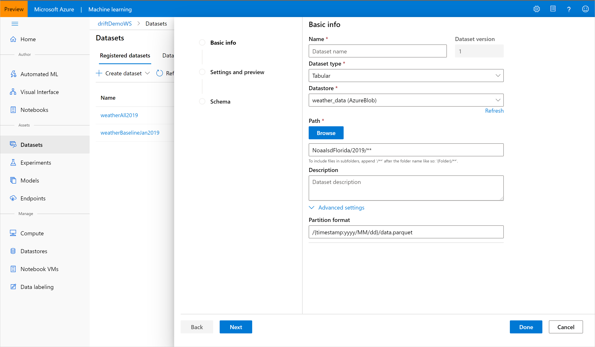
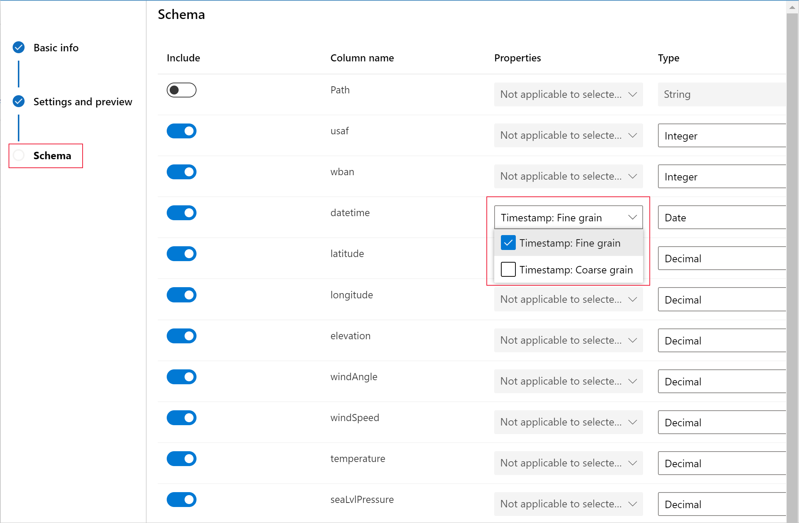
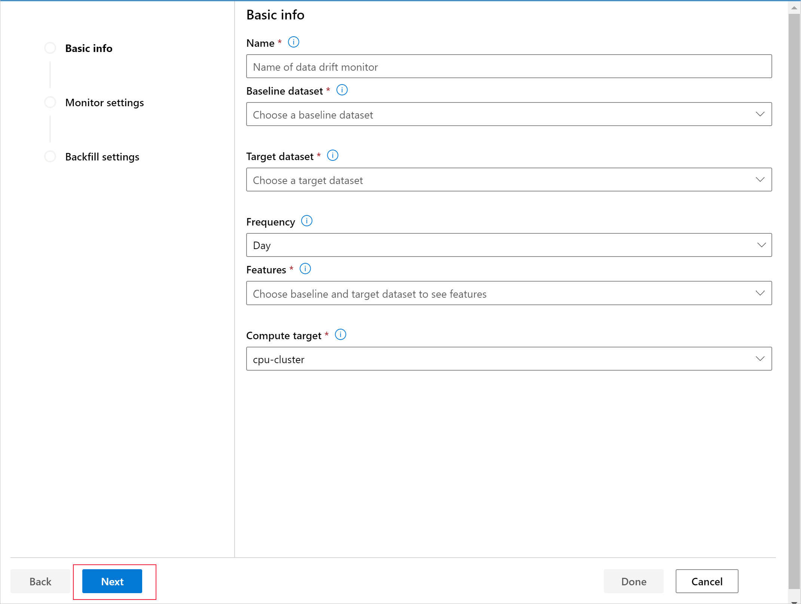
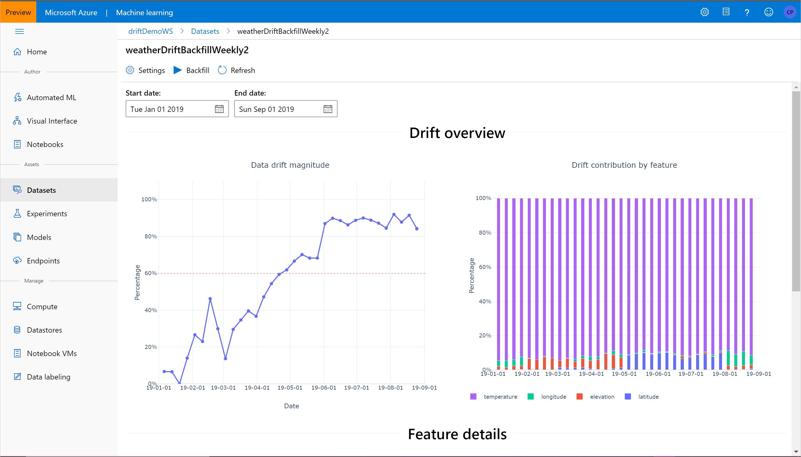

# Detect data drift (preview) on datasets

In this article, you learn how to create Azure Machine Learning dataset monitors (preview), monitor for data drift in datasets, and setup alerts.

With Azure Machine Learning dataset monitors, you can:
* **Analyze drift in your data** to understand how it changes over time.
* **Set up alerts on data drift** for early warnings to potential issues in Azure Machine Learning. 
* **Monitor model data** for differences between training and serving datasets.

> [!Note]
> This Azure Machine Learning service capability is in preview.

## Prerequisites

To create and work with dataset monitors, you need:
* An Azure subscription. If you don’t have an Azure subscription, create a free account before you begin. Try the [free or paid version of Azure Machine Learning](https://aka.ms/AMLFree) today.
* An [Azure Machine Learning workspace](how-to-manage-workspace.md).
* The [Azure Machine Learning SDK for Python installed](https://docs.microsoft.com/python/api/overview/azure/ml/install?view=azure-ml-py), which includes the azureml-datasets package.
* Structured (tabular) data with a timestamp specified in the file path, file name, or column in the data.

## What is data drift?

In the context of machine learning, data drift is the change in model input data that leads to model performance degradation. It is one of the top reasons where model accuracy degrades over time, thus monitoring data drift helps detect model performance issues.

In general, data drift is a significant statistical change in data. Causes of data drift include: upstream process changes, such as a sensor being replaced that changes the units of measurement from inches to centimeters; data quality issues, such as a broken sensor always reading 0; natural drift in the data, such as mean temperature changing with the seasons; change in relation between features, or covariate shift. The Azure Machine Learning service data drift capability, utilized through dataset monitors, measures and alerts for data drift.

## Azure Machine Learning data drift concepts

There are several concepts to understand before setting up your first data drift monitor.

### Target and baseline datasets

A target dataset is compared over time to a baseline dataset, so the timestamp column in the dataset must be specified. This is not required for the baseline dataset. Conceptually, there are three primary scenarios for setting up dataset monitors in Azure Machine Learning.

Scenario | Description
---|---
Monitoring a model's serving data for drift from the model's training data | Results from this scenario can be interpreted as monitoring a proxy for the model's accuracy, given that model accuracy degrades if the serving data drifts from the training data.
Monitoring a time series dataset for drift from a previous time period. | This scenario is more general, and can be used to monitor datasets involved upstream or downstream of model building.  The target dataset must have a timestamp column, while the baseline dataset can be any tabular dataset which has features in common with the target dataset.
Performing analysis on past data for data drift. | This can be used to understand historical data and inform decisions in settings for dataset monitors.

### Setting the timestamp column in target dataset

The target dataset needs to have the time series trait set on it by specifying the timestamp column either from a column in the data or a virtual column derived from the path pattern of the files. This can be done through the Python SDK or the workspace landing page (preview). 

#### Workspace landing page

If the path to your data contains timestamp information, make sure to include all subfolders with data and set the partition format. 

In the following example, all data under the subfolder NoaaIsdFlorida/2019 is taken, and the partition format specifies the timestamp's year, month, and day. 

[](media/how-to-monitor-datasets/partition-format-expand.png)

In the **Schema** settings, specify the timestamp column from a virtual or real column in the specified dataset:



#### Python SDK

```python 
from azureml.core import Workspace, Dataset, Datastore
# get workspace object
ws = Workspace.from_config()
# get datastore object 
dstore = Datastore.get(ws, 'your datastore name')
# specify datastore paths
dstore_paths = [(dstore, 'weather/*/*/*/*/data.parquet')]
# specify partition format
partition_format = 'weather/{state}/{date:yyyy/MM/dd}/data.parquet'
# create the Tabular dataset with 'state' and 'date' as virtual columns 
dset = Dataset.Tabular.from_parquet_files(path=dstore_paths, parition_format=partition_format)
# assign the timestamp attribute to a real or virtual column in the dataset
dset = dset.with_timestamp_columns('date')
# register the dataset
dset = dset.regiseter(ws, 'target')
```

### Dataset monitor settings

There are various dataset monitor settings broken into three groups, described below.

**Basic info**

This table contains basic settings used for the dataset monitor.

| Setting | Description | Tips |
| ------- | ----------- | ---- |
| Name | Name of the dataset monitor | |
| Baseline dataset | Tabular dataset that will be used as the baseline for comparison of the target dataset over time | Set to a model's target dataset | 
| Target dataset | Tabular dataset with timestamp column specified which will be analyzed for data drift | Set to a model's serving dataset | 
| Frequency | This is the frequency which will be used to schedule the pipeline job and analyze historical data if running a backfill | Adjust this setting to include a comparable size of data to the baseline | 
| Features | List of features which will be analyzed for data drift over time | Set to a model's output feature(s) to measure concept drift. Do not include features that naturally drift over time (month, year, index, etc.). You can change this setting after the monitor is created | 
| Compute target | Azure Machine Learning compute target to run the dataset monitor jobs | | 

**Monitor settings** 

This contains the settings for the scheduled dataset monitor pipeline which will be created. They are described below. 

| Setting | Description | Tips | 
| ------- | ----------- | ---- | 
| Enable | Enable or disable the schedule on the dataset monitor pipeline | Disable this to analyze historical data with the backfill setting. It can be enabled after the dataset monitor is created | 
| Latency | Time, in hours, it takes for data to arrive in the dataset. For instance, if it takes three days for data to arrive in the SQL DB my dataset encapsulates, set the latency to 72. | Cannot be changed after the dataset monitor is created | 
| Email addresses | Email addresses for alerting based on breach of the data drift percentage threshold. | Emails are sent through Azure Monitor. | 
| Threshold | Data drift percentage threshold for email alerting | Further alerts and events can be set on many other metrics in the workspace's associated Application Insights resource | 

**Backfill settings**

This contains the settings for running a backfill on past data for data drift metrics. They are described below. 

| Setting | Description | Tips | 
| ------- | ----------- | ---- | 
| Start date | Start date of the backfill job. | | 
| End date | End date of the backfill job. | This cannot be more than 31*frequency units of time from the start date. Additional backfill runs can be performed after the dataset monitor creation | 

### Data drift results

There are two groups of metrics in the dataset monitors results, described below. 

**Drift overview**  

This contains top-level insights into the magnitude of data drift and which features should be further investigated. 

| Metric | Description | Tips | 
| ------ | ----------- | ---- | 
| Data drift magnitude | Data drift magnitude, given as a percentage between the baseline and target dataset over time. | Noise in the precise percentage measured is expected due to machine learning techniques being used to generate this magnitude | 
| Drift contribution by feature | The contribution of each feature in the target dataset to the measured drift magnitude. | Even if a feature's statistical properties on its own don't seem to change much over time, if their covariance with other features changes significantly the contribution of that feature may be high | 

**Feature details** 

This contains feature-level insights into the change in the feature's distribution, as well as other statistics, over time. 

## Create dataset monitors 

You can create dataset monitors to detect and alert to data drift on new dataset, analyze historical data for drift, and trigger an event if significant changes in data are detected. To get started, a baseline and target dataset must be created.  

### From workspace landing page (Enterprise SKU) 

From the Datasets tab, click on the Dataset monitors: 


Click on the 'Create monitor' button and continue through the wizard by clicking **Next** to create a dataset monitor.



The resulting dataset monitor will appear in the list. Select it to go to that monitor's details page.

### From Python SDK

See the [Python SDK reference documentation on data drift](http://aka.ms/datadriftapi) for full details. 

The following is an example of creation of a dataset monitor using the Python SDK

```python
from azureml.datadrift import DataDriftDetector
### TO UPDATE ###
```

## Understanding data drift results

The following metrics can be retrieved in the Python SDK through the `get_metrics()` method on a `DataDriftDetector`. 

### Drift overview

This section provides the overall magnitude and contribution by feature of drift between the baseline and time slice of target dataset. The magnitude is represented as the data drift percentage, ranging from 0 to 100 where 0 indicates identical datasets and 100 indicates the Azure Machine Learning service data drift capability can completely tell the two datasets apart. Note that due to machine learning being used in computing these metrics, some noise is naturally expected. 

The contribution by feature indicates which features were important in determining the data drift percentage, and indicate which features should be further investigated. Due to covariate shift, the underlying distribution of a feature does not necessarily need to change to have relatively high feature importance. 



### Feature details 

Additionally, the target dataset is profiled over time. The statistical distance between the baseline distribution of each feature is compared with the target dataset's over time, which is conceptually similar to the data drift magnitude but for an individual feature. Min, max, and mean are also available. In the UI, clicking on a data point in the graph will adjust the distribution of the feature being shown. By default, it shows the baseline dataset's distribution and the most recent run's distribution of the same feature. 


## Troubleshooting

Limitations and known issues:

* Time range of backfill jobs are limited to 31 intervals of the monitor's frequency setting 
* Compute size must be large enough to handle the data 

## Next steps

* Head to the [workspace portal](https://ml.azure.com) or the [Python notebook](https://aka.ms/datadrift-notebook) to get started setting up a dataset monitor.