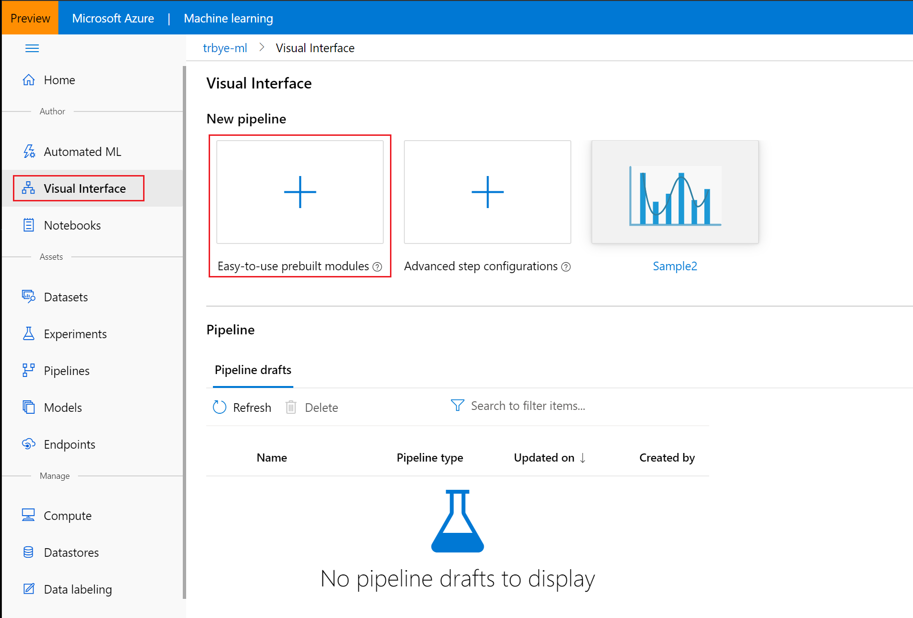
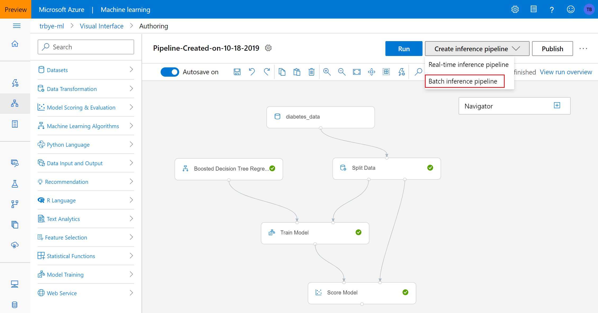
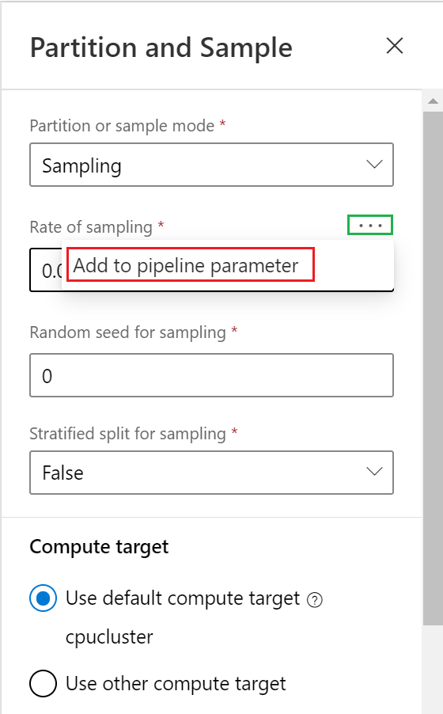
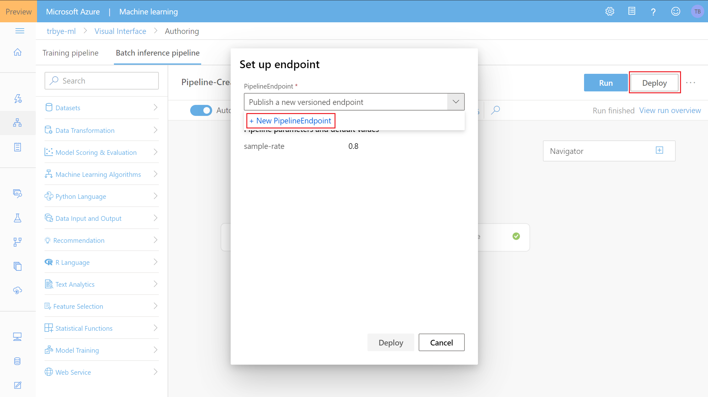
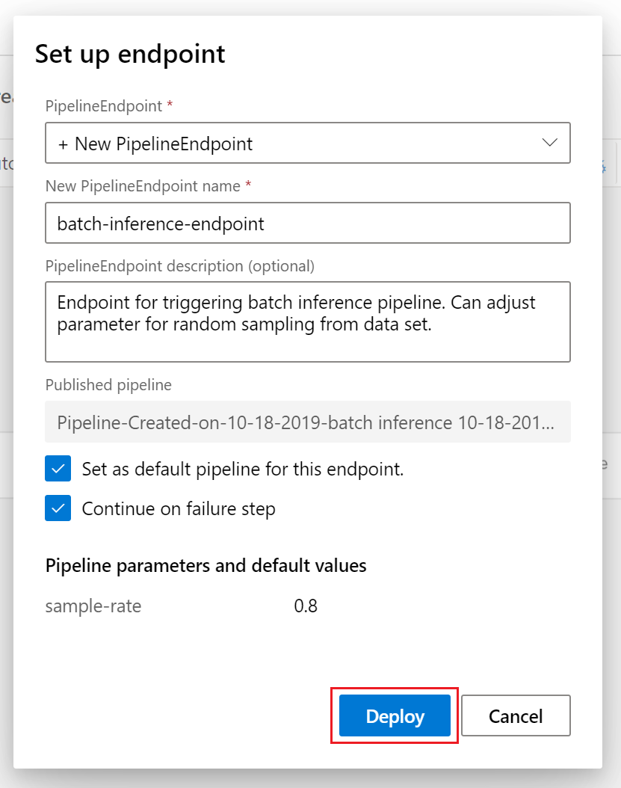
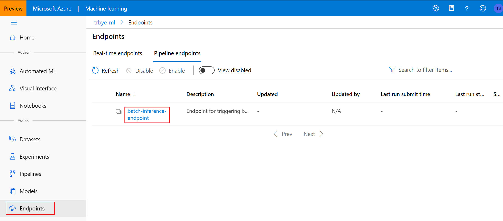
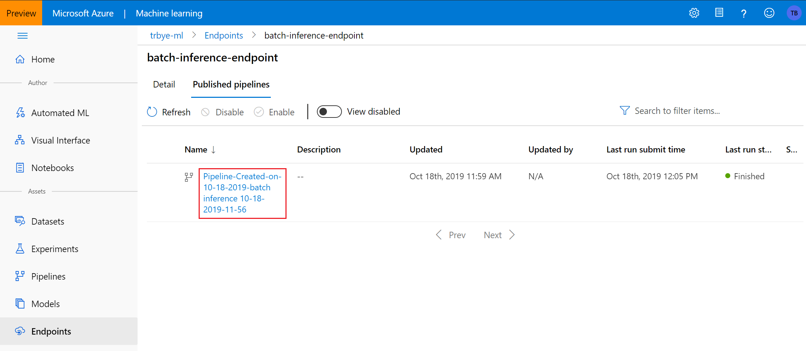
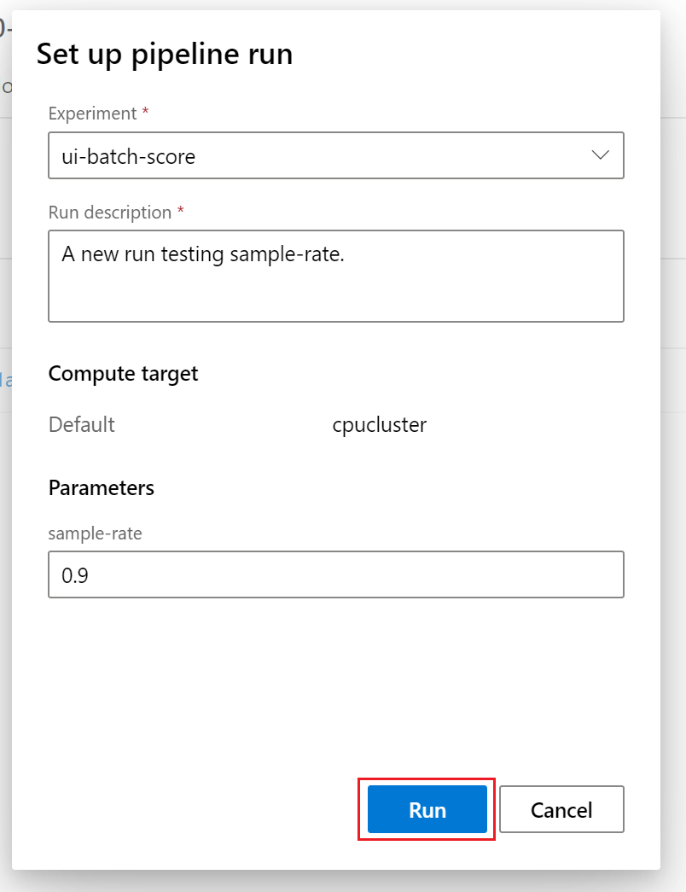

# Run batch predictions using Azure Machine Learning visual interface
[!INCLUDE [applies-to-skus](../../../includes/aml-applies-to-basic-enterprise-sku.md)]

In this how-to, you learn how to use the visual interface to train a model and setup a batch prediction web service. Batch prediction allows for continuous and on-demand scoring of trained models on large data sets, optionally configured as a web service that can be triggered from any HTTP library. 

For setting up batch scoring services using the SDK, see the accompanying [how-to](how-to-run-batch-predictions.md).

## Prerequisites

* If you don’t have an Azure subscription, create a free account before you begin. Try the [free or paid version of the Azure Machine Learning service](https://aka.ms/AMLFree).

* This how-to assumes basic knowledge of building a simple pipeline in the visual interface. For a guided introduction to the visual interface, complete the [tutorial](ui-tutorial-automobile-price-train-score.md). 

## Create a pipeline

