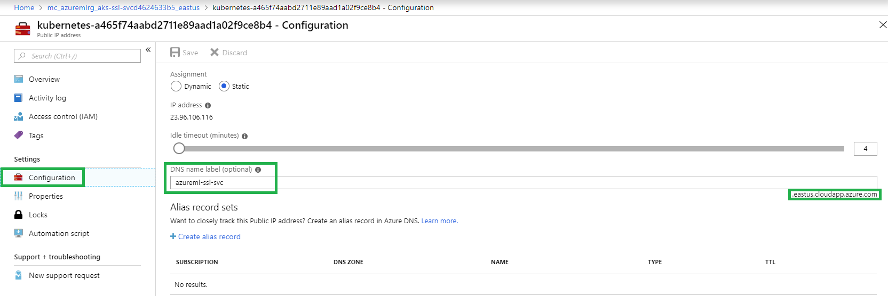

# Use SSL to secure a web service through Azure Machine Learning

This article shows you how to secure a web service that's deployed through the Azure Machine Learning service.

You use [HTTPS](https://en.wikipedia.org/wiki/HTTPS) to restrict access to web services and secure the data that clients submit. HTTPS helps secure communications between a client and a web service by encrypting communications between the two. Encryption uses [Transport Layer Security (TLS)](https://en.wikipedia.org/wiki/Transport_Layer_Security). TLS is sometimes still referred to as *Secure Sockets Layer* (SSL), which was the predecessor of TLS.

> [!TIP]
> The Azure Machine Learning SDK uses the term "SSL" for properties that are related to secure communications. This doesn't mean that your web service doesn't use *TLS*. SSL is just a more commonly recognized term.

TLS and SSL both rely on *digital certificates*, which help with encryption and identity verification. For more information on how digital certificates work, see the Wikipedia topic [Public key infrastructure](https://en.wikipedia.org/wiki/Public_key_infrastructure).

> [!WARNING]
> If you don't use HTTPS for your web service, data that's sent to and from the service might be visible to others on the internet.
>
> HTTPS also enables the client to verify the authenticity of the server that it's connecting to. This feature protects clients against [man-in-the-middle](https://en.wikipedia.org/wiki/Man-in-the-middle_attack) attacks.

This is the general process to secure a web service:

1. Get a domain name.

2. Get a digital certificate.

3. Deploy or update the web service with SSL enabled.

4. Update your DNS to point to the web service.

> [!IMPORTANT]
> If you're deploying to Azure Kubernetes Service (AKS), you can purchase your own certificate or use a certificate that's provided by Microsoft. If you use a certificate from Microsoft, you don't need to get a domain name or SSL certificate. For more information, see the [Enable SSL and deploy](#enable) section of this article.

There are slight differences when you secure web services across [deployment targets](how-to-deploy-and-where.md).

## Get a domain name

If you don't already own a domain name, purchase one from a *domain name registrar*. The process and price differ among registrars. The registrar provides tools to manage the domain name. You use these tools to map a fully qualified domain name (FQDN) (such as www\.contoso.com) to the IP address that hosts your web service.

## Get an SSL certificate

There are many ways to get an SSL certificate (digital certificate). The most common is to purchase one from a *certificate authority* (CA). Regardless of where you get the certificate, you need the following files:

* A **certificate**. The certificate must contain the full certificate chain, and it must be "PEM-encoded."
* A **key**. The key must also be PEM-encoded.

When you request a certificate, you must provide the FQDN of the address that you plan to use for the web service (for example, www\.contoso.com). The address that's stamped into the certificate and the address that the clients use are compared to verify the identity of the web service. If those addresses don't match, the client gets an error message.

> [!TIP]
> If the certificate authority can't provide the certificate and key as PEM-encoded files, you can use a utility such as [OpenSSL](https://www.openssl.org/) to change the format.

> [!WARNING]
> Use *self-signed* certificates only for development. Don't use them in production environments. Self-signed certificates can cause problems in your client applications. For more information, see the documentation for the network libraries that your client application uses.

## <a id="enable"></a> Enable SSL and deploy

To deploy (or redeploy) the service with SSL enabled, set the *ssl_enabled* parameter to "True" wherever it's applicable. Set the *ssl_certificate* parameter to the value of the *certificate* file. Set the *ssl_key* to the value of the *key* file.

### Deploy on AKS and field-programmable gate array (FPGA)

  > [!NOTE]
  > The information in this section also applies when you deploy a secure web service for the visual interface. If you aren't familiar with using the Python SDK, see [What is the Azure Machine Learning SDK for Python?](https://docs.microsoft.com/python/api/overview/azure/ml/intro?view=azure-ml-py).

When you deploy to AKS, you can create a new AKS cluster or attach an existing one.
  
-  If you create a new cluster, you use **[AksCompute.provisionining_configuration()](https://docs.microsoft.com/python/api/azureml-core/azureml.core.compute.akscompute#provisioning-configuration-agent-count-none--vm-size-none--ssl-cname-none--ssl-cert-pem-file-none--ssl-key-pem-file-none--location-none--vnet-resourcegroup-name-none--vnet-name-none--subnet-name-none--service-cidr-none--dns-service-ip-none--docker-bridge-cidr-none--cluster-purpose-none-)**.
- If you attach an existing cluster, you use **[AksCompute.attach_configuration()](https://docs.microsoft.com/python/api/azureml-core/azureml.core.compute.akscompute#attach-configuration-resource-group-none--cluster-name-none--resource-id-none--cluster-purpose-none-)**. Both return a configuration object that has an **enable_ssl** method.

The **enable_ssl** method can use a certificate that's provided by Microsoft or a certificate that you purchase.

  * When you use a certificate from Microsoft, you must use the *leaf_domain_label* parameter. This parameter generates the DNS name for the service. For example, a value of "myservice" creates a domain name of "myservice\<six-random-characters>.\<azureregion>.cloudapp.azure.com", where \<azureregion> is the region that contains the service. Optionally, you can use the *overwrite_existing_domain* parameter to overwrite the existing *leaf_domain_label*.

    To deploy (or redeploy) the service with SSL enabled, set the *ssl_enabled* parameter to "True" wherever it's applicable. Set the *ssl_certificate* parameter to the value of the *certificate* file. Set the *ssl_key* to the value of the *key* file.

    > [!IMPORTANT]
    > When you use a certificate from Microsoft, you don't need to purchase your own certificate or domain name.

    The following example demonstrates how to create a configuration that enables an SSL certificate from Microsoft:

    ```python
    from azureml.core.compute import AksCompute
    # Config used to create a new AKS cluster and enable SSL
    provisioning_config = AksCompute.provisioning_configuration()
    provisioning_config.enable_ssl(leaf_domain_label = "myservice")
    # Config used to attach an existing AKS cluster to your workspace and enable SSL
    attach_config = AksCompute.attach_configuration(resource_group = resource_group,
                                          cluster_name = cluster_name)
    attach_config.enable_ssl(leaf_domain_label = "myservice")
    ```

  * When you use *a certificate that you purchased*, you use the *ssl_cert_pem_file*, *ssl_key_pem_file*, and *ssl_cname* parameters. The following example demonstrates how to use *.pem* files to create a configuration that uses an SSL certificate that you purchased:

    ```python
    from azureml.core.compute import AksCompute
    # Config used to create a new AKS cluster and enable SSL
    provisioning_config = AksCompute.provisioning_configuration()
    provisioning_config.enable_ssl(ssl_cert_pem_file="cert.pem",
                                        ssl_key_pem_file="key.pem", ssl_cname="www.contoso.com")
    # Config used to attach an existing AKS cluster to your workspace and enable SSL
    attach_config = AksCompute.attach_configuration(resource_group = resource_group,
                                         cluster_name = cluster_name)
    attach_config.enable_ssl(ssl_cert_pem_file="cert.pem",
                                        ssl_key_pem_file="key.pem", ssl_cname="www.contoso.com")
    ```

For more information about *enable_ssl*, see [AksProvisioningConfiguration.enable_ssl()](https://docs.microsoft.com/python/api/azureml-core/azureml.core.compute.aks.aksprovisioningconfiguration?view=azure-ml-py#enable-ssl-ssl-cname-none--ssl-cert-pem-file-none--ssl-key-pem-file-none--leaf-domain-label-none--overwrite-existing-domain-false-) and [AksAttachConfiguration.enable_ssl()](https://docs.microsoft.com/python/api/azureml-core/azureml.core.compute.aks.aksattachconfiguration?view=azure-ml-py#enable-ssl-ssl-cname-none--ssl-cert-pem-file-none--ssl-key-pem-file-none--leaf-domain-label-none--overwrite-existing-domain-false-).

### Deploy on Azure Container Instances

When you deploy to Azure Container Instances, you provide values for SSL-related parameters, as the following code snippet shows:

```python
from azureml.core.webservice import AciWebservice

aci_config = AciWebservice.deploy_configuration(ssl_enabled=True, ssl_cert_pem_file="cert.pem", ssl_key_pem_file="key.pem", ssl_cname="www.contoso.com")
```

For more information, see [AciWebservice.deploy_configuration()](https://docs.microsoft.com/python/api/azureml-core/azureml.core.webservice.aciwebservice#deploy-configuration-cpu-cores-none--memory-gb-none--tags-none--properties-none--description-none--location-none--auth-enabled-none--ssl-enabled-none--enable-app-insights-none--ssl-cert-pem-file-none--ssl-key-pem-file-none--ssl-cname-none--dns-name-label-none-).

## Update your DNS

Next, you must update your DNS to point to the web service.

+ **For Container Instances:**

  Use the tools from your domain name registrar to update the DNS record for your domain name. The record must point to the IP address    of the service.

  There can be a delay of minutes or hours before clients can resolve the domain name, depending on the registrar and the "time to live" (TTL) that's configured for the domain name.

+ **For AKS:**

  > [!WARNING]
  > If you used *leaf_domain_label* to create the service by using a certificate from Microsoft, don't manually update the DNS value for the cluster. The value should be set automatically.

  Update the DNS on the **Configuration** tab of the Public IP Address of the AKS cluster. (See the following image.) The Public IP Address is a resource type that's created under the resource group that contains the AKS agent nodes and other networking resources.

  

## Next steps
Learn how to:
+ [Consume a machine learning model deployed as a web service](how-to-consume-web-service.md)
+ [Securely run experiments and inference inside an Azure virtual network](how-to-enable-virtual-network.md)
