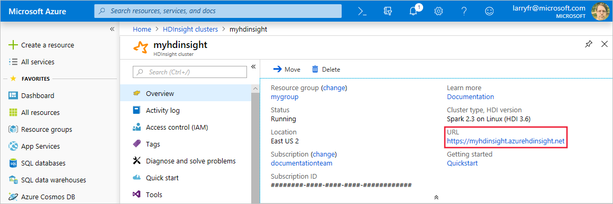
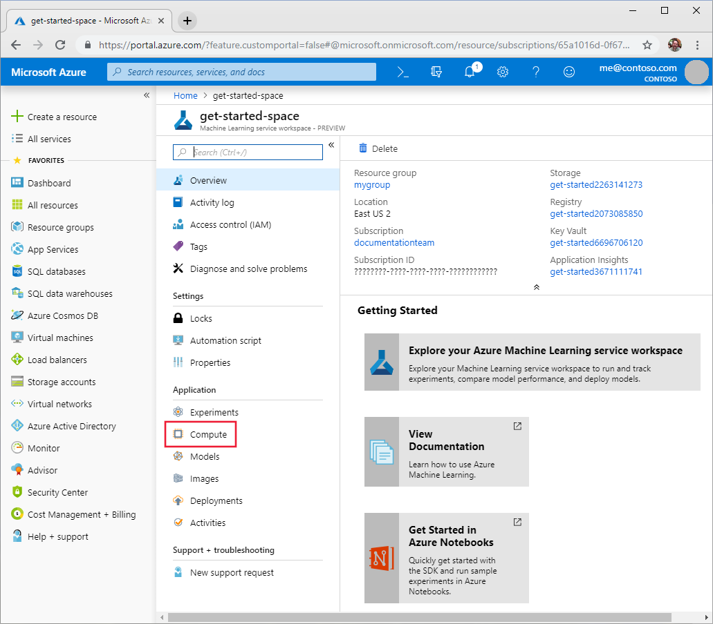
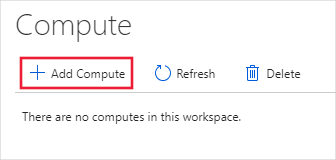
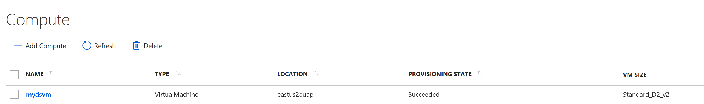
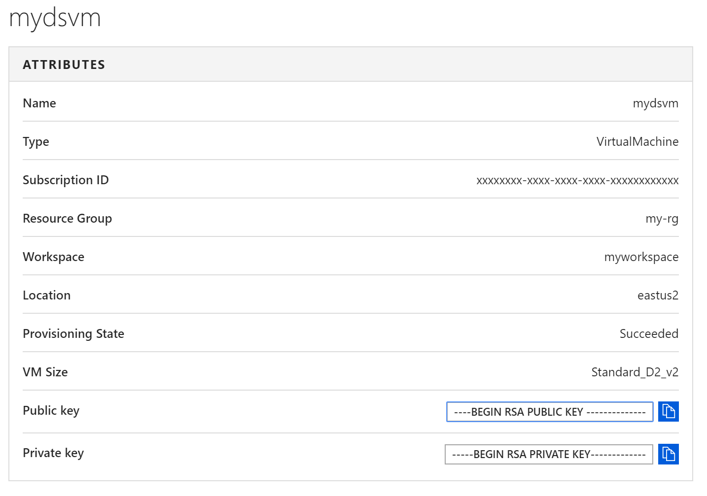

# Select and use a compute target to train your model

With the Azure Machine Learning service, you can train your model in several different environments. These environments, called __compute targets__, can be local or in the cloud. In this document, you will learn about the supported compute targets and how to use them.

A compute target is the resource that runs your training script or hosts your model when it's deployed as a web service. They can be created and managed using the Azure Machine Learning SDK or CLI. If you have compute targets that were created by another process (for example, the Azure portal or Azure CLI), you can use them by attaching them to your Azure Machine Learning service workspace.

You can start with local runs on your machine, and then scale up and out to other environments such as remote Data Science virtual machines with GPU or Azure Batch AI. 

>[!NOTE]
> Code in this article was tested with Azure Machine Learning SDK version 0.168 

## Supported compute targets

Azure Machine Learning service supports the following compute targets:

|Compute target| GPU acceleration | Automated hyperparameter tuning | Automated model selection | Can be used in pipelines|
|----|:----:|:----:|:----:|:----:|
|[Local computer](#local)| Maybe | &nbsp; | ✓ | &nbsp; |
|[Data Science Virtual Machine (DSVM)](#dsvm) | ✓ | ✓ | ✓ | ✓ |
|[Azure Batch AI](#batch)| ✓ | ✓ | ✓ | ✓ | ✓ |
|[Azure HDInsight](#hdinsight)| &nbsp; | &nbsp; | &nbsp; | ✓ |

__[Azure Container Instances (ACI)](#aci)__ can also be used to train models. It is a serverless cloud offering that is inexpensive and easy to create and work with. ACI does not support GPU acceleration, automated hyper parameter tuning, or automated model selection. Also, it cannot be used in a pipeline.

The key differentiators between the compute targets are:
* __GPU acceleration__: GPUs are available with the Data Science Virtual Machine and Azure Batch AI. You may have access to a GPU on your local computer, depending on the hardware, drivers, and frameworks that are installed.
* __Automated hyperparameter tuning__: Azure Machine Learning automated hyperparameter optimization helps you find the best hyperparameters for your model.
* __Automated model selection__: Azure Machine Learning service can intelligently recommend algorithm and hyperparameter selection when building a model. Automated model selection helps you converge to a high-quality model faster than manually trying different combinations. For more information, see the [Tutorial: Automatically train a classification model with Azure Automated Machine Learning](tutorial-auto-train-models.md) document.
* __Pipelines__: Azure Machine Learning service enables you to combine different tasks such as training and deployment into a pipeline. Pipelines can be ran in parallel or in sequence, and provide a reliable automation mechanism. For more information, see the [Build machine learning pipelines with Azure Machine Learning service](concept-ml-pipelines.md) document.

You can use the Azure Machine Learning SDK, Azure CLI, or Azure portal to create compute targets. You can also use existing compute targets by adding (attaching) them to your workspace.

> [!IMPORTANT]
> You cannot attach an existing Azure Containers Instance to your workspace. Instead, you must create a new instance.
>
> You cannot create an Azure HDInsight cluster within a workspace. Instead, you must attach an existing cluster.

## Workflow

The workflow for developing and deploying a model with Azure Machine Learning follows these steps:

1. Develop machine learning training scripts in Python.
1. Create and configure or attach an existing compute target.
1. Submit the training scripts to the compute target.
1. Inspect the results to find the best model.
1. Register the model in the model registry.
1. Deploy the model.

> [!IMPORTANT]
> Your training script isn't tied to a specific compute target. You can train initially on your local computer, then switch compute targets without having to rewrite the training script.

Switching from one compute target to another involves creating a [run configuration](concept-azure-machine-learning-architecture.md#run-configuration). The run configuration defines how to run the script on the compute target.

## Training scripts

When you start a training run, the entire directory that contains your training scripts is submitted. A snapshot is created and sent to the compute target. For more information, see [snapshots](concept-azure-machine-learning-architecture.md#snapshot).

## <a id="local"></a>Local computer

When training locally, you use the SDK to submit the training operation. You can train using a user-managed or system-managed environment.

### User-managed environment

In a user-managed environment, you are responsible for ensuring that all the necessary packages are available in the Python environment you choose to run the script in. The following code snippet is an example of configuring training for a user-managed environment:

```python
from azureml.core.runconfig import RunConfiguration

# Editing a run configuration property on-fly.
run_config_user_managed = RunConfiguration()

run_config_user_managed.environment.python.user_managed_dependencies = True

# You can choose a specific Python environment by pointing to a Python path 
#run_config.environment.python.interpreter_path = '/home/ninghai/miniconda3/envs/sdk2/bin/python'
```

For a Jupyter Notebook that demonstrates training in a user-managed environment, see [https://github.com/Azure/MachineLearningNotebooks/blob/master/01.getting-started/02.train-on-local/02.train-on-local.ipynb](https://github.com/Azure/MachineLearningNotebooks/blob/master/01.getting-started/02.train-on-local/02.train-on-local.ipynb).
  
### System-managed environment

System-managed environments rely on conda to manage the dependencies. Conda creates a file named `conda_dependencies.yml` that contains a list of dependencies. You can then ask the system to build a new conda environment and run your scripts in it. System-managed environments can be reused later, as long as the `conda_dependencies.yml` files remains unchanged. 

The initial setup up of a new environment can take several minutes to complete, depending on the size of the required dependencies. The following code snippet demonstrates creating a system-managed environment that depends on scikit-learn:

```python
from azureml.core.runconfig import RunConfiguration
from azureml.core.conda_dependencies import CondaDependencies

run_config_system_managed = RunConfiguration()

run_config_system_managed.environment.python.user_managed_dependencies = False
run_config_system_managed.auto_prepare_environment = True

# Specify conda dependencies with scikit-learn

run_config_system_managed.environment.python.conda_dependencies = CondaDependencies.create(conda_packages=['scikit-learn'])
```

For a Jupyter Notebook that demonstrates training in a system-managed environment, see [https://github.com/Azure/MachineLearningNotebooks/blob/master/01.getting-started/02.train-on-local/02.train-on-local.ipynb](https://github.com/Azure/MachineLearningNotebooks/blob/master/01.getting-started/02.train-on-local/02.train-on-local.ipynb).

## <a id="dsvm"></a>Data Science Virtual Machine

Your local machine may not have the compute or GPU resources required to train the model. In this situation, You can scale up or scale out the training process by adding additional compute targets such as a Data Science Virtual Machines (DSVM).

> [!WARNING]
> Azure Machine Learning only supports virtual machines running Ubuntu. When creating a virtual machine or selecting an existing one, you must select one that uses Ubuntu.

The following steps use the SDK to configure a Data Science Virtual Machine (DSVM) as a training target:

1. Create or attach a Virtual Machine
    
    * To create a new DSVM, first check to see if you have a DSVM with the same name, if not create a new VM:
    
        ```python
        from azureml.core.compute import DsvmCompute
        from azureml.core.compute_target import ComputeTargetException

        compute_target_name = 'mydsvm'

        try:
            dsvm_compute = DsvmCompute(workspace = ws, name = compute_target_name)
            print('found existing:', dsvm_compute.name)
        except ComputeTargetException:
            print('creating new.')
            dsvm_config = DsvmCompute.provisioning_configuration(vm_size = "Standard_D2_v2")
            dsvm_compute = DsvmCompute.create(ws, name = compute_target_name, provisioning_configuration = dsvm_config)
            dsvm_compute.wait_for_completion(show_output = True)
        ```
    * To attach an existing virtual machine as a compute target, you must provide the fully qualified domain name, login name, and password for the virtual machine.  In the example, replace ```<fqdn>``` with public fully qualified domain name of the VM, or the public IP address. Replace ```<username>``` and ```<password>``` with the SSH user and password for the VM:

        ```python
        from azureml.core.compute import RemoteCompute

        dsvm_compute = RemoteCompute.attach(ws,
                                        name="attach-dsvm",
                                        username='<username>',
                                        address="<fqdn>",
                                        ssh_port=22,
                                        password="<password>")

        dsvm_compute.wait_for_completion(show_output=True)
    
   It takes around 5 minutes to create the DSVM instance.

1. Create a configuration for the DSVM compute target. Docker and conda are used to create and configure the training environment on DSVM:

    ```python
    from azureml.core.runconfig import RunConfiguration
    from azureml.core.conda_dependencies import CondaDependencies

    # Load the "cpu-dsvm.runconfig" file (created by the above attach operation) in memory
    run_config = RunConfiguration(framework = "python")

    # Set compute target to the Linux DSVM
    run_config.target = compute_target_name

    # Use Docker in the remote VM
    run_config.environment.docker.enabled = True

    # Use CPU base image from DockerHub
    run_config.environment.docker.base_image = azureml.core.runconfig.DEFAULT_CPU_IMAGE
    print('Base Docker image is:', run_config.environment.docker.base_image)

    # Ask system to provision a new one based on the conda_dependencies.yml file
    run_config.environment.python.user_managed_dependencies = False

    # Prepare the Docker and conda environment automatically when used the first time.
    run_config.prepare_environment = True

    # specify CondaDependencies obj
    run_config.environment.python.conda_dependencies = CondaDependencies.create(conda_packages=['scikit-learn'])

    ```

1. To delete the compute resources when you are finished, use the following code:

    ```python
    dsvm_compute.delete()
    ```

For a Jupyter Notebook that demonstrates training on a Data Science Virtual Machine, see [https://github.com/Azure/MachineLearningNotebooks/blob/master/01.getting-started/04.train-on-remote-vm/04.train-on-remote-vm.ipynb](https://github.com/Azure/MachineLearningNotebooks/blob/master/01.getting-started/04.train-on-remote-vm/04.train-on-remote-vm.ipynb).

## <a id="batch"></a>Azure Batch AI

If it takes a long time to train your model, you can use Azure Batch AI to distribute the training across a cluster of compute resources in the cloud. Batch AI can also be configured to enable a GPU resource.

The following example looks for an existing Batch AI cluster by name. If one is not found, it is created:

```python
from azureml.core.compute import BatchAiCompute
from azureml.core.compute import ComputeTarget
import os

# choose a name for your cluster
batchai_cluster_name = os.environ.get("BATCHAI_CLUSTER_NAME", ws.name + "gpu")
cluster_min_nodes = os.environ.get("BATCHAI_CLUSTER_MIN_NODES", 1)
cluster_max_nodes = os.environ.get("BATCHAI_CLUSTER_MAX_NODES", 3)
vm_size = os.environ.get("BATCHAI_CLUSTER_SKU", "STANDARD_NC6")
autoscale_enabled = os.environ.get("BATCHAI_CLUSTER_AUTOSCALE_ENABLED", True)


if batchai_cluster_name in ws.compute_targets():
    compute_target = ws.compute_targets()[batchai_cluster_name]
    if compute_target and type(compute_target) is BatchAiCompute:
        print('found compute target. just use it. ' + batchai_cluster_name)
else:
    print('creating a new compute target...')
    provisioning_config = BatchAiCompute.provisioning_configuration(vm_size = vm_size, # NC6 is GPU-enabled
                                                                vm_priority = 'lowpriority', # optional
                                                                autoscale_enabled = autoscale_enabled,
                                                                cluster_min_nodes = cluster_min_nodes, 
                                                                cluster_max_nodes = cluster_max_nodes)

    # create the cluster
    compute_target = ComputeTarget.create(ws, batchai_cluster_name, provisioning_config)
    
    # can poll for a minimum number of nodes and for a specific timeout. 
    # if no min node count is provided it will use the scale settings for the cluster
    compute_target.wait_for_completion(show_output=True, min_node_count=None, timeout_in_minutes=20)
    
     # For a more detailed view of current BatchAI cluster status, use the 'status' property    
    print(compute_target.status.serialize())
```

To attach an existing Batch AI cluster as a compute target, you must provide the Azure resource ID. To get the resource ID from the Azure portal, use the following steps:
1. Search for `Batch AI` service under **All Services**
1. Click on the workspace name in which your cluster belongs
1. Select the cluster
1. Click on **Properties**
1. Copy the **ID**

The following example uses the SDK to attach a cluster to your workspace. In the example, replace `<name>` with any name for the compute. The name does not have to match the name of the cluster. Replace `<resource-id>` with the Azure resource ID detailed above:

```python
from azureml.core.compute import BatchAiCompute
BatchAiCompute.attach(workspace=ws,
                      name=<name>,
                      resource_id=<resource-id>)
```

You can also check the Batch AI cluster and job status using the following Azure CLI commands:

- Check cluster status. You can see how many nodes are running by using `az batchai cluster list`.
- Check job status. You can see how many jobs are running by using `az batchai job list`.

It takes around 5 minutes to create the Batch AI cluster.

For a Jupyter Notebook that demonstrates training in a Batch AI cluster, see [https://github.com/Azure/MachineLearningNotebooks/blob/master/training/03.train-hyperparameter-tune-deploy-with-tensorflow/03.train-hyperparameter-tune-deploy-with-tensorflow.ipynb](https://github.com/Azure/MachineLearningNotebooks/blob/master/training/03.train-hyperparameter-tune-deploy-with-tensorflow/03.train-hyperparameter-tune-deploy-with-tensorflow.ipynb).

## <a name='aci'></a>Azure Container Instance (ACI)

Azure Container Instances are isolated containers that have faster startup times and do not require the user to manage any Virtual Machines. The Azure Machine Learning service uses Linux containers, which are available in the westus, eastus, westeurope, northeurope, westus2, and southeastasia regions. For more information, see [region availability](https://docs.microsoft.com/azure/container-instances/container-instances-quotas#region-availability). 

The following example shows how to use the SDK to create an ACI compute target and use it to train a model: 

```python
from azureml.core.runconfig import RunConfiguration
from azureml.core.conda_dependencies import CondaDependencies

# create a new runconfig object
run_config = RunConfiguration()

# signal that you want to use ACI to run script.
run_config.target = "containerinstance"

# ACI container group is only supported in certain regions, which can be different than the region the Workspace is in.
run_config.container_instance.region = 'eastus'

# set the ACI CPU and Memory 
run_config.container_instance.cpu_cores = 1
run_config.container_instance.memory_gb = 2

# enable Docker 
run_config.environment.docker.enabled = True

# set Docker base image to the default CPU-based image
run_config.environment.docker.base_image = azureml.core.runconfig.DEFAULT_CPU_IMAGE
#run_config.environment.docker.base_image = 'microsoft/mmlspark:plus-0.9.9'

# use conda_dependencies.yml to create a conda environment in the Docker image
run_config.environment.python.user_managed_dependencies = False

# auto-prepare the Docker image when used for the first time (if it is not already prepared)
run_config.auto_prepare_environment = True

# specify CondaDependencies obj
run_config.environment.python.conda_dependencies = CondaDependencies.create(conda_packages=['scikit-learn'])
```

It can take from a few seconds to a few minutes to create an ACI compute target.

For a Jupyter Notebook that demonstrates training on Azure Container Instance, see [https://github.com/Azure/MachineLearningNotebooks/blob/master/01.getting-started/03.train-on-aci/03.train-on-aci.ipynb](https://github.com/Azure/MachineLearningNotebooks/blob/master/01.getting-started/03.train-on-aci/03.train-on-aci.ipynb).

## <a id="hdinsight"></a>Attach an HDInsight cluster 

HDInsight is a popular platform for big-data analytics. It provides Apache Spark, which can be used to train your model.

> [!IMPORTANT]
> You must create the HDInsight cluster before using it to train your model. To create a Spark on HDInsight cluster, see the [Create a Spark Cluster in HDInsight](https://docs.microsoft.com/azure/hdinsight/spark/apache-spark-jupyter-spark-sql) document.
>
> When creating the cluster, you must specify an SSH user name and password. Note these values, as you need them when using HDInsight as a compute target.
>
> Once the cluster has been created, it has a fully qualified domain name (FQDN) of `<clustername>.azurehdinsight.net`, where `<clustername>` is the name you provided for the cluster. You need this address (or the public IP address of the cluster) to use it as a compute target

To configure HDInsight as a compute target, you must provide the fully qualified domain name, cluster login name, and password for the HDInsight cluster. The following example uses the SDK to attach a cluster to your workspace. In the example, replace `<fqdn>` with the public fully qualified domain name of the cluster, or the public IP address. Replace `<username>` and `<password>` with the SSH user and password for the cluster:

> [!NOTE]
> To find the FQDN for your cluster, visit the Azure portal and select your HDInsight cluster. From the __Overview__ section, the FQDN is part of the __URL__ entry. Just remove the `https://` from the beginning of the value.
>
> 

```python
from azureml.core.compute import HDInsightCompute

try:
    # Attaches a HDInsight cluster as a compute target.
    HDInsightCompute.attach(ws,name = "myhdi",
                            address = "<fqdn>",
                            username = "<username>",
                            password = "<password>")
except UserErrorException as e:
    print("Caught = {}".format(e.message))
    print("Compute config already attached.")

# Configure HDInsight run
# load the runconfig object from the "myhdi.runconfig" file generated by the attach operaton above.
run_config = RunConfiguration.load(project_object = project, run_config_name = 'myhdi')

# ask system to prepare the conda environment automatically when used for the first time
run_config.auto_prepare_environment = True
```

## Submit training run
    
The code for submitting a training run is the same regardless of the compute target:

* Create a `ScriptRunConfig` object using the run configuration for the compute target.
* Submit the run.
* Wait for the run to complete.

The following example uses the configuration for the system-managed local compute target created earlier in this document:

```pyghon
src = ScriptRunConfig(source_directory = script_folder, script = 'train.py', run_config = run_config_system_managed)
run = exp.submit(src)
run.wait_for_completion(show_output = True)
```

For a Jupyter Notebook that demonstrates training with Spark on HDInsight, see [https://github.com/Azure/MachineLearningNotebooks/blob/master/01.getting-started/05.train-in-spark/05.train-in-spark.ipynb](https://github.com/Azure/MachineLearningNotebooks/blob/master/01.getting-started/05.train-in-spark/05.train-in-spark.ipynb).

## View and set up compute using the Azure portal

You can view what compute targets are associated with your workspace from the Azure portal. To get to the list, use the following steps:

1. Visit the [Azure portal](https://portal.azure.com) and navigate to your workspace.
2. Click on the __Compute__ link under the __Applications__ section.

    

### Create a compute target

Follow the above steps to view the list of compute targets, and then use the following steps to create a compute target:

1. Click the __+__ sign to add a compute target.

    

1. Enter a name for the compute target.
1. Select the type of compute to attach for __Training__. 
1. Select __Create New__ and fill out the required form. 
1. Select __Create__
1. You can view the status create operation by selecting the compute target from the list.

    
    You will then see the details for that compute.
    
1. Now you can submit a run against these targets as detailed above.

### Reuse existing compute in your workspace

Follow the above steps to view the list of compute targets, then use the following steps to reuse compute target:

1. Click the **+** sign to add a compute target.
2. Enter a name for the compute target.
3. Select the type of compute to attach for Training. Batch AI and Virtual Machines are currently supported in the portal for training.
4. Select 'Use Existing'.
    - When attaching Batch AI clusters, select the compute target from the dropdown, select the Batch AI workspace and the Batch AI Cluster, and then click **Create**.
    - When attaching a Virtual Machine, enter the IP Address, Username/Password Combination, Private/Public Keys, and the Port and click Create.

    > [!NOTE]
    > Microsoft recommends that you use SSH keys, as they are more secure than passwords. Passwords are vulnerable to brute force attacks, while SSH keys rely on cryptographic signatures. For information on creating SSH keys for use with Azure Virtual Machines, see the following documents:
    >
    > * [Create and use SSH keys on Linux or macOS]( https://docs.microsoft.com/azure/virtual-machines/linux/mac-create-ssh-keys)
    > * [Create and use SSH keys on Windows]( https://docs.microsoft.com/azure/virtual-machines/linux/ssh-from-windows)

5. You can view the status of the provisioning state by selecting the compute target from the list of Computes.
6. Now you can submit a run against these targets.

## Examples
The following notebooks demonstrate concepts in this article:
* [01.getting-started/02.train-on-local/02.train-on-local.ipynb](https://github.com/Azure/MachineLearningNotebooks/blob/master/01.getting-started/02.train-on-local)
* [01.getting-started/04.train-on-remote-vm/04.train-on-remote-vm.ipynb](https://github.com/Azure/MachineLearningNotebooks/blob/master/01.getting-started/04.train-on-remote-vm)
* [01.getting-started/03.train-on-aci/03.train-on-aci.ipynb](https://github.com/Azure/MachineLearningNotebooks/blob/master/01.getting-started/03.train-on-aci)
* [01.getting-started/05.train-in-spark/05.train-in-spark.ipynb](https://github.com/Azure/MachineLearningNotebooks/blob/master/01.getting-started/05.train-in-spark)
* [tutorials/01.train-models.ipynb](https://github.com/Azure/MachineLearningNotebooks/blob/master/tutorials/01.train-models.ipynb)

Get these notebooks:
[!INCLUDE [aml-clone-in-azure-notebook](../../../includes/aml-clone-for-examples.md)]

## Next steps

* [Azure Machine Learning SDK reference](http://aka.ms/aml-sdk)
* [Tutorial: Train a model](tutorial-train-models-with-aml.md)
* [Where to deploy models](how-to-deploy-and-where.md)
* [Build machine learning pipelines with Azure Machine Learning service](concept-ml-pipelines.md)
