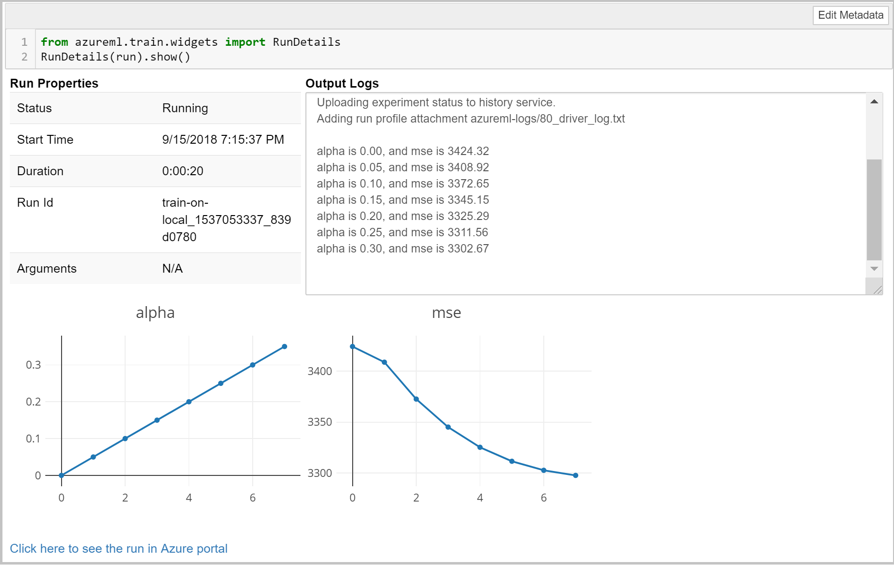

# Track experiments and training metrics in Azure Machine Learning

In the Azure Machine Learning service, you can track your experiments and monitor metrics to enhance the model creation process. In this article, you'll learn about the different ways to add logging to your training script, how to submit the experiment with **start_logging** and **ScriptRunConfig**, how to check the progress of a running job, and how to view the results of a run. 

>[!NOTE]
> Code in this article was tested with Azure Machine Learning SDK version 0.168 

## List of training metrics 

The following metrics can be added to a run while training an experiment. To view a more detailed list of what can be tracked on a run, see the [SDK reference documentation](https://docs.microsoft.com/python/api/overview/azure/azure-ml-sdk-overview?view=azure-ml-py).

|Type| Python function | Example | Notes|
|----|:----|:----|:----|
|Scalar values | `run.log(name, value, description='')`| `run.log("accuracy", 0.95) ` |Log a numerical or string value to the run with the given name. Logging a metric to a run causes that metric to be stored in the run record in the experiment.  You can log the same metric multiple times within a run, the result being considered a vector of that metric.|
|Lists| `run.log_list(name, value, description='')`| `run.log_list("accuracies", [0.6, 0.7, 0.87])` | Log a list of values to the run with the given name.|
|Row| `run.log_row(name, description=None, **kwargs)`| `run.log_row("Y over X", x=1, y=0.4)` | Using *log_row* creates a metric with multiple columns as described in kwargs. Each named parameter generates a column with the value specified.  *log_row* can be called once to log an arbitrary tuple, or multiple times in a loop to generate a complete table.|
|Table| `run.log_table(name, value, description='')`| `run.log_table("Y over X", {"x":[1, 2, 3], "y":[0.6, 0.7, 0.89]})` | Log a dictionary object to the run with the given name. |
|Images| `run.log_image(name, path=None, plot=None)`| `run.log_image("ROC", plt)` | Log an image to the run record. Use log_image to log an image file or a matplotlib plot to the run.  These images will be visible and comparable in the run record.|
|Tag a run| `run.tag(key, value=None)`| `run.tag("selected", "yes")` | Tag the run with a string key and optional string value.|
|Upload file or directory|`run.upload_file(name, path_or_stream)`| run.upload_file("best_model.pkl", "./model.pkl") | Upload a file to the run record. Runs automatically capture file in the specified output directory, which defaults to "./outputs" for most run types.  Use upload_file only when additional files need to be uploaded or an output directory is not specified. We suggest adding `outputs` to the name so that it gets uploaded to the outputs directory. You can list all of the files that are associated with this run record by called `run.get_file_names()`|

> [!NOTE]
> Metrics for scalars, lists, rows, and tables can have type: float, integer, or string.

## Log metrics for experiments

If you want to track or monitor your experiment, you must add code to start logging when you submit the run. The following are ways to trigger the run submission:
* __Run.start_logging__ - Add logging functions to your training script and start an interactive logging session in the specified experiment. **start_logging** creates an interactive run for use in scenarios such as notebooks. Any metrics that are logged during the session are added to the run record in the experiment.
* __ScriptRunConfig__ - Add logging functions to your training script and load the entire script folder with the run.  **ScriptRunConfig** is a class for setting up configurations for script runs. With this option, you can add monitoring code to be notified of completion or to get a visual widget to monitor.

## Set up the workspace and experiment
Before adding logging and submitting an experiment, you must set up the workspace and experiment.

1. Load the workspace. To learn more about setting the workspace configuration, follow the [quickstart](https://docs.microsoft.com/azure/machine-learning/service/quickstart-get-started).

  ```python
  from azureml.core import Workspace, Run
  import azureml.core
  
  ws = Workspace(workspace_name = <<workspace_name>>,
               subscription_id = <<subscription_id>>,
               resource_group = <<resource_group>>)
   ```

2. Create the experiment.

  ```python
  from azureml.core import Experiment

  # make up an arbitrary name
  experiment_name = 'train-in-notebook'
  exp = Experiment(workspace_object = ws, name = experiment_name)
  ```
  
## Option 1: Use start_logging

**start_logging** creates an interactive run for use in scenarios such as notebooks. Any metrics that are logged during the session are added to the run record in the experiment.

The following example trains a simple sklearn Ridge model locally in a local Jupyter notebook. To learn more about submitting experiments to different environments, see [Set up compute targets for model training with Azure Machine Learning service](https://docs.microsoft.com/azure/machine-learning/service/how-to-set-up-training-targets).

1. Create a training script in a local Jupyter notebook. 

  ``` python
  # load diabetes dataset, a well-known small dataset that comes with scikit-learn
  from sklearn.datasets import load_diabetes
  from sklearn.linear_model import Ridge
  from sklearn.metrics import mean_squared_error
  from sklearn.model_selection import train_test_split
  from sklearn.externals import joblib

  X, y = load_diabetes(return_X_y = True)
  columns = ['age', 'gender', 'bmi', 'bp', 's1', 's2', 's3', 's4', 's5', 's6']
  X_train, X_test, y_train, y_test = train_test_split(X, y, test_size = 0.2, random_state = 0)
  data = {
      "train":{"X": X_train, "y": y_train},        
      "test":{"X": X_test, "y": y_test}
  }
  reg = Ridge(alpha = 0.03)
  reg.fit(data['train']['X'], data['train']['y'])
  preds = reg.predict(data['test']['X'])
  print('Mean Squared Error is', mean_squared_error(preds, data['test']['y']))
  joblib.dump(value = reg, filename = 'model.pkl');
  ```

2. Add experiment tracking using the Azure Machine Learning service SDK, and upload a persisted model into the experiment run record. The following code adds tags, logs, and uploads a model file to the experiment run.

  ```python
  run = Run.start_logging(experiment = exp)
  run.tag("Description","My first run!")
  run.log('alpha', 0.03)
  reg = Ridge(alpha = 0.03)
  reg.fit(data['train']['X'], data['train']['y'])
  preds = reg.predict(data['test']['X'])
  run.log('mse', mean_squared_error(preds, data['test']['y']))
  joblib.dump(value = reg, filename = 'model.pkl')
  # Upload file directly to the outputs folder
  run.upload_file(name = 'outputs/model.pkl', path_or_stream = './model.pkl')

  run.complete()
  ```

The script ends with ```run.complete()```, which marks the run as completed.  This is typically used in interactive notebook scenarios.

## Option 2: Use ScriptRunConfig

**ScriptRunConfig** is a class for setting up configurations for script runs. With this option, you can add monitoring code to be notified of completion or to get a visual widget to monitor.

This example expands on the basic sklearn Ridge model from above. It does a simple parameter sweep to sweep over alpha values of the model to capture metrics and trained models in runs under the experiment. The example runs locally against a user-managed environment. 

1. Create a training script. This uses ```%%writefile%%``` to write the training code out to the script folder as ```train.py```.

  ```python
  %%writefile $project_folder/train.py

  import os
  from sklearn.datasets import load_diabetes
  from sklearn.linear_model import Ridge
  from sklearn.metrics import mean_squared_error
  from sklearn.model_selection import train_test_split
  from azureml.core.run import Run
  from sklearn.externals import joblib

  import numpy as np

  #os.makedirs('./outputs', exist_ok = True)

  X, y = load_diabetes(return_X_y = True)

  run = Run.get_context()

  X_train, X_test, y_train, y_test = train_test_split(X, y, test_size = 0.2, random_state = 0)
  data = {"train": {"X": X_train, "y": y_train},
          "test": {"X": X_test, "y": y_test}}

  # list of numbers from 0.0 to 1.0 with a 0.05 interval
  alphas = mylib.get_alphas()

  for alpha in alphas:
      # Use Ridge algorithm to create a regression model
      reg = Ridge(alpha = alpha)
      reg.fit(data["train"]["X"], data["train"]["y"])

      preds = reg.predict(data["test"]["X"])
      mse = mean_squared_error(preds, data["test"]["y"])
      # log the alpha and mse values
      run.log('alpha', alpha)
      run.log('mse', mse)

      model_file_name = 'ridge_{0:.2f}.pkl'.format(alpha)
      # save model in the outputs folder so it automatically get uploaded
      with open(model_file_name, "wb") as file:
          joblib.dump(value = reg, filename = model_file_name)

      # upload the model file explicitly into artifacts 
      run.upload_file(name = model_file_name, path_or_stream = model_file_name)

      # register the model
      #run.register_model(file_name = model_file_name)

      print('alpha is {0:.2f}, and mse is {1:0.2f}'.format(alpha, mse))
  
  ```

2. The ```train.py``` script references ```mylib.py```. This file allows you to get the list of alpha values to use in the ridge model.

  ```python
  %%writefile $script_folder/mylib.py
  import numpy as np

  def get_alphas():
      # list of numbers from 0.0 to 1.0 with a 0.05 interval
      return np.arange(0.0, 1.0, 0.05)
  ```

3. Configure a user-managed local environment.

  ```python
  from azureml.core.runconfig import RunConfiguration

  # Editing a run configuration property on-fly.
  run_config_user_managed = RunConfiguration()

  run_config_user_managed.environment.python.user_managed_dependencies = True

  # You can choose a specific Python environment by pointing to a Python path 
  #run_config.environment.python.interpreter_path = '/home/user/miniconda3/envs/sdk2/bin/python'
  ```

4. Submit the ```train.py``` script to run in the user-managed environment. This whole script folder is submitted for training, including the ```mylib.py``` file.

  ```python
  from azureml.core import ScriptRunConfig

  src = ScriptRunConfig(source_directory = script_folder, script = 'train.py', run_config = run_config_user_managed)
  run = exp.submit(src)
  ```
  
## View run details

### Monitor run with Jupyter notebook widgets
When you use the **ScriptRunConfig** method to submit runs, you can watch the progress of the run with a Jupyter notebook widget. Like the run submission, the widget is asynchronous and provides live updates every 10-15 seconds until the job completes.

1. View the Jupyter widget while waiting for the run to complete.

  ```python
  from azureml.train.widgets import RunDetails
  RunDetails(run).show()
  ```

  

### Get log results upon completion

Model training and monitoring occur in the background so that you can run other tasks while you wait. You can also wait until the model has completed training before running more code. When you use **ScriptRunConfig**, you can use ```run.wait_for_completion(show_output = True)``` to show when the model training is complete. The ```show_output``` flag gives you verbose output. 
  
### Query run metrics

You can view the metrics of a trained model using ```run.get_metrics()```. You can now get all of the metrics that were logged in the  example above to determine the best model.

## View the experiment in the Azure portal

When an experiment has finished running, you can browse to the recorded experiment run record. You can do this in two ways:

* Get the URL to the run directly ```print(run.get_portal_url())```
* View the run details by submitting the name of the run (in this case, ```run```). This points you to the experiment name, ID, type, status, details page, a link to the Azure portal, and a link to documentation.

The link for the run brings you directly to the run details page in the Azure portal. Here you can see any properties, tracked metrics, images, and charts that are logged in the experiment. In this case, we logged MSE and the alpha values.

  

You can also view any outputs or logs for the run, or download the snapshot of the experiment you submitted so you can share the experiment folder with others.

## Example notebooks
The following notebooks demonstrate concepts in this article:
* [01.getting-started/01.train-within-notebook/01.train-within-notebook.ipynb](https://github.com/Azure/MachineLearningNotebooks/blob/master/01.getting-started/01.train-within-notebook)
* [01.getting-started/02.train-on-local/02.train-on-local.ipynb](https://github.com/Azure/MachineLearningNotebooks/blob/master/01.getting-started/02.train-on-local)

Get these notebooks:
[!INCLUDE [aml-clone-in-azure-notebook](../../../includes/aml-clone-for-examples.md)]

## Next steps

Try these next steps to learn how to use the Azure Machine Learning SDK for Python:

* See an example of how to register the best model and deploy it in the tutorial, [Train an image classification model with Azure Machine Learning](tutorial-train-models-with-aml.md).

* Learn how to [Train PyTorch Models with Azure Machine Learning](how-to-train-pytorch.md).
