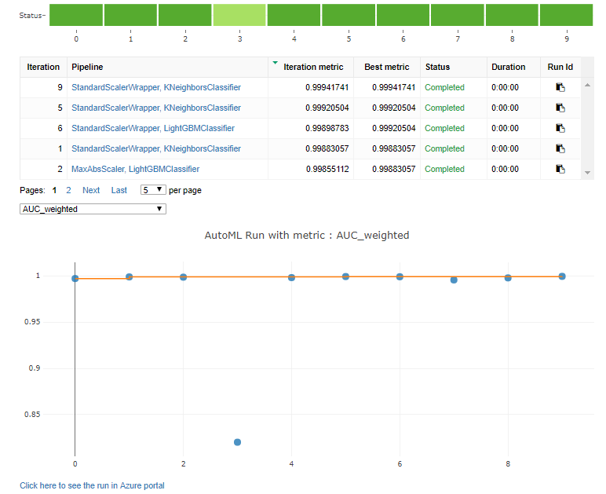
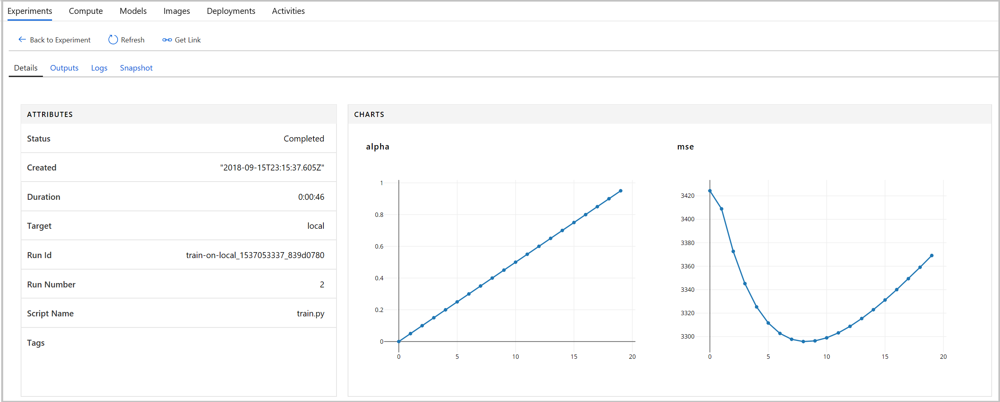
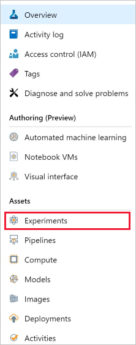
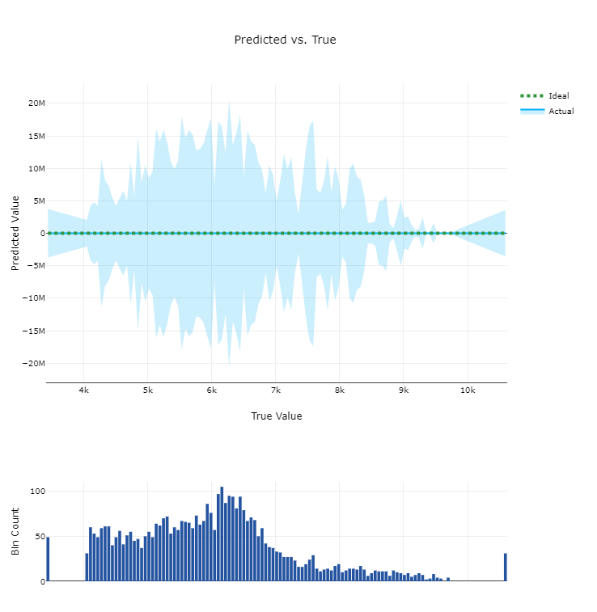
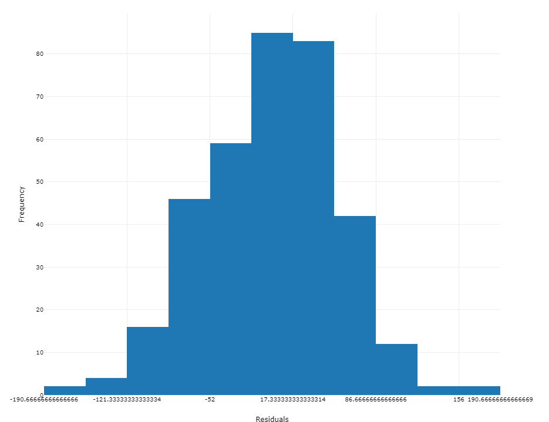

# Log metrics during training runs in Azure Machine Learning

Enhance the model creation process by tracking your experiments and monitoring metrics. In this article, learn how to add logging to your training script, submit an experiment run, monitor the run, and view the results of a run in Azure Machine Learning service.

## List of training metrics 

The following metrics can be added to a run while training an experiment. To view a more detailed list of what can be tracked on a run, see the [Run class reference documentation](https://docs.microsoft.com/python/api/azureml-core/azureml.core.run(class)?view=azure-ml-py).

|Type| Python function | Notes|
|----|:----|:----|
|Scalar values |Function:<br>`run.log(name, value, description='')`<br><br>Example:<br>run.log("accuracy", 0.95) |Log a numerical or string value to the run with the given name. Logging a metric to a run causes that metric to be stored in the run record in the experiment.  You can log the same metric multiple times within a run, the result being considered a vector of that metric.|
|Lists|Function:<br>`run.log_list(name, value, description='')`<br><br>Example:<br>run.log_list("accuracies", [0.6, 0.7, 0.87]) | Log a list of values to the run with the given name.|
|Row|Function:<br>`run.log_row(name, description=None, **kwargs)`<br>Example:<br>run.log_row("Y over X", x=1, y=0.4) | Using *log_row* creates a metric with multiple columns as described in kwargs. Each named parameter generates a column with the value specified.  *log_row* can be called once to log an arbitrary tuple, or multiple times in a loop to generate a complete table.|
|Table|Function:<br>`run.log_table(name, value, description='')`<br><br>Example:<br>run.log_table("Y over X", {"x":[1, 2, 3], "y":[0.6, 0.7, 0.89]}) | Log a dictionary object to the run with the given name. |
|Images|Function:<br>`run.log_image(name, path=None, plot=None)`<br><br>Example:<br>`run.log_image("ROC", plt)` | Log an image to the run record. Use log_image to log an image file or a matplotlib plot to the run.  These images will be visible and comparable in the run record.|
|Tag a run|Function:<br>`run.tag(key, value=None)`<br><br>Example:<br>run.tag("selected", "yes") | Tag the run with a string key and optional string value.|
|Upload file or directory|Function:<br>`run.upload_file(name, path_or_stream)`<br> <br> Example:<br>run.upload_file("best_model.pkl", "./model.pkl") | Upload a file to the run record. Runs automatically capture file in the specified output directory, which defaults to "./outputs" for most run types.  Use upload_file only when additional files need to be uploaded or an output directory is not specified. We suggest adding `outputs` to the name so that it gets uploaded to the outputs directory. You can list all of the files that are associated with this run record by called `run.get_file_names()`|

> [!NOTE]
> Metrics for scalars, lists, rows, and tables can have type: float, integer, or string.

## Start logging metrics

If you want to track or monitor your experiment, you must add code to start logging when you submit the run. The following are ways to trigger the run submission:
* __Run.start_logging__ - Add logging functions to your training script and start an interactive logging session in the specified experiment. **start_logging** creates an interactive run for use in scenarios such as notebooks. Any metrics that are logged during the session are added to the run record in the experiment.
* __ScriptRunConfig__ - Add logging functions to your training script and load the entire script folder with the run.  **ScriptRunConfig** is a class for setting up configurations for script runs. With this option, you can add monitoring code to be notified of completion or to get a visual widget to monitor.

## Set up the workspace
Before adding logging and submitting an experiment, you must set up the workspace.

1. Load the workspace. To learn more about setting the workspace configuration, follow the steps in [Create an Azure Machine Learning service workspace](setup-create-workspace.md#sdk).

   ```python
   from azureml.core import Experiment, Run, Workspace
   import azureml.core
  
   ws = Workspace.from_config()
   ```
  
## Option 1: Use start_logging

**start_logging** creates an interactive run for use in scenarios such as notebooks. Any metrics that are logged during the session are added to the run record in the experiment.

The following example trains a simple sklearn Ridge model locally in a local Jupyter notebook. To learn more about submitting experiments to different environments, see [Set up compute targets for model training with Azure Machine Learning service](https://docs.microsoft.com/azure/machine-learning/service/how-to-set-up-training-targets).

1. Create a training script in a local Jupyter notebook. 

   ```python
   # load diabetes dataset, a well-known small dataset that comes with scikit-learn
   from sklearn.datasets import load_diabetes
   from sklearn.linear_model import Ridge
   from sklearn.metrics import mean_squared_error
   from sklearn.model_selection import train_test_split
   from sklearn.externals import joblib

   X, y = load_diabetes(return_X_y = True)
   columns = ['age', 'gender', 'bmi', 'bp', 's1', 's2', 's3', 's4', 's5', 's6']
   X_train, X_test, y_train, y_test = train_test_split(X, y, test_size = 0.2, random_state = 0)
   data = {
      "train":{"X": X_train, "y": y_train},        
      "test":{"X": X_test, "y": y_test}
   }
   reg = Ridge(alpha = 0.03)
   reg.fit(data['train']['X'], data['train']['y'])
   preds = reg.predict(data['test']['X'])
   print('Mean Squared Error is', mean_squared_error(preds, data['test']['y']))
   joblib.dump(value = reg, filename = 'model.pkl');
   ```

2. Add experiment tracking using the Azure Machine Learning service SDK, and upload a persisted model into the experiment run record. The following code adds tags, logs, and uploads a model file to the experiment run.

   ```python
    # Get an experiment object from Azure Machine Learning
    experiment = Experiment(workspace=ws, name="train-within-notebook")
    
    # Create a run object in the experiment
    run =  experiment.start_logging()
    # Log the algorithm parameter alpha to the run
    run.log('alpha', 0.03)
    
    # Create, fit, and test the scikit-learn Ridge regression model
    regression_model = Ridge(alpha=0.03)
    regression_model.fit(data['train']['X'], data['train']['y'])
    preds = regression_model.predict(data['test']['X'])
    
    # Output the Mean Squared Error to the notebook and to the run
    print('Mean Squared Error is', mean_squared_error(data['test']['y'], preds))
    run.log('mse', mean_squared_error(data['test']['y'], preds))
    
    # Save the model to the outputs directory for capture
    model_file_name = 'outputs/model.pkl'
    
    joblib.dump(value = regression_model, filename = model_file_name)
    
    # upload the model file explicitly into artifacts 
    run.upload_file(name = model_file_name, path_or_stream = model_file_name)
    
    # Complete the run
    run.complete()
   ```

    The script ends with ```run.complete()```, which marks the run as completed.  This function is typically used in interactive notebook scenarios.

## Option 2: Use ScriptRunConfig

[**ScriptRunConfig**](https://docs.microsoft.com/python/api/azureml-core/azureml.core.scriptrunconfig?view=azure-ml-py) is a class for setting up configurations for script runs. With this option, you can add monitoring code to be notified of completion or to get a visual widget to monitor.

This example expands on the basic sklearn Ridge model from above. It does a simple parameter sweep to sweep over alpha values of the model to capture metrics and trained models in runs under the experiment. The example runs locally against a user-managed environment. 

1. Create a training script `train.py`.

   ```python
   # train.py

   import os
   from sklearn.datasets import load_diabetes
   from sklearn.linear_model import Ridge
   from sklearn.metrics import mean_squared_error
   from sklearn.model_selection import train_test_split
   from azureml.core.run import Run
   from sklearn.externals import joblib

   import numpy as np

   #os.makedirs('./outputs', exist_ok = True)

   X, y = load_diabetes(return_X_y = True)

   run = Run.get_context()

   X_train, X_test, y_train, y_test = train_test_split(X, y, test_size = 0.2, random_state = 0)
   data = {"train": {"X": X_train, "y": y_train},
          "test": {"X": X_test, "y": y_test}}

   # list of numbers from 0.0 to 1.0 with a 0.05 interval
   alphas = mylib.get_alphas()

   for alpha in alphas:
      # Use Ridge algorithm to create a regression model
      reg = Ridge(alpha = alpha)
      reg.fit(data["train"]["X"], data["train"]["y"])

      preds = reg.predict(data["test"]["X"])
      mse = mean_squared_error(preds, data["test"]["y"])
      # log the alpha and mse values
      run.log('alpha', alpha)
      run.log('mse', mse)

      model_file_name = 'ridge_{0:.2f}.pkl'.format(alpha)
      # save model in the outputs folder so it automatically get uploaded
      with open(model_file_name, "wb") as file:
          joblib.dump(value = reg, filename = model_file_name)

      # upload the model file explicitly into artifacts 
      run.upload_file(name = model_file_name, path_or_stream = model_file_name)

      # register the model
      #run.register_model(file_name = model_file_name)

      print('alpha is {0:.2f}, and mse is {1:0.2f}'.format(alpha, mse))
  
   ```

2. The `train.py` script references `mylib.py` which allows you to get the list of alpha values to use in the ridge model.

   ```python
   # mylib.py
  
   import numpy as np

   def get_alphas():
      # list of numbers from 0.0 to 1.0 with a 0.05 interval
      return np.arange(0.0, 1.0, 0.05)
   ```

3. Configure a user-managed local environment.

   ```python
   from azureml.core import Environment
    
   # Editing a run configuration property on-fly.
   user_managed_env = Environment("user-managed-env")
    
   user_managed_env.python.user_managed_dependencies = True
    
   # You can choose a specific Python environment by pointing to a Python path 
   #user_managed_env.python.interpreter_path = '/home/johndoe/miniconda3/envs/myenv/bin/python'
   ```

4. Submit the ```train.py``` script to run in the user-managed environment. This whole script folder is submitted for training, including the ```mylib.py``` file.

   ```python
   from azureml.core import ScriptRunConfig
    
   exp = Experiment(workspace=ws, name="train-on-local")
   src = ScriptRunConfig(source_directory='./', script='train.py')
   src.run_config.environment = user_managed_env
   run = exp.submit(src)
   ```

## Manage a run

The [Start, monitor and cancel training runs](how-to-manage-runs.md) article highlights specific Azure Machine Learning workflows for how to manage your experiments.

## View run details

### Monitor run with Jupyter notebook widgets
When you use the **ScriptRunConfig** method to submit runs, you can watch the progress of the run with a Jupyter notebook widget. Like the run submission, the widget is asynchronous and provides live updates every 10-15 seconds until the job completes.

1. View the Jupyter widget while waiting for the run to complete.

   ```python
   from azureml.widgets import RunDetails
   RunDetails(run).show()
   ```

   

2. **[For automated machine learning runs]** To access the charts from a previous run. Replace `<<experiment_name>>` with the appropriate experiment name:

   ``` 
   from azureml.widgets import RunDetails
   from azureml.core.run import Run

   experiment = Experiment (workspace, <<experiment_name>>)
   run_id = 'autoML_my_runID' #replace with run_ID
   run = Run(experiment, run_id)
   RunDetails(run).show()
   ```

   


To view further details of a pipeline click on the Pipeline you would like to explore in the table, and the charts will render in a pop-up from the Azure portal.

### Get log results upon completion

Model training and monitoring occur in the background so that you can run other tasks while you wait. You can also wait until the model has completed training before running more code. When you use **ScriptRunConfig**, you can use ```run.wait_for_completion(show_output = True)``` to show when the model training is complete. The ```show_output``` flag gives you verbose output. 
  
### Query run metrics

You can view the metrics of a trained model using ```run.get_metrics()```. You can now get all of the metrics that were logged in the  example above to determine the best model.

<a name="view-the-experiment-in-the-web-portal"></a>
## View the experiment in the Azure portal

When an experiment has finished running, you can browse to the recorded experiment run record. You can access the history in two ways:

* Get the URL to the run directly ```print(run.get_portal_url())```
* View the run details by submitting the name of the run (in this case, ```run```). This way points you to the experiment name, ID, type, status, details page, a link to the Azure portal, and a link to documentation.

The link for the run brings you directly to the run details page in the Azure portal. Here you can see any properties, tracked metrics, images, and charts that are logged in the experiment. In this case, we logged MSE and the alpha values.

  

You can also view any outputs or logs for the run, or download the snapshot of the experiment you submitted so you can share the experiment folder with others.

### Viewing charts in run details

There are various ways to use the logging APIs to record different types of metrics during a run and view them as charts in the Azure portal. 

|Logged Value|Example code| View in portal|
|----|----|----|
|Log an array of numeric values| `run.log_list(name='Fibonacci', value=[0, 1, 1, 2, 3, 5, 8, 13, 21, 34, 55, 89])`|single-variable line chart|
|Log a single numeric value with the same metric name repeatedly used (like from within a for loop)| `for i in tqdm(range(-10, 10)):    run.log(name='Sigmoid', value=1 / (1 + np.exp(-i))) angle = i / 2.0`| Single-variable line chart|
|Log a row with 2 numerical columns repeatedly|`run.log_row(name='Cosine Wave', angle=angle, cos=np.cos(angle))   sines['angle'].append(angle)      sines['sine'].append(np.sin(angle))`|Two-variable line chart|
|Log table with 2 numerical columns|`run.log_table(name='Sine Wave', value=sines)`|Two-variable line chart|

<a name="auto"></a>
## Understanding automated ML charts

After submitting an automated ML job in a notebook, a history of these runs can be found in your machine learning service workspace. 

Learn more about:
+ [Charts and curves for classification models](#classification)
+ [Charts and graphs for regression models](#regression)
+ [Model explain ability](#model-explain-ability-and-feature-importance)


### View the run charts

1. Go to your workspace. 

1. Select **Experiments** in the leftmost panel of your workspace.

   

1. Select the experiment you are interested in.

   

1. In the table, select the Run Number.

   

1. In the table, select the Iteration Number for the model that you would like to explore further.

   


### Classification

For every classification model that you build by using the automated machine learning capabilities of Azure Machine Learning, you can see the following charts: 
+ [Confusion matrix](#confusion-matrix)
+ [Precision-Recall chart](#precision-recall-chart)
+ [Receiver operating characteristics (or ROC)](#roc)
+ [Lift curve](#lift-curve)
+ [Gains curve](#gains-curve)
+ [Calibration plot](#calibration-plot)

#### Confusion matrix

A confusion matrix is used to describe the performance of a classification model. Each row displays the instances of the true class, and each column represents the instances of the predicted class. The confusion matrix shows the correctly classified labels and the incorrectly classified labels for a given model.

For classification problems, Azure Machine Learning automatically provides a confusion matrix for each model that is built. For each confusion matrix, automated ML will show the correctly classified labels as green, and incorrectly classified labels as red. The size of the circle represents the number of samples in that bin. In addition, the frequency count of each predicted label and each true label is provided in the adjacent bar charts. 

Example 1: A classification model with poor accuracy


Example 2: A classification model with high accuracy (ideal)


#### Precision-recall chart

With this chart, you can compare the precision-recall curves for each model to determine which model has an acceptable relationship between precision and recall for your particular business problem. This chart shows Macro Average Precision-Recall, Micro Average Precision-Recall, and the precision-recall associated with all classes for a model.

The term Precision represents that ability for a classifier to label all instances correctly. Recall represents the ability for a classifier to find all instances of a particular label. The precision-recall curve shows the relationship between these two concepts. Ideally, the model would have 100% precision and 100% accuracy.

Example 1: A classification model with low precision and low recall


Example 2: A classification model with ~100% precision and ~100% recall (ideal)


#### ROC

Receiver operating characteristic (or ROC) is a plot of the correctly classified labels vs. the incorrectly classified labels for a particular model. The ROC curve can be less informative when training models on datasets with high bias, as it will not show the false positive labels.

Example 1: A classification model with low true labels and high false labels


Example 2: A classification model with high true labels and low false labels


#### Lift curve

You can compare the lift of the model built automatically with Azure Machine Learning to the baseline in order to view the value gain of that particular model.

Lift charts are used to evaluate the performance of a classification model. It shows how much better you can expect to do with a model compared to without a model. 

Example 1: Model performs worse than a random selection model


Example 2: Model performs better than a random selection model


#### Gains curve

A gains chart evaluates the performance of a classification model by each portion of the data. It shows for each percentile of the data set, how much better you can expect to perform compared against a random selection model.

Use the cumulative gains chart to help you choose the classification cutoff using a percentage that corresponds to a desired gain from the model. This information provides another way of looking at the results in the accompanying lift chart.

Example 1: A classification model with minimal gain


Example 2: A classification model with significant gain


#### Calibration plot

For all classification problems, you can review the calibration line for micro-average, macro-average, and each class in a given predictive model. 

A calibration plot is used to display the confidence of a predictive model. It does this by showing the relationship between the predicted probability and the actual probability, where “probability” represents the likelihood that a particular instance belongs under some label. A well calibrated model  aligns with the y=x line, where it is reasonably confident in its predictions. An over-confident model  aligns with the y=0 line, where the predicted probability is present but there is no actual probability.

Example 1: A more well-calibrated model


Example 2: An over-confident model


### Regression
For every regression model, you build using the automated machine learning capabilities of Azure Machine Learning, you can see the following charts: 
+ [Predicted vs. True](#pvt)
+ [Histogram of residuals](#histo)

<a name="pvt"></a>

#### Predicted vs. True

Predicted vs. True shows the relationship between a predicted value and its correlating true value for a regression problem. This graph can be used to measure performance of a model as the closer to the y=x line the predicted values are, the better the accuracy of a predictive model.

After each run, you can see a predicted vs. true graph for each regression model. To protect data privacy, values are binned together and the size of each bin is shown as a bar graph on the bottom portion of the chart area. You can compare the predictive model, with the lighter shade area showing error margins, against the ideal value of where the model should be.

Example 1: A regression model with low accuracy in predictions


Example 2: A regression model with high accuracy in its predictions


<a name="histo"></a>

#### Histogram of residuals

A residual represents an observed y – the predicted y. To show a margin of error with low bias, the histogram of residuals should be shaped as a bell curve, centered around 0. 

Example 1: A regression model with bias in its errors


Example 2: A regression model with more even distribution of errors


### Model explain-ability and feature importance

Feature importance gives a score that indicates how valuable each feature was in the construction of a model. You can review the feature importance score for the model overall as well as per class on a predictive model. You can see per feature how the importance compares against each class and overall.


## Example notebooks
The following notebooks demonstrate concepts in this article:
* [how-to-use-azureml/training/train-within-notebook](https://github.com/Azure/MachineLearningNotebooks/blob/master/how-to-use-azureml/training/train-within-notebook)
* [how-to-use-azureml/training/train-on-local](https://github.com/Azure/MachineLearningNotebooks/blob/master/how-to-use-azureml/training/train-on-local)
* [how-to-use-azureml/training/logging-api/logging-api.ipynb](https://github.com/Azure/MachineLearningNotebooks/blob/master/how-to-use-azureml/training/logging-api)

[!INCLUDE [aml-clone-in-azure-notebook](../../../includes/aml-clone-for-examples.md)]

## Next steps

Try these next steps to learn how to use the Azure Machine Learning SDK for Python:

* See an example of how to register the best model and deploy it in the tutorial, [Train an image classification model with Azure Machine Learning](tutorial-train-models-with-aml.md).

* Learn how to [Train PyTorch Models with Azure Machine Learning](how-to-train-pytorch.md).
