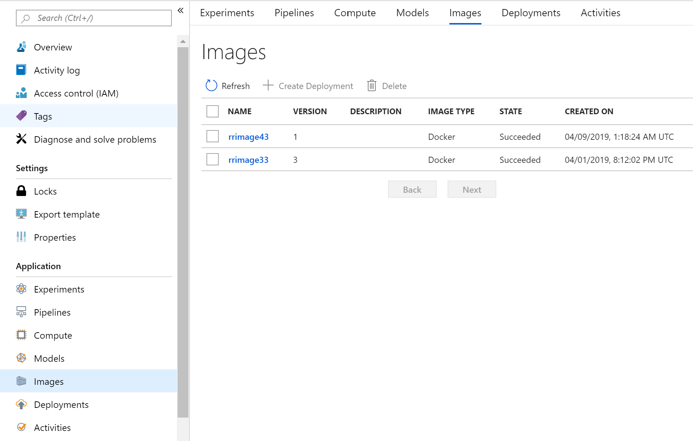
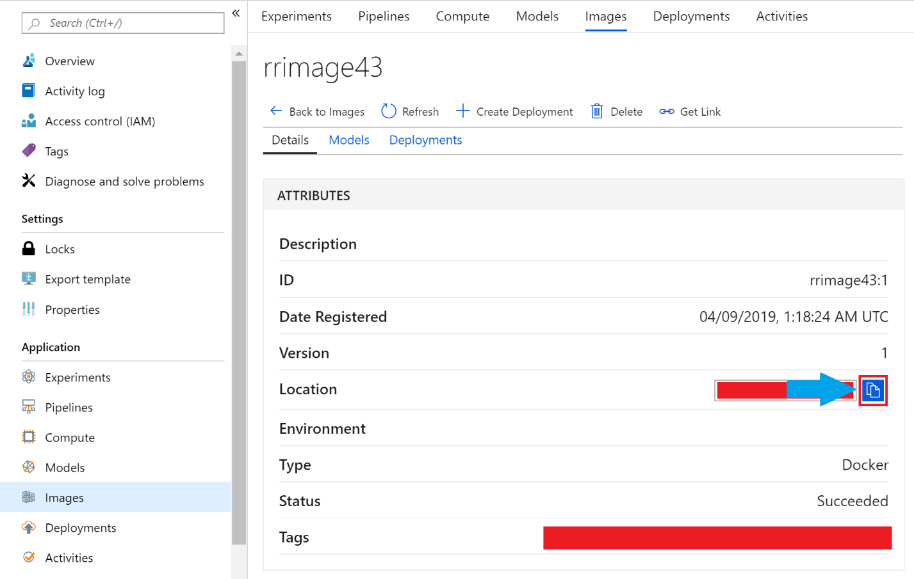
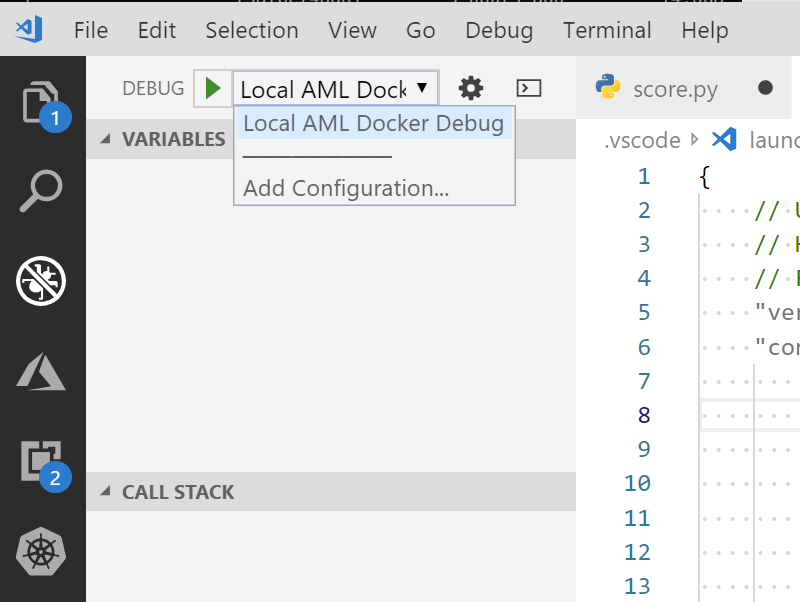
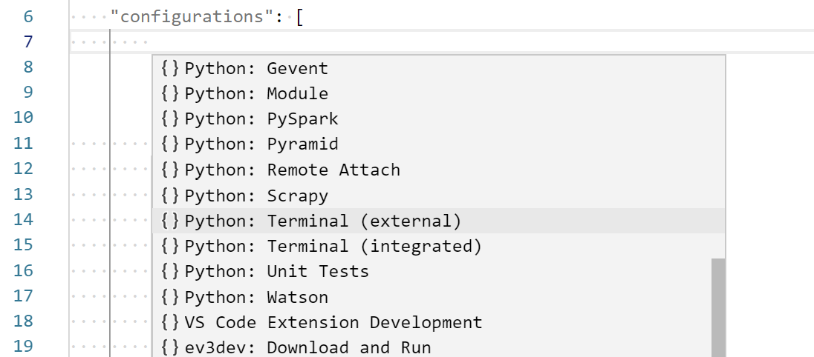
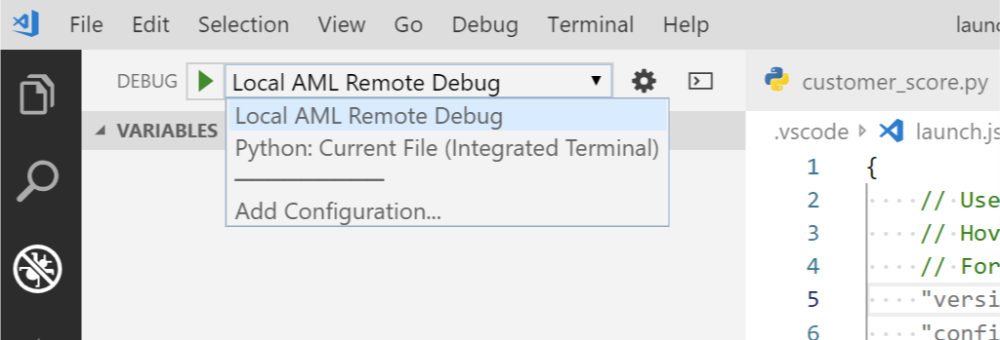
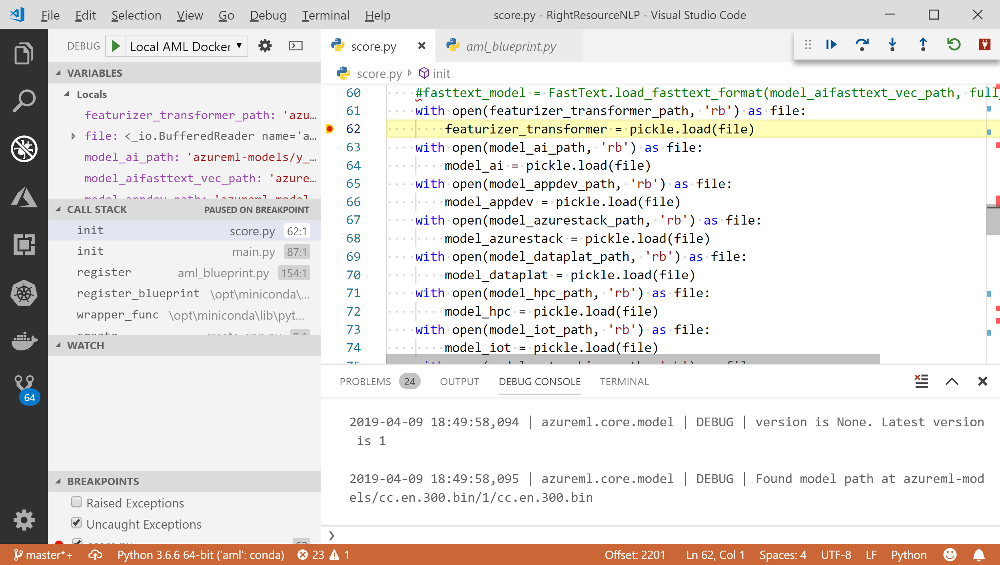

# Use VS Code to debug models deployed as web services

Learn how to use Visual Studio Code to debug models deployed as web services by the Azure Machine Learning service. When deploying a model as a web service, the Azure Machine Learning service creates a Docker image that contains the model and all the assets needed to use it.

It can be difficult to troubleshoot problems that occur inside the image using techniques such as adding print statements to your code. By using VS Code, you can attach to the running web service inside the image and interactively debug the process. This allows you to view variables, set breakpoints, etc. as requests are made to the service.

## Prerequisites

* A model deployed as a web service. If you do not have one, use the steps in the [train](tutorial-train-models-with-aml.md) and [deploy](tutorial-deploy-models-with-aml.md) tutorials to train the model and create the Docker image.

* [Visual Studio Code](https://code.visualstudio.com/Download).

* The [Python Tools for Visual Studio (PTVSD)](https://pypi.org/project/ptvsd/). To install the tools, use the following command from your Python environment:

    ```
    python -m pip install --upgrade ptvsd
    ```

    For more information on using PTVSD with VS Code, see [Remote Debugging](https://code.visualstudio.com/docs/python/debugging#_remote-debugging).

* The [Azure CLI](https://docs.microsoft.com/cli/azure/install-azure-cli?view=azure-cli-latest).

* [Docker](https://www.docker.com/get-started) must be installed on your local development environment.

## Debugging methods

Generally speaking, there are two different methods you can use to debug Python with PTVSD in VS Code. These methods are to either start the debugger at process start time, or attach a debugger at run time.

### Launch score.py from the debugger module at process start time

Attaching the debugger at start time requires using a command similar to the following text:

```text
python -m ptvsd --host 0.0.0.0 --port 5678 --wait score.py
```

This command starts the debugging server (PTVSD) and waits until VS Code connects to it before running the score.py file.

### Attach to the environment at run time

The script is launched by some other process, which is what happens with the score.py file in Azure Machine Learning web service deployments. To allow you to attach a debugger at run time, add the following code to the top of your score.py file:

```python
import ptvsd
# Allows other computers to attach to ptvsd at this IP address and port.
ptvsd.enable_attach(address=('0.0.0.0', 5678), redirect_output = True)
# Pause the script until a remote debugger is attached and timeout after 30 sec
ptvsd.wait_for_attach(timeout = 30)
print("Debugger attached...")
```

## Create the Docker image

To connect to the Python scripts inside the Docker image, you must install the PTVSD package inside the image. It is also useful to install a text editor, so that you can make changes to files as needed inside the image. The steps in this section register an image that includes PTVSD and vim.

> [!NOTE]
> The information in this section assumes that you're familiar with using the SDK to deploy models. For example notebooks that train and deploy models, see the [Machine Learning notebook repository](https://github.com/Azure/MachineLearningNotebooks/). 

1. When creating a deployment, include the PTVSD package in the conda dependencies. The following example demonstrates adding it using the `pip_packages` parameter:

    ```python
    from azureml.core.conda_dependencies import CondaDependencies 
    
    # Usually a good idea to choose specific version numbers
    # so training is made on same packages as scoring
    myenv = CondaDependencies.create(conda_packages=['numpy==1.15.4',            
                                'scikit-learn==0.19.1', 'pandas==0.23.4'],
                                 pip_packages = ['azureml-defaults==1.0.17', 'ptvsd'])
    
    with open("myenv.yml","w") as f:
        f.write(myenv.serialize_to_string())
    ```

2. To install vim in the Docker image, create a new text file named `Dockerfile.steps` and use the following as the contents of the file:

    ```text
    RUN apt-get update && apt-get -y install vim
    ```

3. To create an image that uses the `Dockerfile.steps` file, use the `docker_file` parameter when creating an image. The following example demonstrates how to do this:

    > [!NOTE]
    > This example assumes that `ws` points to your Azure Machine Learning workspace, and that `model` is the model being deployed. The `myenv.yml` file contains the conda dependencies created in step 1.

    ```python
    from azureml.core.image import Image, ContainerImage
    image_config = ContainerImage.image_configuration(runtime= "python",
                                 execution_script="score.py",
                                 conda_file="myenv.yml",
                                 docker_file="Dockerfile.steps")

    image = Image.create(name = "myimage",
                     models = [model],
                     image_config = image_config, 
                     workspace = ws)
    ```

## Download the image

The steps in this section download the image to your local development environment. There, you can run it in your local Docker installation and debug it. If you need to debug it running in an Azure Kubernetes Service (AKS) deployment in the cloud, see the [TBD]() section.

> [!IMPORTANT]
> Local debugging of the image requires a working Docker installation on your local development environment. Docker must be running before you start debugging the image. For more information on using Docker, see [https://www.docker.com](https://www.docker.com).

1. Use the [Azure portal](https://portal.azure.com) and navigate to your Azure Machine Learning workspace. From the __Overview__ section, copy the name of the __Registry__. Save this name, as it is used later in this section.

    

1. To find the image path within the repository, select __Images__ from the left side of your Azure Machine learning workspace and then select the image name:

    

    From __Details__ for the image, copy the __Location__ value. This is the path to the image. Save this value as it is used later in this section.

    

1. Open a command prompt, terminal, or other shell and use the following Azure CLI command to authenticate to the Azure subscription that contains your Azure Machine Learning workspace:

    ```azurecli
    az login
    ```

1. To authenticate to the Azure Container Registry (ACR) that contains your image, use the following command. Replace `myregistry` with the name you retrieved in step 1.

    ```azurecli
    az acr login --name myregistry
    ```

1. To download the image to your local Docker, use the following command. Replace `myimagepath` with the location value from step 2.

    ```bash
    docker pull myimagepath
    ```

    > [!TIP]
    > The authentication from the previous step does not last forever. If you wait long enough between the authentication command and the pull command, you will receive an authentication failure. If this happens, reauthenticate.

    The time it takes to complete the download depends on the speed of your internet connection. A download status is displayed during the process. Once the download is complete, you can use the `docker images` command to verify that it has downloaded.

1. To make it easier to work with the image, use the following command to add a tag to it. Replace `myimagepath` with the location value from step 2.

    ```bash
    docker tag myimagepath debug:1
    ```

    For the rest of the steps, you can refer to the local image as `debug:1` instead of the full image path value.

## Configure Visual Studio Code

VS Code needs to know the port that PTVSD on the Docker image uses for debugging. It also needs to know the host address, and the directories (both locally and in the image) where the code is located.

To configure VS Code and PTVSD to connect to the image, use the following steps.

> [!IMPORTANT]
> These steps assume that PTVSD has been successfully installed with VS Code. If you have not installed PTVSD, use the following command to install it:
> ```python
> python -m pip install --upgrade ptvsd
> ```

1. Use VS Code to open the `score.py` file that was used to create your model deployment.

1. From VS Code, select the __Debug__ menu and then select __Open configurations__. A file named __launch.json__ opens.

1. In the __launch.json__ file, find the line that contains `"configurations": [`, and insert the following text on the line after it:

    ```json
    {
        "name": "Azure Machine Learning service: Docker Debug",
        "type": "python",
        "request": "attach",
        "port": 5678,
        "host": "localhost",
        "pathMappings": [
            {
                "localRoot": "${workspaceFolder}",
                "remoteRoot": "/var/azureml-app"
            }
        ]
    }
    ```

    > [!IMPORTANT]
    > If there are already other entries in the configurations section, add a comma (,) after the code that you inserted.

1. Save the __launch.json__ file.

## Debug the service

1. To start a container based on the image, use the following command:

    ```bash
    docker run -it --rm --name debug -p 8000:5001 -p 5678:5678 debug:1 /bin/bash
    ```

    This command creates a new container named __debug__. Once it starts, you arrive at a bash prompt inside the container. Your prompt changes to something similar to `root@ba216845db54:/#`.

1. If you are not sure whether the score.py file is successfully loading or not, you can use the following steps to verify that it can load and process data:

    * Create an example data file in the Docker container.
    * Modify the score.py to load the example data on start.
    * Start score.py using PTVSD. The PTVSD process waits for you to connect a debugger.

    To make these changes and start the process using PTVSD, use the following steps:

    1. From the ``root@ba216845db54:/#` prompt, use the following command to move to the directory containing the score.py file:

        ```bash
        cd /var/azureml-app
        ```
    
    1. To create a data file to test the score.py file, use the following command to open the vim editor:


2. To start the web service and immediately attach a debuggger, use the following command:


7. <a name='step7'></a>**Launch debugging in the container** : depending on the debugging approach :
    1. **At start time** : Launch the container using `docker run -it --rm --name lab -p 8000:5001 -p 5678:5678 lab:1 /bin/bash`. This step launches a shell session in the container, after which you can type `cd /var/azureml-app/` and then run `python -m ptvsd --host 0.0.0.0 --port 5678 --wait score.py`. You will connect to the debugging session at step [12](#step12).
    2. <a name='step7.2'></a>**At run time** : Launch the container using: `docker run --rm --name lab -p 8000:5001 -p 5678:5678 lab:1`. This launches the processes to serve web requests assuming there aren’t issues with your `score.py` file’s init() or run() functions, and also assumes you have included the lines to run `ptvsd` from within your code if you want to debug your script:

        ```python
        import ptvsd
        # Allows other computers to attach to ptvsd art this IP address and port.
        ptvsd.enable_attach(address=('0.0.0.0', 5678), redirect_output = True)
        # Pause execution unti a remote debugger is attached and timeout after 30 sec
        ptvsd.wait_for_attach(timeout = 30)
        print("Debugger attached...")
        ```
    
8. **Open a shell for edits** : In a second shell (local or through SSH), launch `docker exec -it lab /bin/bash` to open a shell in the container. This shell allows you to edit files in the container without rebuilding the image for every edit.
9. <a name='step9'></a>**Commit changes when required** : When a container is terminated, changes to its filesystem are not persisted. Run `docker commit lab lab:2` for to persist edits made to `score.py` or any other changes you might have made to troubleshoot to disk, changing the image now to `lab:2` versus `lab:1` as we had originally.
10.	**Confirm images on the system** : Running `docker images` should let you see an output like this: 
    ```text
    user@host:~$ docker images --format "table {{.Repository}}\t{{.Tag}}\t{{.ID}}"
    REPOSITORY                              TAG                 IMAGE ID 
    lab                                     2                   3f2515daeb60
    lab                                     1                   ac3f91ddff35
    rrnlpacrkwzwinws.azurecr.io/rrimage45   14                  ac3f91ddff35
    ```
    The image created is the first one in the list (lab:2) and is the result of the last command. You are ready to edit your code so that you can connect to it from VS Code!
11. **Add a debugger configuration in VS Code** : to be able to connect to your container, you need to add a debugger configuration in VS Code. Specifically, click on the `Add Configuration` in the debugger menu:
    
    
    
    When offered the choice, choose Python: Terminal (external or integrated).

    

    Finally, use a configuration similar to this one :

    ```json
    {
        "version": "0.2.0",
        "configurations": [            
            {
                "name": "AML Docker Debug",
                "type": "python",
                "request": "attach",
                "port": 5678,
                "host": "localhost",
                "pathMappings": [
                    {
                        "localRoot": "${workspaceFolder}",
                        "remoteRoot": "/var/azureml-app"
                    }
               ]
            }
        ]
    }
    ```
    The port 5678 and localhost will work because you will tunnel these ports through your SSH sessions to the host running the container (see step [4 for SSH tunneling](#step4) and [7 for launching `docker` containers](#step7).

12. <a name='step12'></a>**Start debugging in VS Code**: Regardless of the approach you’re going to be taking (debugging at start time or at run time), the `score.py` file you’re editing in the container and in VS Code both have to be identical. The scoring file is `/var/azureml-app/score.py` in the container. Specifically, depending on the method, here are some hints of the changes you could do to your `score.py` file. Also, keep in mind the changes suggested below can be performed before the image is created, so that you can hit the ground running and start debugging immediately without modifying the file in the container – and in the VS Code environment.
    1. **At start time** : if you’re manually starting the debugger, you will need to make slight edits in order to call `init()` and `run()` : For example, at the end of your `score.py` file, you might add these lines to manually launch `init()` and `run()` without relying on the AML framework :
        ```python
        # this code assumes you put a file called scoring.json
        # in the working directory of the container (/var/azureml-app)
        # that has records to score.
        if __name__ == "__main__":
            init()
            with open('scoring.json') as infile:
                test_input_data = json.load(infile)
            output = run(json.dumps(test_input_data))
            print(output)        ```
        #...
        ```
    2. **At run time** : in this case, we are letting the container start normally, and we’re attaching to it after it is launched. You will still need to do minor edits to the code (and keep code identical on the VS Code side and in the container). This will be required to debug the web servicing part of the container. This requires adding debugging functionality directly in your code. See below for an example of the usage of ptvsd directly in your score.py file as mentioned in section [7.2](#step7.2), at the beginning of your score.py file, so that this gets executed quickly upon container start, so you have time to attach to the running process from VS Code and test all your code and in particular, both the `init()` and `run()` functions :
        ```python
        import ptvsd
        # Allows other computers to attach to ptvsd art this IP address and port.
        ptvsd.enable_attach(address=('0.0.0.0', 5678), redirect_output = True)
        # Pause execution until a remote debugger is attached and timeout after 30 sec
        ptvsd.wait_for_attach(timeout = 30)
        print("Debugger attached...")
        ```
    This forces the container to pause until a debugger connects. It is not mandatory to use `ptvsd.wait_for_attach()` line if you don’t need to connect before anything initializes.
    
13. **Commit your code** : Remember to commit your code frequently (see step [9](#step9) above).

14. **Start debugging** :
    1. Set one or more break point as you would normally do with VS Code. Select the newly created debugger configuration (Local AML Remote Debug) and press the green play button.
    
    


    2. VS Code will attempt connecting to `localhost` on port `5678`. At this stage, the port is either opened locally or forwarded using SSH to the target running the container. Your VS code instance’s border will change color depending on the color theme, to indicate it’s connected:

    
    
    You’re now connected to your scoring container and can debug step-by-step, explore variables exactly like you would otherwise do if you ran this as a local python program.

15. **Perform edits and commit the changes** : in general, using these techniques will save the time you would otherwise need to rebuild a container at every edit in the `score.py` file or other (you can add a forgotten pip or conda dependency, etc.) and you will need to commit the changes as explained in step [9](#). Once the changes are committed, if you want to test them out, you can stop the container `docker stop lab` and relaunch it.

16. **Testing the web service** : if you’ve launched it using the runtime approach, you are free to use an API testing tool of your choice to connect to your endpoint and trigger the `run()` function. Connect for example to `http://localhost:8000/score` if the container runs locally or on a host where port 8000 is forwarded to, but it could also be with a public IP address if the VM running your container has a public IP address and exposes port 8000 for scoring.

## Summary

We’re continuously working towards making it easier to explore and transform data, and then train and deploy models on the cloud and we hope this helps you troubleshoot complex issues you might with your image.

## Next Steps

Learn more about deployment:
* [How to deploy and where](how-to-deploy-and-where.md)
* Deploy and train your models with [Azure Machine Learning service](https://azure.microsoft.com/en-us/services/machine-learning-service/)
* Explore [AML Notebooks on GitHub](https://github.com/Azure/MachineLearningNotebooks) 
* [Tutorial: Train & deploy models](tutorial-train-models-with-aml.md)
