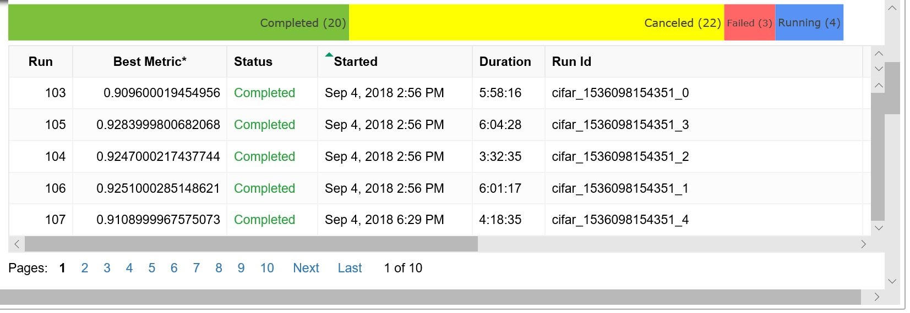
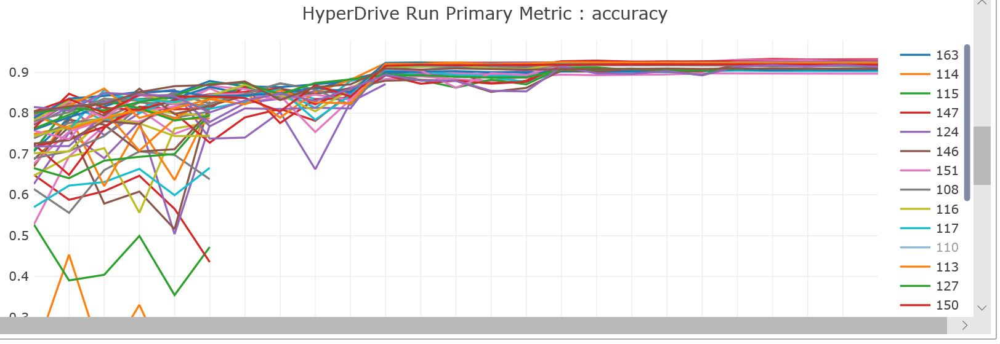
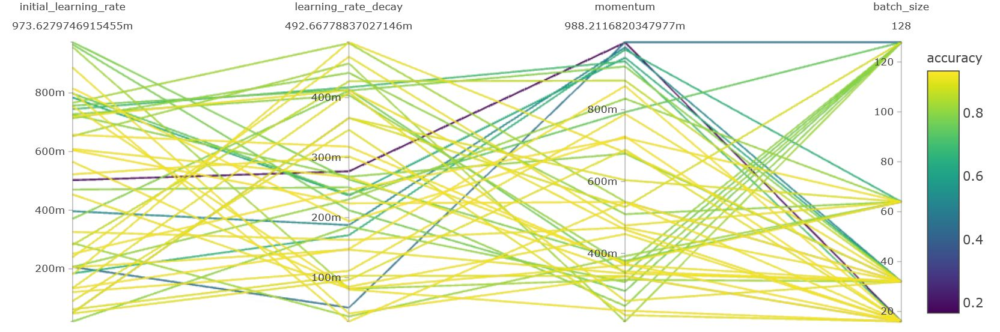
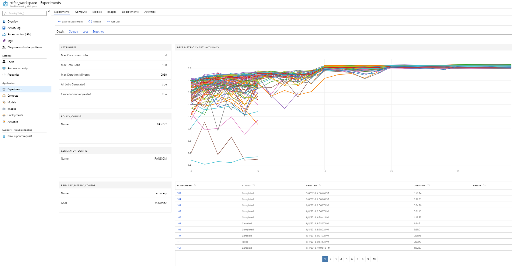

# Tune hyperparameters for your model with Azure Machine Learning service

Efficiently tune hyperparameters for your model using Azure Machine Learning service.  Hyperparameter tuning includes the following steps:

* Define the parameter search space
* Specify a primary metric to optimize  
* Specify early termination criteria for poorly performing runs
* Allocate resources for hyperparameter tuning
* Launch an experiment with the above configuration
* Visualize the training runs
* Select the best performing configuration for your model

## What are hyperparameters?

Hyperparameters are adjustable parameters you choose  to train a model that govern the training process itself. For example, to train a deep neural network, you decide the number of hidden layers in the network and the number of nodes in each layer prior to training the model. These values usually stay constant during the training process.

In deep learning / machine learning scenarios, model performance depends heavily on the hyperparameter values selected. The goal of hyperparameter exploration is to search across various hyperparameter configurations to find a configuration that results in the best performance. Typically, the hyperparameter exploration process is painstakingly manual, given that the search space is vast and evaluation of each configuration can be expensive.

Azure Machine Learning allows you to automate hyperparameter exploration in an efficient manner, saving you significant time and resources. You specify the range of hyperparameter values and a maximum number of training runs. The system then automatically launches multiple simultaneous runs with different parameter configurations and finds the configuration that results in the best performance, measured by the metric you choose. Poorly performing training runs are automatically early terminated, reducing wastage of compute resources. These resources are instead used to explore other hyperparameter configurations.


## Define search space

Automatically tune hyperparameters by exploring the range of values defined for each hyperparameter.

### Types of hyperparameters

Each hyperparameter can either be discrete or continuous.

#### Discrete hyperparameters 

Discrete hyperparameters are specified as a `choice` among discrete values. `choice` can be:

* one or more comma-separated values
* a `range` object
* any arbitrary `list` object


```Python
    {
        "batch_size": choice(16, 32, 64, 128)
        "number_of_hidden_layers": choice(range(1,5))
    }
```

In this case, `batch_size` takes on one of the values [16, 32, 64, 128] and `number_of_hidden_layers` takes on one of the values [1, 2, 3, 4].

Advanced discrete hyperparameters can also be specified using a distribution. The following distributions are supported:

* `quniform(low, high, q)` - Returns a value like round(uniform(low, high) / q) * q
* `qloguniform(low, high, q)` - Returns a value like round(exp(uniform(low, high)) / q) * q
* `qnormal(mu, sigma, q)` - Returns a value like round(normal(mu, sigma) / q) * q
* `qlognormal(mu, sigma, q)` - Returns a value like round(exp(normal(mu, sigma)) / q) * q

#### Continuous hyperparameters 

Continuous hyperparameters are specified as a distribution over a continuous range of values. Supported distributions include:

* `uniform(low, high)` - Returns a value uniformly distributed between low and high
* `loguniform(low, high)` - Returns a value drawn according to exp(uniform(low, high)) so that the logarithm of the return value is uniformly distributed
* `normal(mu, sigma)` - Returns a real value that's normally distributed with mean mu and standard deviation sigma
* `lognormal(mu, sigma)` - Returns a value drawn according to exp(normal(mu, sigma)) so that the logarithm of the return value is normally distributed

An example of a parameter space definition:

```Python
    {    
        "learning_rate": normal(10, 3),
        "keep_probability": uniform(0.05, 0.1)
    }
```

This code defines a search space with two parameters - `learning_rate` and `keep_probability`. `learning_rate` has a normal distribution with mean value 10 and a standard deviation of 3. `keep_probability` has a uniform distribution with a minimum value of 0.05 and a maximum value of 0.1.

### Sampling the hyperparameter space

You can also specify the parameter sampling method to use over the hyperparameter space definition. Azure Machine Learning service supports random sampling, grid sampling, and Bayesian sampling.

#### Random sampling

In random sampling, hyperparameter values are randomly selected from the defined search space. [Random sampling](https://docs.microsoft.com/python/api/azureml-train-core/azureml.train.hyperdrive.randomparametersampling?view=azure-ml-py) allows the search space to include both discrete and continuous hyperparameters.

```Python
from azureml.train.hyperdrive import RandomParameterSampling
param_sampling = RandomParameterSampling( {
        "learning_rate": normal(10, 3),
        "keep_probability": uniform(0.05, 0.1),
        "batch_size": choice(16, 32, 64, 128)
    }
)
```

#### Grid sampling

[Grid sampling](https://docs.microsoft.com/python/api/azureml-train-core/azureml.train.hyperdrive.gridparametersampling?view=azure-ml-py) performs a simple grid search over all feasible values in the defined search space. It can only be used with hyperparameters specified using `choice`. For example, the following space has a total of six samples:

```Python
from azureml.train.hyperdrive import GridParameterSampling
param_sampling = GridParameterSampling( {
        "num_hidden_layers": choice(1, 2, 3),
        "batch_size": choice(16, 32)
    }
)
```

#### Bayesian sampling

[Bayesian sampling](https://docs.microsoft.com/python/api/azureml-train-core/azureml.train.hyperdrive.bayesianparametersampling?view=azure-ml-py) is based on the Bayesian optimization algorithm and makes intelligent choices on the hyperparameter values to sample next. It picks the sample based on how the previous samples performed, such that the new sample improves the reported primary metric.

When you use Bayesian sampling, the number of concurrent runs has an impact on the effectiveness of the tuning process. Typically, a smaller number of concurrent runs can lead to better sampling convergence, since the smaller degree of parallelism increases the number of runs that benefit from previously completed runs.

Bayesian sampling supports only `choice` and `uniform` distributions over the search space. 

```Python
from azureml.train.hyperdrive import BayesianParameterSampling
param_sampling = BayesianParameterSampling( {
        "learning_rate": uniform(0.05, 0.1),
        "batch_size": choice(16, 32, 64, 128)
    }
)
```

> [!NOTE]
> Bayesian sampling does not support any early termination policy (See [Specify an early termination policy](#specify-early-termination-policy)). When using Bayesian parameter sampling, set `early_termination_policy = None`, or leave off the `early_termination_policy` parameter.

<a name='specify-primary-metric-to-optimize'/>

## Specify primary metric

Specify the [primary metric](https://docs.microsoft.com/python/api/azureml-train-core/azureml.train.hyperdrive.primarymetricgoal?view=azure-ml-py) you want the hyperparameter tuning experiment to optimize. Each training run is evaluated for the primary metric. Poorly performing runs (where the primary metric does not meet criteria set by the early termination policy) will be terminated. In addition to the primary metric name, you also specify the goal of the optimization - whether to maximize or minimize the primary metric.

* `primary_metric_name`: The name of the primary metric to optimize. The name of the primary metric needs to exactly match the name of the metric logged by the training script. See [Log metrics for hyperparameter tuning](#log-metrics-for-hyperparameter-tuning).
* `primary_metric_goal`: It can be either `PrimaryMetricGoal.MAXIMIZE` or `PrimaryMetricGoal.MINIMIZE` and determines whether the primary metric will be maximized or minimized when evaluating the runs. 

```Python
primary_metric_name="accuracy",
primary_metric_goal=PrimaryMetricGoal.MAXIMIZE
```

Optimize the runs to maximize "accuracy".  Make sure to log this value in your training script.

<a name='log-metrics-for-hyperparameter-tuning'/>

### Log metrics for hyperparameter tuning

The training script for your model must log the relevant metrics during model training. When you configure the hyperparameter tuning, you specify the primary metric to use for evaluating run performance. (See [Specify a primary metric to optimize](#specify-primary-metric-to-optimize).)  In your  training script, you must log this metric so it is available to the hyperparameter tuning process.

Log this metric in your training script with the following sample snippet:

```Python
from azureml.core.run import Run
run_logger = Run.get_context()
run_logger.log("accuracy", float(val_accuracy))
```

The training script calculates the `val_accuracy` and logs it as "accuracy", which is used as the primary metric. Each time the metric is logged it is received by the hyperparameter tuning service. It is up to the model developer to determine how frequently to report this metric.

<a name='specify-early-termination-policy'/>

## Specify early termination policy

Terminate poorly performing runs automatically with an [early termination policy. Termination reduces wastage of resources and instead uses these resources for exploring other parameter configurations.

When using an early termination policy, you can configure the following parameters that control when a policy is applied:

* `evaluation_interval`: the frequency for applying the policy. Each time the training script logs the primary metric counts as one interval. Thus an `evaluation_interval` of 1 will apply the policy every time the training script reports the primary metric. An `evaluation_interval` of 2 will apply the policy every other time the training script reports the primary metric. If not specified, `evaluation_interval` is set to 1 by default.
* `delay_evaluation`: delays the first policy evaluation for a specified number of intervals. It is an optional parameter that allows all configurations to run for an initial minimum number of intervals, avoiding premature termination of training runs. If specified, the policy applies every multiple of evaluation_interval that is greater than or equal to delay_evaluation.

Azure Machine Learning service supports the following Early Termination Policies.

### Bandit policy

[Bandit](https://docs.microsoft.com/python/api/azureml-train-core/azureml.train.hyperdrive.banditpolicy?view=azure-ml-py#definition) is a termination policy based on slack factor/slack amount and evaluation interval. The policy early terminates any runs where the primary metric is not within the specified slack factor / slack amount with respect to the best performing training run. It takes the following configuration parameters:

* `slack_factor` or `slack_amount`: the slack allowed with respect to the best performing training run. `slack_factor` specifies the allowable slack as a ratio. `slack_amount` specifies the allowable slack as an absolute amount, instead of a ratio.

    For example,  consider a Bandit policy being applied at interval 10. Assume that the best performing run at interval 10 reported a primary metric 0.8 with a goal to maximize the primary metric. If the policy was specified with a `slack_factor` of 0.2, any training runs, whose best metric at interval 10 is less than 0.66 (0.8/(1+`slack_factor`)) will be terminated. If instead, the policy was specified with a `slack_amount` of 0.2, any training runs, whose best metric at interval 10 is less than 0.6 (0.8 - `slack_amount`) will be terminated.
* `evaluation_interval`: the frequency for applying the policy (optional parameter).
* `delay_evaluation`: delays the first policy evaluation for a specified number of intervals (optional parameter).


```Python
from azureml.train.hyperdrive import BanditPolicy
early_termination_policy = BanditPolicy(slack_factor = 0.1, evaluation_interval=1, delay_evaluation=5)
```

In this example, the early termination policy is applied at every interval when metrics are reported, starting at evaluation interval 5. Any run whose best metric is less than (1/(1+0.1) or 91% of the best performing run will be terminated.

### Median stopping policy

[Median stopping](https://docs.microsoft.com/python/api/azureml-train-core/azureml.train.hyperdrive.medianstoppingpolicy?view=azure-ml-py) is an early termination policy based on running averages of primary metrics reported by the runs. This policy computes running averages across all training runs and terminates runs whose performance is worse than the median of the running averages. This policy takes the following configuration parameters:
* `evaluation_interval`: the frequency for applying the policy (optional parameter).
* `delay_evaluation`: delays the first policy evaluation for a specified number of intervals (optional parameter).


```Python
from azureml.train.hyperdrive import MedianStoppingPolicy
early_termination_policy = MedianStoppingPolicy(evaluation_interval=1, delay_evaluation=5)
```

In this example, the early termination policy is applied at every interval starting at evaluation interval 5. A run will be terminated at interval 5 if its best primary metric is worse than the median of the running averages over intervals 1:5 across all training runs.

### Truncation selection policy

[Truncation selection](https://docs.microsoft.com/python/api/azureml-train-core/azureml.train.hyperdrive.truncationselectionpolicy?view=azure-ml-py) cancels a given percentage of lowest performing runs at each evaluation interval. Runs are compared based on their performance on the primary metric and the lowest X% are terminated. It takes the following configuration parameters:

* `truncation_percentage`: the percentage of lowest performing runs to terminate at each evaluation interval. Specify an integer value between 1 and 99.
* `evaluation_interval`: the frequency for applying the policy (optional parameter).
* `delay_evaluation`: delays the first policy evaluation for a specified number of intervals (optional parameter).


```Python
from azureml.train.hyperdrive import TruncationSelectionPolicy
early_termination_policy = TruncationSelectionPolicy(evaluation_interval=1, truncation_percentage=20, delay_evaluation=5)
```

In this example, the early termination policy is applied at every interval starting at evaluation interval 5. A run will be terminated at interval 5, if its performance at interval 5 is in the lowest 20% of performance of all runs at interval 5.

### No termination policy

If you want all training runs to run to completion, set policy to None. This will have the effect of not applying any early termination policy.

```Python
policy=None
```

### Default policy

If no policy is specified, the hyperparameter tuning service will let all training runs run to completion.

>[!NOTE] 
>If you are looking for a conservative policy that provides savings without terminating promising jobs, you can use a Median Stopping Policy with `evaluation_interval` 1 and `delay_evaluation` 5. These are conservative settings, that can provide approximately 25%-35% savings with no loss on primary metric (based on our evaluation data).

## Allocate resources

Control your resource budget for your hyperparameter tuning experiment by specifying the [maximum total number of training runs]().  Optionally specify the maximum duration for your hyperparameter tuning experiment.

* `max_total_runs`: Maximum total number of training runs that will be created. Upper bound - there may be fewer runs, for instance, if the hyperparameter space is finite and has fewer samples. Must be a number between 1 and 1000.
* `max_duration_minutes`: Maximum duration in minutes of the hyperparameter tuning experiment. Parameter is optional, and if present, any runs that would be running after this duration are automatically canceled.

>[!NOTE] 
>If both `max_total_runs` and `max_duration_minutes` are specified, the hyperparameter tuning experiment terminates when the first of these two thresholds is reached.

Additionally, specify the maximum number of training runs to run concurrently during your hyperparameter tuning search.

* `max_concurrent_runs`: Maximum number of runs to run concurrently at any given moment. If none specified, all `max_total_runs` will be launched in parallel. If specified, must be a number between 1 and 100.

>[!NOTE] 
>The number of concurrent runs is gated on the resources available in the specified compute target. Hence, you need to ensure that the compute target has the available resources for the desired concurrency.

Allocate resources for hyperparameter tuning:

```Python
max_total_runs=20,
max_concurrent_runs=4
```

This code configures the hyperparameter tuning experiment to use a maximum of 20 total runs, running 4 configurations at a time.

## Configure experiment

[Configure your hyperparameter tuning](https://docs.microsoft.com/python/api/azureml-train-core/azureml.train.hyperdrive.hyperdriverunconfig?view=azure-ml-py) experiment using the defined hyperparameter search space, early termination policy, primary metric, and resource allocation from the sections above. Additionally, provide an `estimator` that will be called with the sampled hyperparameters. The `estimator` describes the training script you run, the resources per job (single or multi-gpu), and the compute target to use. Since concurrency for your hyperparameter tuning experiment is gated on the resources available, ensure that the compute target specified in the `estimator` has sufficient resources for your desired concurrency. (For more information on estimators, see [how to train models](how-to-train-ml-models.md).)

Configure your hyperparameter tuning experiment:

```Python
from azureml.train.hyperdrive import HyperDriveConfig
hyperdrive_run_config = HyperDriveConfig(estimator=estimator,
                          hyperparameter_sampling=param_sampling, 
                          policy=early_termination_policy,
                          primary_metric_name="accuracy", 
                          primary_metric_goal=PrimaryMetricGoal.MAXIMIZE,
                          max_total_runs=100,
                          max_concurrent_runs=4)
```

## Submit experiment

Once you define your hyperparameter tuning configuration, [submit an experiment](https://docs.microsoft.com/python/api/azureml-core/azureml.core.experiment%28class%29?view=azure-ml-py#submit-config--tags-none----kwargs-):

```Python
from azureml.core.experiment import Experiment
experiment = Experiment(workspace, experiment_name)
hyperdrive_run = experiment.submit(hyperdrive_run_config)
```

`experiment_name` is the name you assign to your hyperparameter tuning experiment, and `workspace` is the workspace in which you want to create the experiment (For more information on experiments, see [How does Azure Machine Learning service work?](concept-azure-machine-learning-architecture.md))

## Visualize experiment

The Azure Machine Learning SDK provides a [Notebook widget](https://docs.microsoft.com/python/api/azureml-widgets/azureml.widgets.rundetails?view=azure-ml-py) that visualizes the progress of your training runs. The following snippet visualizes all your hyperparameter tuning runs in one place in a Jupyter notebook:

```Python
from azureml.widgets import RunDetails
RunDetails(hyperdrive_run).show()
```

This code displays a table with details about the training runs for each of the hyperparameter configurations.



You can also visualize the performance of each of the runs as training progresses. 



Additionally, you can visually identify the correlation between performance and values of individual hyperparameters using a Parallel Coordinates Plot. 



You can visualize all your hyperparameter tuning runs in the Azure web portal as well. For more information on how to view an experiment in the web portal, see [how to track experiments](how-to-track-experiments.md#view-the-experiment-in-the-web-portal).



## Find the best model

Once all of the hyperparameter tuning runs have completed, [identify the best performing configuration](https://docs.microsoft.com/python/api/azureml-train-core/azureml.train.hyperdrive.hyperdriverun?view=azure-ml-py#get-best-run-by-primary-metric-include-failed-true--include-canceled-true-) and the corresponding hyperparameter values:

```Python
best_run = hyperdrive_run.get_best_run_by_primary_metric()
best_run_metrics = best_run.get_metrics()
parameter_values = best_run.get_details()['runDefinition']['Arguments']

print('Best Run Id: ', best_run.id)
print('\n Accuracy:', best_run_metrics['accuracy'])
print('\n learning rate:',parameter_values[3])
print('\n keep probability:',parameter_values[5])
print('\n batch size:',parameter_values[7])
```

## Sample notebook
Refer to train-hyperparameter-* notebooks in this folder:
* [how-to-use-azureml/training-with-deep-learning](https://github.com/Azure/MachineLearningNotebooks/tree/master/how-to-use-azureml/training-with-deep-learning)

[!INCLUDE [aml-clone-in-azure-notebook](../../../includes/aml-clone-for-examples.md)]

## Next steps
* [Track an experiment](how-to-track-experiments.md)
* [Deploy a trained model](how-to-deploy-and-where.md)
