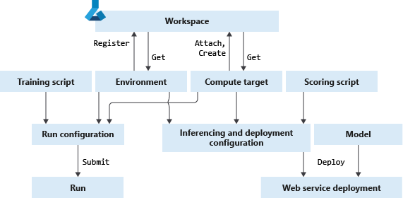

# Create and manage environments for training and deployment

In this article learn to

* Create an environment and specify package dependencies
* Retrieve and update environments
* Use environment for training
* Use environment for web service deployment

## What are environments

In Azure Machine Learning, [environment objects](https://docs.microsoft.com/python/api/azureml-core/azureml.core.environment.environment?view=azure-ml-py) specify the Python packages, environment variables, and software settings around your training and scoring scripts, and run times, such as Python, Spark, or Docker. They are managed and versioned entities within your Azure Machine Learning workspace that enable reproducible, auditable and portable machine learning workflows across different compute targets. You can use an environment object on your local compute to develop your training script, re-use that same environment on Azure Machine Learning Compute for model training at scale, and finally deploy your model using that same environment.

The following illustrates where environment objects fit in the Azure Machine Learing experiment creation, training and deployment workflow.



### Types of environments

Environments can broadly be divided into two categories: user-managed  system-managed.

For a user-managed environment, you're responsible for setting up your environment and installing every package your training script needs on the compute target. Conda will not check your environment or install anything for you. If your training environment is already configured, you can skip the setup step by setting `environment.python.user_managed_dependencies=True` parameter in the [PythonSection](https://docs.microsoft.com/python/api/azureml-core/azureml.core.environment.pythonsection?view=azure-ml-py).

System managed environments are used when you want [Conda](https://conda.io/docs/) to manage the Python environment and the script dependencies for you. The service assumes this type of environment by default, due to its usefulness on remote compute targets that are not manually configurable.

### Attributes of an environment

The [Environment](https://docs.microsoft.com/python/api/azureml-core/azureml.core.environment.environment?view=azure-ml-py) class contains a name, a version and a dictionary of environment variables you want to pass to your training run.

Furthermore, Environment class contains sections, which are applicable depending on where your script executes. The sections are automatically created and populated with default values when you create the environment. You can change the properties under each section to control the behavior of training or scoring.

Attributes| Description
---|---
Name| Unique name of your new environment.
Version| System-assigned version number for the environment.
Variables dictionary| A dictionary of environment variables to pass to remote run. They are accessible from remote run, for example, using [`os.getenv`](https://docs.python.org/3.7/library/os.html#os.getenv).
[PythonSection](https://docs.microsoft.com/en-us/python/api/azureml-core/azureml.core.environment.pythonsection?view=azure-ml-py)|Generally applicable, and can be used to control the Python packages and Python interpreter. For example, you can set the location of Python executable using `environment.python.interpreter_path`
[DockerSection](https://docs.microsoft.com/en-us/python/api/azureml-core/azureml.core.environment.dockersection?view=azure-ml-py)|Generally applicable, and can be used to control the behavior of Docker execution. For example, you can enable or disable Docker execution using `environment.docker.enabled`, and pass additional arguments to Docker run command using `environment.docker.arguments`.
[SparkSection](https://docs.microsoft.com/en-us/python/api/azureml-core/azureml.core.environment.sparksection?view=azure-ml-py)|Relevant only when submitting PySpark training scripts.
DatabricksSection|Relevant only when executing [DatabricksStep](https://docs.microsoft.com/python/api/azureml-pipeline-steps/azureml.pipeline.steps.databricksstep?view=azure-ml-py) in Machine Learning Pipeline.

## Prerequisites

* The Azure Machine Learning SDK for Python [installed](https://docs.microsoft.com/python/api/overview/azure/ml/install?view=azure-ml-py).
* An [Azure Machine Learning service workspace](how-to-manage-workspace.md).

## Create an environment and add packages

The table lists the different ways to create an environment object with the Azure Machine Learning SDK.

Way| Description| Sample code
---|---|---
[Environment](https://docs.microsoft.com/python/api/azureml-core/newazureml.core.environment.environment?view=azure-ml-py) class|Instantiate an environment object.|`Environment(name="myenv")`
[Estimator](https://docs.microsoft.com//python/api/azureml-train-core/azureml.train.estimator.estimator?view=azure-ml-py) run |  When you submit a run using an estimator object an environment is automatically created.|
Existing Conda environment on your local computer| Create an environment from an existing Conda environment on your local computer. This makes it easy to reuse your local interactive environment on remote runs. | Create a Conda environment using <br> `conda create -n mycondaenv` <br> then create an environment object out of that conda environment using <br> `myenv = Environment.from_existing_conda_environment(name="myenv",conda_environment_name="mycondaenv")`.
Conda specification file| Use a conda specification file. | `myenv = Environment.from_conda_specification(name="myenv", file_path="path-to-conda-specification-file")`
Pip requirements file | Use a pip requirement file| `myenv = Environment.from_pip_requirements(name="myenv", file_path="path-to-pip-requirements-file")`
Submit a run |Submitting a run creates a default environment, when one is not defined. When you submit a training run, the building of new environment can take several minutes depending on the size of the required dependencies.

### Add packages to an environment

Add packages to an environment with Conda, pip or private wheel files. Specify each package dependency using the [CondaDependency class](https://docs.microsoft.com/python/api/azureml-core/azureml.core.conda_dependencies.condadependencies?view=azure-ml-py), and add it to the environment's PythonSection.

#### Conda and pip packages

If a package is available in a Conda package repository, it is recommended to use the Conda over pip installation. The reason is that Conda packages typically come with pre-built binaries that make installation more reliable.

The following example adds the `scikit-learn` and `pillow` package to the environment, `myenv` with the [`add_conda_package()`](https://docs.microsoft.com/python/api/azureml-core/azureml.core.conda_dependencies.condadependencies?view=azure-ml-py#add-conda-package-conda-package-) and [`add_pip_package()`](https://docs.microsoft.com/python/api/azureml-core/azureml.core.conda_dependencies.condadependencies?view=azure-ml-py#add-pip-package-pip-package-)  methods, respectively.

```python
from azureml.core import Environment
from azureml.core.environment import CondaDependencies

myenv = Environment(name="myenv")
conda_dep = CondaDependencies()

# Install scikit learn conda package
conda_dep.add_conda_package("scikit-learn")

# Install pillow version 5.4.1 pip package
conda_dep.add_pip_package("pillow==5.4.1")

# Adds dependencies to PythonSection of myenv
myenv.python.conda_dependencies=conda_dep
```

#### Private wheel files

You can use private pip wheel files by first uploading it to your workspace storage by using static [`add_private_pip_wheel()`](https://docs.microsoft.com/python/api/azureml-core/azureml.core.environment.environment?view=azure-ml-py#add-private-pip-wheel-workspace--file-path--exist-ok-false-) method, then capturing the storage URL, and passing the URL to the `add_pip_package()` method

```python
# During environment creation the service replaces the URL by secure SAS URL, so your wheel file is kept private and secure
whl_url = Environment.add_private_pip_wheel(workspace=ws,file_path = "my-custom.whl")
myenv = Environment(name="myenv")
conda_dep = CondaDependencies()
conda_dep.add_pip_package(whl_url)
myenv.python.conda_dependencies=conda_dep
```

## Manage environments

In this section, we show how to register your environment, so we can use it across compute targets, and share them with other workspace users. We also retrieve existing environments by name, explain how new versions are generated, and show how to build an environment manually for debugging.

### Register environments

The environment is automatically registered with your workspace when you submit a run or deploy a web service. You can also manually register the environment using the [Environment.register](https://docs.microsoft.com/python/api/azureml-core/azureml.core.environment(class)?view=azure-ml-py#register-workspace-) method. This
operation makes the environment into an entity that is tracked and versioned in the cloud, and can be shared between workspace users.

When used for the first time, in training or deployment, the environment is registered with the workspace, built, and deployed on the compute target. The environments are cached by the service, therefore as long as the environment definition remains unchanged, the full setup time is incurred only once.
 
### Get existing environments
The Environment class offers methods that allow you to retrieve existing environments in your workspace by name, as a list or by specific training run.

#### View list of environments

View the environments in your workspace with [list()](https://docs.microsoft.com/python/api/azureml-core/azureml.core.environment(class)?view=azure-ml-py#list-workspace-), and then select one to re-use.

```python
from azureml.core import Environment
list("workspace_name")
```

#### Get environment by name

You can also get a specific environment by name and version. 
The following code uses the [get()](https://docs.microsoft.com/python/api/azureml-core/azureml.core.environment(class)?view=azure-ml-py#get-workspace--name--version-none-) method to retrieve version `1` of the environment, `myenv` on the `ws` workspace.

```python
restored_environment = Environment.get(workspace=ws,name="myenv",version="1")
```

#### Training run specific environment

To get the environment used for a specific run after training completes, use the [get_environment()](https://docs.microsoft.com/python/api/azureml-core/azureml.core.run.run?view=azure-ml-py#get-environment--)method in the Run class.

```python
from azureml.core import Run
Run.get_environment()
```

### Update existing environment

If you make changes to an existing environment, such as add a Python package, a new version of an environment is created when you either submit run, deploy model or manually register the environment. The versioning allows you to view changes to the environment over time.

> [!NOTE]
> To update a Python package version of an existing environment, specify the exact version number for that package. Otherwise, the Azure Machine Learning will re-use the existing environment with package versions from when the environment was created.

### Debug the image build

In the following example, we [build()](https://docs.microsoft.com/python/api/azureml-core/azureml.core.environment(class)?view=azure-ml-py#build-workspace-) an environment manually as a Docker image, and monitor the output logs from the image build using [wait_for_completion()](https://docs.microsoft.com/python/api/azureml-core/azureml.core.image(class)?view=azure-ml-py#wait-for-creation-show-output-false-). The built image then appears under the workspace Azure Container Registry, which is helpful for debugging.

```python
from azureml.core import Image
build = env.build()
build.wait_for_completion(show_output=True)
```

## Using environments for training

To submit a training run, you need to combine your environment, [compute target](concept-compute-target.md)
and training Python script into a run configuration; a wrapper object used for submitting runs.

When you submit a training run, the building of a new environment can take several minutes depending on the size of the required dependencies. The environments are cached by the service, therefore as long as the environment definition remains unchanged, the full setup time is incurred only once.

The following is a local script run example where you would use [ScriptRunConfig](https://docs.microsoft.com/python/api/azureml-core/azureml.core.script_run_config.scriptrunconfig?view=azure-ml-py) as your wrapper object.

```python
from azureml.core import Environment, ScriptRunConfig, Experiment

exp = Experiment(name="myexp", workspace = ws)
# Instantiate environment
myenv = Environment(name="myenv")

# Add training script to run config
runconfig = ScriptRunConfig(source_directory=".", script="train.py")

# Attach compute target to run config
runconfig.compute_target = "local"

# Attach environment to run config
runconfig.environment = myenv

# Submit run 
run = exp.submit(runconfig)
```

> [!NOTE]
> To disable run history or run snapshots, use the setting under `ScriptRunConfig.run_config.history`.

If you don't specify the environment in your run configuration, the service will create a default environment for you when you submit your run.

### Train with an estimator

If you are using an [estimator](how-to-train-ml-models.md) for training, you can simply submit the estimator instance directly, as it already encapsulates the environment and compute target.

The following uses an estimator for a single-node training run on a remote compute for a scikit-learn model, and assumes a  previously created compute target object, `compute_target` and datastore object, `ds`.

```python
from azureml.train.estimator import Estimator

script_params = {
    '--data-folder': ds.as_mount(),
    '--regularization': 0.8
}

sk_est = Estimator(source_directory='./my-sklearn-proj',
                   script_params=script_params,
                   compute_target=compute_target,
                   entry_script='train.py',
                   conda_packages=['scikit-learn'])

# Submit the run 
run = experiment.submit(sk_est)
```

## Using environments for web service deployment

You can use environments when deploying your model as a web service. This enables a reproducible, connected workflow where you can train, test, and deploy your model using the exact same libraries in both your training and inferencing computes.

To deploy a web service, combine the environment, inference compute, scoring script and registered model in your deployment object, [deploy()](https://docs.microsoft.com/python/api/azureml-core/azureml.core.model.model?view=azure-ml-py#deploy-workspace--name--models--inference-config--deployment-config-none--deployment-target-none-). Learn more about [deploying web services](how-to-deploy-and-where.md).

In this example, we assume you have completed a training run which produced a model "outputs/model.pkl", and deploy that model to Azure Container Instance (ACI). When building the web service, the model and scoring files are mounted on the image and the Azure Machine Learning inferencing stack is added to the image.

```python
from azureml.core.model import InferenceConfig, Model
from azureml.core.webservice import AciWebservice, Webservice

# Regist the model we want to deploy
model = run.register_model(model_name = "mymodel", model_path = "outputs/model.pkl")

# Combine scoring script & environment in Inference configuration
inference_config = InferenceConfig(entry_script="score.py", environment=myenv)

# Set deployment configuration
deployment_config = AciWebservice.deploy_configuration(cpu_cores = 1, memory_gb = 1)

# Define the model, inference & deployment configuration and web service name and location to deploy 
service = Model.deploy(
    workspace = ws,
    name = "my_web_service",
    models = [model],
    inference_config = inference_config,
    deployment_config = deployment_config)
```

### Docker and environments

Azure Machine Learning supports Docker when building environments, which provides additional isolation and reproducibility.

On local computes or virtual machines, you can choose between Docker-based and bare metal environments. However, for Azure Machine Learning Compute clusters or web service deployments, the environment must be Docker-based.

By default, Azure Machine Learning service uses one of the Ubuntu Linux-based [base images](https://github.com/Azure/AzureML-Containers), and installs the specified Python packages. The base image has CPU and GPU versions. You can specify the GPU image by turning the `Environment.docker.gpu_support` flag on.

You can also specify your own custom Docker image, by specifying `Environment.docker.base_image` and `Environment.docker.base_image_registry` variables. The default for the image registry is Azure Container Registry of your workspace. You can push custom images there to have authenticated access by default.

> [!NOTE]
> If you specify `environment.python.user_managed_dependencies=False` while using custom Docker image, Azure ML service will build a Conda environment within the image and execute the run in that environment, instead of using Python libraries you may have installed on the base image. Set the parameter to `True` to use your own installed packages.

Once built, the Docker image appears in the Azure Container Registy associated with the workspace, in repository named _azureml/azureml\_\<uuid\>_. The unique identifier part corresponds to a hash computed from environment configuration. This allows the Azure Machine Learning service to determine whether an image corresponding to given environment already exists and re-use it.

## Example notebooks

This [example notebook](https://github.com/Azure/MachineLearningNotebooks/tree/master/how-to-use-azureml/training/using-environments) expands upon concepts and methods demonstrated in this article.

## Next steps

* [Tutorial: Train a model](tutorial-train-models-with-aml.md) uses a managed compute target to  train a model.
* Once you have a trained model, learn [how and where to deploy models](how-to-deploy-and-where.md).
* View the [Environment class](https://docs.microsoft.com/python/api/azureml-core/azureml.core.environment(class)?view=azure-ml-py) SDK reference.
