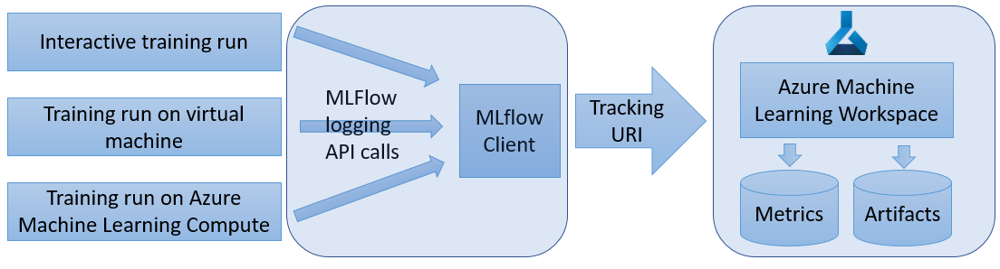

# How to use MLflow with Azure Machine Learning service (Preview)

[MLflow](https://www.mlflow.org) is an open-source library for tracking your machine learning experiments and models, by instrumenting your code in cloud-independent way. It provides [a tracking API](https://mlflow.org/docs/latest/quickstart.html#using-the-tracking-api) with functionality to log metrics and artifacts from your Python training code.

Azure Machine Learning service Workspace provides a centralized, secure, scalable location to store your metrics and models, and manage your compute and deployed model. You can use MLflow client with Azure Machine Learning service by setting the MLflow tracking URI to point to your workspace. You can then view and track the metrics and artifacts in your workspace.

You can use MLflow logging on interactive runs on your local computer, as well as on different Azure ML compute targets, such as Machine Learning compute, and also on Azure Databricks.



## Pre-requisites

 * [Install MLflow.](https://mlflow.org/docs/latest/quickstart.html)
 * [Install Azure ML Python SDK on your local computer and create Azure ML Workspace](setup-create-workspace.md). The SDK provides the connectivity for MLflow to access your workspace.

## Interactive runs

You can use MLflow with Azure Machine Learning service interactively, for example when training models in your local Jupyter Notebook or code editor. 

To switch your MLflow code to use Azure Machine Learning service as back end, you need to first install azureml.core.contrib package:

```
pip install azureml.core.contrib
```

In your Python code, import necessary packages and set the tracking URI to point to your workspace

```
import mlflow
import azureml.contrib.mlflow
from azureml.core import Workspace

ws = Workspace.from_config()

mlflow.set_tracking_uri(ws.get_mlflow_tracking_uri())
```

>[!NOTE]
>The tracking URI is valid up to an hour or less. If you restart your script after some idle time, use the get_mlflow_tracking_uri API to get a new URI.

Then, you can set the MLflow experiment name and start logging metrics:

```
experiment_name = "experiment-with-mlflow"
mlflow.set_experiment(experiment_name)

with mlflow.start_run():
    mlflow.log_metric('alpha', 0.03)
```

In addition to logging metrics, you can log models and artifacts. See [sample notebooks]((https://github.com/Azure/MachineLearningNotebooks/blob/master/contrib/mlflow) for more examples.

## Remote runs

Remote runs allow you to train your models on more powerful compute, such as GPU enabled virtual machines, or Machine Learning Compute clusters. See [Set up compute targets for model training](how-to-set-up-training-targets.md) to learn about different compute options.

When you submit a run to a compute target using Azure ML SDK's ```Experiment.submit("train.py")``` method, Azure ML automatically sets the MLflow tracking URI and directs the logging from MLflow to your Workspace. 

To enable the logging, include the azureml.core.contrib package to as a pip dependency to your run configuration: 

```
from azureml.core.runconfig import RunConfiguration
from azureml.core.conda_dependencies import CondaDependencies
from azureml.core import ScriptRunConfig

exp = Experiment(workspace=<my-workspace>, name="my-experiment")

cd = CondaDependencies.create(pip_packages=["mlflow", "azureml-contrib-run"])

run_config = RunConfiguration(framework="python",conda_dependencies=cd)

run_config.target = "my-remote-compute-name"

src = ScriptRunConfig(script="my-training-script.py", run_config=run_config)

run = exp.submit(src)
```

In your training script, simply import mlflow and azureml.contrib.mlflow and start logging:

```
import mlflow
import azureml.contrib.mlflow

with mlflow.start_run():
    mlflow.log_metric("example", 1.23)
```

Then, in your script you can use MLflow logging APIs as shown above, but without having to set the tracking URI.

## View metrics and artifacts in your workspace

The metrics and artifacts from MLflow logging appear in your workspace. You can avigate to your Workspace blade at [Azure portal](https://portal.azure.com), find the experiment by name, and then view the details of your runs.

## Next steps

 * Try out [example notebooks for MLflow with Azure ML](https://github.com/Azure/MachineLearningNotebooks/blob/master/contrib/mlflow)