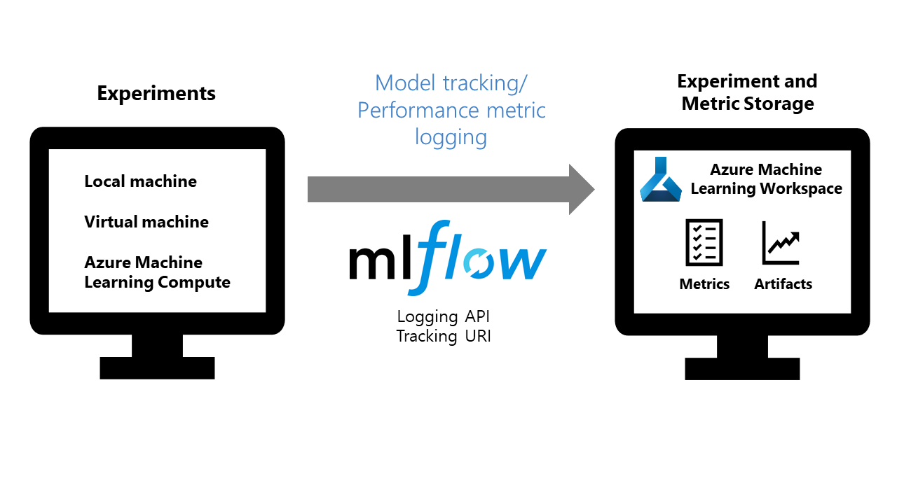

# How to use MLflow with Azure Machine Learning service (Preview)

[MLflow](https://www.mlflow.org) is an open-source library for managing the life cycle of your machine learning experiments. Whether you run your experiments locally, on a virtual machine, or on a remote compute environment, with [MLFlow Tracking](https://mlflow.org/docs/latest/quickstart.html#using-the-tracking-api) you can log and track your training run metrics and artifacts. The [Azure Machine Learning Workspace](https://docs.microsoft.com/azure/machine-learning/service/concept-azure-machine-learning-architecture#workspace) provides a centralized, secure, and scalable location to store your training metrics and models. This how-to demonstrates how to use MLflow Tracking with Azure Machine Learning to track and log your experiment metrics and artifacts in your workspace.



## Prerequisites

* [Install MLflow.](https://mlflow.org/docs/latest/quickstart.html)
* [Install Azure ML Python SDK on your local computer and create Azure ML Workspace](setup-create-workspace.md). The SDK provides the connectivity for MLflow to access your workspace.

## Use MLflow Tracking on local runs

Install the `azureml.core.contrib` package to use MLflow Tracking with Azure Machine Learning on your local training runs.

```shell
pip install azureml.core.contrib
```

Import the mlflow, azureml.contrib.mlflow and Workspace classes to access MLflow's tracking URI and configure your workspace.

In the following code, the `get_mlflow_tracking_uri()` assigns a unique tracking URI address to the workspace, `ws` and`set_tracking_uri()` points the MLflow tracking URI to that address.

```Python
import mlflow
import azureml.contrib.mlflow
from azureml.core import Workspace

ws = Workspace.from_config()

mlflow.set_tracking_uri(ws.get_mlflow_tracking_uri())
```

>[!NOTE]
>The tracking URI is valid up to an hour or less. If you restart your script after some idle time, use the get_mlflow_tracking_uri API to get a new URI.

Set the MLflow experiment name with `set_experiment()` and start your experiment and logging run metrics and models.

```Python
experiment_name = "experiment_with_mlflow"
mlflow.set_experiment(experiment_name)

with mlflow.start_run():
    mlflow.log_metric('alpha', 0.03)
```

## Use MLflow Tracking with remote runs

Remote runs let you train your models on more powerful computes, such as GPU enabled virtual machines, or Machine Learning Compute clusters. See [Set up compute targets for model training](how-to-set-up-training-targets.md) to learn about different compute options.

Configure your compute target environment with RunConfiguration, CondaDependencies and ScriptRunConfig.
Enable logging by including the azureml.core.contrib package as a pip dependency to your run configuration.

```Python
from azureml.core.runconfig import RunConfiguration
from azureml.core.conda_dependencies import CondaDependencies
from azureml.core import ScriptRunConfig

exp = Experiment(workspace = "my_workspace",
                 name = "my_experiment")

cd = CondaDependencies.create(pip_packages = ["mlflow", "azureml-contrib-run"])

run_config = RunConfiguration(framework = "python",conda_dependencies = cd)

run_config.target = "my_remote_compute_name"

src = ScriptRunConfig(script="my_training_script.py", run_config = run_config)
```

In your training script, import mlflow and azureml.contrib.mlflow so you can use the MLflow logging APIs, and start logging your run metrics.

```Python
import mlflow
import azureml.contrib.mlflow

with mlflow.start_run():
    mlflow.log_metric("example", 1.23)
```

When you submit a run to a compute target using the SDK's `Experiment.submit("train.py")` method, the MLflow tracking URI is automatically set and directs the logging from MLflow to your Workspace.

```Python
run = exp.submit(src)
```

## View metrics and artifacts in your workspace

The metrics and artifacts from MLflow logging are kept in your workspace on the [Azure portal](https://portal.azure.com). To view them, navigate to your workspace and find the experiment by name. You can also view these items at a later time, however storing them incurs costs to your Azure subscription.

## Clean up resources

[!INCLUDE [aml-delete-resource-group](../../../includes/aml-delete-resource-group.md)]

At this time, deleting individual metrics and artifacts is not available.

## Example notebooks

The [MLflow with Azure ML notebooks](https://github.com/Azure/MachineLearningNotebooks/blob/master/contrib/mlflow) demonstrates concepts in this article.

## Next steps

* [How to deploy a model](how-to-deploy-and-where.md).