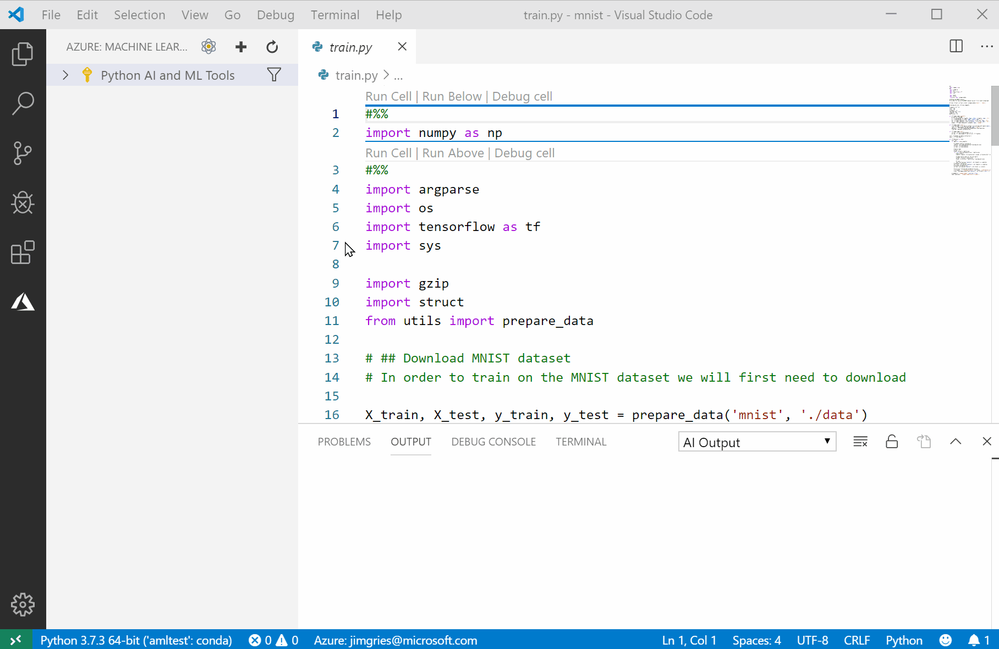
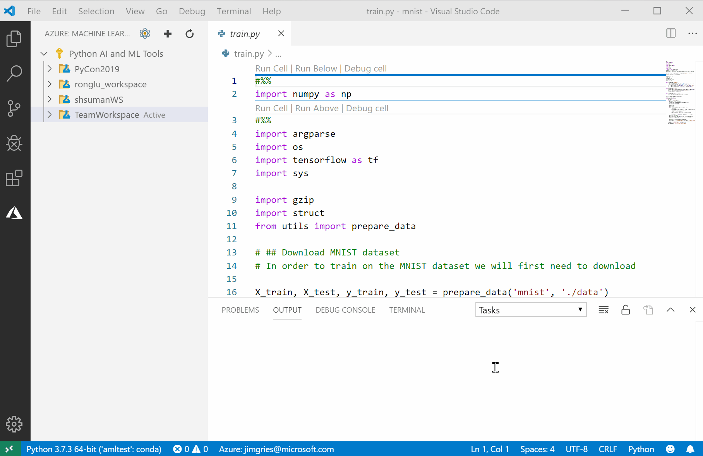
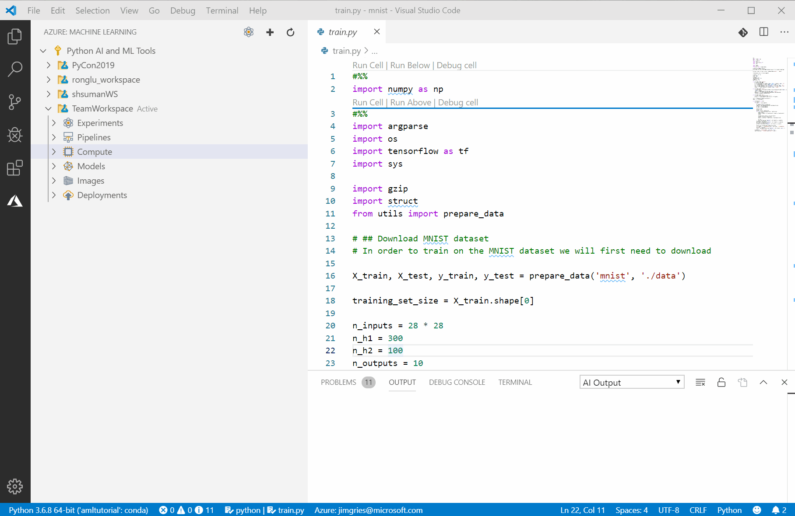
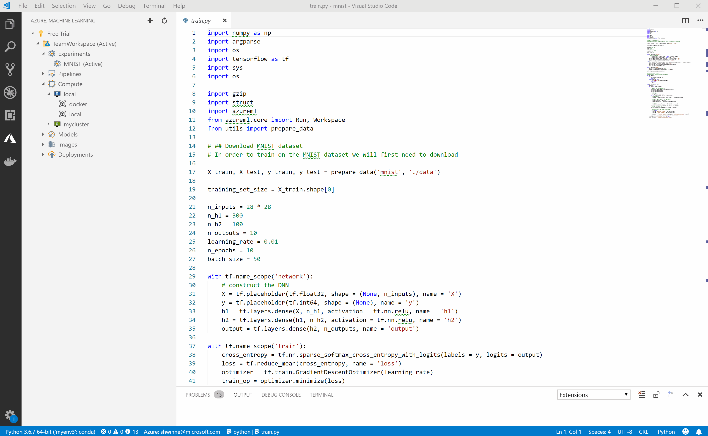

# Get started with Azure Machine Learning for Visual Studio Code

In this article, you'll learn how to use the extension for Azure Machine Learning for Visual Studio Code to train and deploy machine learning and deep learning models.

The [Azure Machine Learning service](overview-what-is-azure-ml.md) provides support for experiments that you run locally and on remote compute targets. For every experiment, you can keep track of multiple runs as often you need to iteratively try different techniques, hyperparameters, and more. You can use Azure Machine Learning to track custom metrics and experiment runs, enabling data science reproducibility and auditability.

You can also deploy these models for your testing and production needs.

## Prerequisites

+ If you don’t have an Azure subscription, create a free account before you begin. Try the [free or paid version of the Azure Machine Learning service](https://aka.ms/AMLFree).

+ Visual Studio Code must be installed. Visual Studio Code is a lightweight but powerful source code editor that runs on your desktop. It comes with built-in support for Python and other programming languages. If you haven't already installed Visual Studio Code, [find out how](https://code.visualstudio.com/docs/setup/setup-overview).

+ [Install Python 3.5 or later](https://www.anaconda.com/download/).


## Install the extension for Azure Machine Learning for Visual Studio Code

When you install the Azure Machine Learning extension, two more extensions are automatically installed (if you have internet access). They're the [Azure Account extension](https://marketplace.visualstudio.com/items?itemName=ms-vscode.azure-account) and the [Microsoft Python extension](https://marketplace.visualstudio.com/items?itemName=ms-python.python).

To work with Azure Machine Learning, you need to turn Visual Studio Code into a Python-integrated development environment (IDE). You need the Microsoft Python extension to use [Python in Visual Studio Code](https://code.visualstudio.com/docs/languages/python). This extension is automatically installed with the Azure Machine Learning extension. The extension makes Visual Studio Code an excellent IDE, and it works on any operating system with a variety of Python interpreters. The Microsoft Python extension uses all of the power of Visual Studio Code to provide autocomplete, IntelliSense, linting, debugging, and unit testing. The extension also allows you to easily switch between Python environments, including virtual and conda environments. For more information about editing, running, and debugging Python code, see the [Python hello-world tutorial](https://code.visualstudio.com/docs/python/python-tutorial).

To install the Azure Machine Learning extension:

1. Open Visual Studio Code.

1. In a web browser, go to [Azure Machine Learning for Visual Studio Code extension (preview)](https://aka.ms/vscodetoolsforai).

1. On that web page, select **Install**. 

1. On the extension tab, select **Install**.

1. A welcome tab for the extension opens in Visual Studio Code, and the Azure symbol (outlined in red in the following screenshot) is added to the activity bar.

   

1. In the dialog box, select **Sign In** and follow the prompts to authenticate with Azure. 
   
   The Azure Account extension, which was installed along with the Azure Machine Learning for Visual Studio Code extension, helps you authenticate with your Azure account. For a list of commands, see the page for the [Azure Account extension](https://marketplace.visualstudio.com/items?itemName=ms-vscode.azure-account).

> [!Tip] 
> Check out the [IntelliCode extension for Visual Studio Code (preview)](https://go.microsoft.com/fwlink/?linkid=2006060). IntelliCode provides a set of AI-assisted capabilities for IntelliSense in Python, such as inferring the most relevant autocompletions based on the current code context.

## Install the Azure Machine Learning SDK

1. Make sure that Python 3.5 or later is installed and is recognized by Visual Studio Code. If you install it now, restart Visual Studio Code and [select a Python interpreter](https://code.visualstudio.com/docs/python/python-tutorial).

1. In the integrated terminal window, specify the Python interpreter to use. Or select Enter to use your default Python interpreter.

   

1. In the lower-right corner of the window, a notification appears, indicating that the [Azure Machine Learning SDK](https://docs.microsoft.com/python/api/overview/azure/ml/intro?view=azure-ml-py) is being automatically installed. The newly created Python environment is local and private, and it has the Visual Studio Code prerequisites for working with the Azure Machine Learning service.

   

## Get started with Azure Machine Learning

Before you start training and deploying machine learning models in Visual Studio Code, you need to create an [Azure Machine Learning service workspace](concept-workspace.md) in the cloud. This workspace will contain your models and resources. 

To create a workspace and add your first experiment:

1. On the Visual Studio Code activity bar, select the Azure icon. The Azure Machine Learning sidebar appears.

   [](./media/vscode-tools-for-ai/CreateaWorkspace.gif#lightbox)


1. Right-click your Azure subscription and select **Create Workspace**. A list appears. In the example animated image, the subscription name is **Free Trial**, and the workspace is **TeamWorkspace**. 

1. Select a resource group from the list or create a new one by using the wizard in the command palette.

1. In the field, type a unique and clear name for your new workspace. In the example image, the workspace is named **TeamWorkspace**.

1. Select Enter to create the new workspace. It appears in the tree, below the subscription name.

1. Right-click the **Experiment** node, and choose **Create Experiment** from the context menu.  Experiments keep track of your runs using Azure Machine Learning.

1. In the field, enter a name for your experiment. In the example screenshots, the experiment is named **MNIST**.
 
1. Select Enter to create the new experiment. The experiment appears in the tree, below the workspace name.

1. In a workspace, you can right-click an experiment to set it as the **Active** experiment. The **Active** experiment is your current experiment. Your open folder in Visual Studio Code will be linked to this experiment in the cloud. This folder should contain your local Python scripts.

Now your key metrics will be stored within the experiment history. Similarly, the models you train will be automatically uploaded to Azure Machine Learning and stored alongside your experiment metrics and logs. 

[](./media/vscode-tools-for-ai/CreateAnExperiment.gif#lightbox)


## Create and manage compute targets

With Azure Machine Learning for Visual Studio Code, you can prepare your data, train models, and deploy them both locally and on remote compute targets.

The extension supports several remote compute targets for Azure Machine Learning. For more information, see the full list of supported [compute targets for Azure Machine Learning](how-to-set-up-training-targets.md).

### Create compute targets for Azure Machine Learning in Visual Studio Code

To create a compute target:

1. On the Visual Studio Code activity bar, select the Azure icon. The Azure Machine Learning sidebar appears.

2. In the tree view, expand your Azure subscription and Azure Machine Learning service workspace. In the following example image, the subscription name is **Free Trial**, and the workspace is **TeamWorkspace**. 

3. Under the workspace node, right-click the **Compute** node and choose **Create Compute**.

4. Choose the compute target type from the list. 

5. On the command palette, select a virtual machine size.

6. On the command palette, in the field, enter a name for the compute target. 

7. In the JSON config file that opens on a new tab, specify any advanced properties. You can specify properties such as a maximum node count.

8. When you finish configuring your compute target, in the lower-right corner of the window, select **Submit**.

Here's an example of how to create an Azure Machine Learning compute (AMLCompute):

[](./media/vscode-tools-for-ai/CreateARemoteCompute.gif#lightbox)

#### The run configuration file

The Visual Studio Code extension automatically creates a local compute target and run configurations for your local and docker environments on your local computer. You can find the run configuration files under the associated compute target node. 

## Train and tune models

Use Azure Machine Learning for Visual Studio Code (preview) to rapidly iterate on your code, step through and debug, and use your solution for source code control. 

To run your experiment locally by using Azure Machine Learning:

1. On the Visual Studio Code activity bar, select the Azure icon. The Azure Machine Learning sidebar appears.

1. In the tree view, expand your Azure subscription and Azure Machine Learning service workspace. 

1. Under the workspace node, expand the **Compute** node and right-click the **Run Config** of the compute you want to use. 

1. Select **Run Experiment**.

1. From the File Explorer, select the script you want to run. 

1. Select **View Experiment Run** to see the integrated Azure Machine Learning portal to monitor your runs and see your trained models.

Here's an example of how to run an experiment locally:

[](./media/vscode-tools-for-ai/RunExperimentLocally.gif#lightbox)

### Use remote computes for experiments in Visual Studio Code

To use a remote compute target for training, you need to create a run configuration file. This file tells Azure Machine Learning not only where to run your experiment but also how to prepare the environment.

#### The conda dependencies file

By default, a new conda environment is created for you, and your installation dependencies are managed. However, you must specify your dependencies and their versions in the *aml_config/conda_dependencies.yml* file. 

The following snippet from the default *aml_config/conda_dependencies.yml* specifies `tensorflow=1.12.0`. If you don't specify the version of the dependency, the latest version will be used. You can add additional dependencies in the config file.

```yaml
# The dependencies defined in this file will be automatically provisioned for runs with userManagedDependencies=False.

name: project_environment
dependencies:
  # The python interpreter version.

  # Currently Azure ML only supports 3.5.2 and later.

- python=3.6.2
- tensorflow=1.12.0

- pip:
    # Required packages for AzureML execution, history, and data preparation.

  - --index-url https://azuremlsdktestpypi.azureedge.net/sdk-release/Preview/E7501C02541B433786111FE8E140CAA1
  - --extra-index-url https://pypi.python.org/simple
  - azureml-defaults

```

To run your experiment with Azure Machine Learning on a remote compute target:

1. On the Visual Studio Code activity bar, select the Azure icon. The Azure Machine Learning sidebar appears.

1. In the tree view, expand your Azure subscription and Azure Machine Learning service workspace. 

1. In the editor window, right-click your Python script, and select **AML: Run as Experiment in Azure**. 

1. On the command palette, select the compute target. 

1. On the command palette, in the field, enter the run configuration name. 

1. Edit the *conda_dependencies.yml* file to specify the experiment's runtime dependencies. Then in the lower-right corner of the window, select **Submit**. 

1. Select **View Experiment Run** to see the integrated Azure Machine Learning portal to monitor your runs and see your trained models.

Here's an example of how to run an experiment on a remote compute target:

[](./media/vscode-tools-for-ai/runningOnARemoteTarget.gif#lightbox)


## Deploy and manage models
In Azure Machine Learning, you can deploy and manage your machine learning models in the cloud and at the edge. 

### Register your model to Azure Machine Learning from Visual Studio Code

Now that you've trained your model, you can register it in your workspace. You can track and deploy registered models.

To register your model:

1. On the Visual Studio Code activity bar, select the Azure icon. The Azure Machine Learning sidebar appears.

1. In the tree view, expand your Azure subscription and Azure Machine Learning service workspace.

1. Under the workspace node, right-click **Models** and choose **Register Model**.

1. On the command palette, in the field, enter a model name. 

1. From the list, choose whether to upload a **model file** (for single models) or a  **model folder** (for models with multiple files, such as TensorFlow). 

1. Select your folder or file.

1. When you finish configuring your model properties, in the lower-right corner of the window, select **Submit**. 

Here's an example of how to register your model to Azure Machine Learning:

[](./media/vscode-tools-for-ai/RegisteringAModel.gif#lightbox)


### Deploy your service from Visual Studio Code

In Visual Studio Code, you can deploy your web service to:
+ Azure Container Instances (ACI) for testing.
+ Azure Kubernetes Service (AKS) for production.

You don't need to create an ACI container to test in advance, because ACI containers are created on the fly. However, you do need to configure AKS clusters in advance. For more information, see [Deploy models with the Azure Machine Learning service](how-to-deploy-and-where.md).

To deploy a web service:

1. On the Visual Studio Code activity bar, select the Azure icon. The Azure Machine Learning sidebar appears.

1. In the tree view, expand your Azure subscription and your Azure Machine Learning service workspace.

1. Under the workspace node, expand the **Models** node.

1. Right-click the model you want to deploy, and choose **Deploy Service from Registered Model** from the context menu.

1. On the command palette, choose the compute target you want to deploy to. 

1. On the command palette, in the field, enter a name for this service.  

1. On the command palette, select the Enter key on your keyboard to browse for and select the script file.

1. On the command palette, select the Enter key on your keyboard to browse for and select the conda dependency file.

1. When you finish configuring your service properties, in the lower-right corner of the window, select **Submit** to deploy. In the service properties file, you can specify a local docker file or a schema.json file.

The web service is now deployed.

Here's an example of how to deploy a web service:

[](./media/vscode-tools-for-ai/CreatingAnImage.gif#lightbox)

### Use keyboard shortcuts

You can use the keyboard to access Azure Machine Learning features in Visual Studio Code. The most important keyboard shortcut to know is Ctrl+Shift+P, which displays the command palette. From the command palette, you have access to all of the functionality of Visual Studio Code, including keyboard shortcuts for the most common operations.

[](./media/vscode-tools-for-ai/commands.gif#lightbox)

## Next steps

* For a walkthrough of how to train with Azure Machine Learning outside of Visual Studio Code, see [Tutorial: Train models with Azure Machine Learning](tutorial-train-models-with-aml.md).
* For a walkthrough of how to edit, run, and debug code locally, see the [Python hello-world tutorial](https://code.visualstudio.com/docs/python/python-tutorial).
