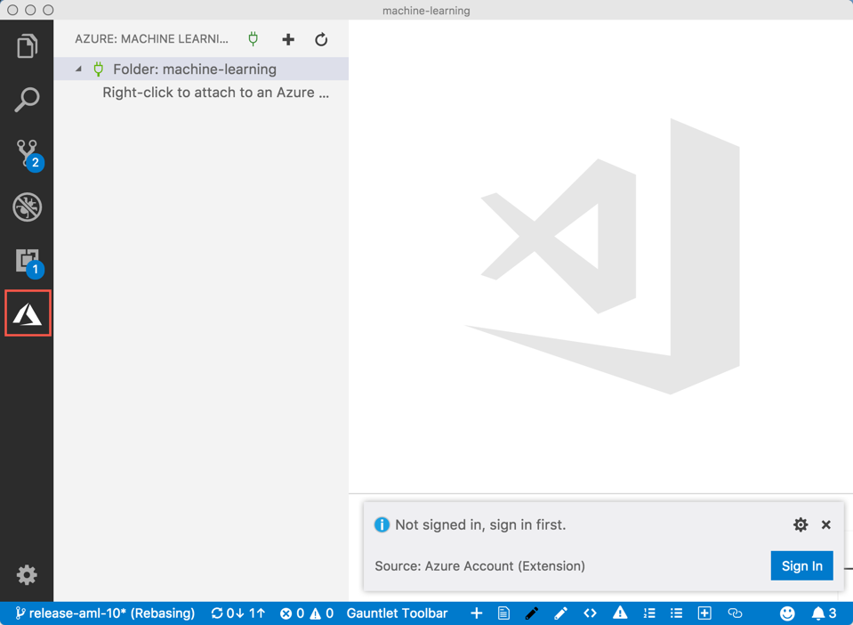
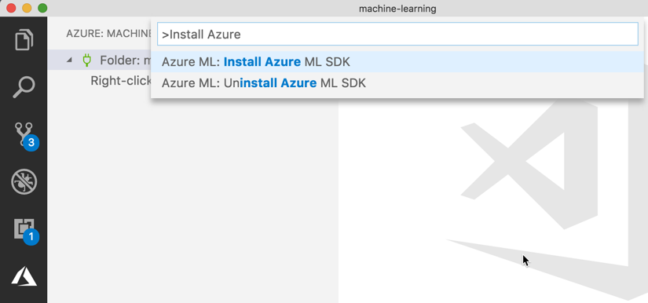
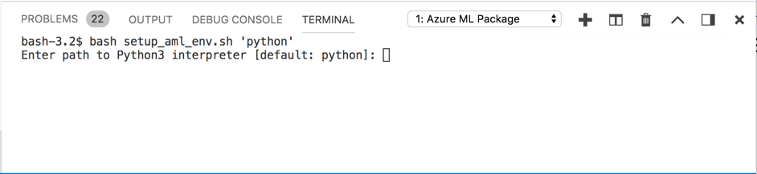
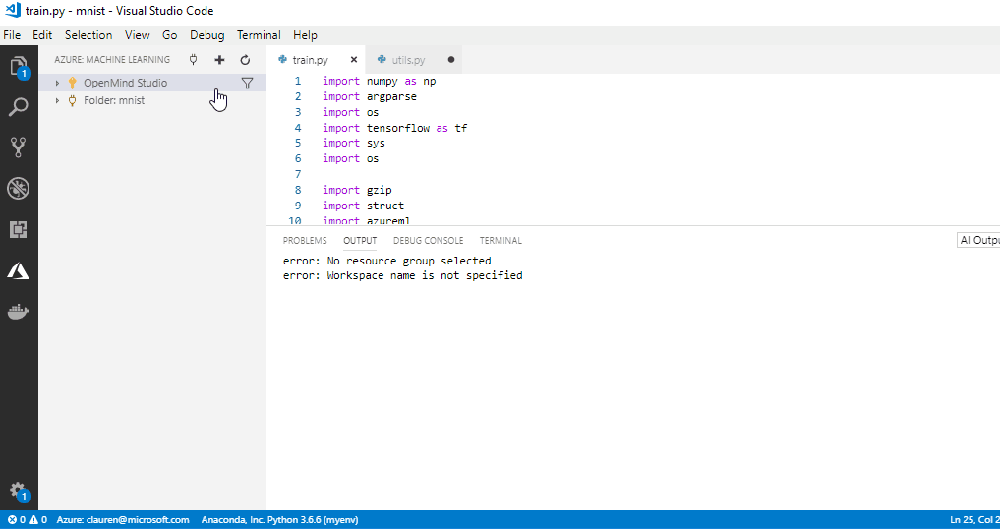
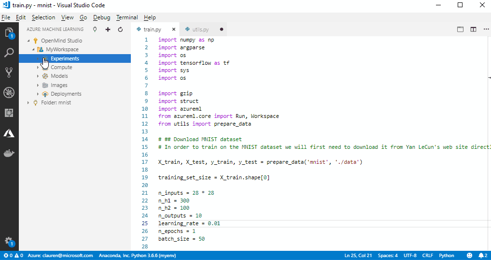

# VS Code Tools for AI: Get started with Azure Machine Learning from Visual Studio Code

In this article, you'll learn about Visual Studio Code (VS Code) extension, **Tools for AI**, and how to start training and deploy machine learning and deep learning models with Azure Machine Learning service in VS Code.

Use the Tools for AI extension in Visual Studio code to use the Azure Machine Learning service to prep your data, train, and test ML models on local and remote compute targets, deploy those models and track custom metrics and experiments.

## Prerequisite

+ Visual Studio Code must be installed. VS Code is a lightweight but powerful source code editor that runs on your desktop. It comes with built-in support for Python and more.  [Learn how to install VS Code](https://code.visualstudio.com/docs/setup/setup-overview).

+ [Install Python 3.5 or greater](https://www.anaconda.com/download/).

+ If you don’t have an Azure subscription, create a [free account](https://azure.microsoft.com/free/?WT.mc_id=A261C142F) before you begin.

## Install VS Code Tools for AI extension

When you install the **Tools for AI** extension, two more extensions are automatically installed (if you have internet access). They are the [Azure Account](https://marketplace.visualstudio.com/items?itemName=ms-vscode.azure-account) extension and the [Microsoft Python](https://marketplace.visualstudio.com/items?itemName=ms-python.python) extension

To work with Azure Machine Learning, we need to turn VS Code into a Python IDE. Working with [Python in Visual Studio Code](https://code.visualstudio.com/docs/languages/python), requires the Microsoft Python extension, which gets installed with Tools for AI automatically. The extension makes VS Code an excellent IDE, and works on any operating system with a variety of Python interpreters. It leverages all of VS Code's power to provide auto complete and IntelliSense, linting, debugging, and unit testing, along with the ability to easily switch between Python environments, including virtual and conda environments. Check out this walk-through of editing, running, and debugging Python code, see the [Python Hello World Tutorial](https://code.visualstudio.com/docs/languages/python/docs/python/python-tutorial)

**To install the Tools for AI extension:**

1. Launch VS Code.

1. In a browser, visit: http://aka.ms/vscodetoolsforai. 

1. In that web page, click **Install**. 

1. In the extension tab, click **Install**.

1. A welcome tab opens in VS Code for the extension and the Azure symbol is added to activity bar.

   

1. In the dialog box, click **Sign In** and follow the onscreen prompt to authenticate with Azure. 
   
   The Azure Account extension, which was installed along with the VS Code Tools for AI, helps you authenticate with your Azure account. See the list of commands in the [Azure Account extension](https://marketplace.visualstudio.com/items?itemName=ms-vscode.azure-account) page.

> [!Tip] 
> Check out the [IntelliCode extension for VS Code (preview)](https://go.microsoft.com/fwlink/?linkid=2006060). IntelliCode provides a set of AI-assisted capabilities for IntelliSense in Python, such as inferring the most relevant auto-completions based on the current code context.

## Install the SDK

1. Make sure that Python 3.5 or greater is installed and recognized by VS Code. If you install it now, then  restart VS Code and select a Python interpreter using instructions at https://code.visualstudio.com/docs/python/python-tutorial.

1. In VS Code, open the command palette **Ctrl+Shift+P**.

1. Type 'Install Azure ML SDK' to find the pip install command for the SDK. A local private Python environment is created that has the Visual Studio Code prerequisites for working with Azure Machine Learning.
   

1. In the integrated terminal window, specify the Python interpreter to use or you can hit **Enter** to use your default Python interpreter.

   

## Get started with Azure Machine Learning

Before you start training and deploying ML models using VS Code, you need to create an [Azure Machine Learning service workspace](concept-azure-machine-learning-architecture.md#workspace) in the cloud to contain your models and resources. Learn how to create one and create your first experiment in that workspace.

1. Click the Azure icon in the Visual Studio Code activity bar. The Azure: Machine Learning sidebar appears.

   

1. Right-click your Azure subscription and select **Create Workspace**. A list appears. In the animated image, the subscription name is 'OpenMind Studio' and the workspace is 'MyWorkspace'. 

1. Select an existing resource group from the list or create a new one using the wizard in the command palette.

1. In the field, type a unique and clear name for your new workspace. In the screenshots, the workspace is named 'MyWorkspace'.

1. Hit enter and the new workspace is created. It appears in the tree below the subscription name.

1. Right-click the workspace name and choose **Create Experiment** from the context menu.  Experiments keep track of your runs using Azure Machine Learning.

1. In the field, enter a name your experiment. In the screenshots, the experiment is named 'MNIST'.
 
1. Hit enter and the new experiment is created. It appears in the tree below the workspace name.

1. Right-click the experiment name and choose **Attach a local folder**. This folder should contain your local Python scripts. The folder is then linked to the experiment in the cloud. 

   Now each of your experiment runs with your experiment so all of your key metrics will be stored in the experiment history and the models you train will get automatically uploaded to Azure Machine Learning and stored with your experiment metrics and logs.

   

### Use keyboard shortcuts

Like most of VS Code, the Azure Machine Learning features in VS Code are accessible from the keyboard. The most important key combination to know is Ctrl+Shift+P, which brings up the Command Palette. From here, you have access to all of the functionality of VS Code, including keyboard shortcuts for the most common operations.

## Next steps

You can now use Visual Studio Code to work with Azure Machine Learning.

Learn how to [create compute targets, train, and deploy models in Visual Studio Code](how-to-vscode-train-deploy.md).