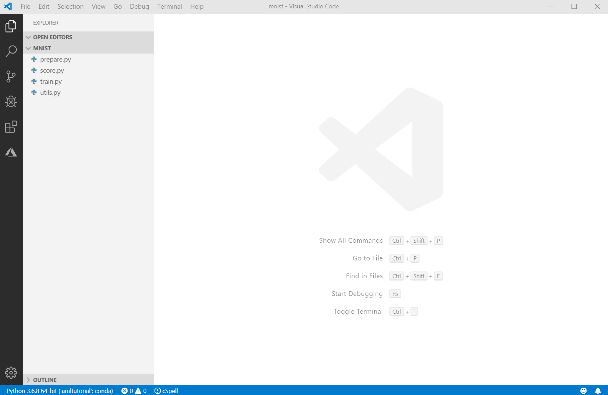
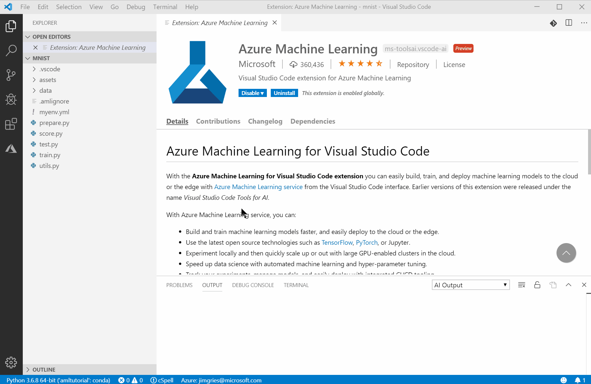
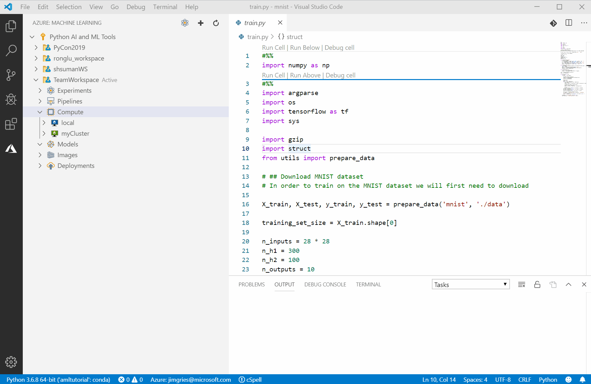
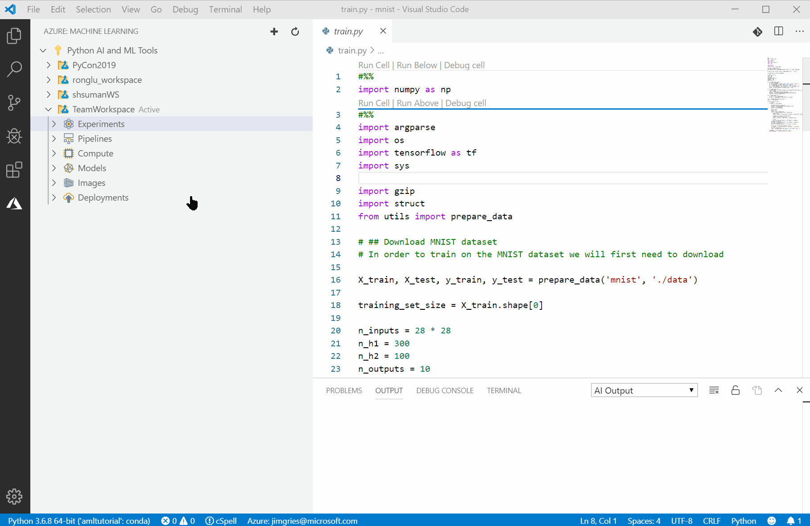

# Get started with Azure Machine Learning for Visual Studio Code

In this article, you'll learn how to use the extension for Azure Machine Learning for Visual Studio Code to train and deploy machine learning models.

The [Azure Machine Learning service](overview-what-is-azure-ml.md) streamlines the building, training, and deployment of machine learning models.
+ For training, it provides support for running experiments locally or remotely. For every experiment, you can keep track cusom metrics of multiple runs iteratively to fine tune hyperparameters
+ You can also use the Azure Machine Learning service to easily deploy machine learning models for your testing and production needs.

## Prerequisites

+ If you don’t have an Azure subscription, create a free account before you begin. Try the [free or paid version of Azure Machine Learning](https://aka.ms/AMLFree).

+ Install [Visual Studio Code](https://code.visualstudio.com/docs/setup/setup-overview), a lightweight code editor that runs on Windows, Mac, and Linux. .

+ [Install Python 3.5 or later](https://www.anaconda.com/download/).


## Install Azure Machine Learning extension for Visual Studio Code

When you install the Azure Machine Learning extension, two more extensions are automatically installed. They're the [Azure Account extension](https://marketplace.visualstudio.com/items?itemName=ms-vscode.azure-account) and the [Microsoft Python extension](https://marketplace.visualstudio.com/items?itemName=ms-Python.Python). For more information about using the Python extension for editing, running, and debugging Python code, see the [Python hello-world tutorial](https://code.visualstudio.com/docs/Python/Python-tutorial).

To install the Azure Machine Learning extension:

1. Open Visual Studio Code.

1. Switch to the Extensions tab, and search for "Azure Machine Learning".

1. On the extension tab, select **Install**.

1. A welcome tab for the extension opens in Visual Studio Code, and the Azure symbol (highlighted in red in the following screenshot) is added to the activity bar.

   

1. In the dialog box, select **Sign In** and follow the prompts to authenticate with Azure.

   The Azure Account extension, which was installed along with the Azure Machine Learning for Visual Studio Code extension, helps you authenticate with your Azure account. For a list of commands, see the page for the [Azure Account extension](https://marketplace.visualstudio.com/items?itemName=ms-vscode.azure-account).

> [Tip] You can also download the extension installer directly from [Azure Machine Learning for Visual Studio Code extension (preview)](https://aka.ms/vscodetoolsforai).

## Quick start with Azure Machine Learning
There are multiple ways of running your training scripts using the Azure Machine Learning service. If you're just getting started, let's first walk through how to quickly submit a training script to run in Azure.

If you're already somewhat familiar with the Azure Machine Learning concepts and would like more details as to how to manage and use them with the extension, see [Azure Machine Learning in-depth with VS Code](./how-to-vscode-tools.md#azure-machine-learning-in-depth-with-vs-code) below.

## Run an existing Python training script in Azure
If you have an existing training script, the Azure Machine Learning extension for VS Code not only provides an excellent editing, debugging and source management experience, but also makes it extremely easy to run and store metrics for that script as an Azure Machine Learning experiment in the cloud.

Let's get started. You can use your own training script if you have it ready, or clone the sample [vscode-tools-for-ai repo](https://github.com/microsoft/vscode-tools-for-ai). This is the public repo for filing issues about this extension. It also contains a small **mnist** sample folder that we'll use for this example.

1. Open the **mnist** folder in VS Code.

1. Create a new Python environment using your favorite virtual environment package or Anaconda and install the tensorflow and numpy packages.

1. Select the new environment you created as your Python interpreter at the bottom left corner of the VS Code status bar.

1. Open **train.py** and run it by opening the debugger and pressing the run button (alternatively just press F5).

[](./media/vscode-tools-for-ai/RunMNIST.gif#lightbox)

If everything is installed correctly, the script will run and create a tensorflow model in the outputs folder.

[](./media/vscode-tools-for-ai/ShowTensorFlowModel.gif#lightbox)

Now that you know that your script runs correctly, let's run it in Azure!

This can be easily be done with no extra modification of **train.py**. However, with just a few simple changes, you can make use of Azure Machine Learning to automatically track important metrics of your choice about each training run.

### Make Azure aware of your run metrics
To modify your project so that Azure can be made aware of important information in your runs:

1. Create a file called **amlrun.py** in the same folder as **train.py**

```Python
import azureml
from azureml.core import Run

# access the Azure ML run
# init run param to check if running within AML
def get_AMLRun():
    try:
        run = Run.get_submitted_run()
        return run
    except Exception as e:
        print("Caught = {}".format(e.message))
        return None
```

2. Import the amlrun file in **train.py**

```Python
...
from utils import prepare_data
from amlrun import get_AMLRun
...
```
3. Initialize the run object in **train.py**

```Python
...
init = tf.global_variables_initializer()
saver = tf.train.Saver()
run = get_AMLRun()
...
```
4. Log metrics to Azure with the run.log() function:

```Python
...
        acc_val = acc_op.eval(feed_dict = {X: X_test, y: y_test})

        # log accuracies to AML logger if using AML
        if run != None:
            run.log('Validation Accuracy', np.float(acc_val))
            run.log('Training Accuracy', np.float(acc_train))

        print(epoch, '-- Training accuracy:', acc_train, '\b Validation
...
```
### Run the script in Azure
That's it! Now just use the extension to run your script in the cloud! Please note that the following walkthrough video takes the liberty of compressing the amount of time it takes to create a new Azure ML workspace and compute, as well as the time it takes to run the training script.

   [](./media/vscode-tools-for-ai/StartGoldenPath.gif#lightbox)

After clicking the Run Experiment button, answer the prompts as follows:

1. Choose your Azure subscription
1. Choose to create a *new* Azure ML workspace
1. Pick from a set of pre-configured environment templates to initialize the enrinment for the runs. The templates provide a starting point and include settings for:
    1. **PyTorch**, **TensorFlow**, or **Scikit-learn**
    1. **Single** or **Distributed** compute training
    1. **General** for custom environments
1. Ensure the list of pip and conda packages is correct for your script based on the template you chose in the previous step
1. Review the default names and specs for the experiment run and click the **Submit Experiment** link in the json file. Note that the json file won't be saved. It is simply there for you to review or change the experiment settings before submission.
1. Sit back and relax while the extension sets everything up for you and runs your script!

[](./media/vscode-tools-for-ai/RunGoldenPath.gif#lightbox)

In a few seconds you will be notified that the experiment has been submitted to Azure at which time you can view its progress either in the Azure portal by clicking the **View Experiment Run** link in the VS Code notification, or inside VS Code by hitting the refresh button in the Azure tab.

At the moment, viewing run metrics is only supported in the Azure portal. The **View Experiment Run** link mentioned above will take you to the run where you will see the metrics you logged.
[](./media/vscode-tools-for-ai/ExperimentRunOnPortal.PNG#lightbox)

## Azure Machine Learning in-depth with VS Code

In the walkthrough above, we submitted an experiment by following the easiest path, where the extension does lots of the work behind the scenes to minimize the steps that you need to manage. In this section, we'll cover how you can manage all the Azure Machine Learning concepts individually for maximum control.

Before you start training and deploying machine learning models in Visual Studio Code, you need to create an [Azure Machine Learning workspace](concept-workspace.md) in the cloud. This workspace will contain your models and resources.

### Create a workspace

1. On the Visual Studio Code activity bar, select the Azure icon. The Azure Machine Learning sidebar appears.

[](./media/vscode-tools-for-ai/CreateaWorkspace.gif#lightbox)


1. Right-click your Azure subscription and select **Create Workspace**. By default a name is generated containing the date and time of creation. Change the name to **TeamWorkspace** and press enter.

1. Select a resource group from the list if you know which to choose or create a new one. If creating a new one, choose a location that is closest to the location you plan to deploy your model. In this case, we chose **West US 2**.

1. After pressing enter, Azure Machine Learning will receive the request to create your workspace. You will be notified of the process in the Visual Studio Code notification area.

1. Expand the Subscription node, to find your newly created workspace.

### Create an experiment
One or more experiments can be created in your workspace to track and analyze individual model training runs. Runs can be done in the Azure cloud or on your local machine.

1. Expand the **TeamWorkspace** workspace. Right-click the **Experiments** node, and choose **Create Experiment** from the context menu.

1. In the prompt, enter a name for your experiment. In the example screenshots, the experiment is named **MNIST**.

1. Select Enter to create the new experiment. The new experiment appears in the tree as a child of the **Experiments** node.

1. In a workspace, you can right-click an experiment to set it as the **Active** experiment. The **Active** experiment links that experiment in the cloud to the folder you currently have open in Visual Studio Code. This folder should contain your local Python scripts. By setting an active experiment, key metrics for all training runs will be stored within the experiment, regardless of where they are executed.

[](./media/vscode-tools-for-ai/CreateAnExperiment.gif#lightbox)


### Create and manage compute targets

With Azure Machine Learning for Visual Studio Code, you can prepare your data, train models, and deploy them both locally and on remote compute targets.

The extension supports several remote compute targets for Azure Machine Learning. For more information, see the full list of supported [compute targets for Azure Machine Learning](how-to-set-up-training-targets.md).

### Create compute targets for Azure Machine Learning in Visual Studio Code

To create a compute target:

1. On the Visual Studio Code activity bar, select the Azure icon. The Azure Machine Learning sidebar appears.

1. In the tree view, expand your Azure subscription and Azure Machine Learning workspace.

1. Under the workspace node, right-click the **Compute** node and choose **Create Compute**.

1. Choose the compute target type from the list.

1. In the command palette prompt, select a virtual machine size. Note that you can filter the computes with text, such as "gpu".

1. In the command palette prompt, enter a name for the compute target.

1. After entering the name, the compute will be created using default parameters. To change the parameters, right click on the new compute and choose **Edit Compute**.

1. In the json that is displayed, make desired changes then click the "Save and continue" CodeLens (using the keyboard you can press **ctrl-shift-p* to invoke the command palette and run the **Azure ML: Save and Continue** command)

Here's an example of how to create and edit an Azure Machine Learning compute (AMLCompute):

[](./media/vscode-tools-for-ai/CreateARemoteCompute.gif#lightbox)

#### The run configuration file

To run an Azure Machine Learning experiment on a compute, that compute needs to be configured appropriately. A run configuration file is the mechanism by which this environment is specified.

Here's an example of how to create a run conifiguration for the AmlCompute, created above.

[](./media/vscode-tools-for-ai/CreateARunConfig.gif#lightbox)

To run Azure ML experiments on your local machine a run configuration file is still required. When creating a local run configuration the Python environment used will default to the path to the interpreter you have set within VS Code.

### Train and tune models

Using the Azure ML extension for VS Code There are multiple ways of running a training script in an experiment.

1. Right click on the training script and choose **Azure ML: Run as Experiment in Azure**
1. Click the Run Experiment toolbar icon.
1. Right click on a run configuration node.
1. Use the VS Code command palette to execute **Azure ML: Run Experiment**

To run an Azure Machine Learning experiment:

1. On the Visual Studio Code activity bar, select the Azure icon.

1. In the tree view, expand your Azure subscription and Azure Machine Learning workspace.

1. Under the workspace node, expand the **Experiments** node and right-click the experiment you want to run.

1. Select **Run Experiment**.

1. Choose the name of the Python file you want to run to train your model and press enter to submit the run. Note: The file chosen must reside in the folder you currently have open in VS Code.

1. After the run is submitted, a **Run node** will appear below the experiment you chose. Use this node to monitor the state of your runs. Note: It may be necessary to periodically refresh the window to see the latest status.

Here's an example of how to run an experiment on the compute previously created:

[](./media/vscode-tools-for-ai/RunExperiment.gif#lightbox)

### Deploy and manage models
In Azure Machine Learning, you can deploy and manage your machine learning models in the cloud and at the edge.

### 1. Register your model to Azure Machine Learning from Visual Studio Code

Now that you've trained your model, you can register it in your workspace. You can track and deploy registered models.

To register your model:

1. On the Visual Studio Code activity bar, select the Azure icon. The Azure Machine Learning sidebar appears.

1. In the tree view, expand your Azure subscription and Azure Machine Learning workspace.

1. Under the workspace node, right-click **Models** and choose **Register Model**.

1. On the command palette, in the field, enter a model name.

1. From the list, choose whether to upload a **model file** (for single models) or a  **model folder** (for models with multiple files, such as TensorFlow).

1. Select your folder or file.

1. When you finish configuring your model properties, in the lower-right corner of the window, select **Submit**.

Here's an example of how to register your model to Azure Machine Learning:

[](./media/vscode-tools-for-ai/RegisteringAModel.gif#lightbox)


### 2. Deploy your service from Visual Studio Code

In Visual Studio Code, you can deploy your web service to:
+ Azure Container Instances (ACI) for testing.
+ Azure Kubernetes Service (AKS) for production.

You don't need to create an ACI container to test in advance, because ACI containers are created on the fly. However, you do need to configure AKS clusters in advance. For more information, see [Deploy models with Azure Machine Learning](how-to-deploy-and-where.md).

To deploy a web service:

1. On the Visual Studio Code activity bar, select the Azure icon. The Azure Machine Learning sidebar appears.

1. In the tree view, expand your Azure subscription and your Azure Machine Learning workspace.

1. Under the workspace node, expand the **Models** node.

1. Right-click the model you want to deploy, and choose **Deploy Service from Registered Model** from the context menu.

1. On the command palette, choose the compute target you want to deploy to.

1. On the command palette, in the field, enter a name for this service.

1. On the command palette, select the Enter key on your keyboard to browse for and select the script file.

1. On the command palette, select the Enter key on your keyboard to browse for and select the conda dependency file.

1. When you finish configuring your service properties, in the lower-right corner of the window, select **Submit** to deploy. In the service properties file, you can specify a local docker file or a schema.json file.

The web service is now deployed.

Here's an example of how to deploy a web service:

[](./media/vscode-tools-for-ai/CreatingAnImage.gif#lightbox)

### Use keyboard shortcuts

You can use the keyboard to access Azure Machine Learning features in Visual Studio Code. The most important keyboard shortcut to know is Ctrl+Shift+P, which displays the command palette. From the command palette, you have access to all of the functionality of Visual Studio Code, including keyboard shortcuts for the most common operations.

[](./media/vscode-tools-for-ai/commands.gif#lightbox)

## Next steps

* For a walkthrough of how to train with Azure Machine Learning outside of Visual Studio Code, see [Tutorial: Train models with Azure Machine Learning](tutorial-train-models-with-aml.md).
* For a walkthrough of how to edit, run, and debug code locally, see the [Python hello-world tutorial](https://code.visualstudio.com/docs/Python/Python-tutorial).
