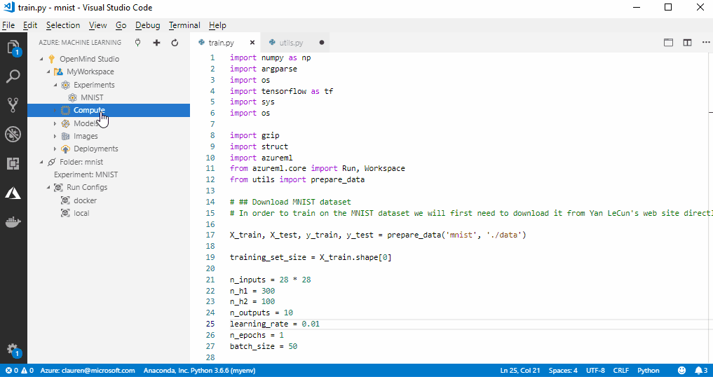
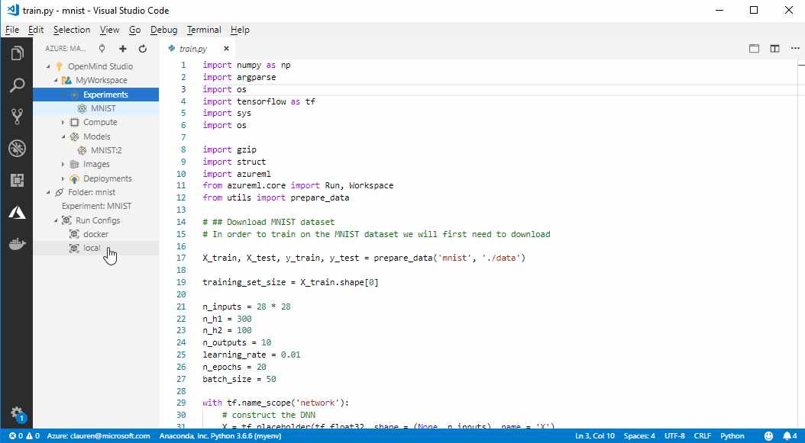
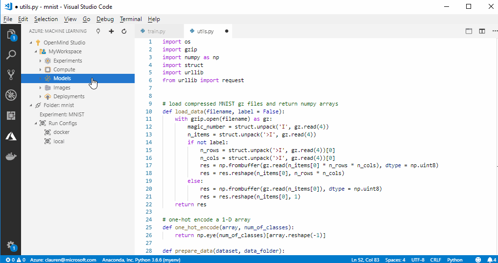
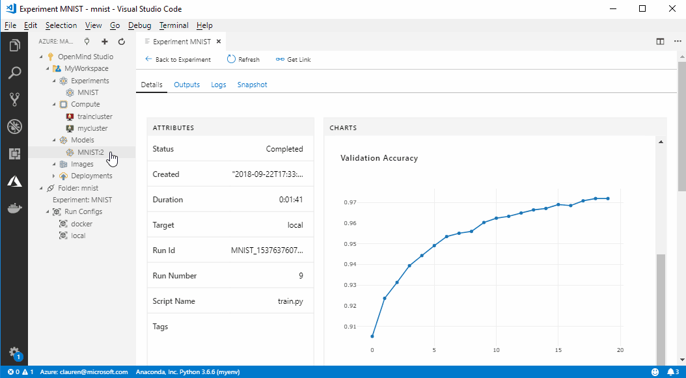

# VS Code Tools for AI: Train and deploy ML models from VS Code
In this article, you will learn how to use the **VS Code Tools for AI** extension to train and deploy machine learning and deep learning models with Azure Machine Learning service in VS Code.

Azure Machine Learning provides support for running experiments locally and on remote compute targets. For every experiment, you can keep track of multiple runs as often you need to iteratively try different techniques, hyperparameters, and more. You can use Azure Machine Learning to track custom metrics and experiment runs, enabling data science reproducibility and auditability.

And you can deploy these models for your testing and production needs.

## Prerequisites

+ [Have VS Code Tools for AI](how-to-vscode-tools.md)  set up for Azure Machine Learning.

+ Have the [Azure Machine Learning SDK for Python installed](how-to-vscode-tools.md)  with VS Code.

+ If you don’t have an Azure subscription, create a [free account](https://azure.microsoft.com/free/?WT.mc_id=A261C142F) before you begin.

## Create and manage compute targets

With Visual Studio Code Tools for AI, you can prepare your data, train models, and deploy them both locally and on remote compute targets.

This extension supports several different remote compute targets for Azure Machine Learning. See the [full list of supported compute targets](how-to-set-up-training-targets.md) for Azure Machine Learning.

### Create compute targets for Azure Machine Learning in VS Code

**To create a compute target:**

1. Click the Azure icon in the Visual Studio Code activity bar. The Azure: Machine Learning sidebar appears.

2. In the tree view, expand your Azure subscription and Azure Machine Learning service workspace. In the animated image, the subscription name is 'OpenMind Studio' and the workspace is 'MyWorkspace'. 

3. Under the workspace node, right-click the **Compute** node and choose **Create Compute**.

4. Choose the compute target type from the list. 

5. In the field, enter a unique name for this compute target and specify the size of the virtual machine.

6. Specify any advanced properties in the JSON config file that opens in a new tab. 

7. When you are done configuring your compute target, click **Finish** in the lower right.

Here is an example for Azure Batch AI:
[](./media/vscode-tools-for-ai/createcompute.gif#lightbox)

### Use remote computes for experiments in VS Code

To use a remote compute target when training, you need to create a run configuration file. This file tells Azure Machine Learning not only where to run your experiment but also how to prepare the environment.

#### The 'run configuration' file

The VS Code extension will automatically create a run configuration for your **local** and **docker** environments on your local computer.

This is a snippet from the default run configuration file.

If you want to install all of your libraries/dependencies yourself, set `userManagedDependencies: True` and then local experiment runs will use your default Python environment as specified by the VS Code Python extension.

```yaml
# user_managed_dependencies=True indicates that the environment will be user managed. False indicates that AzureML will manage the user environment.
    userManagedDependencies: False
# The python interpreter path
    interpreterPath: python
# Path to the conda dependencies file to use for this run. If a project
# contains multiple programs with different sets of dependencies, it may be
# convenient to manage those environments with separate files.
    condaDependenciesFile: aml_config/conda_dependencies.yml
# Docker details
    docker:
# Set True to perform this run inside a Docker container.
    enabled: false
```

#### The conda dependencies file

By default, a new conda environment is created for you and your installation dependencies are managed. However, you must specify your dependencies in the `aml_config/conda_dependencies.yml` file.

This is a snippet from the default 'aml_config/conda_dependencies.yml'.
You can add additional dependencies in the config file.

```yaml
# The dependencies defined in this file will be automatically provisioned for runs with userManagedDependencies=False.

name: project_environment
dependencies:
  # The python interpreter version.

  # Currently Azure ML only supports 3.5.2 and later.

- python=3.6.2

- pip:
    # Required packages for AzureML execution, history, and data preparation.

  - --index-url https://azuremlsdktestpypi.azureedge.net/sdk-release/Preview/E7501C02541B433786111FE8E140CAA1
  - --extra-index-url https://pypi.python.org/simple
  - azureml-defaults

```

## Train and tune models

Use Azure Machine Learning from VS Code to rapidly iterate on your code, step through and debug, and use your source code control solution of choice. 

**To run your experiment with Azure Machine Learning:**

1. Click the Azure icon in the Visual Studio Code activity bar. The Azure: Machine Learning sidebar appears.

1. In the tree view, expand your Azure subscription and Azure Machine Learning service workspace. In the animated image, the subscription name is 'OpenMind Studio' and the workspace is 'MyWorkspace'. 

1. Under the workspace node, expand the **Compute** node and right-click the **Run Config** of compute you want to use. 

1. Select **Run Experiment**.

1. Click **View Experiment Run** to see the integrated Azure Machine Learning portal to monitor your runs and see your trained models.

   [](./media/vscode-tools-for-ai/runexperiment.gif#lightbox)

## Deploy and manage models
Azure Machine Learning enables deploying and managing your machine learning models in the cloud and on the edge. 

### Register your model to Azure Machine Learning from VS Code

Now that you have trained your model, you can register it in your workspace.
Registered models can be tracked and deployed.

**To register your model:**

1. Click the Azure icon in the Visual Studio Code activity bar. The Azure: Machine Learning sidebar appears.

1. In the tree view, expand your Azure subscription and Azure Machine Learning service workspace.

1. Under the workspace node, right-click **Models** and choose **Register Model**.

1. From the list, choose whether you want to upload a **model file** (for single models) a  **model folder** (for models with multiple files, such as Tensorflow). 

1. Use the file chooser dialog to select the file or folder.

   [](./media/vscode-tools-for-ai/registermodel.gif#lightbox)

> [!Warning]
> For now, please remove the Tags from the generated json file.

### Deploy your service from VS Code

Using VS Code, you can deploy your web service to:
+ Azure Container Instance (ACI): for testing
+ Azure Kubernetes Service (AKS): for production 

You do not need to create an ACI container to test in advance since they are created on the fly. However, AKS clusters do need to be configured in advance. 

Learn more about [deployment with Azure Machine Learning](how-to-deploy-and-where.md) in general.

**To deploy a web service:**

1. Click the Azure icon in the Visual Studio Code activity bar. The Azure: Machine Learning sidebar appears.

1. In the tree view, expand your Azure subscription and your Azure Machine Learning service workspace.

1. Under the workspace node, expand the **Models** node.

1. Right-click the model you want to deploy and choose **Deploy Service from Registered Model** command from the context menu.

1. In the VS Code Command Palette, choose the compute target to which to deploy from the list. 

1. In the field, enter a name for this service. 

1. In the dialog box in the lower right corner, click **Browse** and select your scoring script. The dialog closes.

1. If you have a local Docker file, click  **Browse** in the second dialog box that appears. 

   If you cancel out the dialog box and don't specify a local Docker file, an 'Azure Machine Learning' one is used by default.

1. In the third dialog box that appears, click **Browse**  and select the local conda file path, or input the file path in json editor later.

1. If you have a schema.json file you want to use, click **Browse** in the fourth dialog box that appears and select the file.

The web service is now deployed.

Here is an example for Azure Container Instance:
[](./media/vscode-tools-for-ai/deploy.gif#lightbox)

## Next steps

For a walk-through of training with Machine Learning outside of VS Code, read [Tutorial: Train models with Azure Machine Learning](tutorial-train-models-with-aml.md).

For a walk-through of editing, running, and debugging code locally, see the [Python Hello World Tutorial](https://code.visualstudio.com/docs/languages/python/docs/python/python-tutorial)
