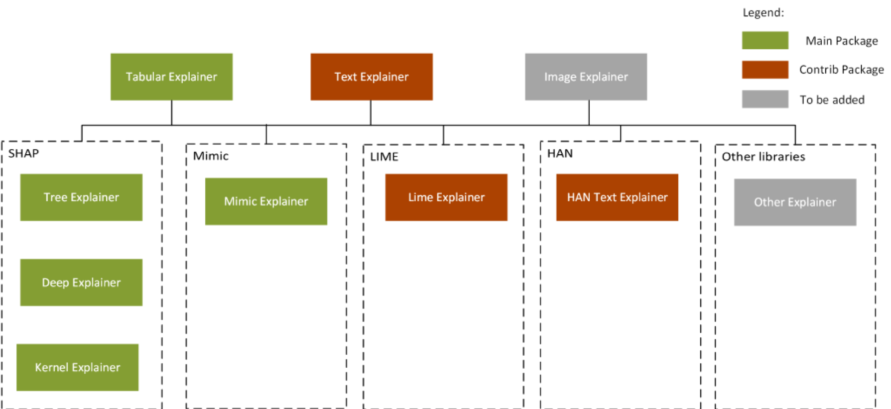

# Model interpretability with Azure Machine Learning service

In this article, you learn how to explain why your model made the predictions it did with the various interpretability packages of the Azure Machine Learning Python SDK.

Using the classes and methods in the SDK, you can get:
+ Feature importance values for both raw and engineered features
+ Interpretability on real-world datasets at scale, during training and inference.
+ Interactive visualizations to aid you in the discovery of patterns in data and explanations at training time

During the training phase of the development cycle, model designers and evaluators can use interpretability output of a model to verify hypotheses and build trust with stakeholders.  They also use the insights into the model for debugging, validating model behavior matches their objectives, and to check for bias.

In machine learning, **features** are the data fields used to predict a target data point. For example,
to predict credit risk, data fields for age, account size, and account age might be used. In this case,
age, account size, and account age are **features**. Feature importance tells you how each data field affected the model's predictions. For example, age may be heavily used in the prediction while account size and age don't affect the prediction accuracy significantly. This process allows data scientists to explain resulting predictions, so that stakeholders have visibility into what data points are most important in the model.

Using these tools, you can explain machine learning models **globally on all data**, or **locally on a specific data points** using the state-of-art technologies in an easy-to-use and scalable fashion.

The interpretability classes are made available through multiple SDK packages. Learn how to [install SDK packages for Azure Machine Learning](https://docs.microsoft.com/python/api/overview/azure/ml/install?view=azure-ml-py).

* [`azureml.explain.model`](https://docs.microsoft.com/python/api/azureml-explain-model/?view=azure-ml-py), the main package, containing functionalities supported by Microsoft.

* `azureml.contrib.explain.model`, preview, and experimental functionalities that you can try.

* `azureml.train.automl.automlexplainer` package for interpreting automated machine learning models.

> [!IMPORTANT]
> Content in the `contrib` namespace is not fully supported. As the experimental functionalities become mature, they will gradually be moved to the main namespace.

## How to interpret your model

You can apply the interpretability classes and methods to understand the model’s global behavior or specific predictions. The former is called global explanation and the latter is called local explanation.

The methods can be also categorized based on whether the method is model agnostic or model specific. Some methods target certain type of models. For example, SHAP’s tree explainer only applies to tree-based models. Some methods treat the model as a black box, such as mimic explainer or SHAP’s kernel explainer. The `explain` package leverages these different approaches based on data sets, model types, and use cases.

The output is a set of information on how a given model makes its prediction, such as:
* Global/local relative feature importance

* Global/local feature and prediction relationship

### Explainers

There are two sets of explainers: Direct Explainers and Meta Explainers in the SDK.

__Direct explainers__ come from integrated libraries. The SDK wraps all the explainers so that they expose a common API and output format. If you are more comfortable directly using these explainers, you can directly invoke them instead of using the common API and output format. The following are a list of the direct explainers available in the SDK:

* **Tree Explainer**: SHAP’s tree explainer, which focuses on polynomial time fast SHAP value estimation algorithm specific to trees and ensembles of trees.
* **Deep Explainer**: Based on the explanation from SHAP, Deep Explainer "is a high-speed approximation algorithm for SHAP values in deep learning models that builds on a connection with DeepLIFT described in the SHAP NIPS paper. TensorFlow models and Keras models using the TensorFlow backend are supported (there is also preliminary support for PyTorch)".
* **Kernel Explainer**: SHAP's Kernel explainer uses a specially weighted local linear regression to estimate SHAP values for any model.
* **Mimic Explainer**: Mimic explainer is based on the idea of global surrogate models. A global surrogate model is an intrinsically interpretable model that is trained to approximate the predictions of a black box model as accurately as possible. Data scientist can interpret the surrogate model to draw conclusions about the black box model.
* **LIME Explainer** (`contrib`): Based on LIME, LIME Explainer uses the state-of-the-art Local interpretable model-agnostic explanations (LIME) algorithm to create local surrogate models. Unlike the global surrogate models, LIME focuses on training local surrogate models to explain individual predictions.
* **HAN Text Explainer** (`contrib`): HAN Text Explainer uses a Hierarchical Attention Network for getting model explanations from text data for a given black box text model. We train the HAN surrogate model on a given teacher model's predicted outputs. After training globally across the text corpus, we have added a fine-tune step for a specific document in order to improve the accuracy of the explanations. HAN uses a bidirectional RNN with two attention layers, for sentence and word attention. Once the DNN is trained on the teacher model and fine-tuned on a specific document, we can extract the word importances from the attention layers. We have found HAN to be more accurate than LIME or SHAP for text data but more costly in terms of training time as well. However, we have made improvements to the training time by giving the user the option to initialize the network with GloVe word embeddings, although it is still slow. The training time can be improved significantly by running HAN on a remote Azure GPU VM. The implementation of HAN is described in 'Hierarchical Attention Networks for Document Classification (Yang et al., 2016)' ([https://www.cs.cmu.edu/~diyiy/docs/naacl16.pdf](https://www.cs.cmu.edu/~diyiy/docs/naacl16.pdf)).

__Meta explainers__ automatically select a suitable direct explainer and generate the best explanation info based on the given model and data sets. The meta explainers leverage all the libraries (SHAP, LIME, Mimic, etc.) that we have integrated or developed. The following are the meta explainers available in the SDK:

* **Tabular Explainer**: Used with tabular datasets.
* **Text Explainer**: Used with text datasets.

In addition to Meta-selecting of the direct explainers, meta explainers develop additional features on top of the underlying libraries and improve the speed and scalability over the direct explainers.

Currently `TabularExplainer` employs the following logic to invoke the Direct Explainers:

1. If it's a tree-based model, apply `TreeExplainer`, else
2. If it's a DNN model, apply `DeepExplainer`, else
3. Treat it as a black-box model and apply `KernelExplainer`

The intelligence built into `TabularExplainer` will become more sophisticated as more libraries are integrated into the SDK and we learn about pros and cons of each explainer.

`TabularExplainer` has also made significant feature and performance enhancements over the Direct Explainers:

* **Summarization of the initialization dataset**. In cases where speed of explanation is most important, we summarize the initialization dataset and generate a small set of representative samples, which speeds up both global and local explanation.
* **Sampling the evaluation data set**. If the user passes in a large set of evaluation samples but doesn't actually need all of them to be evaluated, the sampling parameter can be set to true to speed up the global explanation.

The following diagram shows the relationship between the two sets of direct and meta explainers.

[](./media/machine-learning-interpretability-explainability/interpretability-architecture.png#lightbox)

### Models supported

Any models that are trained on datasets in Python `numpy.array`, `pandas.DataFrame`, `iml.datatypes.DenseData`, or `scipy.sparse.csr_matrix` format are supported by the interpretability `explain` package of the SDK.

The explanation functions accept both models and pipelines as input. If a model is provided, the model must implement the prediction function `predict` or `predict_proba` that conforms to the Scikit convention. If a pipeline (name of the pipeline script) is provided, the explanation function assumes that the running pipeline script returns a prediction.

### Local and remote compute target

The `explain` package is designed to work with both local and remote compute targets. If run locally, The SDK functions will not contact any Azure services. You can run explanation remotely on Azure Machine Learning Compute and log the explanation info into Azure Machine Learning Run History Services. Once this information is logged, reports and visualizations from the explanation are readily available on Azure Machine Learning Workspace portal for user analysis.

## Interpretability in training

### Train and explain locally

1. Train your model in a local Jupyter notebook.

    ```python
    # load breast cancer dataset, a well-known small dataset that comes with scikit-learn
    from sklearn.datasets import load_breast_cancer
    from sklearn import svm
    from sklearn.model_selection import train_test_split
    breast_cancer_data = load_breast_cancer()
    classes = breast_cancer_data.target_names.tolist()
    # Split data into train and test
    from sklearn.model_selection import train_test_split
    x_train, x_test, y_train, y_test = train_test_split(breast_cancer_data.data, breast_cancer_data.target, test_size=0.2, random_state=0)
    clf = svm.SVC(gamma=0.001, C=100., probability=True)
    model = clf.fit(x_train, y_train)
    ```

2. Call the explainer: To initialize an explainer object, you need to pass your model and some training data to the explainer's constructor. You can also optionally pass in feature names and output class names (if doing classification) which will be used to make your explanations and visualizations more informative. Here is how to instantiate an explainer object using [TabularExplainer](https://docs.microsoft.com/python/api/azureml-explain-model/azureml.explain.model.tabularexplainer?view=azure-ml-py) and [MimicExplainer](https://docs.microsoft.com/python/api/azureml-explain-model/azureml.explain.model.mimic.mimicexplainer?view=azure-ml-py) locally. `TabularExplainer` is calling one of the three explainers underneath (`TreeExplainer`, `DeepExplainer`, or `KernelExplainer`), and is automatically selecting the most appropriate one for your use case. You can however, call each of its three underlying explainers directly.

    ```python
    from azureml.explain.model.tabular_explainer import TabularExplainer
    # "features" and "classes" fields are optional
    explainer = TabularExplainer(model, x_train, features=breast_cancer_data.feature_names, classes=classes)
    ```

    or

    ```python
    from azureml.explain.model.mimic.mimic_explainer import MimicExplainer
    from azureml.explain.model.mimic.models.lightgbm_model import LGBMExplainableModel

    # "features" and "classes" fields are optional
    explainer = MimicExplainer(model, x_train, LGBMExplainableModel, features=breast_cancer_data.feature_names, classes=classes)
    ```

3. Get the global feature importance values.

    ```python
    # You can use the training data or the test data here
    global_explanation = explainer.explain_global(x_train)
    # Sorted feature importance values and feature names
    sorted_global_importance_values = global_explanation.get_ranked_global_values()
    sorted_global_importance_names = global_explanation.get_ranked_global_names()
    dict(zip(sorted_global_importance_names, sorted_global_importance_values))
    ```

4. Local feature importance values: use the following function calls to explain an individual instance or a group of instances.

    ```python
    # explain the first data point in the test set
    local_explanation = explainer.explain_local(x_test[0])

    # sorted feature importance values and feature names
    sorted_local_importance_names = local_explanation.get_ranked_local_names()
    sorted_local_importance_values = local_explanation.get_ranked_local_values()
    ```

    or

    ```python
    # explain the first five data points in the test set
    local_explanation = explainer.explain_local(x_test[0:4])

    # sorted feature importance values and feature names
    sorted_local_importance_names = local_explanation.get_ranked_local_names()
    sorted_local_importance_values = local_explanation.get_ranked_local_values()
    ```

### Train and explain remotely

While you can train on the various compute targets supported by Azure Machine Learning service, the example in this section shows how to do this using an Azure Machine Learning Compute target.

1. Create a training script in a local Jupyter notebook (for example, run_explainer.py).

    ```python
    run = Run.get_context()
    client = ExplanationClient.from_run(run)

    # Train your model here

    # explain predictions on your local machine
    # "features" and "classes" fields are optional
    explainer = TabularExplainer(model, x_train, features=breast_cancer_data.feature_names, classes=classes)
    # explain overall model predictions (global explanation)
    global_explanation = explainer.explain_global(x_test)
    # explain local data points (individual instances)
    local_explanation = explainer.explain_local(x_test[0])
    # upload global and local explanation objects to Run History
    client.upload_model_explanation(run, local_explanation, top_k=2, comment='local explanation: top 2 features')
    # Uploading global model explanation data for storage or visualization in webUX
    # The explanation can then be downloaded on any compute
    # Multiple explanations can be uploaded
    client.upload_model_explanation(global_explanation, comment='global explanation: all features')
    # Or you can only upload the explanation object with the top k feature info
    #client.upload_model_explanation(global_explanation, top_k=2, comment='global explanation: Only top 2 features')
    ```

2. Follow the instructions on [Set up compute targets for model training](how-to-set-up-training-targets.md#amlcompute) to learn about how to set up an Azure Machine Learning Compute as your compute target and submit your training run.

3. Download the explanation in your local Jupyter notebook.

    ```python
    from azureml.contrib.explain.model.explanation.explanation_client import ExplanationClient
    # Get model explanation data
    client = ExplanationClient.from_run(run)
    explanation = client.download_model_explanation()
    local_importance_values = explanation.local_importance_values
    expected_values = explanation.expected_values
    # Or you can use the saved run.id to retrive the feature importance values
    client = ExplanationClient.from_run_id(ws, experiment_name, run.id)
    explanation = client.download_model_explanation()
    local_importance_values = explanation.local_importance_values
    expected_values = explanation.expected_values
    # Get the top k (e.g., 4) most important features with their importance values
    explanation = client.download_model_explanation(top_k=4)
    global_importance_values = explanation.get_ranked_global_values()
    global_importance_names = explanation.get_ranked_global_names()
    print('global importance values: {}'.format(global_importance_values))
    print('global importance names: {}'.format(global_importance_names))
    ```

## Visualizations

Use the visualization dashboard to understand and interpret your model:

### Global visualizations

The following plots provide a global view of the trained model along with its predictions and explanations.

|Plot|Description|
|----|-----------|
|Data Exploration| An overview of the dataset along with prediction values.|
|Global Importance|Shows the top K (configurable K) important features globally. This chart is useful for understanding the global behavior of the underlying model.|
|Explanation Exploration|Demonstrates how a feature is responsible for making a change in model’s prediction values (or probability of prediction values). |
|Summary| Uses a signed local feature importance values across all data points to show the distribution of the impact each feature has on the prediction value.|

[](./media/machine-learning-interpretability-explainability/global-charts.png#lightbox)

### Local visualizations

You can click on any individual data point at any time of the preceding plots to load the local feature importance plot for the given data point.

|Plot|Description|
|----|-----------|
|Local Importance|Shows the top K (configurable K) important features globally. This chart is useful for understanding the local behavior of the underlying model on a specific data point.|

[](./media/machine-learning-interpretability-explainability/local-charts.png#lightbox)

To load the visualization dashboard, use the following code:

```python
from azureml.contrib.explain.model.visualize import ExplanationDashboard

ExplanationDashboard(global_explanation, model, x_test)
```

## Raw feature transformations

Optionally, you can pass your feature transformation pipeline to the explainer to receive explanations in terms of the raw features before the transformation (rather than engineered features). If you skip this, the explainer provides explanations in terms of engineered features.

The format of supported transformations is same as the one described in [sklearn-pandas](https://github.com/scikit-learn-contrib/sklearn-pandas). In general, any transformations are supported as long as they operate on a single column and are therefore clearly one to many.

```python
from sklearn.pipeline import Pipeline
from sklearn.impute import SimpleImputer
from sklearn.preprocessing import StandardScaler, OneHotEncoder
from sklearn.linear_model import LogisticRegression
from sklearn_pandas import DataFrameMapper

# Assume that we have created two arrays, numerical and categorical, which holds the numerical and categorical feature names

numeric_transformations = [([f], Pipeline(steps=[('imputer', SimpleImputer(strategy='median')), ('scaler', StandardScaler())])) for f in numerical]

categorical_transformations = [([f], OneHotEncoder(handle_unknown='ignore', sparse=False)) for f in categorical]

transformations = numeric_transformations + categorical_transformations

# Append model to preprocessing pipeline.
# Now we have a full prediction pipeline.
clf = Pipeline(steps=[('preprocessor', DataFrameMapper(transformations)),
                    ('classifier', LogisticRegression(solver='lbfgs'))])

# clf.steps[-1][1] returns the trained classification model
# Pass transformation as an input to create the explanation object
# "features" and "classes" fields are optional
tabular_explainer = TabularExplainer(clf.steps[-1][1], initialization_examples=x_train, features=dataset_feature_names, classes=dataset_classes, transformations=transformations)
```

## Interpretability in inference

The explainer can be deployed along with the original model and can be used at scoring time to provide the local explanation information. The process of deploying a scoring explainer is similar to deploying a model and includes the following steps:

1. Create an explanation object:

   ```python
   from azureml.contrib.explain.model.tabular_explainer import TabularExplainer

   explainer = TabularExplainer(model, x_test)
   ```

1. Create a scoring explainer using the explanation object:

   ```python
   scoring_explainer = explainer.create_scoring_explainer(x_test)

   # Pickle scoring explainer
   scoring_explainer_path = scoring_explainer.save('scoring_explainer_deploy')
   ```

1. Configure and register an image that uses the scoring explainer model.

   ```python
   # Register explainer model using the path from ScoringExplainer.save - could be done on remote compute
   run.upload_file('breast_cancer_scoring_explainer.pkl', scoring_explainer_path)
   model = run.register_model(model_name='breast_cancer_scoring_explainer', model_path='breast_cancer_scoring_explainer.pkl')
   print(model.name, model.id, model.version, sep = '\t')
   ```

1. [Optional] Retrieve the scoring explainer from cloud and test the explanations

   ```python
   from azureml.contrib.explain.model.scoring.scoring_explainer import ScoringExplainer

   # Retrieve the scoring explainer model from cloud"
   scoring_explainer_model = Model(ws, 'breast_cancer_scoring_explainer')
   scoring_explainer_model_path = scoring_explainer_model.download(target_dir=os.getcwd(), exist_ok=True)

   # Load scoring explainer from disk
   scoring_explainer = ScoringExplainer.load(scoring_explainer_model_path)

   # Test scoring explainer locally
   preds = scoring_explainer.explain(x_test)
   print(preds)
   ```

1. Deploy the image to a compute target:

   1. Create a scoring file (before this step, follow the steps in [Deploy models with the Azure Machine Learning service](https://docs.microsoft.com/azure/machine-learning/service/how-to-deploy-and-where) to register your original prediction model)

        ```python
        %%writefile score.py
        import json
        import numpy as np
        import os
        import pickle
        from sklearn.externals import joblib
        from sklearn.linear_model import LogisticRegression
        from azureml.core.model import Model

        def init():

            global original_model
            global scoring_model

            # Retrieve the path to the model file using the model name
            # Assume original model is named original_prediction_model
            original_model_path = Model.get_model_path('original_prediction_model')
            scoring_explainer_path = Model.get_model_path('breast_cancer_scoring_explainer')

            original_model = joblib.load(original_model_path)
            scoring_explainer = joblib.load(scoring_explainer_path)

        def run(raw_data):
            # Get predictions and explanations for each data point
            data = np.array(json.loads(raw_data)['data'])
            # Make prediction
            predictions = original_model.predict(data)
            # Retrieve model explanations
            local_importance_values = scoring_explainer.explain(data)
            # You can return any data type as long as it is JSON-serializable
            return {'predictions': predictions.tolist(), 'local_importance_values': local_importance_values}
        ```

   1. Define the deployment configuration (This configuration depends on the requirements of your model. The following example defines a configuration that uses one CPU core and 1 GB of memory)

        ```python
        from azureml.core.webservice import AciWebservice

        aciconfig = AciWebservice.deploy_configuration(cpu_cores=1,
                                                       memory_gb=1,
                                                       tags={"data": "breastcancer",
                                                             "method" : "local_explanation"},
                                                       description='Get local explanations for breast cancer data')
        ```

   1. Create a file with environment dependencies

        ```python
        from azureml.core.conda_dependencies import CondaDependencies

        # WARNING: to install this, g++ needs to be available on the Docker image and is not by default (look at the next cell)


        myenv = CondaDependencies.create(pip_packages=["azureml-defaults", "azureml-explain-model", "azureml-contrib-explain-model"],
                                        conda_packages=["scikit-learn"])

        with open("myenv.yml","w") as f:
            f.write(myenv.serialize_to_string())

        with open("myenv.yml","r") as f:
            print(f.read())
        ```

   1. Create a custom dockerfile with g++ installed

        ```python
        %%writefile dockerfile
        RUN apt-get update && apt-get install -y g++
        ```

   1. Deploy the created image (time estimate: 5 minutes)

        ```python
        from azureml.core.webservice import Webservice
        from azureml.core.image import ContainerImage

        # Use the custom scoring, docker, and conda files we created above
        image_config = ContainerImage.image_configuration(execution_script="score.py",
                                                        docker_file="dockerfile",
                                                        runtime="python",
                                                        conda_file="myenv.yml")

        # Use configs and models generated above
        service = Webservice.deploy_from_model(workspace=ws,
                                            name='model-scoring-service',
                                            deployment_config=aciconfig,
                                            models=[scoring_explainer_model, original_model],
                                            image_config=image_config)

        service.wait_for_deployment(show_output=True)
        ```

1. Test the deployment

    ```python
    import requests

    # Create data to test service with
    x_list = x_test.tolist()
    examples = x_list[:4]
    input_data = "{\"data\": " + str(examples) + "}"

    headers = {'Content-Type':'application/json'}

    # send request to service
    resp = requests.post(service.scoring_uri, input_data, headers=headers)

    print("POST to url", service.scoring_uri)
    # can covert back to Python objects from json string if desired
    print("prediction:", resp.text)
    ```

1. Clean up: To delete a deployed web service, use `service.delete()`.

## Interpretability in automated ML

Automated machine learning contains packages for interpreting feature importance in auto-trained models. Additionally, classification scenarios allow you to retrieve class-level feature importance. There are two methods to enable this behavior within automated machine learning:

* To enable feature importance for a trained ensemble model, use the [`explain_model()`](https://docs.microsoft.com/python/api/azureml-train-automl/azureml.train.automl.automlexplainer?view=azure-ml-py) function.

    ```python
    from azureml.train.automl.automlexplainer import explain_model

    shap_values, expected_values, overall_summary, overall_imp, \
        per_class_summary, per_class_imp = explain_model(fitted_model, X_train, X_test)
    ```

* To enable feature importance for each individual run prior to training, set the `model_explainability` parameter to `True` in the `AutoMLConfig` object, along with providing validation data. Then use the [`retrieve_model_explanation()`](https://docs.microsoft.com/python/api/azureml-train-automl/azureml.train.automl.automlexplainer?view=azure-ml-py) function.

    ```python
    from azureml.train.automl.automlexplainer import retrieve_model_explanation

    shap_values, expected_values, overall_summary, overall_imp, per_class_summary, \
        per_class_imp = retrieve_model_explanation(best_run)
    ```

For more information, see the [how-to](how-to-configure-auto-train.md#explain-the-model-interpretability) on enabling interpretability features in automated machine learning.

## Next steps

To see a collection of Jupyter notebooks that demonstrate the instructions above, see the [Azure Machine Learning Interpretability sample notebooks](https://github.com/Azure/MachineLearningNotebooks/tree/master/how-to-use-azureml/explain-model).
