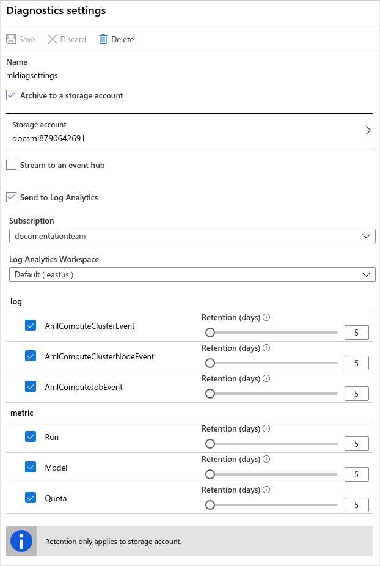

# Monitoring Azure Machine Learning

This article describes the monitoring data generated by Azure Machine Learning and how you can use the Azure Monitor to analyze and alert on this data.

## Azure Monitor

Azure Machine Learning logs monitoring data using [Azure Monitor](/azure/azure-monitor/overview), which is a full stack monitoring service in Azure. Azure Monitor provides a complete set of features to monitor your Azure resources in addition to resources in other clouds and on-premises.

Start with the article [Monitoring Azure resources with Azure Monitor, which provides the following information:

- What is Azure Monitor?
- Costs associated with monitoring
- Monitoring data collected in Azure
- Configuring data collection
- Standard tools in Azure for analyzing and alerting on monitoring data

The following sections build on this information by describing the specific data gathered from Azure Machine Learning, providing examples for configuring data collection, and analyzing this data with Azure tools.

## Monitoring data from Azure Machine Learning

Azure Machine Learning collects the same kinds of monitoring data as other Azure resources, which are described in [Monitoring data from Azure resources](/azure/azure-monitor/insights/monitor-azure-resource#monitoring-data-from-Azure-resources). See [Azure Machine Learning monitoring data reference](monitor-resource-reference.md) for a detailed reference of the logs and metrics created by Azure Machine Learning.

## Configuration

Metrics for Azure Machine Learning do not need to be configured, they are collected automatically.

To collect resource logs or forward them outside of Azure Monitor, create a diagnostic setting. See [Create diagnostic setting to collect platform logs and metrics in Azure](/azure/azure-monitor/platform/diagnostic-settings) for the detailed process for creating a diagnostic setting using the Azure portal, CLI, or PowerShell.

When you create a diagnostic setting, you specify which categories of logs to collect. The categories for Azure Machine Learning are listed in the following table:

| Category | Description |
|:---|:---|
| AmlComputeClusterEvent | Events from Azure Machine Learning compute clusters. |
| AmlComputeClusterNodeEvent | Events from nodes within an Azure Machine Learning compute cluster. |
| AmlComputeJobEvent | Events from jobs running on Azure Machine Learning compute. |



## Analyzing metric data

You can analyze metrics for Azure Machine Learning by opening **Metrics** from the **Azure Monitor** menu. See [Getting started with Azure Metrics Explorer](/azure/azure-monitor/platform/metrics-getting-started) for details on using this tool.

All metrics for Azure Machine Learning are in the namespace **Machine Learning Service Workspace**.


For metrics that support dimensions, you can filter the metric with the desired dimension value. For example, filtering **Active Cores** for a **Cluster Name** of `cpu-cluster`.

## Analyzing log data

Data in Azure Monitor Logs is stored in tables, with each table having its own set of unique properties. Azure Machine Learning stores data in the following tables:

| Table | Description |
|:---|:---|
| AmlComputeClusterEvent | Events from Azure Machine Learning compute clusters. |
| AmlComputeClusterNodeEvent | Events from nodes within an Azure Machine Learning compute cluster. |
| AmlComputeJobEvent | Events from jobs running on Azure Machine Learning compute. |

> [!IMPORTANT]
> When you select **Logs** from the Azure Machine Learning menu, Log Analytics is opened with the query scope set to the current workspace. This means that log queries will only include data from that resource. If you want to run a query that includes data from other databases or data from other Azure services, select **Logs** from the **Azure Monitor** menu. See [Log query scope and time range in Azure Monitor Log Analytics](/azure/azure-monitor/log-query/scope/) for details.

See [Azure Machine Learning monitoring data reference](monitor-resource-reference.md) for a detailed reference of the logs and metrics created by Azure Machine Learning.

### Sample queries

Following are queries that you can use to help you monitor your Azure Machine Learning resources: 

+ Get failed jobs in the last five days:

    ```Kusto
    AmlComputeJobEvent
    | where TimeGenerated > ago(5d) and EventType == "JobFailed"
    | project  TimeGenerated , ClusterId , EventType , ExecutionState , ToolType
    ```

+ Get records for a specific job name:

    ```Kusto
    AmlComputeJobEvent
    | where JobName == "automl_a9940991-dedb-4262-9763-2fd08b79d8fb_setup"
    | project  TimeGenerated , ClusterId , EventType , ExecutionState , ToolType
    ```

+ Get cluster events in the last five days for clusters where the VM size is Standard_D1_V2:

    ```Kusto
    AmlComputeClusterEvent
    | where TimeGenerated > ago(4d) and VmSize == "STANDARD_D1_V2"
    | project  ClusterName , InitialNodeCount , MaximumNodeCount , QuotaAllocated , QuotaUtilized
    ```

+ Get nodes allocated in the last eight days:

    ```Kusto
    AmlComputeClusterNodeEvent
    | where TimeGenerated > ago(8d) and NodeAllocationTime  > ago(8d)
    | distinct NodeId
    ```

## Alerts

The following table lists common and recommended alert rules for Azure Machine Learning:

| Alert type | Condition | Description |
|:---|:---|:---|
| Model Deploy Failed | Aggregation type: Total, Operator: Greater than, Threshold value: 0 | When one or more model deployments have failed |
| Quota Utilization Percentage | Aggregation type: Average, Operator: Greater than, Threshold value: 90| When the quota utilization percentage is greater than 90% |
| Unusable Nodes | Aggregation type: Total, Operator: Greater than, Threshold value: 0 | When there are one or more unusable nodes |

## Next steps

- See [Azure Machine Learning monitoring data reference](monitor-resource-reference.md) for a reference of the logs and metrics created by Azure Machine Learning.
- See [Manage and request quotas for Azure resources](how-to-manage-quotas.md) for information on working with quotas relating to Azure Machine Learning.
- See [Monitoring Azure resources with Azure Monitor](/azure/azure-monitor/insights/monitor-azure-resource) for details on monitoring Azure resources.
