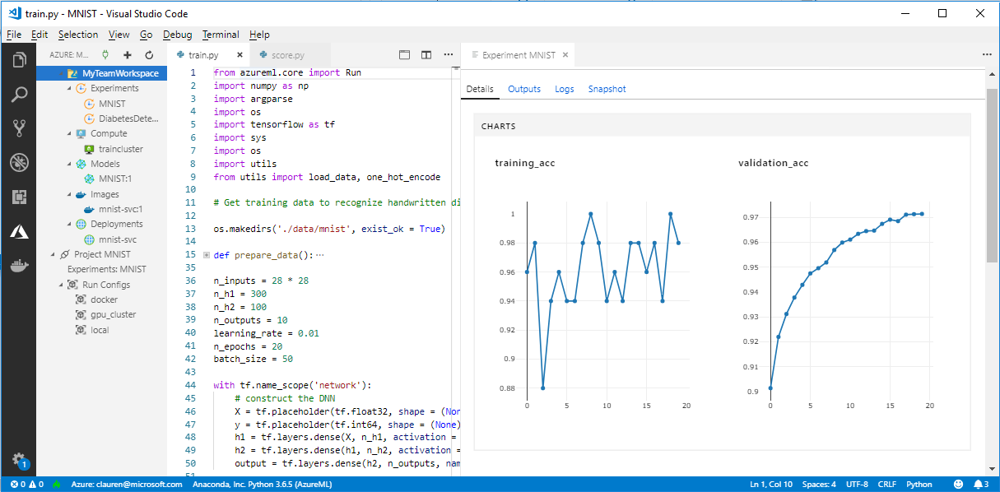

# What is happening to Workbench in Azure Machine Learning (preview)?

The Workbench application and some other early features were replaced in the September 2018 release to make way for an improved [architecture](concept-azure-machine-learning-architecture.md). The release contains many significant updates prompted by customer feedback to improve your experience. The core functionality from experiment runs to model deployment has not changed, but now you can use the robust <a href="http://aka.ms/aml-sdk" target="_blank">SDK</a> and [CLI](reference-azure-machine-learning-cli.md) to accomplish your machine learning tasks and pipelines.  

In this article, you'll learn about what changed and how it affects your pre-existing work with the Azure Machine Learning service.

## What changed?

The latest release of Azure Machine Learning service includes:
+ A [simplified Azure resources model](concept-azure-machine-learning-architecture.md)
+ [New portal UI](how-to-track-experiments.md) to manage your experiments and compute targets
+ A new, more comprehensive Python <a href="http://aka.ms/aml-sdk" target="_blank">SDK</a>
+ A new expanded [Azure CLI extension](reference-azure-machine-learning-cli.md) for machine learning

The [architecture](concept-azure-machine-learning-architecture.md) was redesigned with ease-of-use in mind. Instead of multiple Azure resources and accounts, you only need an [Azure Machine Learning service Workspace](concept-azure-machine-learning-architecture.md#workspace).  You can create workspaces quickly in the [Azure portal](quickstart-get-started.md).  A workspace can be used by multiple users to store training and deployment compute targets, model experiments, Docker images, deployed models, and so on.

While there are new improved CLI and SDK clients in the current release, the desktop Workbench application itself is deprecated. Now, you can monitor your experiments in the [workspace dashboard in the Azure web portal](how-to-track-experiments.md#view-the-experiment-in-the-azure-portal). Use the dashboard to get your experiment history, manage the compute targets attached to your workspace, manage your models and Docker images, and even deploy web services.

## How do I migrate?

Most of the artifacts created in the earlier version of the Azure Machine Learning service are stored in your own local or cloud storage. These artifacts won't ever disappear. To migrate, you need to register the artifacts again with the updated Azure Machine Learning service. Learn what you can migrate and how in this [migration article](how-to-migrate.md).

## Support timeline

You can continue to use your experimentation and model management accounts as well as the Workbench application for a while longer after September 2018. Support for the following resources will be removed progressively in the 3-4 months after that release. You can still find the documentation for the old features in the [Resources section](../desktop-workbench/tutorial-classifying-iris-part-1.md) at the bottom of the table of contents.

|Phase|Support details for earlier features|
|:---:|----------------|
|1|The ability to create _Azure Machine Learning Experimentation account_ and _Model Management account_ in the Azure portal and from the CLI. The ability to create ML Compute Environments from the CLI also ends. If you have an existing account, the CLI and the desktop Workbench continue to work in this phase.|
|2|The underlying APIs for creating old workspaces and projects in the desktop Workbench and with the CLI ends. You can still open existing projects, add additional scripts to it, run scripts in existing projects, and deploy web services to existing ML Compute Environments in this phase.|
|3|Support for everything else, including the remaining APIs and the desktop Workbench end in this phase.|

[Start migrating](how-to-migrate.md) today. All of the latest capabilities are available using the new <a href="http://aka.ms/aml-sdk" target="_blank">SDK</a>, [CLI](reference-azure-machine-learning-cli.md), and [portal](quickstart-get-started.md).

## What about run histories?

Run histories will remain accessible for a while. When you are ready to move to the updated version of Azure Machine Learning service, you can export these run histories if you want to keep a copy.

Run histories are now called _experiments_ in the current release. You can collect your model's experiments and explore them using the SDK, CLI, or web portal.

The portal's workspace dashboard is supported on Edge, Chrome and Firefox browsers only.

[  ]
(./media/overview-what-happened-to-workbench/image001.png#lightbox)

## Can I still prep data?

Your pre-existing data preparation files are not portable to the latest release since we don't have Workbench anymore. However, you can still prepare your data for modeling.  

With smaller data sets, you can use the  <a href="http://aka.ms/aml-sdk" target="_blank">Azure Machine Learning Data Prep SDK</a> to quickly prepare your data prior to modeling. 

You can use this same  <a href="http://aka.ms/aml-sdk" target="_blank">SDK</a> for larger data sets or use Azure Databricks to prepare big data sets. 

## Will projects persist?

You won't lose any code or work. In the older version, projects are cloud entities with a local directory. In the latest version, you attach local directories to the Azure Machine Learning service Workspace using a local config file. [See a diagram of the latest architecture](concept-azure-machine-learning-architecture.md).

Since much of the project content was already on your local machine, you just need to create a config file in that directory and reference it in your code to connect to your workspace. [Learn how migrate your existing projects.](how-to-migrate.md#projects)

Learn how to get started [in Python with the main SDK](quickstart-get-started.md).

## What about my registers models and images?
 
The models that you registered in your old model registry must migrated to your new workspace if you want to continue to use them. You can do this by [downloading the models and re-registering them](how-to-migrate.md) in your new workspace. 

The images that you created in your old image registry must be re-created in the new workspace to continue to use them. You can do this by following the [create docker image](how-to-deploy-to-aci.md#configure-an-image) section. 

## What about deployed web services?

The models you deployed as web services using your Model Management account will continue to work for as long as Azure Container Service (ACS) is supported. Those web services will even work after support has ended for Model Management accounts. However, when support for the old CLI ends, so does your ability to manage those web services.

In the newer version, models are deployed as web services to [Azure Container Instances](how-to-deploy-to-aci.md) (ACI) or [Azure Kubernetes Service](how-to-deploy-to-aks.md) (AKS) clusters. You can also [deploy to FPGAs and to the IoT edge](how-to-deploy-and-where.md). Without having to change any of your scoring files, dependencies, and schemas, you can redeploy your models using the new SDK or CLI. 

## What about the old SDK & CLI?

Yes, they will continue to work for a while (see the [timeline](#timeline) above). We recommend that you start creating your new experiments and models with the latest SDK and/or CLI.

In the latest release, the new Python SDK allows you to interact with the Azure Machine Learning service in any Python environment. Learn how to install the latest <a href="http://aka.ms/aml-sdk" target="_blank">SDK</a>.  You can also use the [updated Azure CLI machine learning extension](reference-azure-machine-learning-cli.md) with the rich set of `az ml` commands to interact the service in any command-line environment, including Azure portal cloud shell.

## What about VS Code Tools for AI?

With this latest release, the Visual Studio (VS) Code Tools for AI extension has been expanded and improved to work with the above new features.

[  ]
(./media/overview-what-happened-to-workbench/vscode-big.png#lightbox)

## What about domain packages?

The domain packages for [Computer Vision, Text Analytics, and Forecasting](../desktop-workbench/reference-python-package-overview.md) cannot be used with the latest version of Azure Machine Learning. However, you can still build and train computer vision, text, and forecasting models with latest Azure Machine Learning Python <a href="http://aka.ms/aml-sdk" target="_blank">SDK</a>. To learn how to migrate pre-existing models built using the Computer Vision, Text Analytics, and Forecasting packages, contact us at [AML-Packages@microsoft.com](mailto:AML-Packages@microsoft.com).

## Next steps

Learn about [the latest architecture for the Azure Machine Learning service](concept-azure-machine-learning-architecture.md) and try one of the quickstarts or tutorials:

* [What is Azure Machine Learning service](overview-what-is-azure-ml.md)
* [Quickstart: Create a workspace with Python](quickstart-get-started.md)
* [Tutorial: Train a model](tutorial-train-models-with-aml.md)
