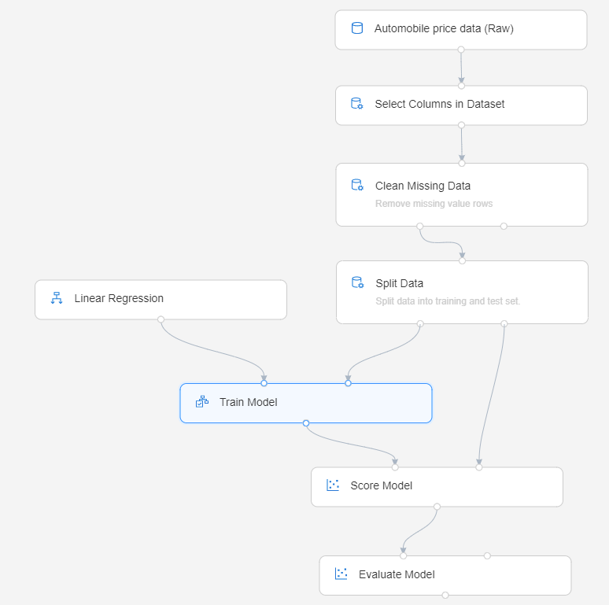

# What is Azure Machine Learning service?

Azure Machine Learning service is a cloud service that you use to train, deploy, automate, and manage machine learning models, all at the broad scale that the cloud provides.

## What is machine learning?

Machine learning is a data science technique that allows computers to use existing data to forecast future behaviors, outcomes, and trends. By using machine learning, computers learn without being explicitly programmed.

Forecasts or predictions from machine learning can make apps and devices smarter. For example, when you shop online, machine learning helps recommend other products you might want based on what you've bought. Or when your credit card is swiped, machine learning compares the transaction to a database of transactions and helps detect fraud. And when your robot vacuum cleaner vacuums a room, machine learning helps it decide whether the job is done.

## What is Azure Machine Learning service?

Azure Machine Learning service provides a cloud-based environment you can use to prep data, train, test, deploy, manage, and track machine learning models. Start training on your local machine and then scale out to the cloud. The service fully supports open-source technologies such as PyTorch, TensorFlow, and scikit-learn and can be used for any kind of machine learning, from classical ml to deep learning, supervised and unsupervised learning. 

Explore and prepare data, train and test models, and deploy them using rich tools such as:
+ A [visual interface](ui-quickstart-run-experiment.md) in which you can drag-n-drop modules to build your experiments and then deploy models
+ [Jupyter notebooks](https://jupyter.org)  in which you use the [SDKs](https://docs.microsoft.com/azure/machine-learning/service/#reference) to write your own code, such as [these sample notebooks](https://aka.ms/aml-notebooks)
+ [Visual Studio Code extension](how-to-vscode-tools.md)

## What can I do with Azure Machine Learning service?

Use the <a href="https://aka.ms/aml-sdk" target="_blank">Azure Machine Learning Python SDK</a> with open-source Python packages, or use the [visual interface (preview)](ui-quickstart-run-experiment.md) to build and train highly accurate machine learning and deep-learning models yourself in an Azure Machine Learning service Workspace.

You can choose from many machine learning components available in open-source Python packages, such as <a href="https://scikit-learn.org/stable/" target="_blank">Scikit-learn</a>, <a href="https://www.tensorflow.org" target="_blank">Tensorflow</a>, <a href="https://pytorch.org" target="_blank">PyTorch</a>, and <a href="https://mxnet.io" target="_blank">MXNet</a>.

Whether you write code or use the visual interface, you can track multiple runs as you experiment to find the best solution as well as manage the deployed models.

### Code-first experience

Start training on your local machine using the <a href="https://aka.ms/aml-sdk" target="_blank">Azure Machine Learning Python SDK</a> and then scale out to the cloud. With many available [compute targets](how-to-set-up-training-targets.md), like Azure Machine Learning Compute and [Azure Databricks](/azure/azure-databricks/what-is-azure-databricks), and with [advanced hyperparameter tuning services](how-to-tune-hyperparameters.md), you can build better models faster by using the power of the cloud.

You can also [automate model training and tuning](tutorial-auto-train-models.md) using the SDK.

### Code-free / low code experience

For code-free training, try:

+ The visual interface for drag-n-drop experimenting and deployment
    
    

+ The Azure portal option for automated ML experiments

### Operationalization (MLOps)

When you have the right model, you can easily use it in a web service, on an IoT device, or from Power BI. For more information, see the article on [how to deploy and where](how-to-deploy-and-where.md). 

Then you can manage your deployed models by using the [Azure Machine Learning SDK for Python](https://aka.ms/aml-sdk) or the [Azure portal](https://portal.azure.com/). 

These models can be consumed and return predictions in [real time](how-to-consume-web-service.md) or [asynchronously](how-to-run-batch-predictions.md) on large quantities of data.

And with advanced [machine learning pipelines](concept-ml-pipelines.md), you can collaborate on each step from data preparation, model training and evaluation, through deployment.

To get started using Azure Machine Learning service, see [Next steps](#next-steps).

## How does Azure Machine Learning service differ from Studio?

[Machine Learning Studio](../studio/what-is-ml-studio.md) is a collaborative, drag-and-drop visual workspace where you can build, test, and deploy machine learning solutions without needing to write code. It uses prebuilt and preconfigured machine learning algorithms and data-handling modules as well as a proprietary compute platform.

Azure Machine Learning service provides both SDKs **-and-** a visual interface(preview), to quickly prep data, train and deploy machine learning models. This visual interface (preview) provides a similar drag-and-drop experience to Studio. However, unlike the proprietary compute platform of Studio, the visual interface uses your own compute resources and is fully integrated into Azure Machine Learning service.

Here is a quick comparison.

|| Machine Learning Studio | Azure Machine Learning service: Visual interface|
|---| --- | --- |
|| Generally available (GA) | In preview|
|Modules for interface| Many | Initial set of popular modules|
|Training compute targets| Proprietary compute target, CPU support only| Supports Azure Machine Learning compute, GPU or CPU. (Other computes supported in SDK)|
|Deployment compute targets| Proprietary web service format, not customizable | Enterprise security options  & Azure Kubernetes Service.  ([Other computes](how-to-deploy-and-where.md) supported in SDK) |
|Automated model training and hyperparameter tuning | No | Not yet in visual interface.   (Supported in the SDK and Azure portal.) | 

Try out the visual interface (preview) with [Quickstart: Prepare and visualize data without writing code](ui-quickstart-run-experiment.md)

> [!NOTE]
> Models created in Studio can't be deployed or managed by Azure Machine Learning service. However, models created and deployed in the service visual interface can be managed through the Azure Machine Learning service workspace.

## Free trial

If you don’t have an Azure subscription, create a free account before you begin. Try the [free or paid version of Azure Machine Learning service](https://aka.ms/AMLFree) today.

You get credits to spend on Azure services. After they're used up, you can keep the account and use [free Azure services](https://azure.microsoft.com/free/). Your credit card is never charged unless you explicitly change your settings and ask to be charged. Or [activate MSDN subscriber benefits](https://azure.microsoft.com/pricing/member-offers/msdn-benefits-details/?WT.mc_id=A261C142F), which give you credits every month that you can use for paid Azure services.

## Next steps

- [Create a Machine Learning service workspace](setup-create-workspace.md) to get started.

- Follow the full-length tutorials: 
  + [Train an image classification model with Azure Machine Learning service](tutorial-train-models-with-aml.md) 
  + [Prepare data and use automated machine learning to auto-train a regression model](tutorial-data-prep.md)

- Learn about [machine learning pipelines](/azure/machine-learning/service/concept-ml-pipelines) to build, optimize, and manage your machine learning scenarios.

- Read the in-depth [Azure Machine Learning service architecture and concepts](concept-azure-machine-learning-architecture.md) article.

- For more information, see [other machine learning products from Microsoft](/azure/architecture/data-guide/technology-choices/data-science-and-machine-learning).
