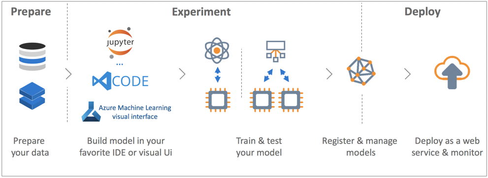

# What is Azure Machine Learning service (preview)?

Azure Machine Learning service (Preview) is a cloud service that you can use to develop and deploy machine learning models. Using Azure Machine Learning service, you can track your models as you build, train, deploy, and manage them, all at the broad scale that the cloud provides.

## What is machine learning?

Machine learning is a data science technique that allows computers to use existing data to forecast future behaviors, outcomes, and trends. Using machine learning, computers learn without being explicitly programmed.

Forecasts or predictions from machine learning can make apps and devices smarter. For example, when you shop online, machine learning helps recommend other products you might like based on what you've purchased. Or when your credit card is swiped, machine learning compares the transaction to a database of transactions and helps detect fraud. And when your robot vacuum cleaner vacuums a room, machine learning helps it decide whether the job is done.

## What is Azure Machine Learning service?

Azure Machine Learning service provides a cloud-based environment you can use to develop, train, test, deploy, manage, and track machine learning models.

[  ]
(./media/overview-what-is-azure-ml/aml.png#lightbox)

Azure Machine Learning service fully supports open-source technologies, so you can use tens of thousands of open-source Python packages with machine learning components such as TensorFlow and scikit-learn.
Rich tools, such as [Jupyter notebooks](http://jupyter.org) or the [Visual Studio Code Tools for AI](https://visualstudio.microsoft.com/downloads/ai-tools-vscode/), make it easy to interactively explore data, transform it, and then develop, and test models.
Azure Machine Learning service also includes features that [automate model generation and tuning](tutorial-auto-train-models.md) to help you create models with ease, efficiency, and accuracy.

Azure Machine Learning service lets you start training on your local machine, and then scale out to the cloud. With native support for [Azure Batch AI](https://azure.microsoft.com/services/batch-ai/) and with [advanced hyperparameter tuning services](how-to-tune-hyperparameters.md), you can build better models faster, using the power of the cloud. 

When you have the right model, you can easily deploy it in a container such as Docker. This means that it's simple to deploy to [Azure Container Instances](how-to-deploy-to-aci.md) or [Azure Kubernetes Service](how-to-deploy-to-aks.md), or you can use the container in your own deployments, either on-premises or in the cloud.
You can manage the deployed models, and track multiple runs as you experiment to find the best solution.

[!INCLUDE [aml-preview-note](../../../includes/aml-preview-note.md)]

## What can I do with Azure Machine Learning service?

Azure Machine Learning service can auto-generate a model and auto-tune it for you.
For an example, see [Tutorial: Automatically train a classification model with Azure Automated Machine Learning](tutorial-auto-train-models.md).

Or, using the Azure Machine Learning <a href="http://aka.ms/aml-sdk" target="_blank">SDK</a> for Python, along with open-source Python packages, you can build and train highly accurate machine learning and deep learning models yourself in an Azure Machine Learning service workspace.
You can choose from many machine learning components available in open-source Python packages, such as the following:

- <a href="http://scikit-learn.org/stable/" target="_blank">Scikit-learn</a>
- <a href="https://www.tensorflow.org" target="_blank">Tensorflow</a>
- <a href="https://pytorch.org" target="_blank">PyTorch</a>
- <a href="https://www.microsoft.com/cognitive-toolkit/" target="_blank">CNTK</a>
- <a href="http://mxnet.io" target="_blank">MXNet</a>

Once you have a model, you use it to create a container (such as Docker) that can be deployed locally for testing, and then as a production web service in either [Azure Container Instances](how-to-deploy-to-aci.md) or [Azure Kubernetes Service](how-to-deploy-to-aks.md).

You then can manage your deployed models using the [Azure portal](https://portal.azure.com/) or the [Azure Machine Learning CLI extension](https://review.docs.microsoft.com/azure/machine-learning/service/reference-azure-machine-learning-cli).
You can evaluate model metrics, retrain and redeploy new versions of the model, all while tracking the model's experiments.

To get started using Azure Machine Learning service, see [Next steps](#next-steps) below.

## How is Azure Machine Learning service different from Studio?

Azure Machine Learning Studio is a collaborative, drag-and-drop visual workspace where you can build, test, and deploy machine learning solutions without needing to write code. It uses pre-built and pre-configured machine learning algorithms and data-handling modules.

Use Machine Learning Studio when you want to experiment with machine learning models quickly and easily, and the built-in machine learning algorithms are sufficient for your solutions.

Use Machine Learning service if you work in a Python environment, you want more control over your machine learning algorithms, or you want to use open-source machine learning libraries.

> [!NOTE]
> Models created in Azure Machine Learning Studio cannot be deployed or managed by Azure Machine Learning service.

## Free trial
If you aren't a subscriber, you can [open an Azure account for free](https://azure.microsoft.com/pricing/free-trial/?WT.mc_id=A261C142F). You get credits to spend on Azure services. After they're used up, you can keep the account and use [free Azure services](https://azure.microsoft.com/free/). Your credit card is never charged unless you explicitly change your settings and ask to be charged. Alternatively, you can [activate MSDN subscriber benefits](https://azure.microsoft.com/pricing/member-offers/msdn-benefits-details/?WT.mc_id=A261C142F): Your MSDN subscription gives you credits every month that you can use for paid Azure services.

## Next steps

- Create a machine learning service workspace using the article [Use Azure Portal to get started](quickstart-get-started.md)
 
- Follow the full-length tutorial, [Train an image classification model with Azure Machine Learning](tutorial-train-models-with-aml.md), to learn how to train and deploy models with Azure Machine Learning service

- For information about allowing Azure Machine Learning to auto-generate and auto-tune your model, see [Tutorial: Automatically train a classification model with Azure Automated Machine Learning](tutorial-auto-train-models.md)

- For a technical, in-depth look at the service, see [Azure Machine Learning service architecture and concepts](concept-azure-machine-learning-architecture.md)

- For more information on other machine learning products from Microsoft, see [Other machine learning products from Microsoft](./overview-more-machine-learning.md)

<!-- 

An intro to AML or an end-to-end quickstart video could go here.

In this 9-minute video, learn how you can benefit your app. You'll learn about key features and what a typical workflow looks like. 

>[!VIDEO https://channel9.msdn.com/Events/Connect/2016/138/player]
 
+ 0-3 minutes covers key features and use-cases.
+ 3-4 minutes covers service provisioning. 
+ 4-6 minutes covers Import Data wizard used to create an index using the built-in real estate dataset.

-->
