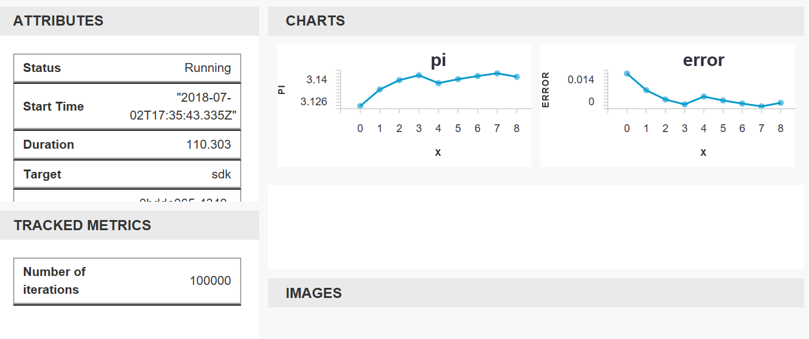

---
title: Get started with Azure Machine Learning service using the CLI extension | Microsoft Docs
description: In this quickstart, you will learn how to get started with Azure Machine Learning service using the Azure Machine Learning CLI extension.
services: machine-learning
ms.service: machine-learning
ms.component: core
ms.topic: quickstart
author: rastala
ms.author: roastala
ms.reviewer: sgilley
ms.date: 09/24/2018
---
# Quickstart: Get started with Azure Machine Learning using the CLI extension

In this quickstart, you'll use a machine learning CLI extension to get started with [Azure Machine Learning service](overview-what-is-azure-ml.md) (Preview).

Using the CLI, you'll learn how to:

1. Create a workspace in your Azure subscription. The workspace is used by one or more users to store their compute resources, models, deployments, and run histories in the cloud.
1. Attach a project to your workspace.   A project is a local folder that contains the scripts and configuration files needed to solve your machine learning problem.  
1. Run a Python script in your project that logs some values across multiple iterations.
1. View the logged values in the run history of your workspace.

> [!NOTE]
> For your convenience, the following Azure resources are added automatically to your workspace when regionally available:  [container registry](https://azure.microsoft.com/services/container-registry/), [storage](https://azure.microsoft.com/services/storage/), [application insights](https://azure.microsoft.com/services/application-insights/), and [key vault](https://azure.microsoft.com/services/key-vault/).

The resources you create can be used as prerequisites to other Azure Machine Learning tutorials and how-to articles.

This CLI was built on top of the Python-based <a href="http://aka.ms/aml-sdk" target="_blank">SDK</a> for Azure Machine Learning service.

## Prerequisites

Make sure you have the following prerequisites before starting the quickstart steps:

+ An Azure subscription. If you don't have an Azure subscription, create a [free account](https://azure.microsoft.com/free/?WT.mc_id=A261C142F) before you begin.
+ [Python 3.5 or higher](https://www.python.org/) installed
+ [Azure CLI](https://docs.microsoft.com/cli/azure/install-azure-cli?view=azure-cli-latest) installed

## Install the CLI extension

On your computer, open a command-line editor and install [the machine learning extension to Azure CLI](reference-azure-machine-learning-cli.md).  The installation can take several minutes to complete.

```azurecli
az extension add azureml-sdk
```

## Install the SDK

[!INCLUDE [aml-install-sdk](../../../includes/aml-install-sdk.md)]

## Create a resource group

A resource group is a container that holds related resources for an Azure solution. Using Azure CLI, sign into Azure, specify the subscription, and create a resource group.

In a command-line window, sign in with the Azure CLI command, `az login`. Follow the prompts for interactive login:
    
   ```azurecli
   az login
   ```

List the available Azure subscriptions, and specify the one you want to use:
   ```azurecli
   az account list --output table
   az account set --subscription <your-subscription-id>
   az account show
   ```
   where \<your-subscription-id\> is ID value for the subscription you wish to use. Do not include the brackets.

Create a resource group to hold your workspace.
   In this quickstart:
   + The name of the resource group is `docs-aml`.
   + The region is `eastus2`. 

   ```azurecli
   az group create -n docs-aml -l eastus2
   ```

## Create a workspace and a project folder

In the command-line window, create an Azure Machine Learning service workspace under the resource group.


   In this quickstart:
   + The workspace name is `docs-ws`.
   + The resource group name is `docs-aml`

   ```azurecli
   az ml workspace create -n docs-ws -g docs-aml
   ```

In the command-line window, create a folder on your local machine for your Azure Machine Learning project.

   ```
   mkdir docs-prj
   cd docs-prj
   ```

## Create a Python script

[!INCLUDE [aml-create-script-pi](../../../includes/aml-create-script-pi.md)]

## Run the script

Attach the folder as a project to the workspace. The `--history` argument specifies a name for the run history file that captures the metrics for each run.

   ```azurecli
   az ml project attach --history my_history -w docs-ws -g docs-aml
   ```

Run the script on your local computer.

   ```azurecli
   az ml run submit -c local pi.py
   ```

   This command runs the code and outputs a web link to your console. Copy-paste the link into your web browser.

In a web browser, visit the URL. A web portal appears with the results of the run. You can inspect the results of that run or previous runs, if they exist.

The portal's dashboard is supported on Edge, Chrome and Firefox browsers only.

   

## Clean up resources

[!INCLUDE [aml-delete-resource-group](../../../includes/aml-delete-resource-group.md)]

## Next steps
You have now created the necessary resources to start experimenting and deploying models. You also created a project, ran a script, and explored the run history of the script.

For an in-depth workflow experience, follow the Azure Machine Learning tutorial on building, training, and deploying a model.

> [!div class="nextstepaction"]
> [Tutorial: Build, train, and deploy](tutorial-train-models-with-aml.md)