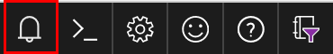

# Get started with Azure Machine Learning Services

In this quickstart, you'll use the Azure portal to get started with [Azure Machine Learning Services](overview-what-is-azure-ml.md).

You'll learn how to:

1. Create a workspace, which is the top-level resource for this service. This workspace is used by one or more users to store their compute resources, models, deployments, and run histories.
1. Attach a project containing your machine learning scripts to your workspace.   A project is a local folder that contains the scripts needed to solve your machine learning problem.  
1. Run a Python script in your project to show a few metrics.
1. View the run history.

 > [!NOTE]
> For your convenience, the following resources are added automatically to your workspace when regionally available: [Azure Container Registry](https://azure.microsoft.com/en-us/services/container-registry/), [Azure storage](https://azure.microsoft.com/en-us/services/storage/), [Azure Application Insights](https://azure.microsoft.com/en-us/services/application-insights/), and [Azure Key Vault](https://azure.microsoft.com/en-us/services/key-vault/).

The resources you create can be used as prerequisites to other Azure Machine Learning tutorials and how-to articles.

## Prerequisites

Make sure you have the following prerequisites before starting the quickstart steps:

+ An Azure subscription. If you don't have an Azure subscription, create a [free account](https://azure.microsoft.com/free/?WT.mc_id=A261C142F) before you begin.
+ [Python 3.5 or higher](https://www.python.org/) installed.
+ A package manager installed, such as [Continuum Anaconda](https://anaconda.org/anaconda/continuum-docs) or [Miniconda](https://conda.io/miniconda.html).

## Create a workspace 

Sign in to the [Azure portal](https://portal.azure.com/) using the credentials for the Azure subscription you'll use. If you don't have an Azure subscription, create a [free account](https://azure.microsoft.com/free/?WT.mc_id=A261C142F) now.

   

Select the **Create a resource** button (+) in the upper-left corner of the portal.

   

Enter **Machine Learning** in the search bar. Select the search result named **Machine Learning Workspace**.

   

In the **Machine Learning Workspace** pane, scroll to the bottom and select **Create** to begin.

   

In the **ML Workspace** pane, configure your workspace.

   Field|Description
   ---|---
   Workspace name |Enter a unique name that identifies your workspace.  Here we'll use MyWorkspace.  You will use this name later in this quickstart.
   Subscription |Choose the Azure subscription that you want to use. If you have multiple subscriptions, choose the appropriate subscription in which the resource is billed.
   Resource group | Use an existing resource group in your subscription, or enter a name to create a new resource group. A resource group is a container that holds related resources for an Azure solution.  Here we'll use Group.  You will use this name later in this quickstart.
   Location | Choose the location closest to your users and the data resources. This is where the workspace is created.

   

Select **Create** to begin the creation process.  It can take a few moments to create the workspace.

   To check on the status of the deployment, select the Notifications icon (bell) on the toolbar.

   

   When finished, a deployment success message appears.  It is also present in the notifications section.   Click on the **Go to resource** button to view the new workspace. You will use some of the values at the top of this page later in this quickstart.


## Install the SDK

Install the Azure Machine Learning SDK for Python. 

In a command-line window, create and activate the conda package manager environment with numpy and cython. This example uses Python 3.6.

  + On Windows:
       ```sh 
       conda create -n myenv Python=3.6 cython numpy
       activate myenv
       ```

  + On Linux or MacOS:
       ```sh 
       conda create -n myenv Python=3.6 cython numpy
       source activate myenv
       ```

Install the SDK.
   ```sh 
   pip install azureml-sdk
   ```

## Attach a project

In a command-line window, create a folder and sub-folder on your local machine for your Azure Machine Learning project.
   ```sh
   mkdir myproject
   cd myproject
   mkdir aml_config
   ```

Create a configuration file for the project. Create a file called config.json in the aml_config folder.  Copy the following code into that file, using the values you created for the workspace:

```json
{
"subscription_id": "Subscription ID found in portal",
"resource_group": "Group",
"workspace_name": "MyWorkspace"
}
```

In a Python editor, attach the project to the new workspace.

   ```python
   from azureml.core import Workspace, Project
   
   # Use the config file to specify the workspace
   ws = Workspace.from_config()
   
   # Attach current directory as a project in the workspace
   # and specify name of run history file for this project, `myhistory`
   helloproj = Project.attach(workspace_object=ws, history_name="myhistory")
   ```

## Run a script

Start tracking metrics with this Python code. These metrics are stored in the run history file.

   ```python
   from azureml.core import Run
   ws = Workspace.from_config()

   # Log metric values
   run = Run.start_logging(workspace = ws, history_name = "myhistory")
   run.log("A single value",1.23)
   run.log_list("A list of values",[1,2,3,4,5])

   # Save an output artifact, such as model or data file  
   with open("myOutputFile.txt","w") as f:
       f.write("My results")
       run.upload_file(name="results",path_or_stream="myOutputFile.txt")

   run.complete()
   ```

## View history

In the portal, navigate to the **History** section for your workspace.

   

There you will find the run results for the code you just executed.

   

## Clean up resources 

[!INCLUDE [aml-delete-resource-group](../../../includes/aml-delete-resource-group.md)]

You can also keep the resource group, but delete a single workspace by displaying the workspace properties and selecting the Delete button.

## Next steps
You have now created the necessary resources to start experimenting and deploying models. You also created a project, ran a script, and explored the run history of the script.

For an in-depth workflow experience, follow the Azure Machine Learning tutorial on building, training, and deploying a model.

> [!div class="nextstepaction"]
> [Tutorial: Build, train, and deploy](tutorial-build-train-deploy-with-azure-machine-learning.md)