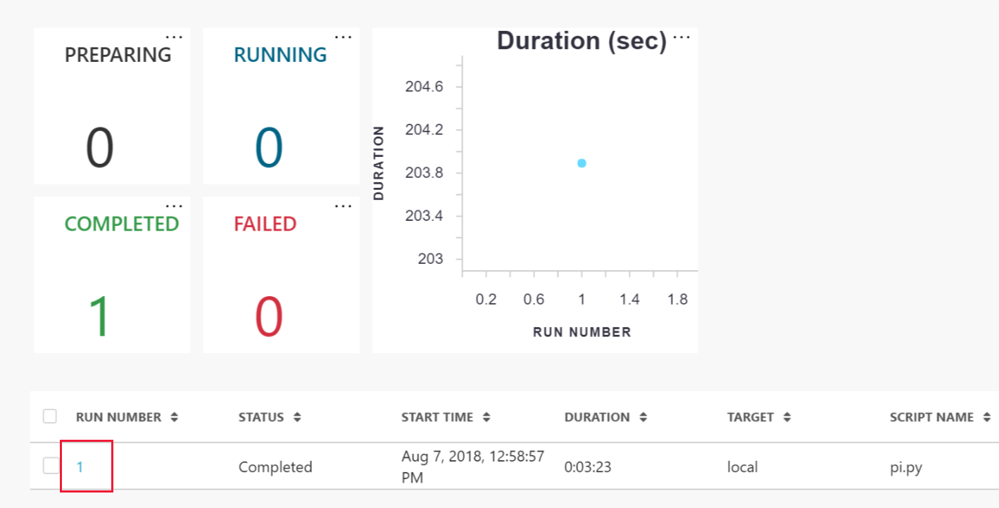

# Quickstart: Get started with Azure Machine Learning service

In this quickstart, you'll use the Azure portal to create a Azure Machine Learning workspace. This workspace is the foundational block in the cloud for experimenting, training, and deploying ML models with Azure Machine Learning service (Preview). 

In this tutorial, you will:

* Create a workspace in your Azure subscription
* Create a configuration file with the details needed to communicate with your workspace
* Try it out with a Python script that logs values across multiple iterations
* View the logged values in your workspace


For your convenience, the following Azure resources are added automatically to your workspace when regionally available:  [container registry](https://azure.microsoft.com/services/container-registry/), [storage](https://azure.microsoft.com/services/storage/), [application insights](https://azure.microsoft.com/services/application-insights/), and [key vault](https://azure.microsoft.com/services/key-vault/).

The resources you create can be used as prerequisites to other Azure Machine Learning tutorials and how-to articles.

## Prerequisites

Make sure you have the following prerequisites before starting the quickstart steps:

+ An Azure subscription. If you don't have an Azure subscription, create a [free account](https://azure.microsoft.com/free/?WT.mc_id=A261C142F) before you begin.
+ A package manager installed, such as [Continuum Anaconda](https://anaconda.org/anaconda/continuum-docs) or [Miniconda](https://conda.io/miniconda.html).


## Create a workspace 

[!INCLUDE [aml-create-portal](../../../includes/aml-create-in-portal.md)]

On the workspace page, click on `Explore your Azure Machine Learning Workspace`

 

In a moment, you will use this page.  For now, leave the browser open and move on to configure a project.


## Create a configuration file

Create a configuration file with the connection details needed to communicate with your workspace.  

On the workspace page, click on `Explore your Azure Machine Learning Workspace`

 

In the middle of the page is the configuration code for your workspace. It will look something like:

```json
{
"subscription_id": "xxxxxxxx-xxxx-xxxx-xxxx-xxxxxxxxxxxx",
"resource_group": "docs-aml",
"workspace_name": "docs-ws"
}
```

Copy this code into a file named **config.json**.  Put this file into a directory named **aml_config**.

## Try it out

Now see how the workspace displays results from your Python code.  In this section you:

* Install the Azure Machine Learning SDK
* Create a Python script that includes `log_row` to log values you want to track
* Run the script
* View the logged values in your workspace

### Install the Azure Machine Learning SDK

[!INCLUDE [aml-install-sdk](../../../includes/aml-install-sdk.md)]

### Create a Python script

[!INCLUDE [aml-create-script-pi](../../../includes/aml-create-script-pi.md)]

### Run the script

Run the script with this Python code, also placed in the same directory as the **aml_config/config.json** configuration file.  In this code, `Workspace.from_config()` reads the configuration file to find your workspace.

```python
from azureml.core import Workspace, Project, Run

ws = Workspace.from_config()

proj = Project.attach(workspace_object = ws,
    history_name = "myhistory",
    directory = ".")

run = Run.submit(project_object = proj,
                    run_config = "local",
                    script_to_run = "pi.py")
```

## View logged values

Go back to the portal page in your browser and refresh the page.

Click again on  `Explore your Azure Machine Learning Workspace`

 

This time you will see a list of experiments for the workspace.

Click on the `myhistory` link, then on the `pi.py` entry on the left. Finally, scroll down the page to find the table of runs and click on the run number link.

 


You can now view the values that were logged in your script:

   

## Clean up resources 

[!INCLUDE [aml-delete-resource-group](../../../includes/aml-delete-resource-group.md)]

You can also keep the resource group, but delete a single workspace by displaying the workspace properties and selecting the Delete button.

## Next steps

You have now created the necessary resources to start experimenting and deploying models. You also created a project, ran a script locally, and explored the run history of that script in your workspace in the cloud.

For an in-depth workflow experience, follow the Azure Machine Learning tutorial on building, training, and deploying a model.

> [!div class="nextstepaction"]
> [Tutorial: Build, train, and deploy](tutorial-train-models-with-aml.md)