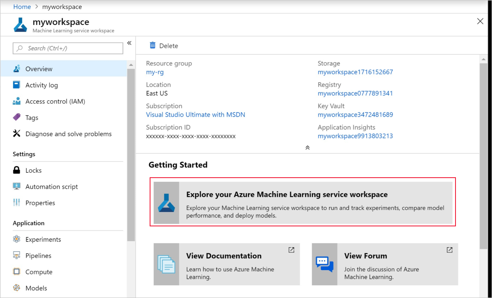
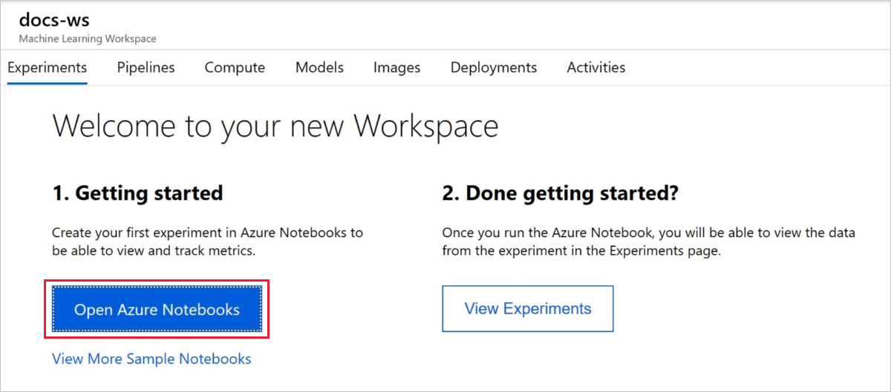
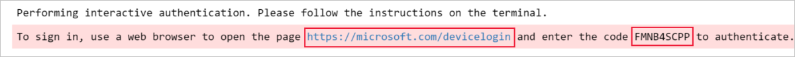
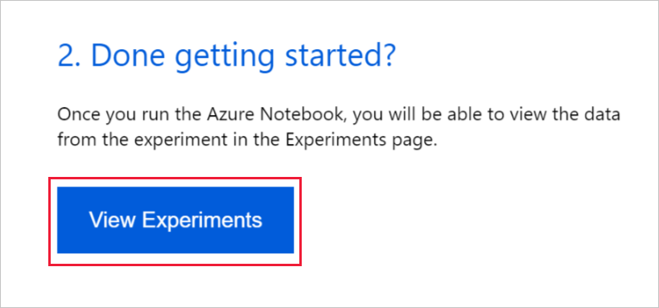
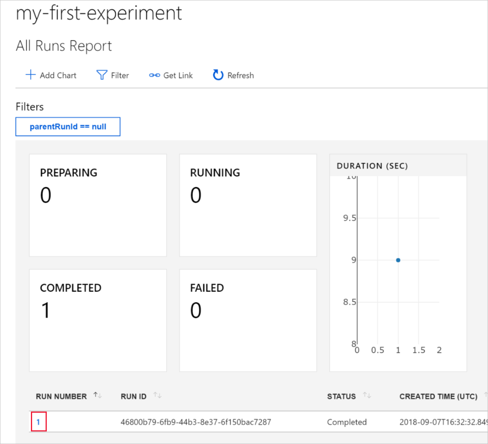
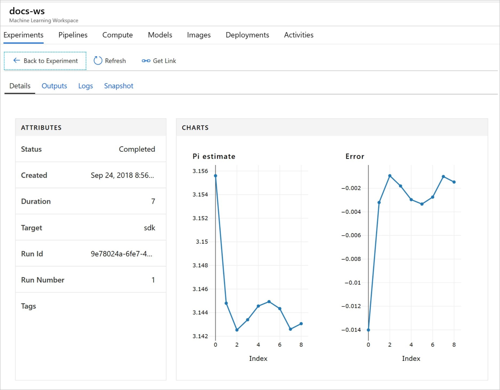

# Quickstart: Use the Azure portal to get started with Azure Machine Learning service

In this quickstart, you'll use the Azure portal to create an Azure Machine Learning service workspace. This workspace is the foundational block in the cloud for experimenting, training, and deploying machine learning models with Azure Machine Learning service. 

In this tutorial, you will:

* Create a workspace in your Azure subscription
* Try it out with Python in an Azure Notebook and log values across multiple iterations
* View the logged values in your workspace

For your convenience, the following Azure resources are added automatically to your workspace when regionally available:  [container registry](https://azure.microsoft.com/services/container-registry/), [storage](https://azure.microsoft.com/services/storage/), [application insights](https://azure.microsoft.com/services/application-insights/), and [key vault](https://azure.microsoft.com/services/key-vault/).

The resources you create can be used as prerequisites to other Azure Machine Learning service tutorials and how-to articles. As with other Azure services, there are limits on certain resources (for eg. BatchAI cluster size) associated with the Azure Machine Learning service. Please read [this](how-to-manage-quotas.md) article on the default limits and how to request more quota.

If you don’t have an Azure subscription, create a [free account](https://azure.microsoft.com/free/?WT.mc_id=A261C142F) before you begin.


## Create a workspace 

[!INCLUDE [aml-create-portal](../../../includes/aml-create-in-portal.md)]

On the workspace page, click on `Explore your Azure Machine Learning service workspace`

 


## Use the workspace

Now see how a workspace helps you manage your machine learning scripts. In this section you:

* Open a notebook in Azure Notebooks
* Run code that creates some logged values
* View the logged values in your workspace

This is one example of how the workspace can help you keep track of information generated in a script. 

### Open a notebook 

Azure Notebooks provides a free cloud platform for Jupyter notebooks, pre-configured with everything you need to run Azure Machine Learning service.  

Click on the `Open Azure Notebooks` button to try your first experiment.

 

Your organization may require [administrator consent](https://notebooks.azure.com/help/signing-up/work-or-school-account/admin-consent) before you can sign in.

After you sign in, a new tab opens and a `Clone Library` prompt appears.  Click on `Clone`


### Run the notebook

Along with two notebooks, you will see a  `config.json` file.  This config file contains information about the workspace you just created.  

Click on `01.run-experiment.ipynb` to open the notebook.

You can run the cells one at a time by using `Shift`+`Enter`.  Or use the menu `Cells` > `Run All` to run the entire notebook.  When you see [*] next to a cell, it is running.  When the code for that cell completes, a number will appear.

You may be prompted to sign in.  Copy the code in the message, then click on the link and paste the code into the new window.  Be sure not to copy a space before or after the code.  Sign in with the same account you used in the Azure portal.

 

In the notebook, the second cell reads from `config.json` to connect to your workspace.
```
ws = Workspace.from_config()
```

The third cell of code starts an experiment with the name of "my-first-experiment".  You will use this name to look up information about the run back in your workspace.

```
experiment = Experiment(workspace_object=ws, name = "my-first-experiment")
```

Notice in the last cell of the notebook the values that are written to a log file.

```
# Log final results
run.log("Final estimate: ",pi_estimate)
run.log("Final error: ",math.pi-pi_estimate)
```

You can view these values in your workspace after the code has run.

## View logged values

After you run all the cells in the notebook, go back to the portal page.  

Click  on  `View Experiments`.



Close the `Reports` pop-up.

Click on `my-first-experiment`.

See information about the run you just performed.  Scroll down the page to find the table of runs and click on the run number link.

 

You see plots that were automatically created of the logged values.  

   

Since the code to approximate pi uses random values, your plots will show different values.

## Clean up resources 

[!INCLUDE [aml-delete-resource-group](../../../includes/aml-delete-resource-group.md)]

You can also keep the resource group, but delete a single workspace by displaying the workspace properties and selecting the Delete button.

## Next steps

You have now created the necessary resources to start experimenting and deploying models. You also ran some code in a notebook, and explored the run history from that code in your workspace in the cloud.

For an in-depth workflow experience, follow the Azure Machine Learning tutorials to train and deploy a model.  

> [!div class="nextstepaction"]
> [Tutorial: Train an image classification model](tutorial-train-models-with-aml.md)
