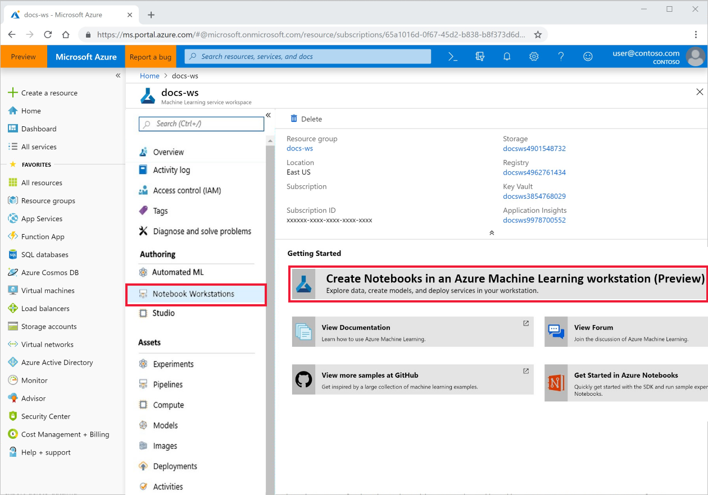
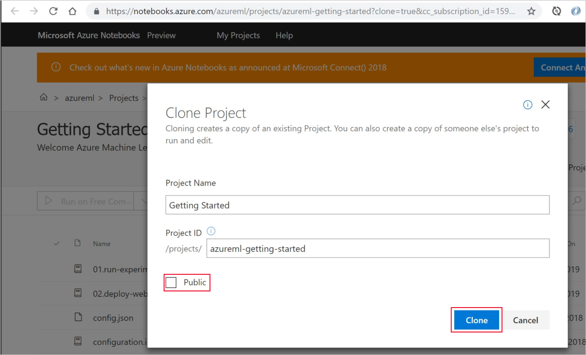
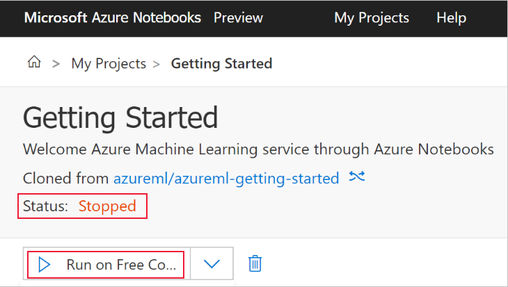
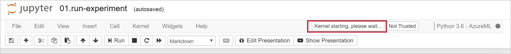

# Quickstart: Use a cloud-based notebook server to get started with Azure Machine Learning

In this article, you use Azure Notebooks to run code that is logged in the Azure Machine Learning service [workspace](concept-azure-machine-learning-architecture.md). Your workspace is the foundational block in the cloud that you use to experiment, train, and deploy machine learning models with Machine Learning. 

This quickstart uses cloud resources and requires no installation. To use your own environment instead, see [Quickstart: Use your own notebook server to get started with Azure Machine Learning](quickstart-run-local-notebook.md).  
 
In this quickstart, you take the following actions:

* Connect to your workspace with Python in a Jupyter notebook. The notebook contains code to estimate pi and logs errors at each iteration. 
* View the logged error values in your workspace.

If you don’t have an Azure subscription, create a free account before you begin. Try the [free or paid version of Azure Machine Learning service](https://aka.ms/AMLFree) today.

## Prerequisite

1. [Create an Azure Machine Learning workspace](setup-create-workspace.md#portal) if you don't have one.

1. Open your workspace in the [Azure portal](https://portal.azure.com/).  See how to [find your workspace](how-to-manage-workspace.md#view).

## Use your workspace

> [!VIDEO https://www.microsoft.com/en-us/videoplayer/embed/RE2F9Ad]

Learn how a workspace helps you manage your machine learning scripts. In this section, you take the following steps:

* Open a notebook in Azure Notebooks.
* Run code that creates some logged values.
* View the logged values in your workspace.

This example shows how the workspace can help you keep track of information generated in a script. 

### Open a notebook 

[Azure Notebooks](https://notebooks.azure.com) provides a free cloud platform for Jupyter notebooks that is preconfigured with everything you need to run Machine Learning. From your workspace, you can launch this platform to get started using your Azure Machine Learning service workspace.

1. On the workspace Overview page, select **Get Started Azure Notebooks** to try your first experiment in Azure Notebooks.  Azure Notebooks is a separate service that lets you run Jupyter notebooks for free in the cloud.  When you use this link to the service, information about how to connect to your workspace will be added to the library you create in Azure Notebooks.

   

1. Sign into Azure Notebooks.  Make sure you sign in with the same account you used to sign into the Azure portal. Your organization might require [administrator consent](https://notebooks.azure.com/help/signing-up/work-or-school-account/admin-consent) before you can sign in.

1. After you sign in, a new tab opens and a `Clone Library` prompt appears. Cloning this library will load a set of notebooks and other files into your Azure Notebooks account.  These files help you explore the capabilities of Azure Machine Learning.

1. Uncheck **Public** so that you don't share your workspace information with others.

1. Select **Clone**.

   

1. If you see that the project status is stopped, click on **Run on Free Computer** to use the free notebook server.

    

### Run the notebook

In the list of files for this project, you see a `config.json` file. This config file contains information about the workspace you created in the Azure portal.  This file allows your code to connect to and add information into your workspace.

1. Select **01.run-experiment.ipynb** to open the notebook.

1. The status area tells you to wait until the kernel has started.  The message disappears once the kernel is ready.

    

1. After the kernel has started, run the cells one at a time using **Shift+Enter**. Or select **Cells** > **Run All** to run the entire notebook. When you see an asterisk, __*__, next to a cell, the cell is still running. After the code for that cell finishes, a number appears. 

1. Follow instructions in the notebook to authenticate your Azure subscription.

After you've finished running all of the cells in the notebook, you can view the logged values in your workspace.

## View logged values

1. The output from the `run` cell contains a link back to the Azure portal to view the experiment results in your workspace. 

    

1. Click the **Link to Azure portal** to view information about the run in your workspace.  This link opens your workspace in the Azure portal.

1. The plots of logged values you see were automatically created in the workspace. Whenever you log multiple values with the same name parameter, a plot is automatically generated for you.

   

Because the code to approximate pi uses random values, your plots will show different values.  

## Clean up resources 

[!INCLUDE [aml-delete-resource-group](../../../includes/aml-delete-resource-group.md)]

You can also keep the resource group but delete a single workspace. Display the workspace properties and select **Delete**.

## Next steps

You created the necessary resources to experiment with and deploy models. You also ran some code in a notebook. And you explored the run history from that code in your workspace in the cloud.

For an in-depth workflow experience, follow Machine Learning tutorials to train and deploy a model:  

> [!div class="nextstepaction"]
> [Tutorial: Train an image classification model](tutorial-train-models-with-aml.md)