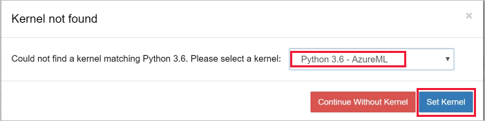

# Quickstart: Use a cloud-based notebook server to get started with Azure Machine Learning

Create a cloud-based notebook server, then use it.  In this quickstart, you run Python code that logs values in the [Azure Machine Learning service workspace](concept-azure-machine-learning-architecture.md). The workspace is the foundational block in the cloud that you use to experiment, train, and deploy machine learning models with Machine Learning. 

This quickstart shows how to create a cloud resource in your Azure Machine Learning workspace, configured with the Python environment necessary to run Azure Machine Learning. To use your own environment instead, see [Quickstart: Use your own notebook server to get started with Azure Machine Learning](quickstart-run-local-notebook.md).  
 
In this quickstart, you take the following actions:

* Create a new cloud-based notebook server in your workspace
* Launch the Jupyter web interface
* Open a notebook that contains code to estimate pi and logs errors at each iteration.
* Run the notebook.
* View the logged error values in your workspace.  This example shows how the workspace can help you keep track of information generated in a script. 

If you don’t have an Azure subscription, create a free account before you begin. Try the [free or paid version of Azure Machine Learning service](https://aka.ms/AMLFree) today.

## Prerequisites

- An Azure Machine Learning workspace.  [Create your workspace](setup-create-workspace.md#portal) now if you don't have one.

## Create a cloud-based notebook server

 From your workspace, you create a cloud resource to get started using Jupyter notebooks. This resource gives you a cloud-based platform pre-configured with everything you need to run Azure Machine Learning service.

1. Open your workspace in the [Azure portal](https://portal.azure.com/).  If you're not sure how to locate your workspace in the portal, see how to [find your workspace](how-to-manage-workspace.md#view).

1. On your workspace page in the Azure portal, select **Notebook VMs** on the left.

1. Select **+New** to create a notebook VM.

     

1. Provide a name for your VM. Then select **Create**. 

    

1. Wait approximately 4-5 minutes, then select **Refresh**.  Try refreshing every 30 seconds or so until the status is **Running**.

    

## Launch Jupyter web interface

After your VM is running, use the **Notebook VMs** section to launch the Jupyter web interface.

1. Select **Jupyter** in the **Launch** column for your VM.  

    

    The link starts your notebook server and opens the server homepage in a new browser tab.  

1. The notebook server opens in a new browser tab.  The URL can only be used by the person who creates the VM.

1. Select the **samples/quickstart** folder to see the quickstart notebook.

### Run the notebook

Run a notebook that estimates pi and logs the error to your workspace.

1. Select **01.run-experiment.ipynb** to open the notebook.

1. You may see a message that the kernel has not been set.  Select **Python 3.6 - AzureML**, then select **Set Kernel**.

   

1. The status area tells you to wait until the kernel has started. The message disappears once the kernel is ready.

    

1.  Click into the first code cell and select **Run**.

    > [!NOTE]
    > Code cells have brackets before them. If the brackets are empty (__[  ]__), the code has not been run. While the code is running, you see an asterisk(__[*]__). After the code completes, a number **[1]** appears.
    >
    > Use **Shift-Enter** as a shortcut to run a cell.

    

1. The notebook contains instructions titled **Important note** which you can ignore.  This information is only applicable when using the notebook From Azure Notebooks.  

1. Run the second code cell. If you see instructions to authenticate, copy the code and follow the link to sign in. Once you sign in, your browser will remember this setting.  

    > [!TIP]
    > Be sure not to copy the space after the code.  

    

1. When you are done, the cell number __[ 2 ]__ appears and you see a successful authentication status message.

    

1. Skip the next code cell which includes `!az-login`.  You are already logged in.

1. Run the rest of the cells, starting with `experiment = Experiment(workspace = ws, name = "my-first-experiment")`.

## View logged values

1. The output from the `run` cell contains a link back to the Azure portal to view the experiment results in your workspace. 

    

1. Click the **Link to Azure portal** to view information about the run in your workspace.  This link opens your workspace in the Azure portal.

1. The plots of logged values you see were automatically created in the workspace. Whenever you log multiple values with the same name parameter, a plot is automatically generated for you.

   

Because the code to approximate pi uses random values, your plots will show different values.  

## Clean up resources 

### Stop the notebook VM

Stop the notebook VM when you are not using it to reduce cost.  

1. In your workspace, select **Notebook VMs**.

   

1. From the list, select the VM.

1. Select **Stop**.

1. When you're ready to user the server again, select **Start**.

### Delete everything

[!INCLUDE [aml-delete-resource-group](../../../includes/aml-delete-resource-group.md)]

You can also keep the resource group but delete a single workspace. Display the workspace properties and select **Delete**.

## Next steps

In this quickstart, you completed these tasks:

* Create a notebook VM
* Start a Jupyter Notebook server on your notebook VM
* Open a notebook that contains code to estimate pi and logs errors at each iteration.
* Run the notebook.
* View the logged error values in your workspace.  This example shows how the workspace can help you keep track of information generated in a script. 

For an in-depth workflow experience, follow Machine Learning tutorials to train and deploy a model:  

> [!div class="nextstepaction"]
> [Tutorial: Train an image classification model](tutorial-train-models-with-aml.md)