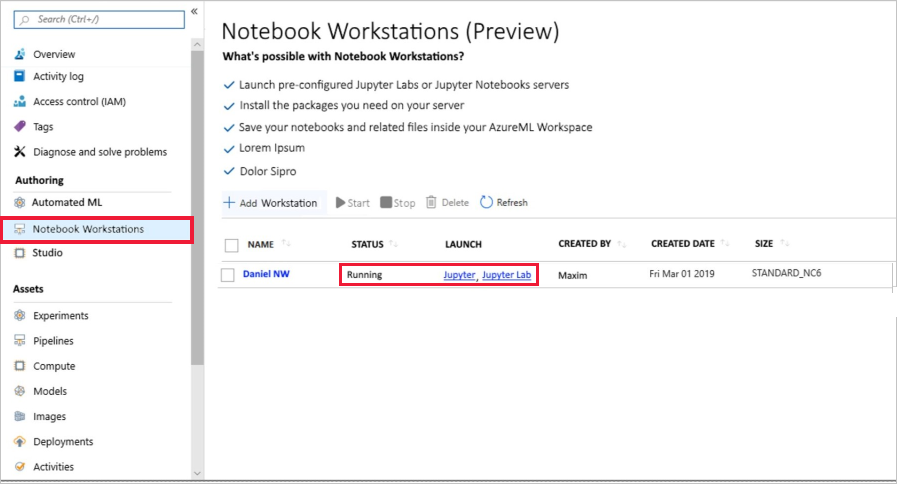

# Quickstart: Use a cloud-based notebook server to get started with Azure Machine Learning

Create a cloud-based notebook server, then use it to run code that logs values in the Azure Machine Learning service [workspace](concept-azure-machine-learning-architecture.md). Your workspace is the foundational block in the cloud that you use to experiment, train, and deploy machine learning models with Machine Learning. 

This quickstart shows how to create a cloud resource in your Azure Machine Learning workspace, configured with the Python environment necessary to run Azure Machine Learning. To use your own environment instead, see [Quickstart: Use your own notebook server to get started with Azure Machine Learning](quickstart-run-local-notebook.md).  
 
In this quickstart, you take the following actions:

* Create a workstation
* Start a Jupyter Notebook server on your workstation
* Open a notebook that contains code to estimate pi and logs errors at each iteration.
* Run the notebook.
* View the logged error values in your workspace.  This example shows how the workspace can help you keep track of information generated in a script. 

If you don’t have an Azure subscription, create a free account before you begin. Try the [free or paid version of Azure Machine Learning service](https://aka.ms/AMLFree) today.

## Prerequisites

1. [Create an Azure Machine Learning workspace](setup-create-workspace.md#portal) if you don't have one.

1. Open your workspace in the [Azure portal](https://portal.azure.com/).  If you're not sure how to locate your workspace in the portal, see how to [find your workspace](how-to-manage-workspace.md#view).

## Create a workstation 

A notebook workstation gives you a cloud platform for Jupyter notebooks that is preconfigured with everything you need to run Azure Machine Learning service. From your workspace, you can create this platform to get started using Jupyter notebooks.

1. On your workspace page in Azure portal, select **Notebook Workstation** on the left.

1. Select **Create Notebooks in an Azure Machine Learning workstation (Preview)**

   

1. The Notebook Workstations section shows a list of all the workstations available in your workspace.  From here you can also manage these workstations.  Select **Add Workstation** to create a notebook workstation.

     

1. On the Add Notebook Workstation section, give your workstation a **Compute name** and select a **Compute type**. Then select **Create**.

    

    > [!NOTE]
    > Your workstation takes approximately two minutes to create. When finished, the status updates to "Running" and links to Jupyter and JupyterLab appear.

## Launch Jupyter web interface

After your workstation is created, use the Notebook Workstations section to launch the Jupyter web interface.

* Select **Jupyter** or **Jupyter Lab** in the **Launch** column for your workstation.

    

    This starts your notebook server and opens the server homepage in a new browser tab.  Your server shows sample notebooks for you to use to get started with Azure Machine Learning service.

### Run the notebook

Run a notebook that estimates pi and logs the error to your workspace.

1. Select **01.run-experiment.ipynb** to open the notebook.

1. The status area tells you to wait until the kernel has started.  The message disappears once the kernel is ready.

    

1. After the kernel has started, run the cells one at a time using **Shift+Enter**. Or select **Cells** > **Run All** to run the entire notebook. When you see an asterisk(__*__) next to a cell, the cell is still running. After the code for that cell finishes, a number appears.  

After you've finished running all of the cells in the notebook, you can view the logged values in your workspace.

## View logged values

1. The output from the `run` cell contains a link back to the Azure portal to view the experiment results in your workspace. 

    

1. Click the **Link to Azure portal** to view information about the run in your workspace.  This link opens your workspace in the Azure portal.

1. The plots of logged values you see were automatically created in the workspace. Whenever you log multiple values with the same name parameter, a plot is automatically generated for you.

   

Because the code to approximate pi uses random values, your plots will show different values.  

## Clean up resources 

[!INCLUDE [aml-delete-resource-group](../../../includes/aml-delete-resource-group.md)]

You can also keep the resource group but delete a single workspace. Display the workspace properties and select **Delete**.

## Next steps

In this quickstart, you completed the following:

* Create a workstation
* Start a Jupyter Notebook server on your workstation
* Open a notebook that contains code to estimate pi and logs errors at each iteration.
* Run the notebook.
* View the logged error values in your workspace.  This example shows how the workspace can help you keep track of information generated in a script. 

For an in-depth workflow experience, follow Machine Learning tutorials to train and deploy a model:  

> [!div class="nextstepaction"]
> [Tutorial: Train an image classification model](tutorial-train-models-with-aml.md)
