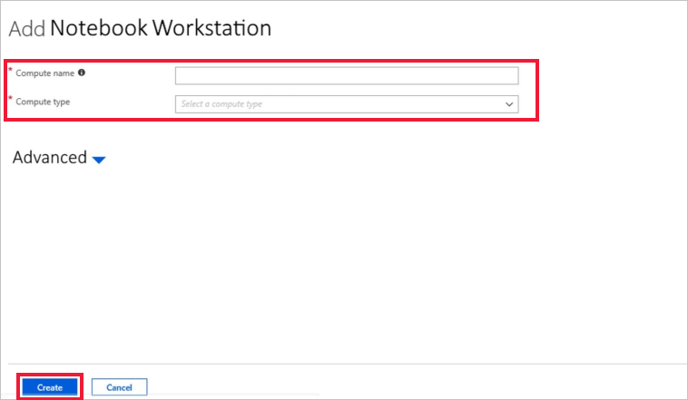
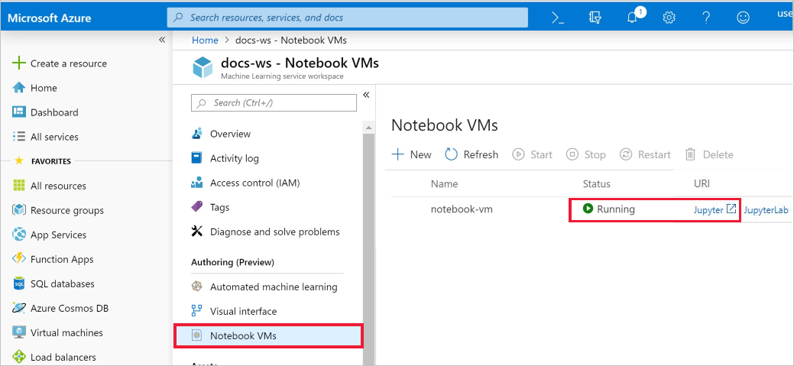
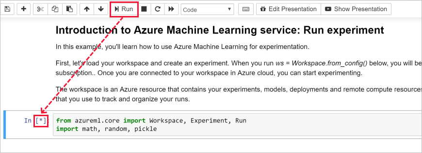
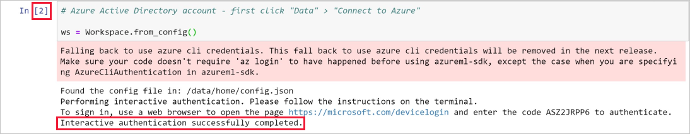
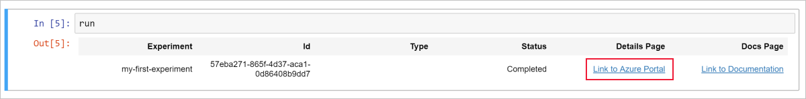
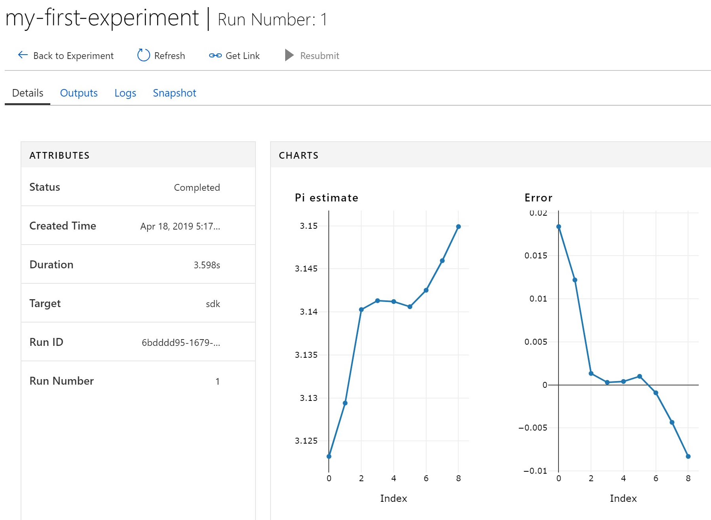
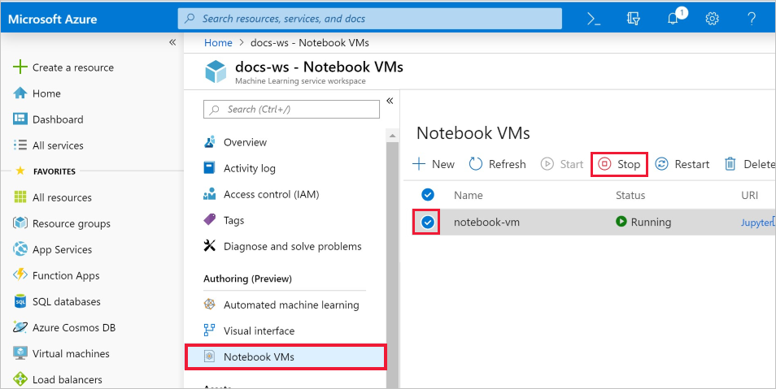

# Quickstart: Use a cloud-based notebook server to get started with Azure Machine Learning

No install required.  Get started with Azure Machine Learning service using a managed notebook server in the cloud. If you want to instead install the SDK into your own Python environment, see [Quickstart: Use your own notebook server to get started with Azure Machine Learning](quickstart-run-local-notebook.md).

This quickstart shows how you can use the [Azure Machine Learning service workspace](concept-azure-machine-learning-architecture.md) to keep track of your machine learning experiments.  You will create a [notebook VM (Preview)](how-to-configure-environment.md#notebookvm), a secure, cloud-based Azure workstation that provides a Jupyter notebook server, JupyterLab, and a fully prepared ML environment. You then run a Python notebook on this VM that log values into the workspace.

In this quickstart, you take the following actions:

* Create a workspace
* Create a notebook VM in your workspace.
* Launch the Jupyter web interface.
* Open a notebook that contains code to estimate pi and logs errors at each iteration.
* Run the notebook.
* View the logged error values in your workspace. This example shows how the workspace can help you keep track of information generated in a script.

If you don’t have an Azure subscription, create a free account before you begin. Try the [free or paid version of Azure Machine Learning service](https://aka.ms/AMLFree) today.

## Create a workspace

If you have an Azure Machine Learning service workspace, skip to the [next section](#create-notebook). Otherwise, create one now.

[!INCLUDE [aml-create-portal](../../../includes/aml-create-in-portal.md)]

## Create a notebook VM

 From your workspace, you create a cloud resource to get started using Jupyter notebooks. This resource gives you a cloud-based platform pre-configured with everything you need to run Azure Machine Learning service.

1. Open your workspace in the [Azure portal](https://portal.azure.com/).  If you're not sure how to locate your workspace in the portal, see how to [find your workspace](how-to-manage-workspace.md#view).

1. On your workspace page in the Azure portal, select **Notebook VMs** on the left.

1. Select **+New** to create a notebook VM.

     

1. Provide a name for your VM. Then select **Create**.

    > [!NOTE]
    > Your Notebook VM name must be between 2 to 16 characters. Valid characters are letters, digits, and the - character.  The name must also be unique across your Azure subscription.

    

1. Wait approximately 4-5 minutes, until the status changes to **Running**.

## Launch Jupyter web interface

After your VM is running, use the **Notebook VMs** section to launch the Jupyter web interface.

1. Select **Jupyter** in the **URI** column for your VM.  

    

    The link starts your notebook server and opens the Jupyter notebook webpage in a new browser tab.  This link will only work for the person who creates the VM.

1. On the Jupyter notebook webpage, the top foldername is your username.  Select this folder.

    > [!TIP]
    > This folder is located on the [storage container](concept-workspace.md#resources) in your workspace rather than on the notebook VM itself.  You can delete the notebook VM and still keep all your work.  When you create a new notebook VM later, it will load  this same folder.

1. The samples foldername includes a version number, for example **samples-1.0.33.1**.  Select the samples folder.

1. Select the **quickstart** folder.

## Run the notebook

Run a notebook that estimates pi and logs the error to your workspace.

1. Select **01.run-experiment.ipynb** to open the notebook.

1. If you see a "Kernel not found" alert, select the kernel **Python 3.6 - AzureML** (approximately mid-way down the list) and set the kernel.

1. Click into the first code cell and select **Run**.

    > [!NOTE]
    > Code cells have brackets before them. If the brackets are empty (__[  ]__), the code has not been run. While the code is running, you see an asterisk(__[*]__). After the code completes, a number **[1]** appears.  The number tells you the order in which the cells ran.
    >
    > Use **Shift-Enter** as a shortcut to run a cell.

    

1. Run the second code cell. If you see instructions to authenticate, copy the code and follow the link to sign in. Once you sign in, your browser will remember this setting.  

    

1. When complete, the cell number __[2]__ appears.  If you had to sign in, you will see a successful authentication status message.   If you didn't have to sign in, you won't see any output for this cell, only the number appears to show that the cell ran successfully.

    

1. Run the rest of the code cells.  As each cell finishes running, you will see its cell number appear. Only the last cell displays any other output.  

    In the largest code cell, you see `run.log`  used in multiple places. Each `run.log` adds its value to your workspace.

## View logged values

1. The output from the `run` cell contains a link back to the Azure portal to view the experiment results in your workspace.

    

1. Click the **Link to Azure portal** to view information about the run in your workspace.  This link opens your workspace in the Azure portal.

1. The plots of logged values you see were automatically created in the workspace. Whenever you log multiple values with the same name parameter, a plot is automatically generated for you. Here is an example:

   

Because the code to approximate pi uses random values, your plots may look different.  

## Clean up resources

### Stop the notebook VM

Stop the notebook VM when you are not using it to reduce cost.  

1. In your workspace, select **Notebook VMs**.

   

1. From the list, select the VM.

1. Select **Stop**.

1. When you're ready to use the server again, select **Start**.

### Delete everything

[!INCLUDE [aml-delete-resource-group](../../../includes/aml-delete-resource-group.md)]

You can also keep the resource group but delete a single workspace. Display the workspace properties and select **Delete**.

## Next steps

In this quickstart, you completed these tasks:

* Create a workspace
* Create a notebook VM.
* Launch the Jupyter web interface.
* Open a notebook that contains code to estimate pi and logs errors at each iteration.
* Run the notebook.
* View the logged error values in your workspace.  This example shows how the workspace can help you keep track of information generated in a script. 

On the Jupyter Notebook webpage, in the **quickstart** folder, open and run the **02.deploy-web-service.ipynb** notebook to learn how to deploy a web service.

Also on the Jupyter Notebook webpage, browse through other notebooks in the samples folder to learn more about Azure Machine Learning service.

For an in-depth workflow experience, follow Machine Learning tutorials to train and deploy a model:  

> [!div class="nextstepaction"]
> [Tutorial: Train an image classification model](tutorial-train-models-with-aml.md)
