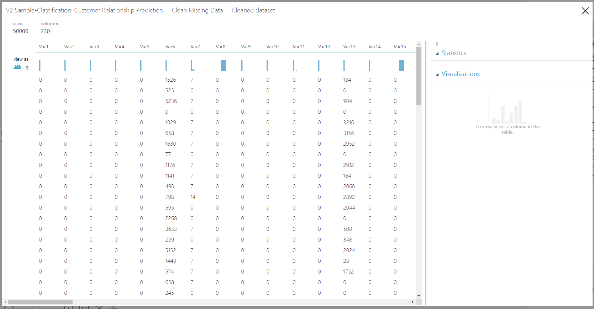
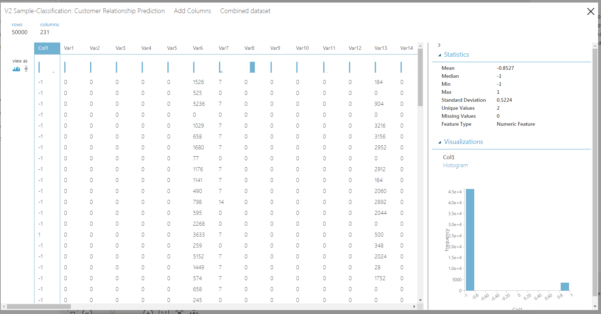

# Sample 5 - Classification: Predict churn

This visual interface sample experiment shows binary classifier prediction of churn, a common task for Customer Relationship Management (CRM).

## Prerequisites

[!INCLUDE [aml-delete-resource-group](../../../includes/aml-ui-prereq.md)]

Select **+ New** at the bottom-left to open the Sample 5 experiment.

## Data

The data used for this experiment is from KDD Cup 2009. The dataset has 50000 rows and 230 feature columns. The task is to predict churn, appetency, and up-selling using these features. Refer to the [KDD Cup 2009 website](https://www.kdd.org/kdd-cup/view/kdd-cup-2009) for further details about the data and the task.

## Experiment summary

The complete experiment graph is shown below.

First we perform some simple data processing.

- The raw dataset contains lots of missing values. We use the **Clean Missing Data** module to replace the missing values with 0. 

- The customer features and the corresponding churn, appetency, and up-selling labels are in different datasets. We used the **Add Columns** module to append the label columns to the feature columns. The first column **Col1** is the label column and the rest of the columns **Var1**, **Var2**, ... are the feature columns. 
 
    

- Split the dataset into train and test sets using the **Split** module.

    Then use the Boosted Decision Tree binary classifier with default parameters to build the prediction models. Build one model per task, that is, to predict up-selling, appetency, and churn.

## Results

Visualize the output of the **Evaluate Model** module to see the performance of the model on the test set. For the upselling task, the ROC curve shows that the model does better than a random model and the area under the curve (AUC) is 0.857. At threshold 0.5, the precision is 0.663, recall is 0.463, and F1 score is 0.545.

 You can move the threshold slider and see the different metrics change for the binary classification task. 

## Clean up resources

[!INCLUDE [aml-ui-cleanup](../../../includes/aml-ui-cleanup.md)]

## Next steps

Explore the other samples available for the visual interface:

- [Sample 1 - Regression: predict automobile price](sample-regression-predict-automobile-price-basic.md)
- [Sample 2 - Regression: Compare algorithms for automobile price prediction](sample-regression-predict-automobile-price-compare-algorithms.md)
- [Sample 3 - Classification: Predict credit risk](sample-classification-predict-credit-risk-basic.md)
- [Sample 4 - Classification: Predict credit risk (cost sensitive)](sample-classification-predict-credit-risk-cost-sensitive.md)
