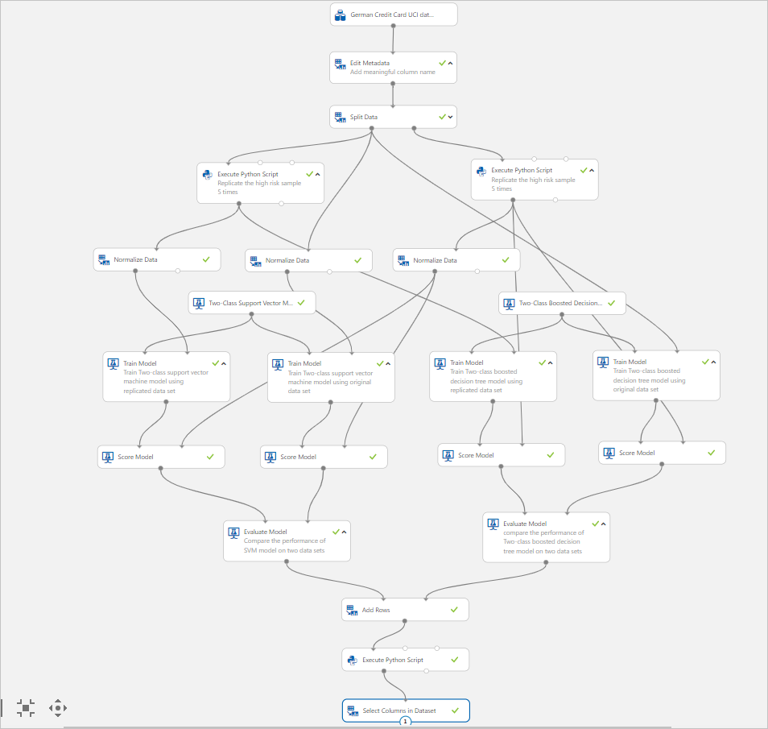
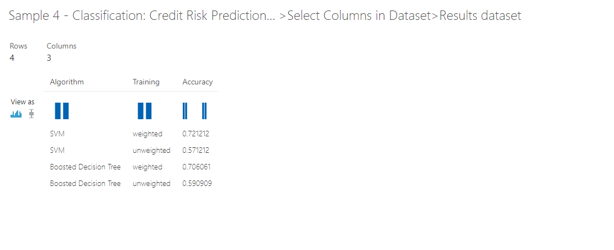

# Sample 4 - Classification: Credit risk prediction (cost sensitive)

This visual interface sample experiment demonstrates how to use a customized Python script to perform cost-sensitive binary classification. The cost of misclassifying the positive samples is five times the cost of misclassifying the negative samples.

This sample predicts credit risk based on information given on a credit application, taking into account the misclassification costs.

In this experiment, we compare two different approaches for generating models to solve this problem:

- Training using the original data set
- Training using a replicated data set

In both approaches, we evaluate the models using the test data set with replication, to ensure that results are aligned with the cost function. We test two classifiers in both approaches: **Two-Class Support Vector Machine** and **Two-Class Boosted Decision Tree**.

## Prerequisites

[!INCLUDE [aml-delete-resource-group](../../../includes/aml-ui-prereq.md)]

Select **+ New** at the bottom-left to open the Sample 4 experiment.


## Related Sample

[[Sample 3 - Classification-Credit Risk Prediction (Basic)](sample-classification-predict-churn.md)](sample-classification-predict-credit-risk-basic.md) provides a basic experiment solving the same problem. Refer to it if you are looking for a simpler sample.

## Data

We use the German Credit Card data set from the UC Irvine repository. This data set contains 1000 samples with 20 features and 1 label. Each sample represents a person. The 20 features include both numerical and categorical features. Check [UCI Site] (https://archive.ics.uci.edu/ml/datasets/Statlog+%28German+Credit+Data%29) for more detail about the dataset. The last column is the label, which denotes the credit risk and has only two possible values: high credit risk = 2, and low credit risk = 1.

## Experiment summary

The cost of misclassifying a low risk example as high is 1, while the cost of misclassifying a high risk example as low is 5. An **Execute Python Script** module is used to account for this misclassification cost.



## Data processing

We started by using the **Metadata Editor** module to add column names to replace the default column names with more meaningful names, obtained from the data set description on the UCI site. The new column names are provided as comma-separated values in the **New column** name field of the **Metadata Editor**.

Next, we generated training and test sets used for developing the risk prediction model. We split the original data set into training and test sets of the same size using the Split module. To create sets of equal size, we set the option, Fraction of rows in the first output, to 0.5.

### Generate the new dataset

Because the cost of underestimating risk is high in the real world, we set the cost of misclassification as follows:

- For high risk cases misclassified as low risk: 5
- For low risk cases misclassified as high risk: 1

To reflect this cost function, we generate a new data set, in which each high risk example is replicated five times, while the number of low risk examples are kept as is. We split the data into training and test data sets before replication to prevent the same row from being in both the training and test sets.

To replicate the high risk data, we put the following Python code into an **Execute Python Script** module:

```
import pandas as pd

def azureml_main(dataframe1 = None, dataframe2 = None):

    df_label_1 = dataframe1[dataframe1.iloc[:, 20] == 1]
    df_label_2 = dataframe1[dataframe1.iloc[:, 20] == 2]

    result = df_label_1.append([df_label_2] * 5, ignore_index=True)
    return result,
```

Both the training and test data sets are replicated using the **Execute Python Script** module.

### Feature engineering

The **Two-class Support Vector Machine** algorithm requires that data be normalized. Therefore, we used the **Normalize Data** module to normalize the ranges of all numeric features, using a `tanh` transformation. A `tanh` transformation converts all numeric features to values within a range of 0-1, while preserving the overall distribution of values.

The **Two-Class Support Vector Machine** module handles string features for us, converting them to categorical features and then to binary features having a value of 0 or 1, so there is no need to normalize these features.

## Model

In this experiment, we applied two classifiers: **Two-Class Support Vector Machine** (SVM) and **Two-Class Boosted Decision Tree**. Because we also used two datasets, we generated a total of four models:

- SVM, trained with original data
- SVM, trained with replicated data
- Boosted Decision Tree, trained with original data
- Boosted Decision Tree, trained with replicated data

We used the standard experimental workflow to create, train, and test the models:

1. Initialize the learning algorithms, using **Two-Class Support Vector Machine** and **Two-Class Boosted Decision Tree**
1. Use **Train Model** to apply the algorithm to the data and create the actual model.
3. Use **Score Model** to produce scores using the test examples.

The following diagram shows a portion of this experiment, in which the original and replicated training sets are used to train two different SVM models. **Train Model** is connected to the training set, and **Score Model** is connected to the test set.


In the evaluation stage of the experiment, we computed the accuracy of each of the four models. For this experiment, we've used **Evaluate Model** to compare examples that have the same misclassification cost.

The **Evaluate Model** module can compute the performance metrics for up to two scored models. Therefore, we used one instance of **Evaluate Model** to evaluate the two SVM models, and another instance of **Evaluate Model** to evaluate the two boosted decision tree models.

Notice that the replicated test data set is used as the input for **Score Model**. In other words, the final accuracy scores include the cost for getting the labels wrong.

## Combine multiple results

The **Evaluate Model** module produces a table with a single row that contains various metrics. To create a single set of accuracy results, we first used Add Rows to combine the results into a single table, and then used the following simple Python script in the **Execute Python Script** module to add the model name and training approach for each row in the table of results.

```
import pandas as pd

def azureml_main(dataframe1 = None, dataframe2 = None):

    new_cols = pd.DataFrame(
            columns=["Algorithm","Training"],
            data=[
                ["SVM", "weighted"],
                ["SVM", "unweighted"],
                ["Boosted Decision Tree","weighted"],
                ["Boosted Decision Tree","unweighted"]
            ])

    result = pd.concat([new_cols, dataframe1], axis=1)
    return result,
```


## Results

To view the final results of the experiment, you can right-click the Visualize output of the last **Select Columns in Dataset** module.



The first column lists the machine learning algorithm used to generate a model.
The second column indicates the type of the training set.
The third column contains the cost-sensitive accuracy value.

From these results, you can see that the best accuracy is provided by the model that was created using **Two-Class Support Vector Machine** and trained on the replicated training data set.

## Clean up resources

[!INCLUDE [aml-ui-cleanup](../../../includes/aml-ui-cleanup.md)]

## Next steps

Explore the other samples available for the visual interface:

- [Sample 1 - Regression: predict automobile price](sample-regression-predict-automobile-price-basic.md)
- [Sample 2 - Regression: Compare algorithms for automobile price prediction](sample-regression-predict-automobile-price-compare-algorithms.md)
- [Sample 3 - Classification: Predict credit risk](sample-classification-predict-credit-risk-basic.md)
- [Sample 5 - Classification: Predict churn](sample-classification-predict-churn.md)
