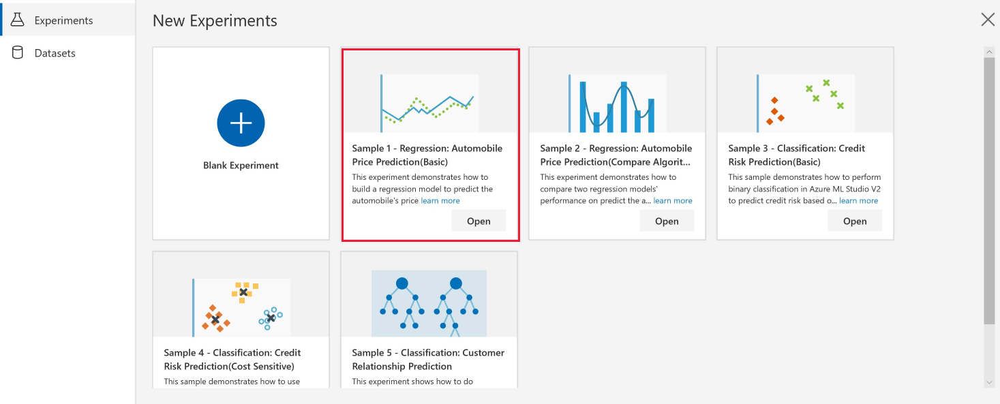

# Sample 1 - Regression: Predict price

This visual interface sample experiment shows how to build a regression model to predict an automobile's price. The process includes training, testing, and evaluating the model by using the **Automobile price data (Raw)** dataset.

## Prerequisites

[!INCLUDE [aml-ui-prereq](../../../includes/aml-ui-prereq.md)]

4. Select the **Open** button for the Sample 1 experiment:

    

## Related sample

[Sample 2 - Regression: Automobile Price Prediction (Compare Algorithms)](sample-regression-predict-automobile-price-compare-algorithms.md) provides a more complicated sample experiment that solves the same problem as this experiment by using two different regression models. It shows how to quickly compare different algorithms in Azure Machine Learning Studio version 2. Check it out if you're looking for a more advanced sample.

## Experiment summary

We use these steps to build the experiment:

1. Get the data.
1. Pre-process the data.
1. Train the model.
1. Test, evaluate, and compare the models.

Here's the complete graph of the experiment:

## Get the data

In this experiment, we use the **Automobile price data (Raw)** dataset, which is from the UCI Machine Learning Repository. The dataset contains 26 columns that contain information about automobiles, including make, model, price, vehicle features (like the number of cylinders), MPG, and an insurance risk score. The goal of this experiment is to predict the price of the car.

## Pre-process the data

The main data preparation tasks include data cleaning, integration, transformation, reduction, and discretization or quantization. In Azure Machine Learning Studio, you can find modules to perform these operations and other data pre-processing tasks in the **Data Transformation** group in the left panel.

We use the **Select Columns in Dataset** module to exclude normalized-losses that have many missing values. We then use **Clean Missing Data** to remove the rows that have missing values. This helps to create a clean set of training data.

## Train the model
Machine learning problems vary. Common machine learning tasks include classification, clustering, regression, and recommender systems, each of which might require a different algorithm. Your choice of algorithm often depends on the requirements of the use case. After you pick an algorithm, you need to tune its parameters to train a more accurate model. You then need to evaluate all models based on metrics like accuracy, intelligibility, and efficiency.

Because the goal of this experiment is to predict automobile prices, and because the label column (price) contains real numbers, a regression model is a good choice. Considering that the number of features is relatively small (less than 100) and these features aren't sparse, the decision boundary is likely to be nonlinear. So we use **Decision Forest Regression** for this experiment.

We use the **Split Data** module to randomly divide the input data so that the training dataset contains 70% of the original data and the testing dataset contains 30% of the original data.

## Test, evaluate, and compare

 We split the dataset and use different datasets to train and test the model to make the evaluation of the model more objective.

After the model is trained, we use the **Score Model** and **Evaluate Model** modules to generate predicted results and evaluate the models.

**Score Model** generates predictions for the test dataset by using the trained model. To check the result, select the output port of **Score Model** and then select **Visualize**.

We then pass the scores to the **Evaluate Model** module to generate evaluation metrics. To check the result, select the output port of the **Evaluate Model** and then select **Visualize**.

## Clean up resources

[!INCLUDE [aml-ui-cleanup](../../../includes/aml-ui-cleanup.md)]

## Next steps

Explore the other samples available for the visual interface:

- [Sample 2 - Regression: Compare algorithms for automobile price prediction](sample-regression-predict-automobile-price-compare-algorithms.md)
- [Sample 3 - Classification: Predict credit risk](sample-classification-predict-credit-risk-basic.md)
- [Sample 4 - Classification: Predict credit risk (cost sensitive)](sample-classification-predict-credit-risk-cost-sensitive.md)
- [Sample 5 - Classification: Predict churn](sample-classification-predict-churn.md)
