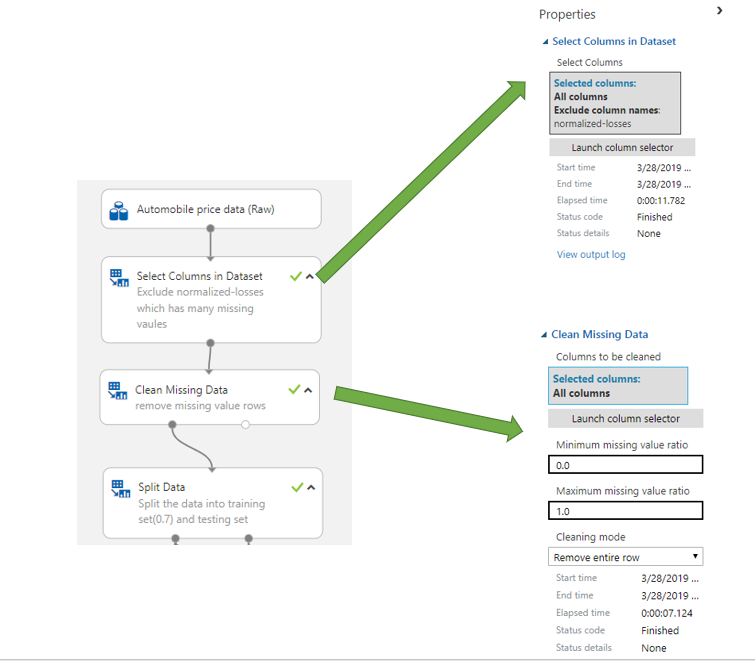
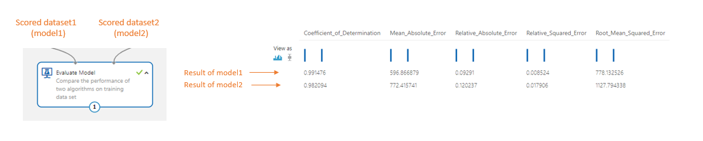

 
# Sample 2 - Regression: predict price and compare algorithms

This visual interface sample experiment demonstrates how to compare two regression models' performance on predict the automobile's price. The process includes training, testing and evaluating the model on the **Automobile price data (Raw)** dataset.

## Prerequisites

[!INCLUDE [aml-delete-resource-group](../../../includes/aml-ui-prereq.md)]

## Related sample

[Sample 1 - Regression: Predict automobile basic](sample-regression-predict-automobile-price-basic.md) provides a simpler experiment solving the same problem using only one regression model. Please refer to it if you are looking for a basic sample on regression problem. 

## Data

In this experiment, we used the **Automobile price data (Raw)** which is sourced from the UCI Machine Learning repository. This dataset contains 26 columns which includes information about automobiles by make, model, price, vehicle features like the number of cylinders, MPG, as well as an insurance risk score. Here the goal is to predict the price of the car.

## Experiment summary

The experiment demonstrates four steps:

1. Get data
1. Data pre-processing
1. Train the model
1. Test and evaluate the model

## Get data

In this experiment, we used the **Automobile price data (Raw)** which is sourced from the UCI Machine Learning repository. This dataset contains 26 columns which includes information about automobiles by make, model, price, vehicle features like the number of cylinders, MPG, as well as an insurance risk score. Here the goal is to predict the price of the car.

## Data pre-precessing

The major data preparation tasks include data cleaning, integration, transformation, reduction, and discretization or quantization. In Azure ML studio, you can find modules to perform these operations and other data pre-processing tasks in the **Data Transformation** group in the left panel.

We use **Select Columns in Dataset** to exclude normalized-losses that has many missing values. Then we use **Clean Missing Data** to remove the rows with missing values. This helps create a clean set of training data.

## Train the model

Machine learning problems vary in nature. Common machine learning tasks include classification, clustering, regression, recommender system, each of which might require a different algorithm. Choosing an algorithm often depends on the requirements of the actual use case. After picking an algorithm, the parameters of the algorithm must be tuned in order to train a more accurate model. All models must then be evaluated based on metrics such as accuracy, intelligibility and efficiency.

In this experiment, the goal is to predict automobile prices. Since the label column (price) contains real numbers, a regression model is a good choice. Considering that the number of features is relatively small (less than 100) and these features are not sparse, the decision boundary is likely to be nonlinear. To compare the performance of different algorithms, we chose two nonlinear algorithms, **Boosted Decision Tree Regression** and **Decision Forest Regression**, to build models. Both algorithms have parameters that you can modify, but we used the default values for this experiment.

Using the Split module, we randomly divide the input data such that the training and testing datasets contains 70% and 30% of the original data respectively.

## Test, evaluate, and compare the model

We used two different sets of randomly chosen data to train and then test the model, as described in Step 3. By splitting the dataset and using different datasets to train and test the model, the result of model evaluation is more objective.

After the model is trained, use the **Score Model** and **Evaluate Model** modules to generate predicted results and to evaluate the models. **Score Model** generates predictions for the test dataset using the trained model. The scores are then passed to **Evaluate Model** to generate evaluation metrics.

In this experiment, we used two instances of **Evaluate Model**, to compare two pairs of models.

First, two algorithms are compared on training dataset.
Second, two algorithms are compared on testing dataset.
From these results, we observe that:

The model built using **Boosted Decision Tree Regression** has lower root mean squared error than the model built on **Decision Forest Regression**.

Both algorithms have lower error on the training dataset than on the unseen testing dataset.

## Clean up resources

[!INCLUDE [aml-ui-cleanup](../../../includes/aml-ui-cleanup.md)]

## Next steps

Explore the other samples available for the visual interface:

- [Sample 1 - Regression: predict automobile price](sample-regression-predict-automobile-price-basic.md)
- [Sample 3 - Classification: Predict credit risk](sample-classification-predict-credit-risk-basic.md)
- [Sample 4 - Classification: Predict credit risk (cost sensitive)](sample-classification-predict-credit-risk-cost-sensitive.md)
- [Sample 5 - Classification: Predict churn](sample-classification-predict-churn.md)