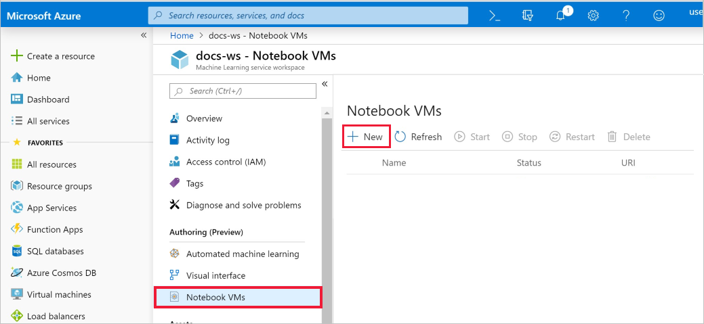
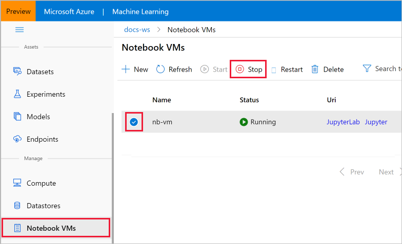

# Tutorial: Set up environment and workspace

In this tutorial, you complete the end-to-end steps to get started with the Azure Machine Learning Python SDK running in Jupyter notebooks. This tutorial is **part one of a two-part tutorial series**, and covers Python environment setup and configuration, as well as creating a workspace to manage your experiments and machine learning models. [**Part two**](tutorial-1st-experiment-sdk-train.md) builds on this to train multiple machine learning models and introduce the model management process using both the Azure portal and the SDK.

In this tutorial, you:

> [!div class="checklist"]
> * Create a machine learning Workspace to use in the next tutorial.
> * Create a cloud-based Jupyter notebook VM with Azure Machine Learning Python SDK installed and pre-configured.

## Prerequisites

The only prerequisite for this tutorial is an Azure subscription. If you don’t have an Azure subscription, create a free account before you begin. Try the [free or paid version of Azure Machine Learning service](https://aka.ms/AMLFree) today.

## Create a workspace

A workspace is a foundational resource in the cloud that you use to experiment, train, and deploy machine learning models. It ties your Azure subscription and resource group to an easily consumed object in the SDK. If you already have an Azure Machine Learning service workspace, skip to the [next section](#azure). Otherwise, create one now.

[!INCLUDE [aml-create-portal](../../../includes/aml-create-in-portal.md)]

## Create a cloud notebook server

This example uses the cloud notebook server in your workspace for an install-free and pre-configured experience. Use [your own environment](how-to-configure-environment.md#local) if you prefer to have control over your environment, packages and dependencies.

From your workspace, you create a cloud resource to get started using Jupyter notebooks. This resource is a cloud-based Linux virtual machine pre-configured with everything you need to run Azure Machine Learning service.

1. Open your workspace in the [Azure portal](https://portal.azure.com/).  If you're not sure how to locate your workspace in the portal, see how to [find your workspace](how-to-manage-workspace.md#view).

1. On your workspace page in the Azure portal, select **Notebook VMs** on the left.

1. Select **+New** to create a notebook VM.

     

1. Provide a name for your VM. Then select **Create**.

    > [!NOTE]
    > Your Notebook VM name must be between 2 to 16 characters. Valid characters are letters, digits, and the - character.  The name must also be unique across your Azure subscription.

1. Wait until the status changes to **Running**.

### Launch Jupyter web interface

After your VM is running, use the **Notebook VMs** section to launch the Jupyter web interface.

1. Select **Jupyter** in the **URI** column for your VM.

    

    The link starts your notebook server and opens the Jupyter notebook webpage in a new browser tab.  This link will only work for the person who creates the VM. Each user of the workspace must create their own VM.

1. On the Jupyter notebook webpage, the top foldername is your username.  Select this folder.

    > [!TIP]
    > This folder is located on the [storage container](concept-workspace.md#resources) in your workspace rather than on the notebook VM itself.  You can delete the notebook VM and still keep all your work.  When you create a new notebook VM later, it will load this same folder. If you share your workspace with others, they will see your folder and you will see theirs.

1. Open the `samples-*` subdirectory, then open `tutorials/tutorial-1st-experiment-sdk-train.ipynb` to run **part two** of the tutorial.

##  Clean up resources

Do not complete this section if you plan on continuing to **part 2** of the tutorial.

### Stop the notebook VM

If you used a cloud notebook server, stop the VM when you are not using it to reduce cost.

1. In your workspace, select **Notebook VMs**.

   

1. From the list, select the VM.

1. Select **Stop**.

1. When you're ready to use the server again, select **Start**.

### Delete everything

[!INCLUDE [aml-delete-resource-group](../../../includes/aml-delete-resource-group.md)]

You can also keep the resource group but delete a single workspace. Display the workspace properties and select **Delete**.

## Next steps

In this tutorial, you completed these tasks:

* Created an Azure Machine Learning service workspace.
* Created and configured a cloud notebook server in your workspace.

Continue with **part 2** of this tutorial to train a simple machine learning model.

> [!div class="nextstepaction"]
> [Tutorial: Train your first model](tutorial-1st-experiment-sdk-train.md)
