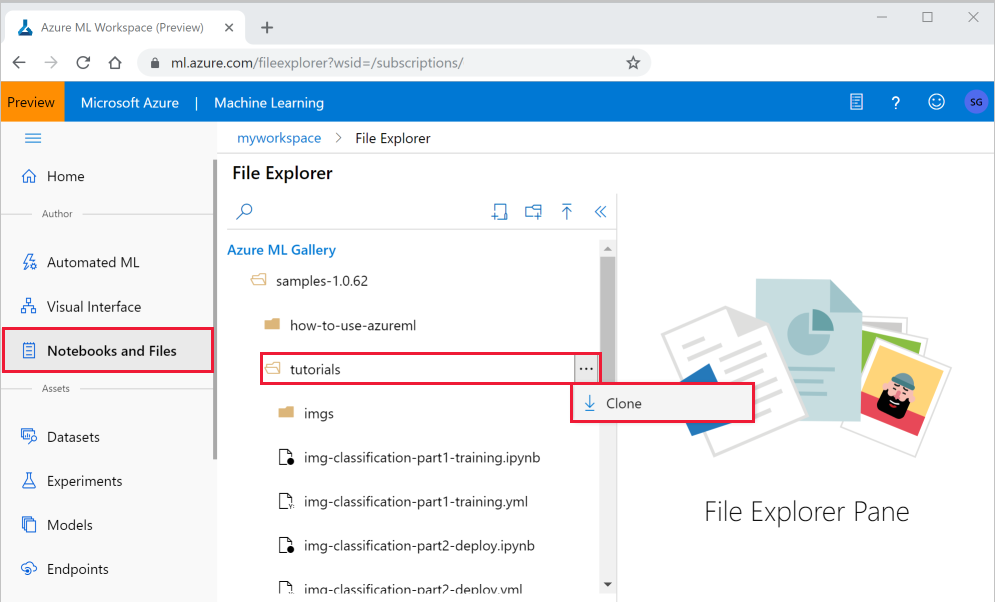
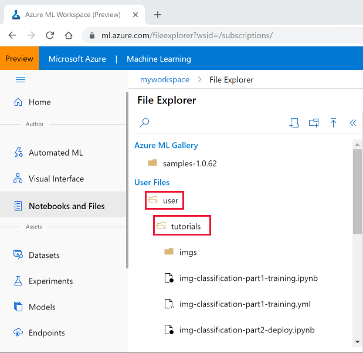
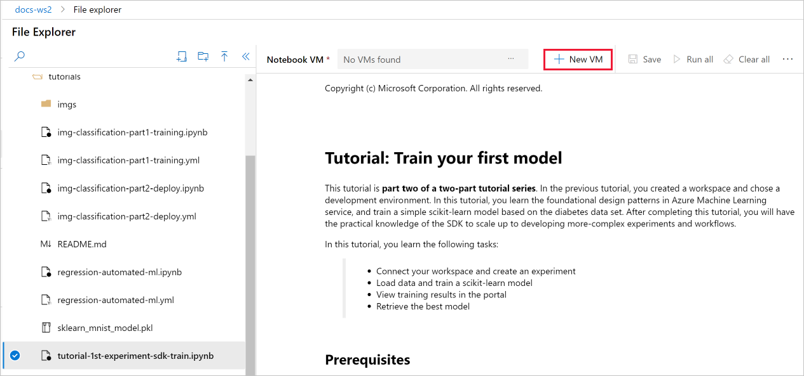

# Tutorial: Get started creating your first ML experiment with the Python SDK

In this tutorial, you complete the end-to-end steps to get started with the Azure Machine Learning Python SDK running in Jupyter notebooks. This tutorial is **part one of a two-part tutorial series**, and covers Python environment setup and configuration, as well as creating a workspace to manage your experiments and machine learning models. [**Part two**](tutorial-1st-experiment-sdk-train.md) builds on this to train multiple machine learning models and introduce the model management process using both the Azure portal and the SDK.

In this tutorial, you:

> [!div class="checklist"]
> * Create an [Azure Machine Learning Workspace](concept-workspace.md) to use in the next tutorial.
> * Clone the tutorials notebook to your folder in the workspace.
> * Create a cloud-based Jupyter notebook VM with Azure Machine Learning Python SDK installed and pre-configured.

If you don’t have an Azure subscription, create a free account before you begin. Try the [free or paid version of Azure Machine Learning](https://aka.ms/AMLFree) today.

## Create a workspace

An Azure Machine Learning workspace is a foundational resource in the cloud that you use to experiment, train, and deploy machine learning models. It ties your Azure subscription and resource group to an easily consumed object in the service. 

You create a workspace via the Azure portal, a web-based console for managing your Azure resources. 

[!INCLUDE [aml-create-portal](../../../includes/aml-create-in-portal.md)]

>[!IMPORTANT] 
> Take note of your **workspace** and **subscription**. You'll need these to ensure you create your experiment in the right place. 

## Clone a notebook folder

This example uses the cloud notebook server in your workspace for an install-free and pre-configured experience. Use [your own environment](how-to-configure-environment.md#local) if you prefer to have control over your environment, packages and dependencies.

You complete the following experiment set-up and run steps in the workspace landing page (preview), a consolidated interface that includes machine learning tools to perform data science scenarios for data science practitioners of all skill levels.

1. Sign in to the [workspace landing page](https://ml.azure.com/).

1. Select your subscription and the workspace you created.

1. Select **Notebooks and Files** on the left.

1. Open the **samples** folder.

1. Select the **"..."** at the right of the **tutorials** folder and then select **Clone**.

    

1. There is a folder displayed for each user who accesses the workspace.  Select your folder to clone the **tutorial**  folder there.

## <a name="open">Select a VM to run the notebook

1. Under **User Files** open your folder and then open the cloned **tutorials** folder.

    

    > [!IMPORTANT]
    > You can view notebooks in the **samples** folder but you cannot run a notebook from there.  In order to run a notebook, make sure you open the cloned version of the notebook in the **User Files** section.
    
1. Select the **tutorial-1st-experiment-sdk-train.ipynb** file in your **tutorials** folder.

1. On the top bar, select a Notebook VM to use to run the notebook. These VMs are pre-configured with everything you need to run Azure Machine Learning. You can select a VM created by any user of your workspace. 

1. If no VMs are found, select **+ New VM** to create the VM.

    

    1. When you create a VM, provide a name.  The name must be between 2 to 16 characters. Valid characters are letters, digits, and the - character, and must also be unique across your Azure subscription.

    1. Then select **Create**. It can take approximately 5 minutes to set up your VM.

1. Once the VM is available it will be displayed in the top toolbar.  You can now run the notebook either by using **Run all** in the toolbar, or by using **Shift+Enter** in the code cells of the notebook.

## Next steps

In this tutorial, you completed these tasks:

* Created an Azure Machine Learning workspace.
* Created and configured a cloud notebook server in your workspace.

In **part two** of the tutorial you run the code in `tutorial-1st-experiment-sdk-train.ipynb` to train a machine learning model. 

> [!div class="nextstepaction"]
> [Tutorial: Train your first model](tutorial-1st-experiment-sdk-train.md)

> [!IMPORTANT]
> If you do not plan on following part 2 of this tutorial or any other tutorials, you should [stop the cloud notebook server VM](tutorial-1st-experiment-sdk-train.md#clean-up-resources) when you are not using it to reduce cost.

