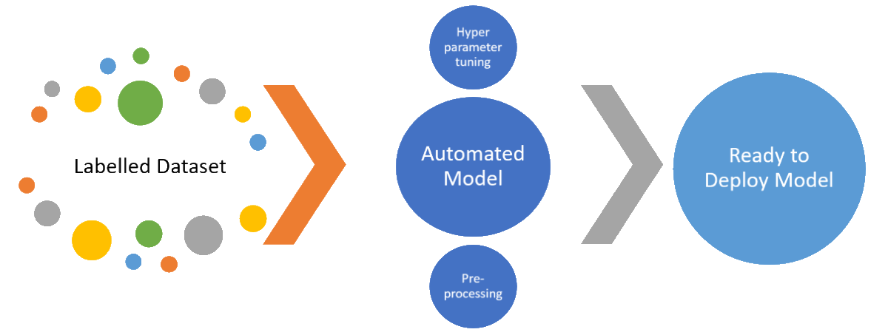
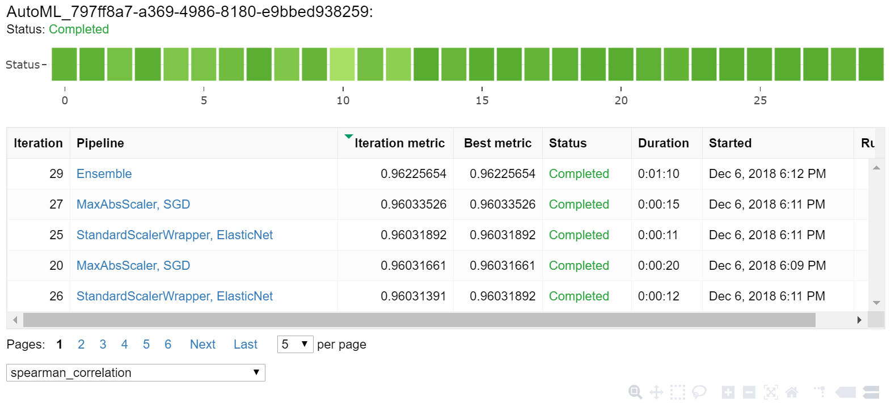
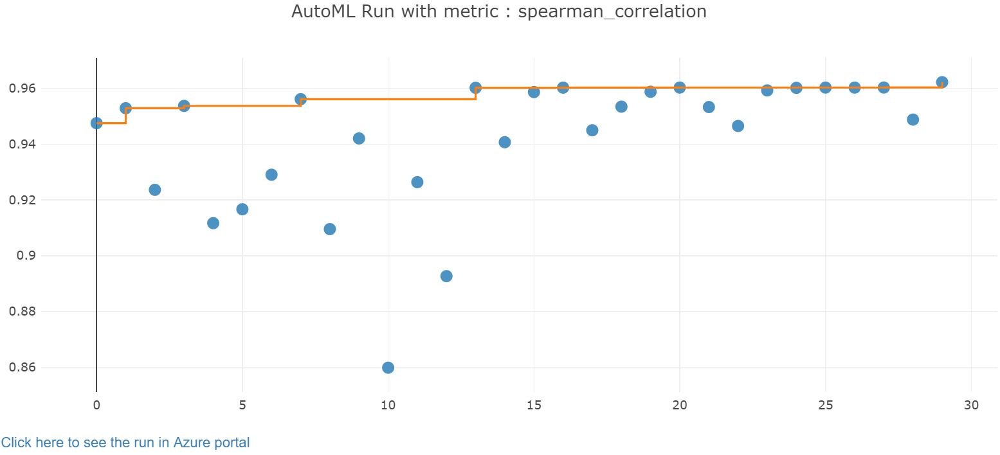
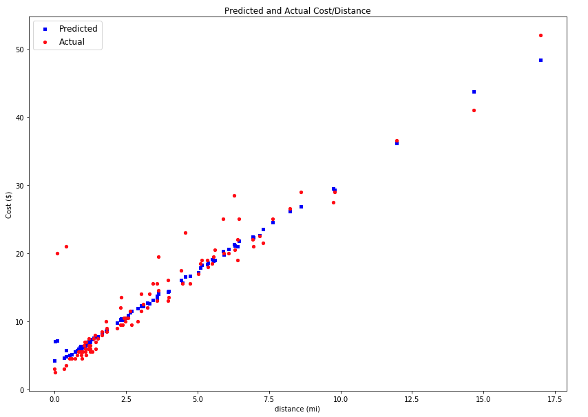

# Tutorial: Use automated machine learning to build your regression model

This tutorial is **part two of a two-part tutorial series**. In the previous tutorial, you [prepared the NYC taxi data for regression modeling](tutorial-data-prep.md).

Now you're ready to start building your model with Azure Machine Learning service. In this part of the tutorial, you use the prepared data and automatically generate a regression model to predict taxi fare prices. By using the automated machine learning capabilities of the service, you define your machine learning goals and constraints. You launch the automated machine learning process. Then allow the algorithm selection and hyperparameter tuning to happen for you. The automated machine learning technique iterates over many combinations of algorithms and hyperparameters until it finds the best model based on your criterion.



In this tutorial, you learn the following tasks:

> [!div class="checklist"]
> * Set up a Python environment and import the SDK packages.
> * Configure an Azure Machine Learning service workspace.
> * Autotrain a regression model.
> * Run the model locally with custom parameters.
> * Explore the results.

If you don’t have an Azure subscription, create a free account before you begin. Try the [free or paid version of Azure Machine Learning service](https://aka.ms/AMLFree) today.

>[!NOTE]
> Code in this article was tested with Azure Machine Learning SDK version 1.0.39.

## Prerequisites

Skip to [Set up your development environment](#start) to read through the notebook steps, or use the instructions below to get the notebook and run it on Azure Notebooks or your own notebook server. To run the notebook you will need:

* [Run the data preparation tutorial](tutorial-data-prep.md).
* A Python 3.6 notebook server with the following installed:
    * The Azure Machine Learning SDK for Python with `automl` and `notebooks` extras
    * `matplotlib`
* The tutorial notebook
* A machine learning workspace
* The configuration file for the workspace in the same directory as the notebook

Get all these prerequisites from either of the sections below.

* Use a [cloud notebook server in your workspace](#azure) 
* Use [your own notebook server](#server)

### <a name="azure"></a>Use a cloud notebook server in your workspace

It's easy to get started with your own cloud-based notebook server. The [Azure Machine Learning SDK for Python](https://aka.ms/aml-sdk) is already installed and configured for you once you create this cloud resource.

[!INCLUDE [aml-azure-notebooks](../../../includes/aml-azure-notebooks.md)]

* After you launch the notebook webpage, run the **tutorials/regression-part2-automated-ml.ipynb** notebook.

### <a name="server"></a>Use your own Jupyter notebook server

Use these steps to create a local Jupyter Notebook server on your computer.  Make sure that you install `matplotlib` and the `automl` and `notebooks` extras in your environment.

[!INCLUDE [aml-your-server](../../../includes/aml-your-server.md)]

After you complete the steps, run the **tutorials/regression-part2-automated-ml.ipynb** notebook.

## <a name="start"></a>Set up your development environment

All the setup for your development work can be accomplished in a Python notebook. Setup includes the following actions:

* Install the SDK
* Import Python packages
* Configure your workspace

### Install and import packages

If you are following the tutorial in your own Python environment, use the following to install necessary packages.

```shell
pip install azureml-sdk[automl,notebooks] matplotlib
```

Import the Python packages you need in this tutorial:

```python
import azureml.core
import pandas as pd
from azureml.core.workspace import Workspace
import logging
import os
```

### Configure workspace

Create a workspace object from the existing workspace. A [Workspace](https://docs.microsoft.com/python/api/azureml-core/azureml.core.workspace.workspace?view=azure-ml-py) is a class that accepts your Azure subscription and resource information. It also creates a cloud resource to monitor and track your model runs.

`Workspace.from_config()` reads the file **config.json** and loads the details into an object named `ws`.  `ws` is used throughout the rest of the code in this tutorial.

After you have a workspace object, specify a name for the experiment. Create and register a local directory with the workspace. The history of all runs is recorded under the specified experiment and in the [Azure portal](https://portal.azure.com).


```python
ws = Workspace.from_config()
# choose a name for the run history container in the workspace
experiment_name = 'automated-ml-regression'
# project folder
project_folder = './automated-ml-regression'

output = {}
output['SDK version'] = azureml.core.VERSION
output['Subscription ID'] = ws.subscription_id
output['Workspace'] = ws.name
output['Resource Group'] = ws.resource_group
output['Location'] = ws.location
output['Project Directory'] = project_folder
pd.set_option('display.max_colwidth', -1)
pd.DataFrame(data=output, index=['']).T
```

## Explore data

Use the data flow object created in the previous tutorial. To summarize, part 1 of this tutorial cleaned the NYC Taxi data so it could be used in a machine learning model. Now, you use various features from the data set and allow an automated model to build relationships between the features and the price of a taxi trip. Open and run the data flow and review the results:


```python
import azureml.dataprep as dprep

file_path = os.path.join(os.getcwd(), "dflows.dprep")

dflow_prepared = dprep.Dataflow.open(file_path)
dflow_prepared.get_profile()
```

<table border="1" class="dataframe">
  <thead>
    <tr style="text-align: right;">
      <th></th>
      <th>Type</th>
      <th>Min</th>
      <th>Max</th>
      <th>Count</th>
      <th>Missing count</th>
      <th>Not missing count</th>
      <th>Percent missing</th>
      <th>Error count</th>
      <th>Empty count</th>
      <th>0.1% quantile</th>
      <th>1% quantile</th>
      <th>5% quantile</th>
      <th>25% quantile</th>
      <th>50% quantile</th>
      <th>75% quantile</th>
      <th>95% quantile</th>
      <th>99% quantile</th>
      <th>99.9% quantile</th>
      <th>Mean</th>
      <th>Standard deviation</th>
      <th>Variance</th>
      <th>Skewness</th>
      <th>Kurtosis</th>
    </tr>
  </thead>
  <tbody>
    <tr>
      <th>vendor</th>
      <td>FieldType.STRING</td>
      <td>1</td>
      <td>VTS</td>
      <td>6148.0</td>
      <td>0.0</td>
      <td>6148.0</td>
      <td>0.0</td>
      <td>0.0</td>
      <td>0.0</td>
      <td></td>
      <td></td>
      <td></td>
      <td></td>
      <td></td>
      <td></td>
      <td></td>
      <td></td>
      <td></td>
      <td></td>
      <td></td>
      <td></td>
      <td></td>
      <td></td>
    </tr>
    <tr>
      <th>pickup_weekday</th>
      <td>FieldType.STRING</td>
      <td>Friday</td>
      <td>Wednesday</td>
      <td>6148.0</td>
      <td>0.0</td>
      <td>6148.0</td>
      <td>0.0</td>
      <td>0.0</td>
      <td>0.0</td>
      <td></td>
      <td></td>
      <td></td>
      <td></td>
      <td></td>
      <td></td>
      <td></td>
      <td></td>
      <td></td>
      <td></td>
      <td></td>
      <td></td>
      <td></td>
      <td></td>
    </tr>
    <tr>
      <th>pickup_hour</th>
      <td>FieldType.DECIMAL</td>
      <td>0</td>
      <td>23</td>
      <td>6148.0</td>
      <td>0.0</td>
      <td>6148.0</td>
      <td>0.0</td>
      <td>0.0</td>
      <td>0.0</td>
      <td>0</td>
      <td>2.90047</td>
      <td>2.69355</td>
      <td>9.72889</td>
      <td>16</td>
      <td>19.3713</td>
      <td>22.6974</td>
      <td>23</td>
      <td>23</td>
      <td>14.2731</td>
      <td>6.59242</td>
      <td>43.46</td>
      <td>-0.693723</td>
      <td>-0.570403</td>
    </tr>
    <tr>
      <th>pickup_minute</th>
      <td>FieldType.DECIMAL</td>
      <td>0</td>
      <td>59</td>
      <td>6148.0</td>
      <td>0.0</td>
      <td>6148.0</td>
      <td>0.0</td>
      <td>0.0</td>
      <td>0.0</td>
      <td>0</td>
      <td>4.99701</td>
      <td>4.95833</td>
      <td>14.1528</td>
      <td>29.3832</td>
      <td>44.6825</td>
      <td>56.4444</td>
      <td>58.9909</td>
      <td>59</td>
      <td>29.427</td>
      <td>17.4333</td>
      <td>303.921</td>
      <td>0.0120999</td>
      <td>-1.20981</td>
    </tr>
    <tr>
      <th>pickup_second</th>
      <td>FieldType.DECIMAL</td>
      <td>0</td>
      <td>59</td>
      <td>6148.0</td>
      <td>0.0</td>
      <td>6148.0</td>
      <td>0.0</td>
      <td>0.0</td>
      <td>0.0</td>
      <td>0</td>
      <td>5.28131</td>
      <td>5</td>
      <td>14.7832</td>
      <td>29.9293</td>
      <td>44.725</td>
      <td>56.7573</td>
      <td>59</td>
      <td>59</td>
      <td>29.7443</td>
      <td>17.3595</td>
      <td>301.351</td>
      <td>-0.0252399</td>
      <td>-1.19616</td>
    </tr>
    <tr>
      <th>dropoff_weekday</th>
      <td>FieldType.STRING</td>
      <td>Friday</td>
      <td>Wednesday</td>
      <td>6148.0</td>
      <td>0.0</td>
      <td>6148.0</td>
      <td>0.0</td>
      <td>0.0</td>
      <td>0.0</td>
      <td></td>
      <td></td>
      <td></td>
      <td></td>
      <td></td>
      <td></td>
      <td></td>
      <td></td>
      <td></td>
      <td></td>
      <td></td>
      <td></td>
      <td></td>
      <td></td>
    </tr>
    <tr>
      <th>dropoff_hour</th>
      <td>FieldType.DECIMAL</td>
      <td>0</td>
      <td>23</td>
      <td>6148.0</td>
      <td>0.0</td>
      <td>6148.0</td>
      <td>0.0</td>
      <td>0.0</td>
      <td>0.0</td>
      <td>0</td>
      <td>2.57153</td>
      <td>2</td>
      <td>9.58795</td>
      <td>15.9994</td>
      <td>19.6184</td>
      <td>22.8317</td>
      <td>23</td>
      <td>23</td>
      <td>14.2105</td>
      <td>6.71093</td>
      <td>45.0365</td>
      <td>-0.687292</td>
      <td>-0.61951</td>
    </tr>
    <tr>
      <th>dropoff_minute</th>
      <td>FieldType.DECIMAL</td>
      <td>0</td>
      <td>59</td>
      <td>6148.0</td>
      <td>0.0</td>
      <td>6148.0</td>
      <td>0.0</td>
      <td>0.0</td>
      <td>0.0</td>
      <td>0</td>
      <td>5.44383</td>
      <td>4.84694</td>
      <td>14.1036</td>
      <td>28.8365</td>
      <td>44.3102</td>
      <td>56.6892</td>
      <td>59</td>
      <td>59</td>
      <td>29.2907</td>
      <td>17.4108</td>
      <td>303.136</td>
      <td>0.0222514</td>
      <td>-1.2181</td>
    </tr>
    <tr>
      <th>dropoff_second</th>
      <td>FieldType.DECIMAL</td>
      <td>0</td>
      <td>59</td>
      <td>6148.0</td>
      <td>0.0</td>
      <td>6148.0</td>
      <td>0.0</td>
      <td>0.0</td>
      <td>0.0</td>
      <td>0</td>
      <td>5.07801</td>
      <td>5</td>
      <td>14.5751</td>
      <td>29.5972</td>
      <td>45.4649</td>
      <td>56.2729</td>
      <td>59</td>
      <td>59</td>
      <td>29.772</td>
      <td>17.5337</td>
      <td>307.429</td>
      <td>-0.0212575</td>
      <td>-1.226</td>
    </tr>
    <tr>
      <th>store_forward</th>
      <td>FieldType.STRING</td>
      <td>N</td>
      <td>Y</td>
      <td>6148.0</td>
      <td>0.0</td>
      <td>6148.0</td>
      <td>0.0</td>
      <td>0.0</td>
      <td>0.0</td>
      <td></td>
      <td></td>
      <td></td>
      <td></td>
      <td></td>
      <td></td>
      <td></td>
      <td></td>
      <td></td>
      <td></td>
      <td></td>
      <td></td>
      <td></td>
      <td></td>
    </tr>
    <tr>
      <th>pickup_longitude</th>
      <td>FieldType.DECIMAL</td>
      <td>-74.0781</td>
      <td>-73.7459</td>
      <td>6148.0</td>
      <td>0.0</td>
      <td>6148.0</td>
      <td>0.0</td>
      <td>0.0</td>
      <td>0.0</td>
      <td>-74.0578</td>
      <td>-73.9639</td>
      <td>-73.9656</td>
      <td>-73.9508</td>
      <td>-73.9255</td>
      <td>-73.8529</td>
      <td>-73.8302</td>
      <td>-73.8238</td>
      <td>-73.7697</td>
      <td>-73.9123</td>
      <td>0.0503757</td>
      <td>0.00253771</td>
      <td>0.352172</td>
      <td>-0.923743</td>
    </tr>
    <tr>
      <th>pickup_latitude</th>
      <td>FieldType.DECIMAL</td>
      <td>40.5755</td>
      <td>40.8799</td>
      <td>6148.0</td>
      <td>0.0</td>
      <td>6148.0</td>
      <td>0.0</td>
      <td>0.0</td>
      <td>0.0</td>
      <td>40.632</td>
      <td>40.7117</td>
      <td>40.7115</td>
      <td>40.7213</td>
      <td>40.7565</td>
      <td>40.8058</td>
      <td>40.8478</td>
      <td>40.8676</td>
      <td>40.8778</td>
      <td>40.7649</td>
      <td>0.0494674</td>
      <td>0.00244702</td>
      <td>0.205972</td>
      <td>-0.777945</td>
    </tr>
    <tr>
      <th>dropoff_longitude</th>
      <td>FieldType.DECIMAL</td>
      <td>-74.0857</td>
      <td>-73.7209</td>
      <td>6148.0</td>
      <td>0.0</td>
      <td>6148.0</td>
      <td>0.0</td>
      <td>0.0</td>
      <td>0.0</td>
      <td>-74.0775</td>
      <td>-73.9875</td>
      <td>-73.9882</td>
      <td>-73.9638</td>
      <td>-73.935</td>
      <td>-73.8755</td>
      <td>-73.8125</td>
      <td>-73.7759</td>
      <td>-73.7327</td>
      <td>-73.9202</td>
      <td>0.0584627</td>
      <td>0.00341789</td>
      <td>0.623622</td>
      <td>-0.262603</td>
    </tr>
    <tr>
      <th>dropoff_latitude</th>
      <td>FieldType.DECIMAL</td>
      <td>40.5835</td>
      <td>40.8797</td>
      <td>6148.0</td>
      <td>0.0</td>
      <td>6148.0</td>
      <td>0.0</td>
      <td>0.0</td>
      <td>0.0</td>
      <td>40.5973</td>
      <td>40.6928</td>
      <td>40.6911</td>
      <td>40.7226</td>
      <td>40.7567</td>
      <td>40.7918</td>
      <td>40.8495</td>
      <td>40.868</td>
      <td>40.8787</td>
      <td>40.7583</td>
      <td>0.0517399</td>
      <td>0.00267701</td>
      <td>0.0390404</td>
      <td>-0.203525</td>
    </tr>
    <tr>
      <th>passengers</th>
      <td>FieldType.DECIMAL</td>
      <td>1</td>
      <td>6</td>
      <td>6148.0</td>
      <td>0.0</td>
      <td>6148.0</td>
      <td>0.0</td>
      <td>0.0</td>
      <td>0.0</td>
      <td>1</td>
      <td>1</td>
      <td>1</td>
      <td>1</td>
      <td>1</td>
      <td>5</td>
      <td>5</td>
      <td>6</td>
      <td>6</td>
      <td>2.39249</td>
      <td>1.83197</td>
      <td>3.3561</td>
      <td>0.763144</td>
      <td>-1.23467</td>
    </tr>
    <tr>
      <th>distance</th>
      <td>FieldType.DECIMAL</td>
      <td>0.01</td>
      <td>32.34</td>
      <td>6148.0</td>
      <td>0.0</td>
      <td>6148.0</td>
      <td>0.0</td>
      <td>0.0</td>
      <td>0.0</td>
      <td>0.0108744</td>
      <td>0.743898</td>
      <td>0.738194</td>
      <td>1.243</td>
      <td>2.40168</td>
      <td>4.74478</td>
      <td>10.5136</td>
      <td>14.9011</td>
      <td>21.8035</td>
      <td>3.5447</td>
      <td>3.2943</td>
      <td>10.8524</td>
      <td>1.91556</td>
      <td>4.99898</td>
    </tr>
    <tr>
      <th>cost</th>
      <td>FieldType.DECIMAL</td>
      <td>0.1</td>
      <td>88</td>
      <td>6148.0</td>
      <td>0.0</td>
      <td>6148.0</td>
      <td>0.0</td>
      <td>0.0</td>
      <td>0.0</td>
      <td>2.33837</td>
      <td>5.00491</td>
      <td>5</td>
      <td>6.93129</td>
      <td>10.524</td>
      <td>17.4811</td>
      <td>33.2343</td>
      <td>50.0093</td>
      <td>63.1753</td>
      <td>13.6843</td>
      <td>9.66571</td>
      <td>93.426</td>
      <td>1.78518</td>
      <td>4.13972</td>
    </tr>
  </tbody>
</table>

You prepare the data for the experiment by adding columns to `dflow_x` to be features for our model creation. You define `dflow_y` to be our prediction value, **cost**:

```python
dflow_X = dflow_prepared.keep_columns(['pickup_weekday','pickup_hour', 'distance','passengers', 'vendor'])
dflow_y = dflow_prepared.keep_columns('cost')
```

### Split the data into train and test sets

Now you split the data into training and test sets by using the `train_test_split` function in the `sklearn` library. This function segregates the data into the x, **features**, dataset for model training and the y, **values to predict**, dataset for testing. The `test_size` parameter determines the percentage of data to allocate to testing. The `random_state` parameter sets a seed to the random generator, so that your train-test splits are always deterministic:

```python
from sklearn.model_selection import train_test_split

x_df = dflow_X.to_pandas_dataframe()
y_df = dflow_y.to_pandas_dataframe()

x_train, x_test, y_train, y_test = train_test_split(x_df, y_df, test_size=0.2, random_state=223)
# flatten y_train to 1d array
y_train.values.flatten()
```

The purpose of this step is to have data points to test the finished model that haven't been used to train the model, in order to measure true accuracy. In other words, a well-trained model should be able to accurately make predictions from data it hasn't already seen. You now have the necessary packages and data ready for autotraining your model.

## Automatically train a model

To automatically train a model, take the following steps:
1. Define settings for the experiment run. Attach your training data to the configuration, and modify settings that control the training process.
1. Submit the experiment for model tuning. After submitting the experiment, the process iterates through different machine learning algorithms and hyperparameter settings, adhering to your defined constraints. It chooses the best-fit model by optimizing an accuracy metric.

### Define settings for autogeneration and tuning

Define the experiment parameter and model settings for autogeneration and tuning. View the full list of [settings](how-to-configure-auto-train.md). Submitting the experiment with these default settings will take approximately 10-15 min, but if you want a shorter run time, reduce either `iterations` or `iteration_timeout_minutes`.


|Property| Value in this tutorial |Description|
|----|----|---|
|**iteration_timeout_minutes**|10|Time limit in minutes for each iteration. Reduce this value to decrease total runtime.|
|**iterations**|30|Number of iterations. In each iteration, a new machine learning model is trained with your data. This is the primary value that affects total run time.|
|**primary_metric**| spearman_correlation | Metric that you want to optimize. The best-fit model will be chosen based on this metric.|
|**preprocess**| True | By using **True**, the experiment can preprocess the input data (handling missing data, converting text to numeric, etc.)|
|**verbosity**| logging.INFO | Controls the level of logging.|
|**n_cross_validations**|5|Number of cross-validation splits to perform when validation data is not specified.|


```python
automl_settings = {
    "iteration_timeout_minutes" : 10,
    "iterations" : 30,
    "primary_metric" : 'spearman_correlation',
    "preprocess" : True,
    "verbosity" : logging.INFO,
    "n_cross_validations": 5
}
```

Use your defined training settings as a parameter to an `AutoMLConfig` object. Additionally, specify your training data and the type of model, which is `regression` in this case.

```python
from azureml.train.automl import AutoMLConfig

# local compute
automated_ml_config = AutoMLConfig(task = 'regression',
                             debug_log = 'automated_ml_errors.log',
                             path = project_folder,
                             X = x_train.values,
                             y = y_train.values.flatten(),
                             **automl_settings)
```

### Train the automatic regression model

Start the experiment to run locally. Pass the defined `automated_ml_config` object to the experiment. Set the output to `True` to view progress during the experiment:


```python
from azureml.core.experiment import Experiment
experiment=Experiment(ws, experiment_name)
local_run = experiment.submit(automated_ml_config, show_output=True)
```

The output shown updates live as the experiment runs. For each iteration, you see the model type, the run duration, and the training accuracy. The field `BEST` tracks the best running training score based on your metric type.

    Parent Run ID: AutoML_02778de3-3696-46e9-a71b-521c8fca0651
    *******************************************************************************************
    ITERATION: The iteration being evaluated.
    PIPELINE: A summary description of the pipeline being evaluated.
    DURATION: Time taken for the current iteration.
    METRIC: The result of computing score on the fitted pipeline.
    BEST: The best observed score thus far.
    *******************************************************************************************

     ITERATION   PIPELINE                                       DURATION      METRIC      BEST
             0   MaxAbsScaler ExtremeRandomTrees                0:00:08       0.9447    0.9447
             1   StandardScalerWrapper GradientBoosting         0:00:09       0.9536    0.9536
             2   StandardScalerWrapper ExtremeRandomTrees       0:00:09       0.8580    0.9536
             3   StandardScalerWrapper RandomForest             0:00:08       0.9147    0.9536
             4   StandardScalerWrapper ExtremeRandomTrees       0:00:45       0.9398    0.9536
             5   MaxAbsScaler LightGBM                          0:00:08       0.9562    0.9562
             6   StandardScalerWrapper ExtremeRandomTrees       0:00:27       0.8282    0.9562
             7   StandardScalerWrapper LightGBM                 0:00:07       0.9421    0.9562
             8   MaxAbsScaler DecisionTree                      0:00:08       0.9526    0.9562
             9   MaxAbsScaler RandomForest                      0:00:09       0.9355    0.9562
            10   MaxAbsScaler SGD                               0:00:09       0.9602    0.9602
            11   MaxAbsScaler LightGBM                          0:00:09       0.9553    0.9602
            12   MaxAbsScaler DecisionTree                      0:00:07       0.9484    0.9602
            13   MaxAbsScaler LightGBM                          0:00:08       0.9540    0.9602
            14   MaxAbsScaler RandomForest                      0:00:10       0.9365    0.9602
            15   MaxAbsScaler SGD                               0:00:09       0.9602    0.9602
            16   StandardScalerWrapper ExtremeRandomTrees       0:00:49       0.9171    0.9602
            17   SparseNormalizer LightGBM                      0:00:08       0.9191    0.9602
            18   MaxAbsScaler DecisionTree                      0:00:08       0.9402    0.9602
            19   StandardScalerWrapper ElasticNet               0:00:08       0.9603    0.9603
            20   MaxAbsScaler DecisionTree                      0:00:08       0.9513    0.9603
            21   MaxAbsScaler SGD                               0:00:08       0.9603    0.9603
            22   MaxAbsScaler SGD                               0:00:10       0.9602    0.9603
            23   StandardScalerWrapper ElasticNet               0:00:09       0.9603    0.9603
            24   StandardScalerWrapper ElasticNet               0:00:09       0.9603    0.9603
            25   MaxAbsScaler SGD                               0:00:09       0.9603    0.9603
            26   TruncatedSVDWrapper ElasticNet                 0:00:09       0.9602    0.9603
            27   MaxAbsScaler SGD                               0:00:12       0.9413    0.9603
            28   StandardScalerWrapper ElasticNet               0:00:07       0.9603    0.9603
            29    Ensemble                                      0:00:38       0.9622    0.9622

## Explore the results

Explore the results of automatic training with a Jupyter widget or by examining the experiment history.

### Option 1: Add a Jupyter widget to see results

If you use a Jupyter notebook, use this Jupyter notebook widget to see a graph and a table of all results:


```python
from azureml.widgets import RunDetails
RunDetails(local_run).show()
```




### Option 2: Get and examine all run iterations in Python

You can also retrieve the history of each experiment and explore the individual metrics for each iteration run. By examining RMSE (root_mean_squared_error) for each individual model run, you see that most iterations are predicting the taxi fair cost within a reasonable margin ($3-4).

```python
children = list(local_run.get_children())
metricslist = {}
for run in children:
    properties = run.get_properties()
    metrics = {k: v for k, v in run.get_metrics().items() if isinstance(v, float)}
    metricslist[int(properties['iteration'])] = metrics

rundata = pd.DataFrame(metricslist).sort_index(1)
rundata
```

<div>
<style scoped>
    .dataframe tbody tr th:only-of-type {
        vertical-align: middle;
    }

    .dataframe tbody tr th {
        vertical-align: top;
    }

    .dataframe thead th {
        text-align: right;
    }
</style>
<table border="1" class="dataframe">
  <thead>
    <tr style="text-align: right;">
      <th></th>
      <th>0</th>
      <th>1</th>
      <th>2</th>
      <th>3</th>
      <th>4</th>
      <th>5</th>
      <th>6</th>
      <th>7</th>
      <th>8</th>
      <th>9</th>
      <th>...</th>
      <th>20</th>
      <th>21</th>
      <th>22</th>
      <th>23</th>
      <th>24</th>
      <th>25</th>
      <th>26</th>
      <th>27</th>
      <th>28</th>
      <th>29</th>
    </tr>
  </thead>
  <tbody>
    <tr>
      <th>explained_variance</th>
      <td>0.811037</td>
      <td>0.880553</td>
      <td>0.398582</td>
      <td>0.776040</td>
      <td>0.663869</td>
      <td>0.875911</td>
      <td>0.115632</td>
      <td>0.586905</td>
      <td>0.851911</td>
      <td>0.793964</td>
      <td>...</td>
      <td>0.850023</td>
      <td>0.883603</td>
      <td>0.883704</td>
      <td>0.880797</td>
      <td>0.881564</td>
      <td>0.883708</td>
      <td>0.881826</td>
      <td>0.585377</td>
      <td>0.883123</td>
      <td>0.886817</td>
    </tr>
    <tr>
      <th>mean_absolute_error</th>
      <td>2.189444</td>
      <td>1.500412</td>
      <td>5.480531</td>
      <td>2.626316</td>
      <td>2.973026</td>
      <td>1.550199</td>
      <td>6.383868</td>
      <td>4.414241</td>
      <td>1.743328</td>
      <td>2.294601</td>
      <td>...</td>
      <td>1.797402</td>
      <td>1.415815</td>
      <td>1.418167</td>
      <td>1.578617</td>
      <td>1.559427</td>
      <td>1.413042</td>
      <td>1.551698</td>
      <td>4.069196</td>
      <td>1.505795</td>
      <td>1.430957</td>
    </tr>
    <tr>
      <th>median_absolute_error</th>
      <td>1.438417</td>
      <td>0.850899</td>
      <td>4.579662</td>
      <td>1.765210</td>
      <td>1.594600</td>
      <td>0.869883</td>
      <td>4.266450</td>
      <td>3.627355</td>
      <td>0.954992</td>
      <td>1.361014</td>
      <td>...</td>
      <td>0.973634</td>
      <td>0.774814</td>
      <td>0.797269</td>
      <td>1.147234</td>
      <td>1.116424</td>
      <td>0.783958</td>
      <td>1.098464</td>
      <td>2.709027</td>
      <td>1.003728</td>
      <td>0.851724</td>
    </tr>
    <tr>
      <th>normalized_mean_absolute_error</th>
      <td>0.024908</td>
      <td>0.017070</td>
      <td>0.062350</td>
      <td>0.029878</td>
      <td>0.033823</td>
      <td>0.017636</td>
      <td>0.072626</td>
      <td>0.050219</td>
      <td>0.019833</td>
      <td>0.026105</td>
      <td>...</td>
      <td>0.020448</td>
      <td>0.016107</td>
      <td>0.016134</td>
      <td>0.017959</td>
      <td>0.017741</td>
      <td>0.016076</td>
      <td>0.017653</td>
      <td>0.046293</td>
      <td>0.017131</td>
      <td>0.016279</td>
    </tr>
    <tr>
      <th>normalized_median_absolute_error</th>
      <td>0.016364</td>
      <td>0.009680</td>
      <td>0.052101</td>
      <td>0.020082</td>
      <td>0.018141</td>
      <td>0.009896</td>
      <td>0.048538</td>
      <td>0.041267</td>
      <td>0.010865</td>
      <td>0.015484</td>
      <td>...</td>
      <td>0.011077</td>
      <td>0.008815</td>
      <td>0.009070</td>
      <td>0.013052</td>
      <td>0.012701</td>
      <td>0.008919</td>
      <td>0.012497</td>
      <td>0.030819</td>
      <td>0.011419</td>
      <td>0.009690</td>
    </tr>
    <tr>
      <th>normalized_root_mean_squared_error</th>
      <td>0.047968</td>
      <td>0.037882</td>
      <td>0.085572</td>
      <td>0.052282</td>
      <td>0.065809</td>
      <td>0.038664</td>
      <td>0.109401</td>
      <td>0.071104</td>
      <td>0.042294</td>
      <td>0.049967</td>
      <td>...</td>
      <td>0.042565</td>
      <td>0.037685</td>
      <td>0.037557</td>
      <td>0.037643</td>
      <td>0.037513</td>
      <td>0.037560</td>
      <td>0.037465</td>
      <td>0.072077</td>
      <td>0.037249</td>
      <td>0.036716</td>
    </tr>
    <tr>
      <th>normalized_root_mean_squared_log_error</th>
      <td>0.055353</td>
      <td>0.045000</td>
      <td>0.110219</td>
      <td>0.065633</td>
      <td>0.063589</td>
      <td>0.044412</td>
      <td>0.123433</td>
      <td>0.092312</td>
      <td>0.046130</td>
      <td>0.055243</td>
      <td>...</td>
      <td>0.046540</td>
      <td>0.041804</td>
      <td>0.041771</td>
      <td>0.045175</td>
      <td>0.044628</td>
      <td>0.041617</td>
      <td>0.044405</td>
      <td>0.079651</td>
      <td>0.042799</td>
      <td>0.041530</td>
    </tr>
    <tr>
      <th>r2_score</th>
      <td>0.810900</td>
      <td>0.880328</td>
      <td>0.398076</td>
      <td>0.775957</td>
      <td>0.642812</td>
      <td>0.875719</td>
      <td>0.021603</td>
      <td>0.586514</td>
      <td>0.851767</td>
      <td>0.793671</td>
      <td>...</td>
      <td>0.849809</td>
      <td>0.880142</td>
      <td>0.880952</td>
      <td>0.880586</td>
      <td>0.881347</td>
      <td>0.880887</td>
      <td>0.881613</td>
      <td>0.548121</td>
      <td>0.882883</td>
      <td>0.886321</td>
    </tr>
    <tr>
      <th>root_mean_squared_error</th>
      <td>4.216362</td>
      <td>3.329810</td>
      <td>7.521765</td>
      <td>4.595604</td>
      <td>5.784601</td>
      <td>3.398540</td>
      <td>9.616354</td>
      <td>6.250011</td>
      <td>3.717661</td>
      <td>4.392072</td>
      <td>...</td>
      <td>3.741447</td>
      <td>3.312533</td>
      <td>3.301242</td>
      <td>3.308795</td>
      <td>3.297389</td>
      <td>3.301485</td>
      <td>3.293182</td>
      <td>6.335581</td>
      <td>3.274209</td>
      <td>3.227365</td>
    </tr>
    <tr>
      <th>root_mean_squared_log_error</th>
      <td>0.243184</td>
      <td>0.197702</td>
      <td>0.484227</td>
      <td>0.288349</td>
      <td>0.279367</td>
      <td>0.195116</td>
      <td>0.542281</td>
      <td>0.405559</td>
      <td>0.202666</td>
      <td>0.242702</td>
      <td>...</td>
      <td>0.204464</td>
      <td>0.183658</td>
      <td>0.183514</td>
      <td>0.198468</td>
      <td>0.196067</td>
      <td>0.182836</td>
      <td>0.195087</td>
      <td>0.349935</td>
      <td>0.188031</td>
      <td>0.182455</td>
    </tr>
    <tr>
      <th>spearman_correlation</th>
      <td>0.944743</td>
      <td>0.953618</td>
      <td>0.857965</td>
      <td>0.914703</td>
      <td>0.939846</td>
      <td>0.956159</td>
      <td>0.828187</td>
      <td>0.942069</td>
      <td>0.952581</td>
      <td>0.935477</td>
      <td>...</td>
      <td>0.951287</td>
      <td>0.960335</td>
      <td>0.960195</td>
      <td>0.960279</td>
      <td>0.960288</td>
      <td>0.960323</td>
      <td>0.960161</td>
      <td>0.941254</td>
      <td>0.960293</td>
      <td>0.962158</td>
    </tr>
    <tr>
      <th>spearman_correlation_max</th>
      <td>0.944743</td>
      <td>0.953618</td>
      <td>0.953618</td>
      <td>0.953618</td>
      <td>0.953618</td>
      <td>0.956159</td>
      <td>0.956159</td>
      <td>0.956159</td>
      <td>0.956159</td>
      <td>0.956159</td>
      <td>...</td>
      <td>0.960303</td>
      <td>0.960335</td>
      <td>0.960335</td>
      <td>0.960335</td>
      <td>0.960335</td>
      <td>0.960335</td>
      <td>0.960335</td>
      <td>0.960335</td>
      <td>0.960335</td>
      <td>0.962158</td>
    </tr>
  </tbody>
</table>
<p>12 rows × 30 columns</p>
</div>

## Retrieve the best model

Select the best pipeline from our iterations. The `get_output` method on `automl_classifier` returns the best run and the fitted model for the last fit invocation. By using the overloads on `get_output`, you can retrieve the best run and fitted model for any logged metric or a particular iteration:

```python
best_run, fitted_model = local_run.get_output()
print(best_run)
print(fitted_model)
```

## Test the best model accuracy

Use the best model to run predictions on the test dataset to predict taxi fares. The function `predict` uses the best model and predicts the values of y, **trip cost**, from the `x_test` dataset. Print the first 10 predicted cost values from `y_predict`:

```python
y_predict = fitted_model.predict(x_test.values)
print(y_predict[:10])
```

Create a scatter plot to visualize the predicted cost values compared to the actual cost values. The following code uses the `distance` feature as the x-axis and trip `cost` as the y-axis. To compare the variance of predicted cost at each trip distance value, the first 100 predicted and actual cost values are created as separate series. Examining the plot shows that the distance/cost relationship is nearly linear, and the predicted cost values are in most cases very close to the actual cost values for the same trip distance.

```python
%matplotlib inline

import matplotlib.pyplot as plt

fig = plt.figure(figsize=(14, 10))
ax1 = fig.add_subplot(111)

distance_vals = [x[4] for x in x_test.values]
y_actual = y_test.values.flatten().tolist()

ax1.scatter(distance_vals[:100], y_predict[:100], s=18, c='b', marker="s", label='Predicted')
ax1.scatter(distance_vals[:100], y_actual[:100], s=18, c='r', marker="o", label='Actual')

ax1.set_xlabel('distance (mi)')
ax1.set_title('Predicted and Actual Cost/Distance')
ax1.set_ylabel('Cost ($)')

plt.legend(loc='upper left', prop={'size': 12})
plt.rcParams.update({'font.size': 14})
plt.show()
```



Calculate the `root mean squared error` of the results. Use the `y_test` dataframe. Convert it to a list to compare to the predicted values. The function `mean_squared_error` takes two arrays of values and calculates the average squared error between them. Taking the square root of the result gives an error in the same units as the y variable, **cost**. It indicates roughly how far the taxi fare predictions are from the actual fares:

```python
from sklearn.metrics import mean_squared_error
from math import sqrt

rmse = sqrt(mean_squared_error(y_actual, y_predict))
rmse
```

    3.2204936862688798

Run the following code to calculate mean absolute percent error (MAPE) by using the full `y_actual` and `y_predict` datasets. This metric calculates an absolute difference between each predicted and actual value and sums all the differences. Then it expresses that sum as a percent of the total of the actual values:

```python
sum_actuals = sum_errors = 0

for actual_val, predict_val in zip(y_actual, y_predict):
    abs_error = actual_val - predict_val
    if abs_error < 0:
        abs_error = abs_error * -1

    sum_errors = sum_errors + abs_error
    sum_actuals = sum_actuals + actual_val

mean_abs_percent_error = sum_errors / sum_actuals
print("Model MAPE:")
print(mean_abs_percent_error)
print()
print("Model Accuracy:")
print(1 - mean_abs_percent_error)
```

    Model MAPE:
    0.10545153869569586

    Model Accuracy:
    0.8945484613043041

From the final prediction accuracy metrics, you see that the model is fairly good at predicting taxi fares from the data set's features, typically within +- $3.00. The traditional machine learning model development process is highly resource-intensive, and requires significant domain knowledge and time investment to run and compare the results of dozens of models. Using automated machine learning is a great way to rapidly test many different models for your scenario.

## Clean up resources

[!INCLUDE [aml-delete-resource-group](../../../includes/aml-delete-resource-group.md)]

## Next steps

In this automated machine learning tutorial, you did the following tasks:

> [!div class="checklist"]
> * Configured a workspace and prepared data for an experiment.
> * Trained by using an automated regression model locally with custom parameters.
> * Explored and reviewed training results.

[Deploy your model](tutorial-deploy-models-with-aml.md) with Azure Machine Learning.
