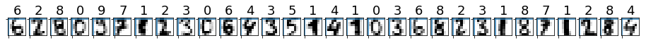
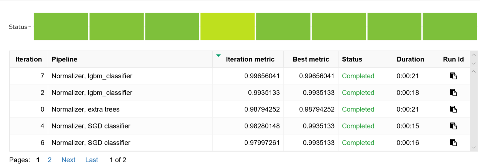
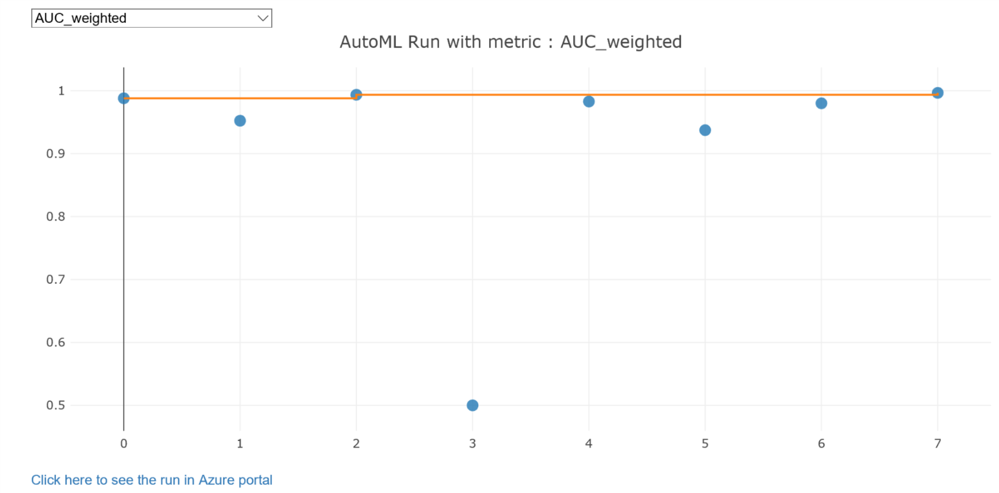

# Tutorial: Train a classification model with automated machine learning in Azure Machine Learning service

In this tutorial, you'll learn how to generate a  machine learning model using automated machine learning (automated ML).  Azure Machine Learning service can perform data preprocessing, algorithm selection and hyperparameter selection in an automated way for you. The final model can then be deployed following the workflow in the [Deploy a model](tutorial-deploy-models-with-aml.md) tutorial.


Similar to the [train models tutorial](tutorial-train-models-with-aml.md), this tutorial classifies handwritten images of digits (0-9) from the [MNIST](http://yann.lecun.com/exdb/mnist/) dataset. But this time you don't to specify an algorithm or tune hyperparameters. The automated ML technique iterates over many combinations of algorithms and hyperparameters until it finds the best model based on your criterion.

You'll learn how to:

> [!div class="checklist"]
> * Set up your development environment
> * Access and examine the data
> * Train using an automated classifier on your local computer
> * Explore the results
> * Review training results
> * Register the best model

If you don’t have an Azure subscription, create a [free account](https://azure.microsoft.com/free/?WT.mc_id=A261C142F) before you begin.

## Get the notebook

For your convenience, this tutorial is available as a [Jupyter notebook](https://github.com/Azure/MachineLearningNotebooks/blob/master/tutorials/03.auto-train-models.ipynb). Run the `03.auto-train-models.ipynb` notebook either in Azure Notebooks or in your own Jupyter notebook server.


[!INCLUDE [aml-clone-in-azure-notebook](../../../includes/aml-clone-in-azure-notebook.md)]


## Set up your development environment

All the setup for your development work can be accomplished in the Python notebook.  Setup includes:

* Import Python packages
* Configure a workspace to enable communication between your local computer and remote resources
* Create a directory to store training scripts

### Import packages
Import Python packages you need in this tutorial.


```python
import azureml.core
import pandas as pd
from azureml.core.workspace import Workspace
from azureml.train.automl.run import AutoMLRun
import time
import logging
from sklearn import datasets
from matplotlib import pyplot as plt
from matplotlib.pyplot import imshow
import random
import numpy as np
```

### Configure workspace

Create a workspace object from the existing workspace. `Workspace.from_config()` reads the file **aml_config/config.json** and loads the details into an object named `ws`.  `ws` is used throughout the rest of the code in this tutorial.

Once you have a workspace object, specify a name for the experiment and create and register a local directory with the workspace. The history of all runs is recorded under the specified experiment.

```python
ws = Workspace.from_config()
# project folder to save your local files
project_folder = './sample_projects/automl-local-classification'
# choose a name for the run history container in the workspace
experiment_name = 'automl-classifier'

import os

output = {}
output['SDK version'] = azureml.core.VERSION
output['Subscription ID'] = ws.subscription_id
output['Workspace'] = ws.name
output['Resource Group'] = ws.resource_group
output['Location'] = ws.location
output['Project Directory'] = project_folder
pd.set_option('display.max_colwidth', -1)
pd.DataFrame(data=output, index=['']).T
```

## Explore data

The initial training tutorial used a high-resolution version  of the MNIST dataset (28x28 pixels).  Since automated ML training requires many iterations, this tutorial uses a smaller resolution version  of the images (8x8 pixels) to demonstrate the concepts while speeding up the time needed for each iteration.  

```python
from sklearn import datasets

digits = datasets.load_digits()

# Exclude the first 100 rows from training so that they can be used for test.
X_train = digits.data[100:,:]
y_train = digits.target[100:]
```

### Display some sample images

Load the data into `numpy` arrays. Then use `matplotlib` to plot 30 random images from the dataset with their labels above them.

```python
count = 0
sample_size = 30
plt.figure(figsize = (16, 6))
for i in np.random.permutation(X_train.shape[0])[:sample_size]:
    count = count + 1
    plt.subplot(1, sample_size, count)
    plt.axhline('')
    plt.axvline('')
    plt.text(x = 2, y = -2, s = y_train[i], fontsize = 18)
    plt.imshow(X_train[i].reshape(8, 8), cmap = plt.cm.Greys)
plt.show()
```
A random sample of images displays:




You now have the necessary packages and data ready for auto training for your model. 

## Train a model

To automatically train a model, first define configuration settings for the experiment and then run the experiment.


### Define settings

Define the experiment settings and model settings.

|Property| Value in this tutorial |Description|
|----|----|---|
|**primary_metric**|AUC Weighted | Metric that you want to optimize.|
|**max_time_sec**|12,000|Time limit in seconds for each iteration|
|**iterations**|20|Number of iterations. In each iteration, the model trains with the data with a specific pipeline|
|**n_cross_validations**|3|Number of cross validation splits|
|**preprocess**|False| *True/False* Enables experiment to perform preprocessing on the input.  Preprocessing handles *missing data*, and performs some common *feature extraction*|
|**exit_score**|0.9985|*double* value indicating the target for *primary_metric*. Once the target is surpassed the run terminates|
|**blacklist_algos**|['kNN','LinearSVM']|*Array* of *strings* indicating algorithms to ignore.
|

```python
from azureml.train.automl import AutoMLConfig

##Local compute 
Automl_config = AutoMLConfig(task = 'classification',
                             primary_metric = 'AUC_weighted',
                             max_time_sec = 12000,
                             iterations = 20,
                             n_cross_validations = 3,
                             preprocess = False,
                             exit_score = 0.9985,
                             blacklist_algos = ['kNN','LinearSVM'],
                             X = X_train,
                             y = y_train,
                             path=project_folder)
```

### Run the experiment

Start the experiment to run locally. Define the compute target as local and set the output to true to view progress on the experiment.


```python
from azureml.core.experiment import Experiment
experiment=Experiment(ws, experiment_name)
local_run = experiment.submit(Automl_config, show_output=True)
```

Output such as the following appears one line at a time as each iteration progresses.  You will see a new line every **10-15 seconds**.

    Running locally
    Parent Run ID: AutoML_ca0c807b-b7bf-4809-a963-61c6feb73ea1
    ***********************************************************************************************
    ITERATION: The iteration being evaluated.
    PIPELINE:  A summary description of the pipeline being evaluated.
    DURATION: Time taken for the current iteration.
    METRIC: The result of computing score on the fitted pipeline.
    BEST: The best observed score thus far.
    ***********************************************************************************************
    
     ITERATION     PIPELINE                               DURATION                METRIC      BEST
             0      Normalizer extra trees                0:00:15.955367           0.988     0.988
             1      Normalizer extra trees                0:00:14.203088           0.952     0.988
             2      Normalizer lgbm_classifier            0:00:15.089057           0.994     0.994
             3      Normalizer SGD classifier             0:00:14.866700           0.500     0.994
             4      Normalizer SGD classifier             0:00:13.740577           0.983     0.994
             5      Normalizer DT                         0:00:13.879204           0.937     0.994
             6      Normalizer SGD classifier             0:00:13.379975           0.980     0.994
             7      Normalizer lgbm_classifier            0:00:15.953293           0.997     0.997
    Stopping criteria reached. Ending experiment.

## Explore the results

Explore the results of experiment with a Jupyter widget or by examining the experiment history.

### Jupyter widget

Use the Jupyter notebook widget to see a graph and a table of all results.

```python
from azureml.train.widgets import RunDetails
RunDetails(local_run).show()
```

Here is a static image of the widget.  In the notebook, you can use the dropdown above the graph to view a graph of each available metric for each iteration.




### Retrieve all iterations

View the experiment history and see individual metrics for each iteration run.

```python
children = list(local_run.get_children())
metricslist = {}
for run in children:
    properties = run.get_properties()
    metrics = {k: v for k, v in run.get_metrics().items() if isinstance(v, float)}
    metricslist[int(properties['iteration'])] = metrics

import pandas as pd
rundata = pd.DataFrame(metricslist).sort_index(1)
rundata
```

This table shows the results:


<!-- hello world -->

<table><thead><tr>
        <th></th>
        <th>0</th>
        <th>1</th>
        <th>2</th>
        <th>3</th>
        <th>4</th>
        <th>5</th>
        <th>6</th>
        <th>7</th>
    </tr></thead>
<tbody>    <tr> 
        <th id="T_32497c5c_a5a9_11e8_a10f_c49ded1c6180level0_row0" class="row_heading level0 row0" >AUC_macro</th> 
        <td id="T_32497c5c_a5a9_11e8_a10f_c49ded1c6180row0_col0" class="data row0 col0" >0.988094</td> 
        <td id="T_32497c5c_a5a9_11e8_a10f_c49ded1c6180row0_col1" class="data row0 col1" >0.951981</td> 
        <td id="T_32497c5c_a5a9_11e8_a10f_c49ded1c6180row0_col2" class="data row0 col2" >0.993606</td> 
        <td id="T_32497c5c_a5a9_11e8_a10f_c49ded1c6180row0_col3" class="data row0 col3" >0.5</td> 
        <td id="T_32497c5c_a5a9_11e8_a10f_c49ded1c6180row0_col4" class="data row0 col4" >0.982724</td> 
        <td id="T_32497c5c_a5a9_11e8_a10f_c49ded1c6180row0_col5" class="data row0 col5" >0.936998</td> 
        <td id="T_32497c5c_a5a9_11e8_a10f_c49ded1c6180row0_col6" class="data row0 col6" >0.979978</td> 
        <td id="T_32497c5c_a5a9_11e8_a10f_c49ded1c6180row0_col7" class="data row0 col7" >0.996639</td> 
    </tr>    <tr> 
        <th id="T_32497c5c_a5a9_11e8_a10f_c49ded1c6180level0_row1" class="row_heading level0 row1" >AUC_micro</th> 
        <td id="T_32497c5c_a5a9_11e8_a10f_c49ded1c6180row1_col0" class="data row1 col0" >0.988104</td> 
        <td id="T_32497c5c_a5a9_11e8_a10f_c49ded1c6180row1_col1" class="data row1 col1" >0.948402</td> 
        <td id="T_32497c5c_a5a9_11e8_a10f_c49ded1c6180row1_col2" class="data row1 col2" >0.99413</td> 
        <td id="T_32497c5c_a5a9_11e8_a10f_c49ded1c6180row1_col3" class="data row1 col3" >0.463035</td> 
        <td id="T_32497c5c_a5a9_11e8_a10f_c49ded1c6180row1_col4" class="data row1 col4" >0.976078</td> 
        <td id="T_32497c5c_a5a9_11e8_a10f_c49ded1c6180row1_col5" class="data row1 col5" >0.945169</td> 
        <td id="T_32497c5c_a5a9_11e8_a10f_c49ded1c6180row1_col6" class="data row1 col6" >0.968913</td> 
        <td id="T_32497c5c_a5a9_11e8_a10f_c49ded1c6180row1_col7" class="data row1 col7" >0.997027</td> 
    </tr>    <tr> 
        <th id="T_32497c5c_a5a9_11e8_a10f_c49ded1c6180level0_row2" class="row_heading level0 row2" >AUC_weighted</th> 
        <td id="T_32497c5c_a5a9_11e8_a10f_c49ded1c6180row2_col0" class="data row2 col0" >0.987943</td> 
        <td id="T_32497c5c_a5a9_11e8_a10f_c49ded1c6180row2_col1" class="data row2 col1" >0.952255</td> 
        <td id="T_32497c5c_a5a9_11e8_a10f_c49ded1c6180row2_col2" class="data row2 col2" >0.993513</td> 
        <td id="T_32497c5c_a5a9_11e8_a10f_c49ded1c6180row2_col3" class="data row2 col3" >0.5</td> 
        <td id="T_32497c5c_a5a9_11e8_a10f_c49ded1c6180row2_col4" class="data row2 col4" >0.982801</td> 
        <td id="T_32497c5c_a5a9_11e8_a10f_c49ded1c6180row2_col5" class="data row2 col5" >0.937292</td> 
        <td id="T_32497c5c_a5a9_11e8_a10f_c49ded1c6180row2_col6" class="data row2 col6" >0.979973</td> 
        <td id="T_32497c5c_a5a9_11e8_a10f_c49ded1c6180row2_col7" class="data row2 col7" >0.99656</td> 
    </tr>    <tr> 
        <th id="T_32497c5c_a5a9_11e8_a10f_c49ded1c6180level0_row3" class="row_heading level0 row3" >AUC_weighted_max</th> 
        <td id="T_32497c5c_a5a9_11e8_a10f_c49ded1c6180row3_col0" class="data row3 col0" >0.987943</td> 
        <td id="T_32497c5c_a5a9_11e8_a10f_c49ded1c6180row3_col1" class="data row3 col1" >0.987943</td> 
        <td id="T_32497c5c_a5a9_11e8_a10f_c49ded1c6180row3_col2" class="data row3 col2" >0.993513</td> 
        <td id="T_32497c5c_a5a9_11e8_a10f_c49ded1c6180row3_col3" class="data row3 col3" >0.993513</td> 
        <td id="T_32497c5c_a5a9_11e8_a10f_c49ded1c6180row3_col4" class="data row3 col4" >0.993513</td> 
        <td id="T_32497c5c_a5a9_11e8_a10f_c49ded1c6180row3_col5" class="data row3 col5" >0.993513</td> 
        <td id="T_32497c5c_a5a9_11e8_a10f_c49ded1c6180row3_col6" class="data row3 col6" >0.993513</td> 
        <td id="T_32497c5c_a5a9_11e8_a10f_c49ded1c6180row3_col7" class="data row3 col7" >0.99656</td> 
    </tr>    <tr> 
        <th id="T_32497c5c_a5a9_11e8_a10f_c49ded1c6180level0_row4" class="row_heading level0 row4" >accuracy</th> 
        <td id="T_32497c5c_a5a9_11e8_a10f_c49ded1c6180row4_col0" class="data row4 col0" >0.852093</td> 
        <td id="T_32497c5c_a5a9_11e8_a10f_c49ded1c6180row4_col1" class="data row4 col1" >0.666464</td> 
        <td id="T_32497c5c_a5a9_11e8_a10f_c49ded1c6180row4_col2" class="data row4 col2" >0.898057</td> 
        <td id="T_32497c5c_a5a9_11e8_a10f_c49ded1c6180row4_col3" class="data row4 col3" >0.0701284</td> 
        <td id="T_32497c5c_a5a9_11e8_a10f_c49ded1c6180row4_col4" class="data row4 col4" >0.832662</td> 
        <td id="T_32497c5c_a5a9_11e8_a10f_c49ded1c6180row4_col5" class="data row4 col5" >0.701827</td> 
        <td id="T_32497c5c_a5a9_11e8_a10f_c49ded1c6180row4_col6" class="data row4 col6" >0.83325</td> 
        <td id="T_32497c5c_a5a9_11e8_a10f_c49ded1c6180row4_col7" class="data row4 col7" >0.925752</td> 
    </tr>    <tr> 
        <th id="T_32497c5c_a5a9_11e8_a10f_c49ded1c6180level0_row5" class="row_heading level0 row5" >average_precision_score_macro</th> 
        <td id="T_32497c5c_a5a9_11e8_a10f_c49ded1c6180row5_col0" class="data row5 col0" >0.929167</td> 
        <td id="T_32497c5c_a5a9_11e8_a10f_c49ded1c6180row5_col1" class="data row5 col1" >0.786258</td> 
        <td id="T_32497c5c_a5a9_11e8_a10f_c49ded1c6180row5_col2" class="data row5 col2" >0.961497</td> 
        <td id="T_32497c5c_a5a9_11e8_a10f_c49ded1c6180row5_col3" class="data row5 col3" >0.1</td> 
        <td id="T_32497c5c_a5a9_11e8_a10f_c49ded1c6180row5_col4" class="data row5 col4" >0.917486</td> 
        <td id="T_32497c5c_a5a9_11e8_a10f_c49ded1c6180row5_col5" class="data row5 col5" >0.685547</td> 
        <td id="T_32497c5c_a5a9_11e8_a10f_c49ded1c6180row5_col6" class="data row5 col6" >0.906611</td> 
        <td id="T_32497c5c_a5a9_11e8_a10f_c49ded1c6180row5_col7" class="data row5 col7" >0.977775</td> 
    </tr>    <tr> 
        <th id="T_32497c5c_a5a9_11e8_a10f_c49ded1c6180level0_row6" class="row_heading level0 row6" >average_precision_score_micro</th> 
        <td id="T_32497c5c_a5a9_11e8_a10f_c49ded1c6180row6_col0" class="data row6 col0" >0.932596</td> 
        <td id="T_32497c5c_a5a9_11e8_a10f_c49ded1c6180row6_col1" class="data row6 col1" >0.728331</td> 
        <td id="T_32497c5c_a5a9_11e8_a10f_c49ded1c6180row6_col2" class="data row6 col2" >0.964138</td> 
        <td id="T_32497c5c_a5a9_11e8_a10f_c49ded1c6180row6_col3" class="data row6 col3" >0.0909031</td> 
        <td id="T_32497c5c_a5a9_11e8_a10f_c49ded1c6180row6_col4" class="data row6 col4" >0.880136</td> 
        <td id="T_32497c5c_a5a9_11e8_a10f_c49ded1c6180row6_col5" class="data row6 col5" >0.757538</td> 
        <td id="T_32497c5c_a5a9_11e8_a10f_c49ded1c6180row6_col6" class="data row6 col6" >0.859813</td> 
        <td id="T_32497c5c_a5a9_11e8_a10f_c49ded1c6180row6_col7" class="data row6 col7" >0.980408</td> 
    </tr>    <tr> 
        <th id="T_32497c5c_a5a9_11e8_a10f_c49ded1c6180level0_row7" class="row_heading level0 row7" >average_precision_score_weighted</th> 
        <td id="T_32497c5c_a5a9_11e8_a10f_c49ded1c6180row7_col0" class="data row7 col0" >0.930681</td> 
        <td id="T_32497c5c_a5a9_11e8_a10f_c49ded1c6180row7_col1" class="data row7 col1" >0.788964</td> 
        <td id="T_32497c5c_a5a9_11e8_a10f_c49ded1c6180row7_col2" class="data row7 col2" >0.962007</td> 
        <td id="T_32497c5c_a5a9_11e8_a10f_c49ded1c6180row7_col3" class="data row7 col3" >0.102123</td> 
        <td id="T_32497c5c_a5a9_11e8_a10f_c49ded1c6180row7_col4" class="data row7 col4" >0.918785</td> 
        <td id="T_32497c5c_a5a9_11e8_a10f_c49ded1c6180row7_col5" class="data row7 col5" >0.692041</td> 
        <td id="T_32497c5c_a5a9_11e8_a10f_c49ded1c6180row7_col6" class="data row7 col6" >0.908293</td> 
        <td id="T_32497c5c_a5a9_11e8_a10f_c49ded1c6180row7_col7" class="data row7 col7" >0.977699</td> 
    </tr>    <tr> 
        <th id="T_32497c5c_a5a9_11e8_a10f_c49ded1c6180level0_row8" class="row_heading level0 row8" >balanced_accuracy</th> 
        <td id="T_32497c5c_a5a9_11e8_a10f_c49ded1c6180row8_col0" class="data row8 col0" >0.917902</td> 
        <td id="T_32497c5c_a5a9_11e8_a10f_c49ded1c6180row8_col1" class="data row8 col1" >0.814509</td> 
        <td id="T_32497c5c_a5a9_11e8_a10f_c49ded1c6180row8_col2" class="data row8 col2" >0.94491</td> 
        <td id="T_32497c5c_a5a9_11e8_a10f_c49ded1c6180row8_col3" class="data row8 col3" >0.5</td> 
        <td id="T_32497c5c_a5a9_11e8_a10f_c49ded1c6180row8_col4" class="data row8 col4" >0.909248</td> 
        <td id="T_32497c5c_a5a9_11e8_a10f_c49ded1c6180row8_col5" class="data row8 col5" >0.833428</td> 
        <td id="T_32497c5c_a5a9_11e8_a10f_c49ded1c6180row8_col6" class="data row8 col6" >0.907412</td> 
        <td id="T_32497c5c_a5a9_11e8_a10f_c49ded1c6180row8_col7" class="data row8 col7" >0.959351</td> 
    </tr>    <tr> 
        <th id="T_32497c5c_a5a9_11e8_a10f_c49ded1c6180level0_row9" class="row_heading level0 row9" >f1_score_macro</th> 
        <td id="T_32497c5c_a5a9_11e8_a10f_c49ded1c6180row9_col0" class="data row9 col0" >0.850511</td> 
        <td id="T_32497c5c_a5a9_11e8_a10f_c49ded1c6180row9_col1" class="data row9 col1" >0.643116</td> 
        <td id="T_32497c5c_a5a9_11e8_a10f_c49ded1c6180row9_col2" class="data row9 col2" >0.899262</td> 
        <td id="T_32497c5c_a5a9_11e8_a10f_c49ded1c6180row9_col3" class="data row9 col3" >0.013092</td> 
        <td id="T_32497c5c_a5a9_11e8_a10f_c49ded1c6180row9_col4" class="data row9 col4" >0.825054</td> 
        <td id="T_32497c5c_a5a9_11e8_a10f_c49ded1c6180row9_col5" class="data row9 col5" >0.691712</td> 
        <td id="T_32497c5c_a5a9_11e8_a10f_c49ded1c6180row9_col6" class="data row9 col6" >0.819627</td> 
        <td id="T_32497c5c_a5a9_11e8_a10f_c49ded1c6180row9_col7" class="data row9 col7" >0.926081</td> 
    </tr>    <tr> 
        <th id="T_32497c5c_a5a9_11e8_a10f_c49ded1c6180level0_row10" class="row_heading level0 row10" >f1_score_micro</th> 
        <td id="T_32497c5c_a5a9_11e8_a10f_c49ded1c6180row10_col0" class="data row10 col0" >0.852093</td> 
        <td id="T_32497c5c_a5a9_11e8_a10f_c49ded1c6180row10_col1" class="data row10 col1" >0.666464</td> 
        <td id="T_32497c5c_a5a9_11e8_a10f_c49ded1c6180row10_col2" class="data row10 col2" >0.898057</td> 
        <td id="T_32497c5c_a5a9_11e8_a10f_c49ded1c6180row10_col3" class="data row10 col3" >0.0701284</td> 
        <td id="T_32497c5c_a5a9_11e8_a10f_c49ded1c6180row10_col4" class="data row10 col4" >0.832662</td> 
        <td id="T_32497c5c_a5a9_11e8_a10f_c49ded1c6180row10_col5" class="data row10 col5" >0.701827</td> 
        <td id="T_32497c5c_a5a9_11e8_a10f_c49ded1c6180row10_col6" class="data row10 col6" >0.83325</td> 
        <td id="T_32497c5c_a5a9_11e8_a10f_c49ded1c6180row10_col7" class="data row10 col7" >0.925752</td> 
    </tr>    <tr> 
        <th id="T_32497c5c_a5a9_11e8_a10f_c49ded1c6180level0_row11" class="row_heading level0 row11" >f1_score_weighted</th> 
        <td id="T_32497c5c_a5a9_11e8_a10f_c49ded1c6180row11_col0" class="data row11 col0" >0.852134</td> 
        <td id="T_32497c5c_a5a9_11e8_a10f_c49ded1c6180row11_col1" class="data row11 col1" >0.646049</td> 
        <td id="T_32497c5c_a5a9_11e8_a10f_c49ded1c6180row11_col2" class="data row11 col2" >0.898705</td> 
        <td id="T_32497c5c_a5a9_11e8_a10f_c49ded1c6180row11_col3" class="data row11 col3" >0.00933691</td> 
        <td id="T_32497c5c_a5a9_11e8_a10f_c49ded1c6180row11_col4" class="data row11 col4" >0.830731</td> 
        <td id="T_32497c5c_a5a9_11e8_a10f_c49ded1c6180row11_col5" class="data row11 col5" >0.696538</td> 
        <td id="T_32497c5c_a5a9_11e8_a10f_c49ded1c6180row11_col6" class="data row11 col6" >0.824547</td> 
        <td id="T_32497c5c_a5a9_11e8_a10f_c49ded1c6180row11_col7" class="data row11 col7" >0.925778</td> 
    </tr>    <tr> 
        <th id="T_32497c5c_a5a9_11e8_a10f_c49ded1c6180level0_row12" class="row_heading level0 row12" >log_loss</th> 
        <td id="T_32497c5c_a5a9_11e8_a10f_c49ded1c6180row12_col0" class="data row12 col0" >0.554364</td> 
        <td id="T_32497c5c_a5a9_11e8_a10f_c49ded1c6180row12_col1" class="data row12 col1" >1.15728</td> 
        <td id="T_32497c5c_a5a9_11e8_a10f_c49ded1c6180row12_col2" class="data row12 col2" >0.51741</td> 
        <td id="T_32497c5c_a5a9_11e8_a10f_c49ded1c6180row12_col3" class="data row12 col3" >2.30397</td> 
        <td id="T_32497c5c_a5a9_11e8_a10f_c49ded1c6180row12_col4" class="data row12 col4" >1.94009</td> 
        <td id="T_32497c5c_a5a9_11e8_a10f_c49ded1c6180row12_col5" class="data row12 col5" >1.57663</td> 
        <td id="T_32497c5c_a5a9_11e8_a10f_c49ded1c6180row12_col6" class="data row12 col6" >2.1848</td> 
        <td id="T_32497c5c_a5a9_11e8_a10f_c49ded1c6180row12_col7" class="data row12 col7" >0.250725</td> 
    </tr>    <tr> 
        <th id="T_32497c5c_a5a9_11e8_a10f_c49ded1c6180level0_row13" class="row_heading level0 row13" >norm_macro_recall</th> 
        <td id="T_32497c5c_a5a9_11e8_a10f_c49ded1c6180row13_col0" class="data row13 col0" >0.835815</td> 
        <td id="T_32497c5c_a5a9_11e8_a10f_c49ded1c6180row13_col1" class="data row13 col1" >0.629003</td> 
        <td id="T_32497c5c_a5a9_11e8_a10f_c49ded1c6180row13_col2" class="data row13 col2" >0.890167</td> 
        <td id="T_32497c5c_a5a9_11e8_a10f_c49ded1c6180row13_col3" class="data row13 col3" >0</td> 
        <td id="T_32497c5c_a5a9_11e8_a10f_c49ded1c6180row13_col4" class="data row13 col4" >0.818755</td> 
        <td id="T_32497c5c_a5a9_11e8_a10f_c49ded1c6180row13_col5" class="data row13 col5" >0.666629</td> 
        <td id="T_32497c5c_a5a9_11e8_a10f_c49ded1c6180row13_col6" class="data row13 col6" >0.814739</td> 
        <td id="T_32497c5c_a5a9_11e8_a10f_c49ded1c6180row13_col7" class="data row13 col7" >0.918851</td> 
    </tr>    <tr> 
        <th id="T_32497c5c_a5a9_11e8_a10f_c49ded1c6180level0_row14" class="row_heading level0 row14" >precision_score_macro</th> 
        <td id="T_32497c5c_a5a9_11e8_a10f_c49ded1c6180row14_col0" class="data row14 col0" >0.855892</td> 
        <td id="T_32497c5c_a5a9_11e8_a10f_c49ded1c6180row14_col1" class="data row14 col1" >0.707715</td> 
        <td id="T_32497c5c_a5a9_11e8_a10f_c49ded1c6180row14_col2" class="data row14 col2" >0.90195</td> 
        <td id="T_32497c5c_a5a9_11e8_a10f_c49ded1c6180row14_col3" class="data row14 col3" >0.00701284</td> 
        <td id="T_32497c5c_a5a9_11e8_a10f_c49ded1c6180row14_col4" class="data row14 col4" >0.84882</td> 
        <td id="T_32497c5c_a5a9_11e8_a10f_c49ded1c6180row14_col5" class="data row14 col5" >0.729611</td> 
        <td id="T_32497c5c_a5a9_11e8_a10f_c49ded1c6180row14_col6" class="data row14 col6" >0.855384</td> 
        <td id="T_32497c5c_a5a9_11e8_a10f_c49ded1c6180row14_col7" class="data row14 col7" >0.927881</td> 
    </tr>    <tr> 
        <th id="T_32497c5c_a5a9_11e8_a10f_c49ded1c6180level0_row15" class="row_heading level0 row15" >precision_score_micro</th> 
        <td id="T_32497c5c_a5a9_11e8_a10f_c49ded1c6180row15_col0" class="data row15 col0" >0.852093</td> 
        <td id="T_32497c5c_a5a9_11e8_a10f_c49ded1c6180row15_col1" class="data row15 col1" >0.666464</td> 
        <td id="T_32497c5c_a5a9_11e8_a10f_c49ded1c6180row15_col2" class="data row15 col2" >0.898057</td> 
        <td id="T_32497c5c_a5a9_11e8_a10f_c49ded1c6180row15_col3" class="data row15 col3" >0.0701284</td> 
        <td id="T_32497c5c_a5a9_11e8_a10f_c49ded1c6180row15_col4" class="data row15 col4" >0.832662</td> 
        <td id="T_32497c5c_a5a9_11e8_a10f_c49ded1c6180row15_col5" class="data row15 col5" >0.701827</td> 
        <td id="T_32497c5c_a5a9_11e8_a10f_c49ded1c6180row15_col6" class="data row15 col6" >0.83325</td> 
        <td id="T_32497c5c_a5a9_11e8_a10f_c49ded1c6180row15_col7" class="data row15 col7" >0.925752</td> 
    </tr>    <tr> 
        <th id="T_32497c5c_a5a9_11e8_a10f_c49ded1c6180level0_row16" class="row_heading level0 row16" >precision_score_weighted</th> 
        <td id="T_32497c5c_a5a9_11e8_a10f_c49ded1c6180row16_col0" class="data row16 col0" >0.859204</td> 
        <td id="T_32497c5c_a5a9_11e8_a10f_c49ded1c6180row16_col1" class="data row16 col1" >0.711918</td> 
        <td id="T_32497c5c_a5a9_11e8_a10f_c49ded1c6180row16_col2" class="data row16 col2" >0.903523</td> 
        <td id="T_32497c5c_a5a9_11e8_a10f_c49ded1c6180row16_col3" class="data row16 col3" >0.00500676</td> 
        <td id="T_32497c5c_a5a9_11e8_a10f_c49ded1c6180row16_col4" class="data row16 col4" >0.861209</td> 
        <td id="T_32497c5c_a5a9_11e8_a10f_c49ded1c6180row16_col5" class="data row16 col5" >0.737586</td> 
        <td id="T_32497c5c_a5a9_11e8_a10f_c49ded1c6180row16_col6" class="data row16 col6" >0.863524</td> 
        <td id="T_32497c5c_a5a9_11e8_a10f_c49ded1c6180row16_col7" class="data row16 col7" >0.928403</td> 
    </tr>    <tr> 
        <th id="T_32497c5c_a5a9_11e8_a10f_c49ded1c6180level0_row17" class="row_heading level0 row17" >recall_score_macro</th> 
        <td id="T_32497c5c_a5a9_11e8_a10f_c49ded1c6180row17_col0" class="data row17 col0" >0.852234</td> 
        <td id="T_32497c5c_a5a9_11e8_a10f_c49ded1c6180row17_col1" class="data row17 col1" >0.666102</td> 
        <td id="T_32497c5c_a5a9_11e8_a10f_c49ded1c6180row17_col2" class="data row17 col2" >0.901151</td> 
        <td id="T_32497c5c_a5a9_11e8_a10f_c49ded1c6180row17_col3" class="data row17 col3" >0.1</td> 
        <td id="T_32497c5c_a5a9_11e8_a10f_c49ded1c6180row17_col4" class="data row17 col4" >0.83688</td> 
        <td id="T_32497c5c_a5a9_11e8_a10f_c49ded1c6180row17_col5" class="data row17 col5" >0.699966</td> 
        <td id="T_32497c5c_a5a9_11e8_a10f_c49ded1c6180row17_col6" class="data row17 col6" >0.833265</td> 
        <td id="T_32497c5c_a5a9_11e8_a10f_c49ded1c6180row17_col7" class="data row17 col7" >0.926966</td> 
    </tr>    <tr> 
        <th id="T_32497c5c_a5a9_11e8_a10f_c49ded1c6180level0_row18" class="row_heading level0 row18" >recall_score_micro</th> 
        <td id="T_32497c5c_a5a9_11e8_a10f_c49ded1c6180row18_col0" class="data row18 col0" >0.852093</td> 
        <td id="T_32497c5c_a5a9_11e8_a10f_c49ded1c6180row18_col1" class="data row18 col1" >0.666464</td> 
        <td id="T_32497c5c_a5a9_11e8_a10f_c49ded1c6180row18_col2" class="data row18 col2" >0.898057</td> 
        <td id="T_32497c5c_a5a9_11e8_a10f_c49ded1c6180row18_col3" class="data row18 col3" >0.0701284</td> 
        <td id="T_32497c5c_a5a9_11e8_a10f_c49ded1c6180row18_col4" class="data row18 col4" >0.832662</td> 
        <td id="T_32497c5c_a5a9_11e8_a10f_c49ded1c6180row18_col5" class="data row18 col5" >0.701827</td> 
        <td id="T_32497c5c_a5a9_11e8_a10f_c49ded1c6180row18_col6" class="data row18 col6" >0.83325</td> 
        <td id="T_32497c5c_a5a9_11e8_a10f_c49ded1c6180row18_col7" class="data row18 col7" >0.925752</td> 
    </tr>    <tr> 
        <th id="T_32497c5c_a5a9_11e8_a10f_c49ded1c6180level0_row19" class="row_heading level0 row19" >recall_score_weighted</th> 
        <td id="T_32497c5c_a5a9_11e8_a10f_c49ded1c6180row19_col0" class="data row19 col0" >0.852093</td> 
        <td id="T_32497c5c_a5a9_11e8_a10f_c49ded1c6180row19_col1" class="data row19 col1" >0.666464</td> 
        <td id="T_32497c5c_a5a9_11e8_a10f_c49ded1c6180row19_col2" class="data row19 col2" >0.898057</td> 
        <td id="T_32497c5c_a5a9_11e8_a10f_c49ded1c6180row19_col3" class="data row19 col3" >0.0701284</td> 
        <td id="T_32497c5c_a5a9_11e8_a10f_c49ded1c6180row19_col4" class="data row19 col4" >0.832662</td> 
        <td id="T_32497c5c_a5a9_11e8_a10f_c49ded1c6180row19_col5" class="data row19 col5" >0.701827</td> 
        <td id="T_32497c5c_a5a9_11e8_a10f_c49ded1c6180row19_col6" class="data row19 col6" >0.83325</td> 
        <td id="T_32497c5c_a5a9_11e8_a10f_c49ded1c6180row19_col7" class="data row19 col7" >0.925752</td> 
    </tr>    <tr> 
        <th id="T_32497c5c_a5a9_11e8_a10f_c49ded1c6180level0_row20" class="row_heading level0 row20" >weighted_accuracy</th> 
        <td id="T_32497c5c_a5a9_11e8_a10f_c49ded1c6180row20_col0" class="data row20 col0" >0.851054</td> 
        <td id="T_32497c5c_a5a9_11e8_a10f_c49ded1c6180row20_col1" class="data row20 col1" >0.66639</td> 
        <td id="T_32497c5c_a5a9_11e8_a10f_c49ded1c6180row20_col2" class="data row20 col2" >0.895428</td> 
        <td id="T_32497c5c_a5a9_11e8_a10f_c49ded1c6180row20_col3" class="data row20 col3" >0.049121</td> 
        <td id="T_32497c5c_a5a9_11e8_a10f_c49ded1c6180row20_col4" class="data row20 col4" >0.829247</td> 
        <td id="T_32497c5c_a5a9_11e8_a10f_c49ded1c6180row20_col5" class="data row20 col5" >0.702754</td> 
        <td id="T_32497c5c_a5a9_11e8_a10f_c49ded1c6180row20_col6" class="data row20 col6" >0.833464</td> 
        <td id="T_32497c5c_a5a9_11e8_a10f_c49ded1c6180row20_col7" class="data row20 col7" >0.924723</td> 
    </tr></tbody> 
</table> 
<!-- hello world -->

## Register the best model 

Use the `local_run` object to get the best model and register it into the workspace. 

```python
# find the run with the highest accuracy value.
best_run, fitted_model = local_run.get_output()

# register model in workspace
description = 'Automated Machine Learning Model'
tags = None
local_run.register_model(description=description, tags=tags)
local_run.model_id # Use this id to deploy the model as a web service in Azure
```

## Test the best model

Use the model to predict a few random digits.  Display the predicted value and the image.  Red font and inverse image (white on black) is used to highlight the misclassified samples.

Since the model accuracy is high, you might have to run the following code a few times before you can see a misclassified sample.

```python
# find 30 random samples from test set
n = 30
X_test = digits.data[:100, :]
y_test = digits.target[:100]
sample_indices = np.random.permutation(X_test.shape[0])[0:n]
test_samples = X_test[sample_indices]


# predict using the  model
result = fitted_model.predict(test_samples)

# compare actual value vs. the predicted values:
i = 0
plt.figure(figsize = (20, 1))

for s in sample_indices:
    plt.subplot(1, n, i + 1)
    plt.axhline('')
    plt.axvline('')
    
    # use different color for misclassified sample
    font_color = 'red' if y_test[s] != result[i] else 'black'
    clr_map = plt.cm.gray if y_test[s] != result[i] else plt.cm.Greys
    
    plt.text(x = 2, y = -2, s = result[i], fontsize = 18, color = font_color)
    plt.imshow(X_test[s].reshape(8, 8), cmap = clr_map)
    
    i = i + 1
plt.show()
```


## Clean up resources

[!INCLUDE [aml-delete-resource-group](../../../includes/aml-delete-resource-group.md)]


## Next steps

In this Azure Machine Learning service tutorial, you used Python to:

> [!div class="checklist"]
> * Set up your development environment
> * Access and examine the data
> * Train using an automated classifier locally with custom parameters
> * Explore the results
> * Review training results
> * Register the best model

Learn more about [how to configure settings for automatic training]() or [how to use automatic training on a remote resource](how-to-auto-train-remote.md).  

