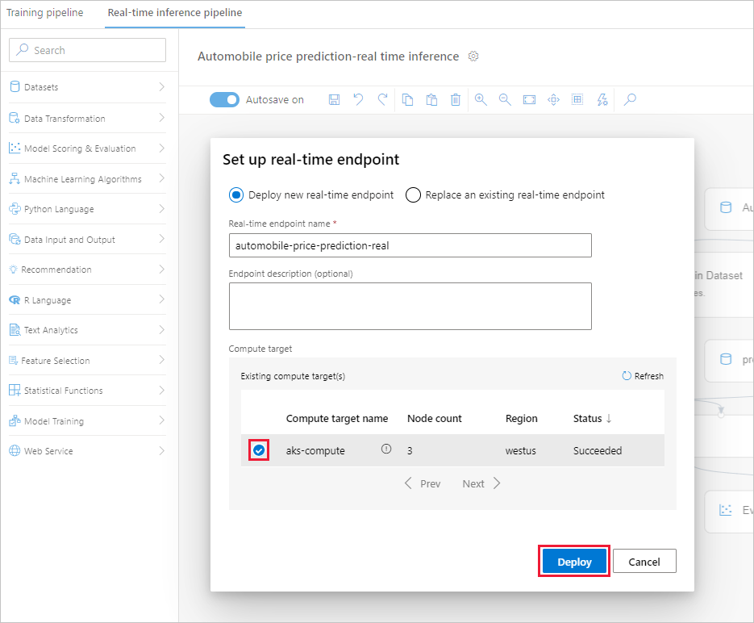
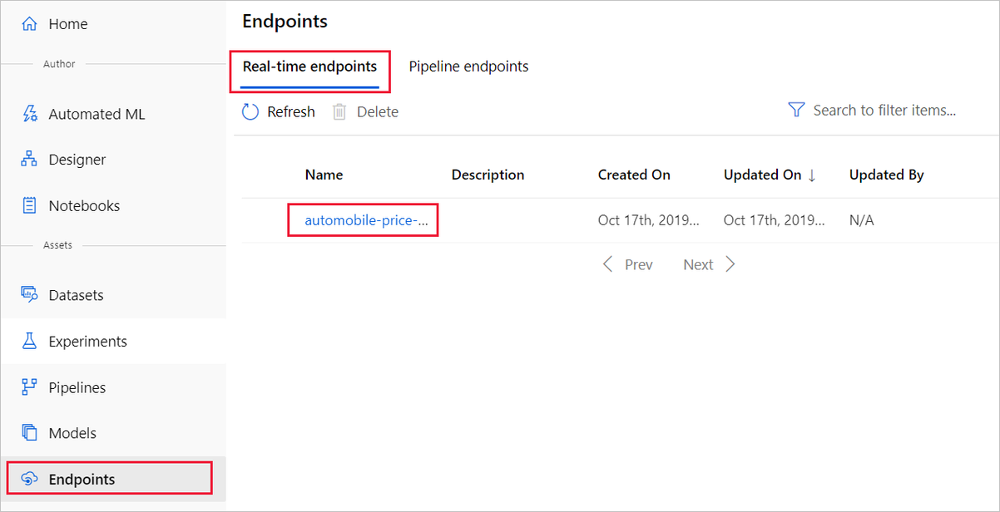
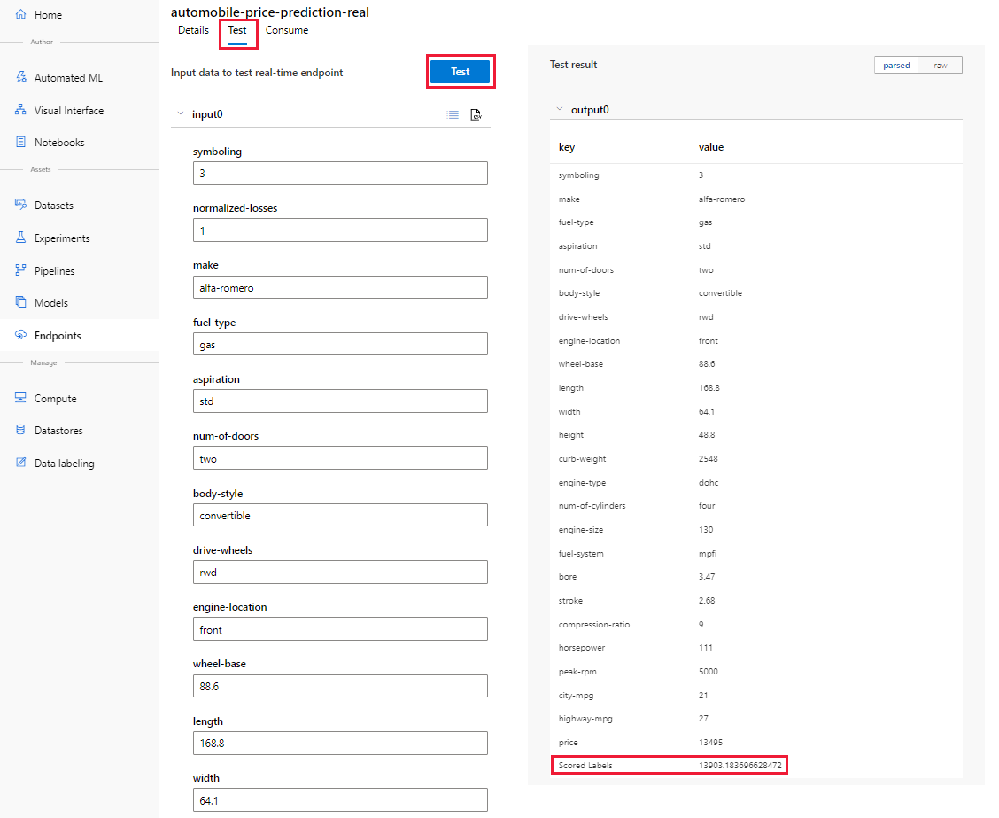

# Tutorial: Deploy a machine learning model with the designer (preview)
[!INCLUDE [applies-to-skus](../../../includes/aml-applies-to-enterprise-sku.md)]

To give others a chance to use the predictive model developed in [part one of the tutorial](tutorial-designer-automobile-price-train-score.md), you can deploy it as a real-time endpoint. In part 1, you trained your model. Now, it's time to generate new predictions based on user input. In this part of the tutorial, you:

> [!div class="checklist"]
> * Deploy a real-time endpoint
> * Create an inferencing cluster
> * Test a real-time endpoint

## Prerequisites

Complete [part one of the tutorial](tutorial-designer-automobile-price-train-score.md) to learn how to train and score a machine learning model in the designer.

## Deploy a real-time endpoint

In order to deploy your pipeline, you must:

1. Convert the training pipeline into a real-time inference pipeline, which removes training modules and adds inputs and outputs for inferencing requests.
1. Deploy the inference pipeline.

### Create a real-time inference pipeline

1. At the top of the pipeline canvas, select **Create inference pipeline** > **Real-time inference pipeline**

    When you select **Create inference pipeline**, several things happen:
    
    * The trained model is stored as a **Dataset** module in the module palette. You can find it under **My Datasets**.
    * Modules, like **Train Model** and **Split Data**, that were used for training are removed.
    * The saved trained model is added back into the pipeline.
    * **Web Service Input** and **Web Service Output** modules are added. These modules identify where user data will enter the model, and where data is returned.

    > [!Note]
    > The **training pipeline** is saved under the new tab at the top of the pipeline canvas. It can also be found as a published pipeline in the designer.
    >

    Your pipeline should now look like this:  

   

1. Select **Run** and use the same compute target and experiment you used in part 1.

1. Select the **Score Model** module.

1. In the properties pane, select **Outputs** > **Visualize** to verify the model is still working. You can see the original data is displayed along with the predicted price ("Scored Labels").

1. Select **Deploy**.

### Create an inferencing cluster

In the dialog that appears, you can select from existing Azure Kubernetes Service (AKS) clusters in your workspace to deploy your model. If you don't have an AKS cluster, use the following steps to create one.

1. Select **Compute** in the dialog to navigate to the **Compute** page.

1. In the navigation ribbon, select **Inference Clusters** > **+ New**.

    

1. In the inference cluster pane, configure a new Kubernetes Service.

1. Enter "aks-compute" for the **Compute name**.
    
1. Select a nearby available **Region**.

1. Select **Create**.

    > [!Note]
    > It takes approximately 15 minutes to create a new AKS service. You can check the provisioning state on the **Inference Clusters** page
    >

### Deploy the real-time endpoint

After your AKS service has finished provisioning, return to the real-time inferencing pipeline to complete deployment.

1. Select **Deploy** above the canvas.

1. Select **Deploy new real-time endpoint**. 

1. Select the AKS cluster you created.

1. Select **Deploy**.

    

    A success notification above the canvas will appear when deployment completes, it may take a few minutes.

## Test the real-time endpoint

You can test your real-time endpoint by navigating to the **Endpoints** page in the workspace navigation pane on the left.

1. On the **Endpoints** page, select the endpoint you deployed.

    

1. Select **Test**.

1. Input testing data or use the autofilled sample data and select **Test**.

    The test request is submitted to the endpoint and the results are shown on page. Although a price value is generated for the input data, it is not used to generate the prediction value.

    

## Clean up resources

[!INCLUDE [aml-ui-cleanup](../../../includes/aml-ui-cleanup.md)]

## Next steps

In this tutorial, you learned the key steps in creating, deploying, and consuming a machine learning model in the designer. To learn more about how you can use the designer to solve other types of problems, see out our other sample pipelines.

> [!div class="nextstepaction"]
> [Credit risk classification sample](how-to-designer-sample-classification-credit-risk-cost-sensitive.md)
