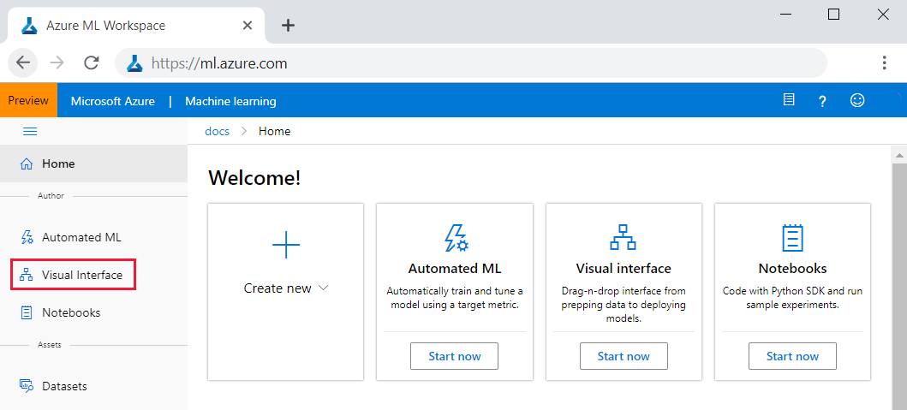
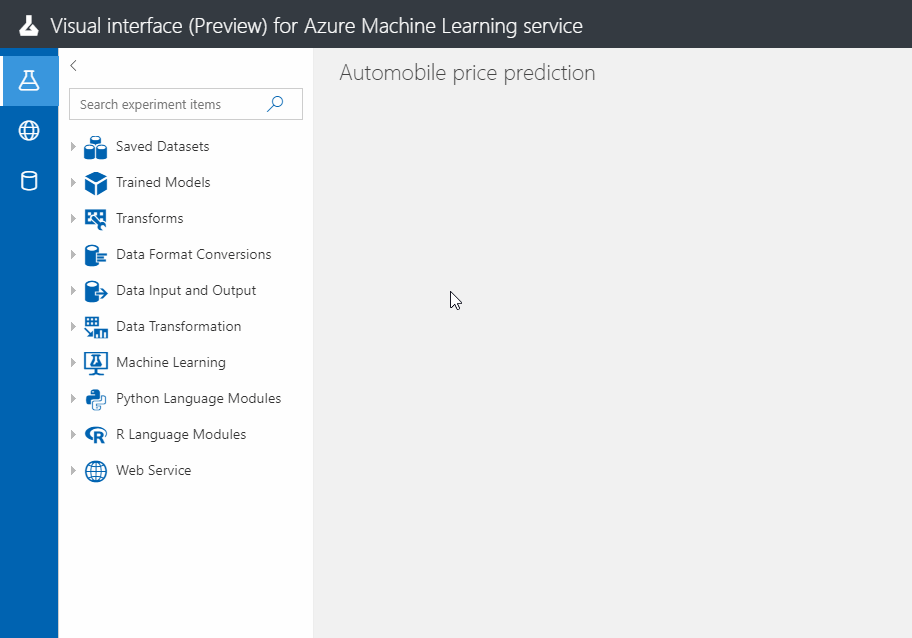
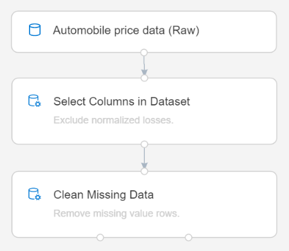
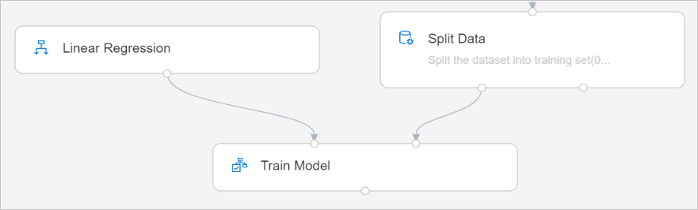
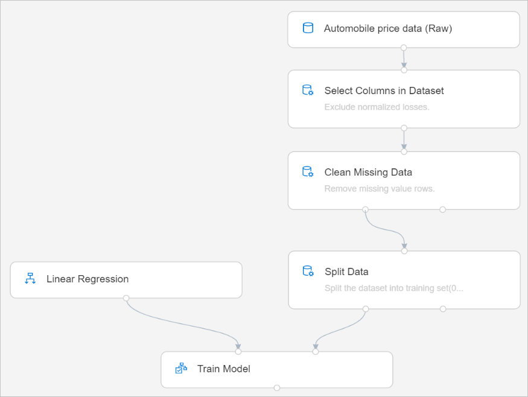
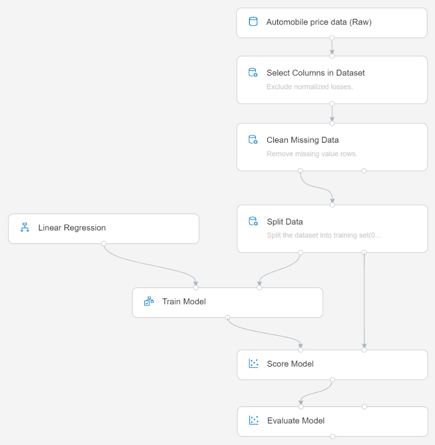

# Tutorial: Predict automobile price with the designer (preview)
[!INCLUDE [applies-to-skus](../../../includes/aml-applies-to-enterprise-sku.md)]

In this two-part tutorial, you learn how to use the Azure Machine Learning designer to develop and deploy a predictive analytics solution that predicts the price of any car. 

In part one, you set up your environment, drag-and-drop modules onto an interactive canvas, and connect them together to create an Azure Machine Learning pipeline.

In part one of the tutorial you learn how to:

> [!div class="checklist"]
> * Create a new pipeline
> * Import data
> * Prepare data
> * Train a machine learning model
> * Evaluate a machine learning model

In [part two](tutorial-designer-automobile-price-deploy.md) of the tutorial, you learn how to deploy your predictive model as an real-time inferencing endpoint to predict the price of any car based on technical specifications you send it. 

> [!Note]
>A completed version of this tutorial is available as a sample pipeline.
>
>To find it, go to the **designer in your workspace**. In the **New pipeline** section, select **Sample 1 - Regression: Automobile Price Prediction(Basic)**.

## Create a new pipeline

Azure Machine Learning pipelines organize multiple, dependent machine learning and data processing steps into a single resource. Pipelines help you organize, manage, and reuse complex machine learning workflows across projects and users. To create an Azure Machine Learning pipeline, you need an Azure Machine Learning workspace. In this section, you learn how to create both these resources.

### Create a new workspace

If you have an Azure Machine Learning workspace with an **Enterprise edition**, [skip to the next section](#create-the-pipeline).

[!INCLUDE [aml-create-portal](../../../includes/aml-create-in-portal-enterprise.md)]

### Create the pipeline

1. Sign into [ml.azure.com](https://ml.azure.com) and select the workspace you want to work with.

1. Select **Designer**.

    

1. Select **Easy-to-use prebuilt modules**.

1. Select the default pipeline name **"Pipeline-Created-on ..."** at the top of the canvas, and rename it to something meaningful. For example, **"Automobile price prediction"**. The name doesn't need to be unique.

## Import data

There are several sample datasets included in the designer for you to experiment with. For this tutorial, use the sample dataset **Automobile price data (Raw)**. 

1. To the left of the pipeline canvas is a palette of datasets and modules. Select **Datasets** then view the **Samples** section to view the available sample datasets.

1. Select the dataset, **Automobile price data (Raw)**, and drag it onto the canvas.

   

### Visualize the data

You can visualize the data to understand the dataset you will be using.

1. Select the **Automobile price data (Raw)** module.

1. In the **Properties** pane to the right of the canvas, select **Outputs**.

1. Select the graph icon to visualize the data.

    

1. Select the different columns in the data window to view information about each one.

    Each row represents an automobile, and the variables associated with each automobile appear as columns. There are 205 rows and 26 columns in this dataset.

## Prepare data

Datasets typically require some preprocessing before analysis. You might have noticed some missing values when visualizing the dataset. These missing values need to be cleaned so the model can analyze the data correctly. You'll remove columns with many missing values and remove any individual rows that have missing values.

### Remove a column

When you train a model, you have to do something about the data that's missing. In this dataset, the **normalized-losses** column is missing many values, so you'll exclude that column from the model altogether.

1. Select which columns of data to work with. Type **Select** in the Search box at the top of the palette to find the **Select Columns in Dataset** module.

1. Click and drag the **Select Columns in Dataset** module onto the canvas. Drop the module below the dataset module.

1. Connect the dataset you added earlier to the **Select Columns in Dataset** module by clicking and dragging. Drag from the dataset's output port, which is the small circle at the bottom of the dataset on the canvas, to the input port of **Select Columns in Dataset**, which is the small circle at the top of the module.

    > [!TIP]
    > You create a flow of data through your pipeline when you connect the output port of one module to an input port of another.
    >

    

1. Select the **Select Columns in Dataset** module.

1. In the **Properties** pane to the right of the canvas, select **Parameters** > **Edit column**.

1. Select the **+** to add a new rule.

1. From the drop-down menu, select **Exclude** and **Column names**.
    
1. Enter **normalized-losses** into the text box.

1. In the lower right, select **Save** to close the column selector.

    
        
    The properties pane shows that the **normalized-losses** column is excluded.

1. Select the **Select Columns in Dataset** module. 

1. In the **Properties**, select **Parameters** > **Comment** and enter "Exclude normalized losses.".

### Clean missing data

Your dataset still has missing values after removing the **normalized-losses** column. You can remove the remaining missing data using the **Clean Missing Data** module.

> [!TIP]
> Cleaning the missing values from input data is a prerequisite for using most of the modules in the designer.

1. Type **Clean** in the Search box to find the **Clean Missing Data** module.

1. Drag the **Clean Missing Data** module to the pipeline canvas and connect it to the **Select Columns in Dataset** module. 

1. In the Properties pane, select **Remove entire row** under **Cleaning mode**.

1. In the Properties pane, enter "Remove missing value rows." in the **Comment** box.  

    Your pipeline should now look something like this:
    
    

## Train a machine learning model

Now that the data is preprocessed, you can construct a predictive model. You'll use your data to train the model. Then you'll test the model to see how closely it's able to predict prices.

### Select an algorithm

**Classification** and **regression** are two types of supervised machine learning algorithms. **Classification** predicts an answer from a defined set of categories, such as a color (red, blue, or green). **Regression** is used to predict a number.

Because you want to predict price, which is a number, you can use a regression algorithm. For this example, you'll use a linear regression model.

### Split the data

Use your data for both training the model and testing it by splitting the data into two separate datasets.

1. Type **split data** in the search box to find the **Split Data** module and connect it to the left port of the **Clean Missing Data** module.

1. Select the **Split Data** module.

1. In the Properties pane, set the **Fraction of rows in the first output dataset** to 0.7.

    This splits 70 percent of the data to train the model, and holds back 30 percent for testing.

1. In the Properties pane, enter "Split the dataset into training set(0.7) and test set(0.3)." in the **Comment** box.

### Train the model

Train the model by giving it a set of data that includes the price. The model scans the data and looks for correlations between a car's features and its price.

1. To select the learning algorithm, clear your module palette search box.

1. Expand **Machine Learning Algorithms**.
    
    This displays several categories of modules that can be used to initialize machine learning algorithms.

1. For this pipeline, select **Regression** > **Linear Regression** and drag it to the pipeline canvas.

1. Find and drag the **Train Model** module to the pipeline canvas. 

1. Connect the output of the Linear Regression module to the left input of the Train Model module.

1. Connect the training data output (left port) of the **Split Data** module to the right input of the **Train Model** module.

    

1. Select the **Train Model** module.

1. In the Properties pane, select **Edit column** selector.

1. In the **Label column** dialog, expand the drop-down menu and select **Column names**. In the text box, enter **price**. Price is the value that your model is going to predict.

    Your pipeline should look like this:

    

## Evaluate a machine learning model

Now that you've trained the model using 70 percent of your data, you can use it to score the other 30 percent of the data to see how well your model functions.

1. Type **score model** in the search box to find the **Score Model** module and drag the module to the pipeline canvas. 

1. Connect the output of the **Train Model** module to the left input port of **Score Model**. Connect the test data output (right port) of the **Split Data** module to the right input port of **Score Model**.

1. Type **evaluate** in the search box to find the **Evaluate Model** and drag the module to the pipeline canvas. 

1. Connect the output of the **Score Model** module to the left input of **Evaluate Model**. 

    The final pipeline should look something like this:

    

### Run the pipeline

[!INCLUDE [aml-ui-create-training-compute](../../../includes/aml-ui-create-training-compute.md)]

### View results

After the run completes, you can view the results of the pipeline run. 

1. View the output from the **Score Model** module by selecting the **Score Model** module.

1. In the **Properties** pane, select **Outputs** > **Visualize**. The output shows the predicted values for price and the known values from the test data.

    

1. View the output from the **Evaluate Model** module by selecting the **Score Model** module.

1. In the **Properties** pane, select **Output** > **Visualize**, and then select **Visualize**.

The following statistics are shown for your model:

* **Mean Absolute Error (MAE)**: The average of absolute errors (an error is the difference between the predicted value and the actual value).
* **Root Mean Squared Error (RMSE)**: The square root of the average of squared errors of predictions made on the test dataset.
* **Relative Absolute Error**: The average of absolute errors relative to the absolute difference between actual values and the average of all actual values.
* **Relative Squared Error**: The average of squared errors relative to the squared difference between the actual values and the average of all actual values.
* **Coefficient of Determination**: Also known as the R squared value, this is a statistical metric indicating how well a model fits the data.

For each of the error statistics, smaller is better. A smaller value indicates that the predictions more closely match the actual values. For Coefficient of Determination, the closer its value is to one (1.0), the better the predictions.

## Clean up resources

[!INCLUDE [aml-ui-cleanup](../../../includes/aml-ui-cleanup.md)]

## Next steps

In part one of this tutorial, you completed these steps:

* Created a pipeline
* Prepared the data
* Trained the model
* Scored and evaluated the model

In part two, you'll learn how to deploy your model as a real-time endpoint.

> [!div class="nextstepaction"]
> [Continue to deploying models](tutorial-designer-automobile-price-deploy.md)
