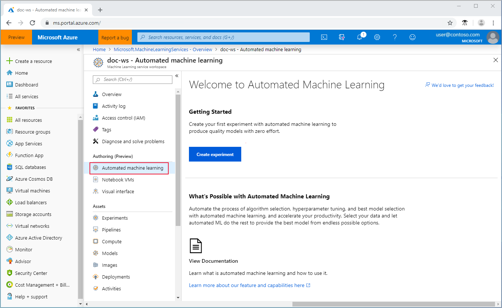
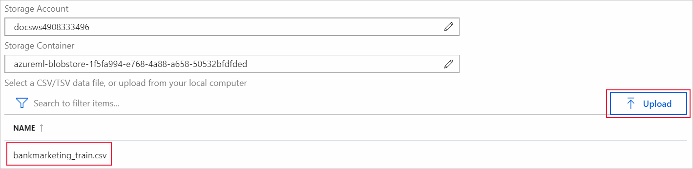
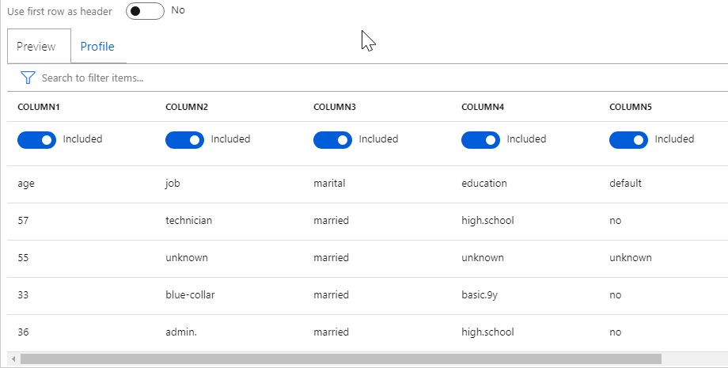
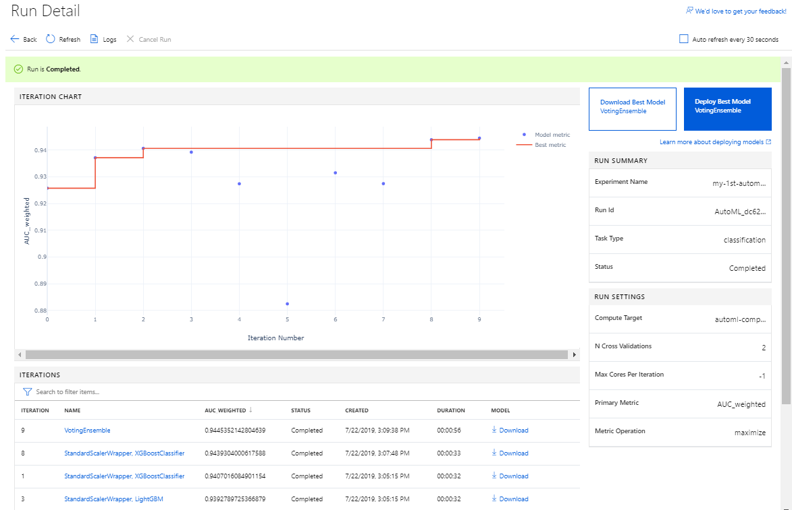
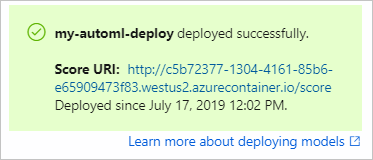

# Tutorial: Use automated machine learning to train and deploy your first classification model (preview)

In this tutorial, you learn how to create your first automated machine learning experiment in the Azure portal. This example creates a classification model to predict whether a client will subscribe to a term deposit with the bank.

By using the automated machine learning capabilities of the service and the Azure portal, you begin the automated machine learning process. The algorithm selection and hyperparameter tuning is done for you. The automated machine learning technique iterates over many combinations of algorithms and hyperparameters until it finds the best model based on your criterion, all without you writing a single line of code.

In this tutorial, you learn the following tasks:

> [!div class="checklist"]
> * Configure an Azure Machine Learning service workspace.
> * Create an experiment.
> * Auto-train a classification model.
> * View training run details.
> * Deploy the model.

## Prerequisites

* An Azure subscription. If you don’t have an Azure subscription, create a [free account](https://aka.ms/AMLFree).

* The **bankmarketing_train.csv** data file. [Download it](https://automlsamplenotebookdata.blob.core.windows.net/automl-sample-notebook-data/bankmarketing_train.csv).

## Create a workspace

[!INCLUDE [aml-create-portal](../../../includes/aml-create-in-portal.md)]

## Create an experiment

1. Go to the left pane of your workspace. Select **Automated machine learning** under the **Authoring (Preview)** section.

    

    Because this is your first experiment with Automated Machine Learning, you'll see the **Welcome to Automated Machine Learning** screen. 

1. Select **Create experiment**. Then enter **my-1st-automl-experiment** as the experiment name.

1. Select **Create a new compute** and configure your compute context for this experiment.

    Field| Value
    ---|---
    Compute name| Enter a unique name that identifies your compute context. For this example, we use **automl-compute**.
    Virtual machine size| Select the virtual machine size for your compute. We use **Standard_DS12_V2**.
    Additional settings| *Min node*: 1. To enable data profiling, you must have one or more nodes.   *Max node*: 6. 

    To create your new compute, select **Create**. This takes a few moments. 

    When creation is complete, select your new compute from the drop-down list, and then select **Next**.

1. For this tutorial, we use the default storage account and container created with your new compute. They automatically populate in the form.

1. Select **Upload** and choose the **bankmarketing_train.csv** file from your local computer to upload it to the default container. Public preview supports only local file uploads and Azure Blob storage accounts. When the upload is complete, select the file from the list. 

    

1. The **Preview** tab allows us to further configure our data for this experiment.

    On the **Preview** tab, indicate that the data includes headers. The service defaults to include all of the features (columns) for training. For this example, scroll to the right and **Ignore** the **day_of_week** feature.

    

    >[!NOTE]
    > Data profiling is not available with computes that have zero minimum nodes.

1. Select **Classification** as the prediction task.

1. Select **y** as the target column, where we want to do predictions. This column indicates whether the client subscribed to a term deposit or not.

1. Expand **Advanced Settings** and populate the fields as follows.

    Advanced settings|Value
    ------|------
    Primary metric| AUC_weighted 
    Exit criteria| When any of these criteria are met, the training job ends before full completion:   *Training job time (minutes)*: 5    *Max number of iterations*: 10 
    Preprocessing| Enables preprocessing done by automated machine learning. This includes automatic data cleansing, preparing, and transformation to generate synthetic features.
    Validation| Select K-fold cross-validation and **2** for the number of cross-validations. 
    Concurrency| Select **5** for the number of max concurrent iterations.

   >[!NOTE]
   > For this experiment, we don't set a metric or max cores per iterations threshold. We also don't block algorithms from being tested.

1. Select **Start** to run the experiment.

   When the experiment starts, you see a blank **Run Detail** screen with the following status at the top. 

      
      
The experiment preparation process takes a couple of minutes. When the process finishes, the status message changes to **Run is Running**.

##  View experiment details

As the experiment progresses, the **Run Detail** screen updates the iteration chart and list with the different iterations (models) that are run. The iterations list is in order by metric score. By default, the model that scores the highest based on our **AUC_weighted** metric is at the top of the list.

>[!TIP]
> Training jobs take several minutes for each pipeline to finish running.

## Deploy the model

For this experiment, **VotingEnsemble** is considered the best model, based on the **AUC_weighted** metric. By using automated machine learning in the Azure portal, we can deploy this model as a web service to predict on new data. 

1. On the **Run Detail** page, select the **Deploy Best Model** button.

1. Populate the **Deploy Best Model** pane as follows:

    Field| Value
    ----|----
    Deployment name| my-automl-deploy
    Deployment description| My first automated machine learning experiment deployment
    Scoring script| Autogenerate
    Environment script| Autogenerate
    
1. Select **Deploy**. Deployment takes about 20 minutes to complete.

    The following message appears when deployment successfully finishes:

    
    
    That's it! You have an operational web service to generate predictions.

## Clean up resources

Deployment files are larger than data and experiment files, so they cost more to store. Delete only the deployment files to minimize costs to your account, or if you want to keep your workspace and experiment files. Otherwise, delete the entire resource group, if you don't plan to use any of the files.  

### Delete the deployment instance

Delete just the deployment instance from the Azure portal, if you want to keep the resource group and workspace for other tutorials and exploration. 

1. Go to the **Assets** pane on the left and select **Deployments**. 

1. Select the deployment you want to delete and select **Delete**. 

1. Select **Proceed**.

### Delete the resource group

[!INCLUDE [aml-delete-resource-group](../../../includes/aml-delete-resource-group.md)]

## Next steps

In this automated machine learning tutorial, you used the Azure portal to create and deploy a classification model. See these articles for more information and next steps:

+ Learn how to [consume a web service](how-to-consume-web-service.md).
+ Learn more about [preprocessing](how-to-create-portal-experiments.md#preprocess).
+ Learn more about [data profiling](how-to-create-portal-experiments.md#profile).
+ Learn more about [automated machine learning](concept-automated-ml.md).

>[!NOTE]
> This Bank Marketing dataset is made available under the [Creative Commons (CCO: Public Domain) License](https://creativecommons.org/publicdomain/zero/1.0/). Any rights in individual contents of the database are licensed under the [Database Contents License](https://creativecommons.org/publicdomain/zero/1.0/) and available on [Kaggle](https://www.kaggle.com/janiobachmann/bank-marketing-dataset). This dataset was originally available within the [UCI Machine Learning Database](https://archive.ics.uci.edu/ml/datasets/bank+marketing).  
> Please cite the following work:   [Moro et al., 2014] S. Moro, P. Cortez and P. Rita. A Data-Driven Approach to Predict the Success of Bank Telemarketing. Decision Support Systems, Elsevier, 62:22-31, June 2014.
