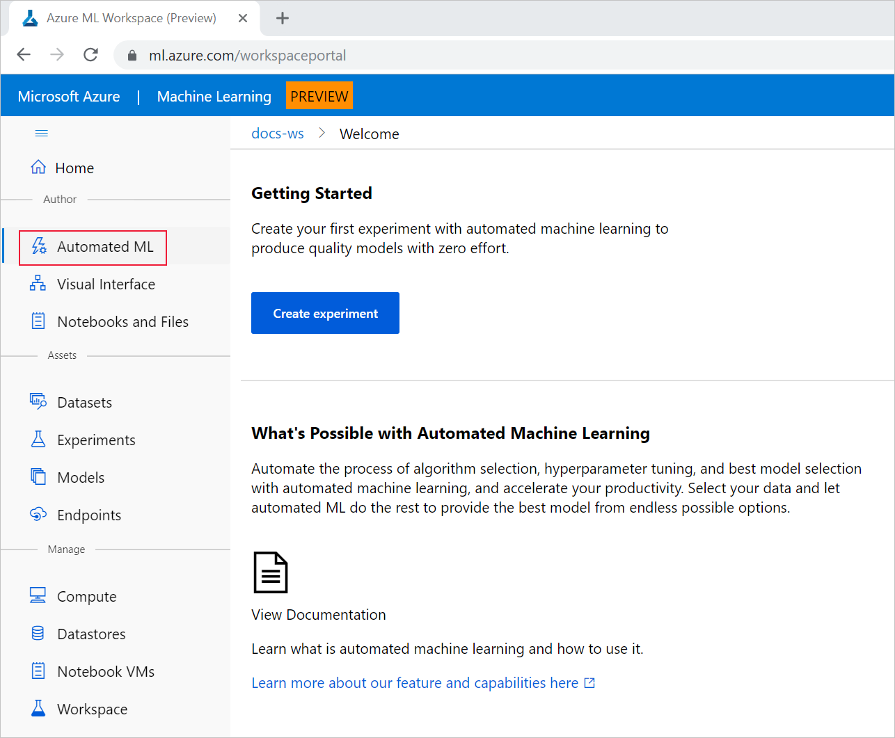
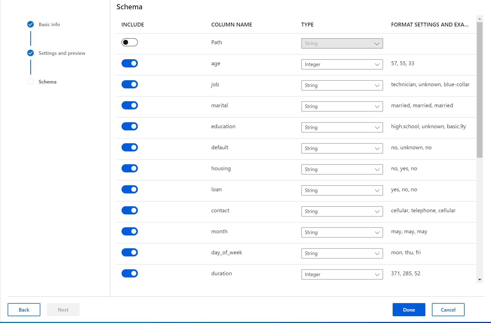

# Tutorial: Create your first classification model with automated machine learning

In this tutorial, you learn how to create your first automated machine learning experiment through the workspace landing page (preview) without writing a single line of code. This example creates a classification model to predict if a client will subscribe to a fixed term deposit with a financial institution.

With automated machine learning, you can automate away time intensive tasks. Automated machine learning rapidly iterates over many combinations of algorithms and hyperparameters to help you find the best model based on a success metric of your choosing.

In this tutorial, you learn how to do the following tasks:

> [!div class="checklist"]
> * Create an Azure Machine Learning service workspace.
> * Run an automated machine learning experiment.
> * View experiment details.
> * Deploy the model.

## Prerequisites

* An Azure subscription. If you don’t have an Azure subscription, create a [free account](https://aka.ms/AMLFree).

* Download the [**bankmarketing_train.csv**](https://automlsamplenotebookdata.blob.core.windows.net/automl-sample-notebook-data/bankmarketing_train.csv) data file. The **y** column indicates if a customer subscribed to a fixed term deposit, which is later identified as the target column for predictions in this tutorial. 

## Create a workspace

An Azure Machine Learning workspace is a foundational resource in the cloud that you use to experiment, train, and deploy machine learning models. It ties your Azure subscription and resource group to an easily consumed object in the service. 

You create a workspace via the Azure portal, a web-based console for managing your Azure resources. 

[!INCLUDE [aml-create-portal](../../../includes/aml-create-in-portal.md)]

>[!IMPORTANT] 
> Take note of your **workspace** and **subscription**. You'll need these to ensure you create your experiment in the right place. 

## Create and run the experiment

You complete the following experiment set-up and run steps in the workspace landing page, a consolidated interface that includes machine learning tools to perform data science scenarios for data science practitioners of all skill levels.

1. Sign in to the [workspace landing page](https://ml.azure.com/workspaceportal/).

1. Select your subscription and the workspace you created.

1. Select **Get started**.

1.  Select **Automated ML** under the **Authoring** section, on the left side pane.
You'll see the **Getting started** screen, since this is your first experiment with Automated Machine Learning.

    

1. Select **Create experiment**. 

1. Enter **my-1st-automl-experiment** as the experiment name.

1. Select **Create a new compute**. 

    1. Configure your compute context for this experiment.
        
        Field | Value
        ----|---
        Compute name |  Enter a unique name that identifies your compute context. For this example, use **automl-compute**.
        Virtual machine size| Select the virtual machine size for your compute. Use the default, **Standard_DS12_V2**.
        Additional settings| *Min node*: 1. To enable data profiling, you must have one or more nodes.   *Max node*: 6.
 
    1. To create your new compute, select **Create**. This takes a couple minutes to complete. 

    1. When creation is complete, select your new compute from the drop-down list, and then select **Next**.

    >[!NOTE]
    >For this tutorial,  you'll use the default storage account and container created with your new compute. They automatically populate in the form.

1. Select **Upload from local file**. From here, you create a new dataset with the **bankmarketing_train.csv** file you previously downloaded for this tutorial. 

    1. Select **Browse** and then select the **bankmarketing_train.csv** file on your local computer. 

    1. Give your dataset a unique name and provide an optional description. 

    1. Select **Next** to  upload it to the default container that was automatically set up during your workspace creation. Public preview supports only local file uploads. 

    1. When the upload is complete, the **Settings and preview** form is intelligently populated based on the file type. Ensure the form is populated as follows.
        
        Field|Value
        ---|---
        File format| Delimited
        Delimiter| Comma
        Encoding| UTF-8
        Column headers| All files have same headers
        Skip rows | None

        >[!NOTE]
        > If any of the settings on this form are updated the preview will update accordingly.

        Select **Next**.
    

    1. The **Schema** form allows for further configuration of your data for this experiment. For this example, select the toggle switch for the **day_of_week** feature, so as to not include it for this experiment. Select **Done**, to complete the file upload and creation of the dataset for your experiment.

        

        
1. Select **Classification** as the prediction task.

1. Select **y** as the target column, what you want to predict. This column indicates whether the client subscribed to a term deposit or not.

1. Expand **Advanced Settings** and populate the fields as follows.

    Advanced settings|Value
    ------|------
    Primary metric| AUC_weighted 
    Exit criteria| When any of these criteria are met, the training job ends before full completion:   *Training job time (minutes)*: 5    *Max number of iterations*: 10 
    Preprocessing| Enables preprocessing done by automated machine learning. This includes automatic data cleansing, preparing, and transformation to generate synthetic features.
    Validation| Select K-fold cross-validation and **2** for the number of cross-validations. 
    Concurrency| Select **5** for the number of max concurrent iterations.

   >[!NOTE]
   > For this experiment, you don't set a metric or max cores per iterations threshold. You also don't block algorithms from being tested.

1. Select **Start** to run the experiment.

   When the experiment starts, you see a blank screen with a status message at the top.

The experiment preparation process takes several minutes. When that process finishes, the status message changes to **Run is Running**.

##  View experiment details

As the experiment progresses, the screen updates the **Iteration chart** and **Iteration list** with the different iterations (models) that are run. The iterations list is in order by metric score. By default, the model that scores the highest based on our **AUC_weighted** metric is at the top of the list.

>[!WARNING]
> Training jobs take several minutes for each pipeline to finish running.

## Deploy the model

By using automated machine learning in the workspace landing page, you can deploy the best model as a web service to predict on new data and identify potential areas of opportunity. For this experiment, deployment means that the financial institution now has an iterative and scalable solution for identifying potential fixed term deposit customers.

In this experiment context, **VotingEnsemble** is considered the best model, based on the **AUC_weighted** metric.  We deploy this model, but be advised, deployment takes about 20 minutes to complete.

1. On the **Run Detail** page, select the **Deploy Best Model** button in the top-right corner.

1. Populate the **Deploy Best Model** pane as follows:

    Field| Value
    ----|----
    Deployment name| my-automl-deploy
    Deployment description| My first automated machine learning experiment deployment
    Scoring script| Autogenerate
    Environment script| Autogenerate
    
1. Select **Deploy**.

    A deployment complete message appears when deployment successfully finishes.
    
Now you have an operational web service to generate predictions.

## Clean up resources

Deployment files are larger than data and experiment files, so they cost more to store. Delete only the deployment files to minimize costs to your account, or if you want to keep your workspace and experiment files. Otherwise, delete the entire resource group, if you don't plan to use any of the files.  

### Delete the deployment instance

Delete just the deployment instance from the Azure portal, if you want to keep the resource group and workspace for other tutorials and exploration. 

1. Go to the [Azure portal](https://portal.azure.com//). Navigate to your workspace and  on the left under the **Assets** pane, select **Deployments**. 

1. Select the deployment you want to delete and select **Delete**. 

1. Select **Proceed**.

### Delete the resource group

[!INCLUDE [aml-delete-resource-group](../../../includes/aml-delete-resource-group.md)]

## Next steps

In this automated machine learning tutorial, you used the workspace landing page to create and deploy a classification model. See these articles for more information and next steps:

> [!div class="nextstepaction"]
> [Consume a web service](how-to-consume-web-service.md)

+ Learn more about [preprocessing](how-to-create-portal-experiments.md#preprocess).
+ Learn more about [data profiling](how-to-create-portal-experiments.md#profile).
+ Learn more about [automated machine learning](concept-automated-ml.md).

>[!NOTE]
> This Bank Marketing dataset is made available under the [Creative Commons (CCO: Public Domain) License](https://creativecommons.org/publicdomain/zero/1.0/). Any rights in individual contents of the database are licensed under the [Database Contents License](https://creativecommons.org/publicdomain/zero/1.0/) and available on [Kaggle](https://www.kaggle.com/janiobachmann/bank-marketing-dataset). This dataset was originally available within the [UCI Machine Learning Database](https://archive.ics.uci.edu/ml/datasets/bank+marketing).  
> [Moro et al., 2014] S. Moro, P. Cortez and P. Rita. A Data-Driven Approach to Predict the Success of Bank Telemarketing. Decision Support Systems, Elsevier, 62:22-31, June 2014.
