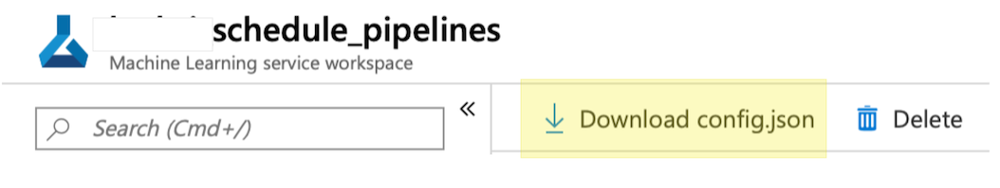
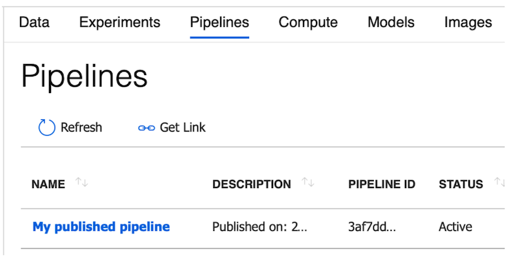
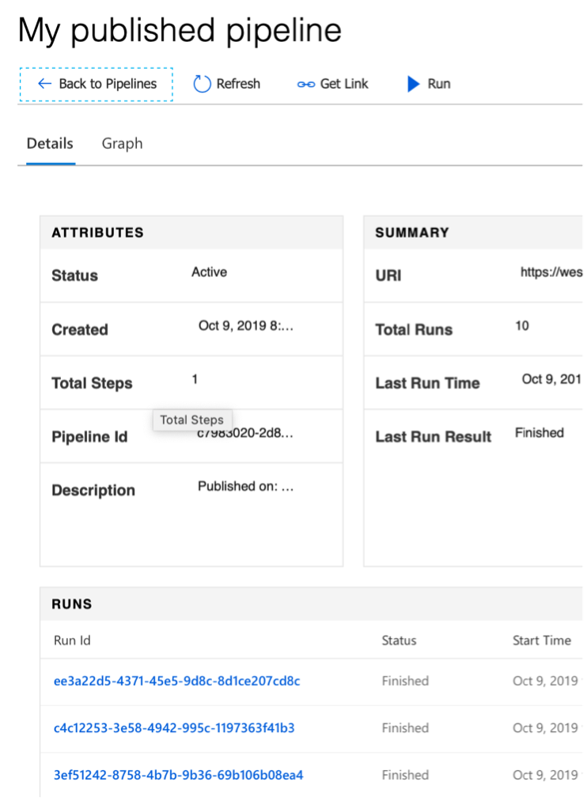

# Tutorial: Schedule machine learning pipelines with Azure Machine Learning SDK for Python

In this tutorial, you learn how to programmatically schedule a pipeline to run on Azure. The sample is a data manipulation task that simulates preprocessing and runs every few minutes. Other areas where scheduling might be beneficial include: 

* Data validation and preprocessing
* Training set augmentation
* Training 
* Model validation
* Drift analysis 
* Reporting 

In this tutorial, you will:

> [!div class="checklist"]
> * Create an Azure Machine Learning workspace
> * Write a data preprocessing script
> * Publish a pipeline encapsulating the script
> * Schedule the pipeline to run periodically
> * View the results of the pipeline experiment
> * Deactivate the pipeline

## Prerequisites

* An Azure subscription. If you don’t have an Azure subscription, create a [free account](https://aka.ms/AMLFree).

* A Python environment in which the Azure Machine Learning SDK for Python and Jupyter are installed. For more information, see [Create and manage reusable environments for training and deployment with Azure Machine Learning.](how-to-use-environments.md)

* Download the [Tutorial: Schedule Azure Machine Learning Pipelines](https://github.com/Azure/MachineLearningNotebooks/blob/master/tutorials/tutorial-pipeline-scheduling.ipynb) notebook. This notebook contains all the source code necessary to complete this tutorial. 

## Create a workspace

An Azure Machine Learning workspace is a foundational resource in the cloud that you use to experiment, train, and deploy machine learning models. It ties your Azure subscription and resource group to an easily consumed object in the service. 

You create a workspace via the Azure portal, a web-based console for managing your Azure resources. 

[!INCLUDE [aml-create-portal](../../../includes/aml-create-in-portal.md)]

### Allocate compute

* In your workspace, choose the **Compute** section.
* Select **+ Add Compute**.
* Name your selection `cpu-compute`.
* Select **Machine Learning Compute**.
* Select an inexpensive VM size, such as `Standard_D1_v2`.
* Leave the other values at their defaults.
* Select **Create** to allocate the resource.

>[!IMPORTANT] 
> Take note of your **workspace**, **resource_group**, and **subscription**. You'll need these to ensure you create your pipeline in the right place. 

## Write a data preprocessing script

You create and use an Azure Machine Learning pipeline to create a repeatable machine learning workflow. Generally, a pipeline will encapsulate a complex process such as data preparation or training. For this tutorial, we have an intentionally simplistic domain. We generate a **raw_data.csv** file that contains timestamped "votes" for a color. 

* Activate the Python environment in which you've installed the Azure Machine Learning SDK for Python. 

* In the directory in which you downloaded the notebook, start Jupyter: 

```shell
jupyter notebook
```

* In Jupyter, open **tutorial-pipeline-scheduling.ipynb** and execute the cells in the **Domain** and **Generating and Preprocessing** sections.

These cells, when run:

* Creates a subdirectory called **pipeline-scheduling-src**.
* Writes two files (**color.py** and **preprocessing.py**) to that subdirectory.
* Creates some fake data and stores it in **unprocessed_data.csv**.
* Reads that fake data, normalizes it, and writes it to **processed_data.csv**.

In a real ML scenario, **unprocessed_data.csv** would be coming in continuously from some upstream process: a Web service, the field, or sensors. Unlike this trivial sample, real-world data preparation is often time-consuming and periodically updating it is a good scenario for a pipeline.

 ## Publish a pipeline encapsulating the script

The next step is to create a pipeline. For a more in-depth explanation of the steps in this section, see [What are ML pipelines in Azure Machine Learning?](concept-ml-pipelines.md). 

* In your browser, navigate to the Machine Learning workspace.
* Download the workspace's **config.json** to the directory in which you are running the Jupyter notebook.



In the Jupyter notebook, continue to the **Authenticate** section and execute the cell:

```python
from azureml.core import Workspace 
ws = Workspace.from_config()
```

Import the various classes you need by executing the cells in the **Importing modules** section. Create a pipeline by executing the cells in the **Create a pipeline** section.

The first of the cells in the **Create a pipeline** section configures the compute resource that will be associated with your pipeline. In this case, we use the `cpu-compute` resource you allocated when creating the workspace. Our **preprocessing.py** script relies on scikit-learn for its data-normalization routines, so we create a custom `CondaDependencies` to make that package available to us. 

```python
def config_compute() :
    # Note that this is the same as compute allocated during Workspace initialization
    compute_target = ws.compute_targets["cpu-compute"]

    compute_config = RunConfiguration()
    compute_config.target = "amlcompute"
    compute_config.amlcompute.vm_size = "STANDARD_D1_V2"
    dependencies = CondaDependencies()
    dependencies.add_pip_package("scikit-learn")
    compute_config.environment.python.conda_dependencies = dependencies
    return (compute_target, compute_config)

(compute_target, compute_config) = config_compute()
```

Now, to build the `PythonScriptStep` that encapsulates our preprocessing data, run the next cell to: 

* Upload the contents of **pipeline-scheduling-src/** (**color.py** and **processing.py**).
* Set **preprocessing.py* as the main script the step will execute.
* Use the `compute_target` and `compute_config` set in the previous cell.

```python
preprocessing_step = PythonScriptStep(
    script_name="preprocessing.py",
    arguments=[],
    inputs=[],
    outputs=[],
    compute_target=compute_target,
    runconfig = compute_config,
    source_directory="./pipeline-scheduling-src/"
)
```

Most pipelines will have multiple steps, but ours is simple. The next cell creates a `Pipeline` in the workspace with the single `PythonScriptStep` defined in the previous cell.

```python
steps = [ preprocessing_step ]
pipeline = Pipeline(workspace=ws, steps=steps)
```

Pipelines run inside an `Experiment`. So the next cell creates an experiment within the workspace called "PipelineScheduling":

```python
experiment_name = "PipelineScheduling"
experiment = Experiment(ws, experiment_name) 
```

Finally, publish and run the `Pipeline`:

```python
pipeline_run = experiment.submit(pipeline)
pipeline_run.wait_for_completion()
```

## Schedule the pipeline to run periodically

In order to schedule a pipeline, you must:

* Publish the pipeline.
* Specify how you would like it to recur.
* Schedule it.

In the notebook, you can do these steps by executing the cells in the **Publish and schedule a pipeline** section. For demonstration purposes, the pipeline is set to run every 3 minutes. More realistically, a data preparation script might run once or twice a day. 

```python
published_pipeline = pipeline_run.publish_pipeline("My published pipeline",f"Published on: {str(datetime.now())}", "0.0.1")
recurrence = ScheduleRecurrence(frequency="Minute", interval=3)
schedule = Schedule.create(ws, name="MySchedule", pipeline_id=published_pipeline.id,
                          experiment_name=experiment_name, recurrence=recurrence)
print(schedule)
```

## View the results of the pipeline experiment

In your Web browser, navigate to your Machine Learning service workspace. From the **Assets** section of the navigation panel, choose **Pipelines**. This link takes you to a list of the pipelines published in the Workspace.



In this page you can see summary information about all the pipelines in the Workspace: names, descriptions, status, and so forth.

You can drill in by clicking on your pipeline:



Here you can get more details about your pipeline and can drill down into individual runs. 

You can also use the **Experiments** tab to get information via the `Experiment` you created ("PipelineScheduling").

## Deactivate the pipeline

If you have a `Pipeline` that is published, but not scheduled, you can disable it with:

```python
pipeline = PublishedPipeline.get(ws, id=pipeline_id)
pipeline.disable()
```

But if the pipeline is scheduled, you must cancel the schedule first. Retrieve the schedule's id from the portal or by running: 

```python
ss = Schedule.list(ws)
for s in ss : 
    print(s)
```

Once you have the `schedule_id` you wish to disable, run: 

```python
def stop_by_schedule_id(ws, schedule_id) : 
    s = next(s for s in Schedule.list(ws) if s.id == schedule_id)
    s.disable()
    return s

stop_by_schedule(ws, schedule_id)
```

If you then run `Schedule.list(ws)` again, you should get an empty list. 

### Delete the resource group

[!INCLUDE [aml-delete-resource-group](../../../includes/aml-delete-resource-group.md)]

## Next steps

In this tutorial, you used the Azure Machine Learning SDK for Python to create and configure an Azure Machine Learning pipeline. You then learned how to schedule that pipeline by publishing it, specifying how often it should be rerun, and creating a schedule. You saw how to use the portal to examine the experiment, pipeline, and individual runs of the pipeline. Finally, you learned how to disable a schedule so that the pipeline stops running. 

For more information, see:

> [!div class="nextstepaction"]
> [Use Azure Machine Learning Pipelines for batch scoring](tutorial-pipeline-batch-scoring-classification.md)

+ Learn more about [pipelines](concept-ml-pipelines.md).
+ Learn more about [exploring Azure Machine Learning with Jupyter](samples-notebooks.md).
