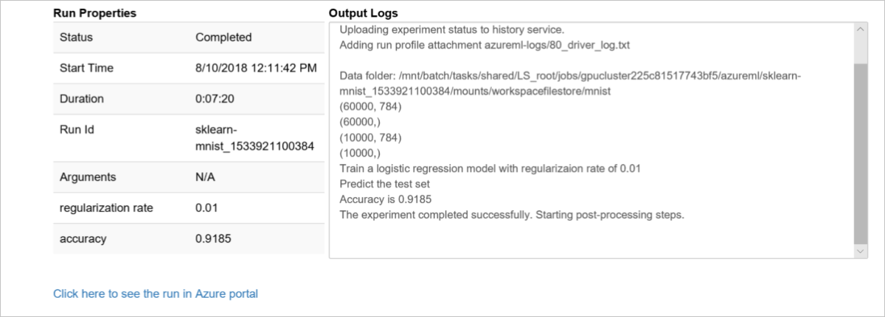

---
title: "Tutorial: Train an image classification model with Azure Machine Learning service"
description: This tutorial shows how to use Azure Machine Learning service to train an image classification model with scikit-learn in a Python Jupyter notebook. This tutorial is part one of a two-part series. 
services: machine-learning
ms.service: machine-learning
ms.component: core
ms.topic: tutorial

author: hning86
ms.author: haining
ms.reviewer: sgilley
ms.date: 09/24/2018
#Customer intent: As a professional data scientist, I can build an image classification model with Azure Machine Learning using Python in a Jupyter notebook.
---

# Tutorial #1: Train an image classification model with Azure Machine Learning service

In this tutorial, you train a machine learning model both locally and on remote compute resources. You'll use the training and deployment workflow for Azure Machine Learning service (preview) in a Python Jupyter notebook.  You can then use the notebook as a template to train your own machine learning model with your own data. This tutorial is **part one of a two-part tutorial series**.  

This tutorial trains a simple logistic regression using the [MNIST](http://yann.lecun.com/exdb/mnist/) dataset and [scikit-learn](http://scikit-learn.org) with Azure Machine Learning service.  MNIST is a popular dataset consisting of 70,000 grayscale images. Each image is a handwritten digit of 28x28 pixels, representing a number from 0 to 9. The goal is to create a multi-class classifier to identify the digit a given image represents. 

Learn how to:

> [!div class="checklist"]
> * Set up your development environment
> * Access and examine the data
> * Train a simple logistic regression locally using the popular scikit-learn machine learning library 
> * Train multiple models on a remote cluster
> * Review training results and register the best model

You'll learn how to select a model and deploy it in [part two of this tutorial](tutorial-deploy-models-with-aml.md) later. 

If you don’t have an Azure subscription, create a [free account](https://azure.microsoft.com/free/?WT.mc_id=A261C142F) before you begin.

## Get the notebook

For your convenience, this tutorial is available as a [Jupyter notebook](https://github.com/Azure/MachineLearningNotebooks/blob/master/tutorials/01.train-models.ipynb). Run the `01.train-models.ipynb` notebook either in Azure Notebooks or in your own Jupyter notebook server.

[!INCLUDE [aml-clone-in-azure-notebook](../../../includes/aml-clone-in-azure-notebook.md)]

>[!NOTE]
> This tutorial was tested with Azure Machine Learning SDK version 0.168 

## Set up your development environment

All the setup for your development work can be accomplished in a Python notebook.  Setup includes:

* Importing Python packages
* Connecting to a workspace to enable communication between your local computer and remote resources
* Creating an experiment to track all your runs
* Creating a remote compute target to use for training

### Import packages

Import Python packages you need in this session. Also display the Azure Machine Learning SDK version.

```python
%matplotlib inline
import numpy as np
import matplotlib
import matplotlib.pyplot as plt

import azureml
from azureml.core import Workspace, Run

# check core SDK version number
print("Azure ML SDK Version: ", azureml.core.VERSION)
```

### Connect to workspace

Create a workspace object from the existing workspace. `Workspace.from_config()` reads the file **config.json** and loads the details into an object named `ws`.

```python
# load workspace configuration from the config.json file in the current folder.
ws = Workspace.from_config()
print(ws.name, ws.location, ws.resource_group, ws.location, sep = '\t')
```

### Create experiment

Create an experiment to track the runs in your workspace. A workspace can have multiple experiments. 

```python
experiment_name = 'sklearn-mnist'

from azureml.core import Experiment
exp = Experiment(workspace=ws, name=experiment_name)
```

### Create remote compute target

Azure Batch AI is a managed service that enables data scientists to train machine learning models on clusters of Azure virtual machines, including VMs with GPU support.  In this tutorial, you create an Azure Batch AI cluster as your training environment. This code creates a cluster for you if it does not already exist in your workspace. 

 **Creation of the cluster takes approximately 5 minutes.** If the cluster is already in the workspace this code uses it and skips the creation process.


```python
from azureml.core.compute import ComputeTarget, BatchAiCompute
from azureml.core.compute_target import ComputeTargetException

# choose a name for your cluster
batchai_cluster_name = "traincluster"

try:
    # look for the existing cluster by name
    compute_target = ComputeTarget(workspace=ws, name=batchai_cluster_name)
    if type(compute_target) is BatchAiCompute:
        print('found compute target {}, just use it.'.format(batchai_cluster_name))
    else:
        print('{} exists but it is not a Batch AI cluster. Please choose a different name.'.format(batchai_cluster_name))
except ComputeTargetException:
    print('creating a new compute target...')
    compute_config = BatchAiCompute.provisioning_configuration(vm_size="STANDARD_D2_V2", # small CPU-based VM
                                                                #vm_priority='lowpriority', # optional
                                                                autoscale_enabled=True,
                                                                cluster_min_nodes=0, 
                                                                cluster_max_nodes=4)

    # create the cluster
    compute_target = ComputeTarget.create(ws, batchai_cluster_name, compute_config)
    
    # can poll for a minimum number of nodes and for a specific timeout. 
    # if no min node count is provided it uses the scale settings for the cluster
    compute_target.wait_for_completion(show_output=True, min_node_count=None, timeout_in_minutes=20)
    
    # Use the 'status' property to get a detailed status for the current cluster. 
    print(compute_target.status.serialize())
```

You now have the necessary packages and compute resources to train a model in the cloud. 

## Explore data

Before you train a model, you need to understand the data that you are using to train it.  You also need to copy the data into the cloud so it can be accessed by your cloud training environment.  In this section you learn how to:

* Download the MNIST dataset
* Display some sample images
* Upload data to the cloud

### Download the MNIST dataset

Download the MNIST dataset and save the files into a `data` directory locally.  Images and labels for both training and testing are downloaded.  


```python
import os
import urllib.request

os.makedirs('./data', exist_ok = True)

urllib.request.urlretrieve('http://yann.lecun.com/exdb/mnist/train-images-idx3-ubyte.gz', filename='./data/train-images.gz')
urllib.request.urlretrieve('http://yann.lecun.com/exdb/mnist/train-labels-idx1-ubyte.gz', filename='./data/train-labels.gz')
urllib.request.urlretrieve('http://yann.lecun.com/exdb/mnist/t10k-images-idx3-ubyte.gz', filename='./data/test-images.gz')
urllib.request.urlretrieve('http://yann.lecun.com/exdb/mnist/t10k-labels-idx1-ubyte.gz', filename='./data/test-labels.gz')
```

### Display some sample images

Load the compressed files into `numpy` arrays. Then use `matplotlib` to plot 30 random images from the dataset with their labels above them. Note this step requires a `load_data` function that's included in the `util.py` file. This file is included in the sample folder. Please make sure it is placed in the same folder as this notebook. The `load_data` function  parses the compresse files into numpy arrays.


```python
# make sure utils.py is in the same directory as this code
from utils import load_data

# note we also shrink the intensity values (X) from 0-255 to 0-1. This helps the model converge faster.
X_train = load_data('./data/train-images.gz', False) / 255.0
y_train = load_data('./data/train-labels.gz', True).reshape(-1)

X_test = load_data('./data/test-images.gz', False) / 255.0
y_test = load_data('./data/test-labels.gz', True).reshape(-1)

# now let's show some randomly chosen images from the traininng set.
count = 0
sample_size = 30
plt.figure(figsize = (16, 6))
for i in np.random.permutation(X_train.shape[0])[:sample_size]:
    count = count + 1
    plt.subplot(1, sample_size, count)
    plt.axhline('')
    plt.axvline('')
    plt.text(x=10, y=-10, s=y_train[i], fontsize=18)
    plt.imshow(X_train[i].reshape(28, 28), cmap=plt.cm.Greys)
plt.show()
```

A random sample of images displays:


Now you have an idea of what these images look like and the expected prediction outcome.

### Upload data to the cloud

Now make the data accessible remotely by uploading that data from your local machine into Azure so it can be accessed for remote training. The datastore is a convenient construct associated with your workspace for you to upload/download data, and interact with it from your remote compute targets. It is backed by Azure blob storage account.

The MNIST files are uploaded into a directory named `mnist` at the root of the datastore.

```python
ds = ws.get_default_datastore()
print(ds.datastore_type, ds.account_name, ds.container_name)

ds.upload(src_dir='./data', target_path='mnist', overwrite=True, show_progress=True)
```
You now have everything you need to start training a model. 

## Train a model locally

Train a simple logistic regression model from scikit-learn locally.

**Training locally can take a minute or two** depending on your computer configuration.

```python
%%time
from sklearn.linear_model import LogisticRegression

clf = LogisticRegression()
clf.fit(X_train, y_train)
```

Next, make predictions using the test set and calculate the accuracy. 

```python
y_hat = clf.predict(X_test)
print(np.average(y_hat == y_test))
```

The local model accuracy displays:

`0.9202`

With just a few lines of code, you have a 92% accuracy.

## Train on a remote cluster

Now you can expand on this simple model by building a model with a different regularization rate. This time you'll train the model on a remote resource.  

For this task, submit the job to the remote training cluster you set up earlier.  To submit a job you:
* Create a directory
* Create a training script
* Create an estimator
* Submit the job 

### Create a directory

Create a directory to deliver the necessary code from your computer to the remote resource.

```python
import os
script_folder = './sklearn-mnist'
os.makedirs(script_folder, exist_ok=True)
```

### Create a training script

To submit the job to the cluster, first create a training script. Run the following code to create the training script called `train.py` in the directory you just created. This training adds a regularization rate to the training algorithm, so produces a slightly different model than the local version.

```python
%%writefile $script_folder/train.py

import argparse
import os
import numpy as np

from sklearn.linear_model import LogisticRegression
from sklearn.externals import joblib

from azureml.core import Run
from utils import load_data

# let user feed in 2 parameters, the location of the data files (from datastore), and the regularization rate of the logistic regression model
parser = argparse.ArgumentParser()
parser.add_argument('--data-folder', type=str, dest='data_folder', help='data folder mounting point')
parser.add_argument('--regularization', type=float, dest='reg', default=0.01, help='regularization rate')
args = parser.parse_args()

data_folder = os.path.join(args.data_folder, 'mnist')
print('Data folder:', data_folder)

# load train and test set into numpy arrays
# note we scale the pixel intensity values to 0-1 (by dividing it with 255.0) so the model can converge faster.
X_train = load_data(os.path.join(data_folder, 'train-images.gz'), False) / 255.0
X_test = load_data(os.path.join(data_folder, 'test-images.gz'), False) / 255.0
y_train = load_data(os.path.join(data_folder, 'train-labels.gz'), True).reshape(-1)
y_test = load_data(os.path.join(data_folder, 'test-labels.gz'), True).reshape(-1)
print(X_train.shape, y_train.shape, X_test.shape, y_test.shape, sep = '\n')

# get hold of the current run
run = Run.get_context()

print('Train a logistic regression model with regularizaion rate of', args.reg)
clf = LogisticRegression(C=1.0/args.reg, random_state=42)
clf.fit(X_train, y_train)

print('Predict the test set')
y_hat = clf.predict(X_test)

# calculate accuracy on the prediction
acc = np.average(y_hat == y_test)
print('Accuracy is', acc)

run.log('regularization rate', np.float(args.reg))
run.log('accuracy', np.float(acc))

os.makedirs('outputs', exist_ok=True)
# note file saved in the outputs folder is automatically uploaded into experiment record
joblib.dump(value=clf, filename='outputs/sklearn_mnist_model.pkl')
```

Notice how the script gets data and saves models:

+ The training script reads an argument to find the directory containing the data.  When you submit the job later, you point to the datastore for this argument:
`parser.add_argument('--data-folder', type = str, dest = 'data_folder', help = 'data directory mounting point')`

    
+ The training script saves your model into a directory named outputs. <br/>
`joblib.dump(value = clf, filename = 'outputs/sklearn_mnist_model.pkl')`<br/>
Anything written in this directory is automatically uploaded into your workspace. You'll access your model from this directory later in the tutorial.

The file `utils.py` is referenced from the training script to load the dataset correctly.  Copy this script into the script folder so that it can be accessed along with the training script on the remote resource.


```python
import shutil
shutil.copy('utils.py', script_folder)
```


### Create an estimator

An estimator object is used to submit the run.  Create your estimator by running the following code to define:

* The name of the estimator object, `est`
* The directory that contains your scripts. All the files in this directory are uploaded into the cluster nodes for execution. 
* The compute target.  In this case you will use the Batch AI cluster you created
* The training script name, train.py
* Parameters required from the training script 
* Python packages needed for training

In this tutorial, this target is the Batch AI cluster. All files in the project directory are uploaded into the cluster nodes for execution. The data_folder is set to use the datastore (`ds.as_mount()`).

```python
from azureml.train.estimator import Estimator

script_params = {
    '--data-folder': ds.as_mount(),
    '--regularization': 0.8
}

est = Estimator(source_directory=script_folder,
                script_params=script_params,
                compute_target=compute_target,
                entry_script='train.py',
                conda_packages=['scikit-learn'])
```


### Submit the job to the cluster

Run the experiment by submitting the estimator object.

```python
run = exp.submit(config=est)
run
```

Since the call is asynchronous, it returns a **Preparing** or **Running** state as soon as the job is started.

## Monitor a remote run

In total, the first run takes **approximately 10 minutes**. But for subsequent runs, as long as the script dependencies don't change, the same image is reused and hence the container start up time is much faster.

Here is what's happening while you wait:

- **Image creation**: A Docker image is created matching the Python environment specified by the estimator. The image is uploaded to the workspace. Image creation and uploading takes **about 5 minutes**. 

  This stage happens once for each Python environment since the container is cached for subsequent runs.  During image creation, logs are streamed to the run history. You can monitor the image creation progress using these logs.

- **Scaling**: If the remote cluster requires more nodes to execute the run than currently available, additional nodes are added automatically. Scaling typically takes **about 5 minutes.**

- **Running**: In this stage, the necessary scripts and files are sent to the compute target, then data stores are mounted/copied, then the entry_script is run. While the job is running, stdout and the ./logs directory are streamed to the run history. You can monitor the run's progress using these logs.

- **Post-Processing**: The ./outputs directory of the run is copied over to the run history in your workspace so you can access these results.


You can check the progress of a running job in multiple ways. This tutorial uses a Jupyter widget as well as a `wait_for_completion` method. 

### Jupyter widget

Watch the progress of the run with a Jupyter widget.  Like the run submission, the widget is asynchronous and provides live updates every 10-15 seconds until the job completes.


```python
from azureml.train.widgets import RunDetails
RunDetails(run).show()
```

Here is a still snapshot of the widget shown at the end of training:



### Get log results upon completion

Model training and monitoring happen in the background. Wait until the model has completed training before running more code. Use `wait_for_completion` to show when the model training is complete. 


```python
run.wait_for_completion(show_output=False) # specify True for a verbose log
```

### Display run results

You now have a model trained on a remote cluster.  Retrieve the accuracy of the model:

```python
print(run.get_metrics())
```
The output shows the remote model has an accuracy slightly higher than the local model, due to the addition of the regularization rate during training.  

`{'regularization rate': 0.8, 'accuracy': 0.9204}`

In the deployment tutorial you will explore this model in more detail.

## Register model

The last step in the training script wrote the file `outputs/sklearn_mnist_model.pkl` in a directory named `outputs` in the VM of the cluster where the job is executed. `outputs` is a special directory in that all content in this  directory is automatically uploaded to your workspace.  This content appears in the run record in the experiment under your workspace. Hence, the model file is now also available in your workspace.

You can see files associated with that run.

```python
print(run.get_file_names())
```

Register the model in the workspace so that you (or other collaborators) can later query, examine, and deploy this model.

```python
# register model 
model = run.register_model(model_name='sklearn_mnist', model_path='outputs/sklearn_mnist_model.pkl')
print(model.name, model.id, model.version, sep = '\t')
```

## Clean up resources

[!INCLUDE [aml-delete-resource-group](../../../includes/aml-delete-resource-group.md)]

You can also  delete just the Azure Managed Compute cluster. However, since autoscale is turned on and the cluster minimum is 0, this particular resource will not incur additional compute charges when not in use.


```python
# optionally, delete the Azure Managed Compute cluster
compute_target.delete()
```

## Next steps

In this Azure Machine Learning service tutorial, you used Python to:

> [!div class="checklist"]
> * Set up your development environment
> * Access and examine the data
> * Train a simple logistic regression locally using the popular scikit-learn machine learning library
> * Train multiple models on a remote cluster
> * Review training details and register the best model

You are ready to deploy this registered model using the instructions in the next part of the tutorial series:

> [!div class="nextstepaction"]
> [Tutorial 2 - Deploy models](tutorial-deploy-models-with-aml.md)
