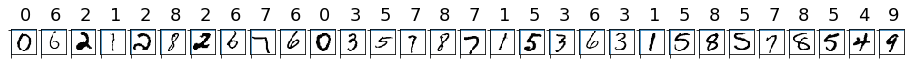

---
title: Build and train models in Azure Machine Learning
description: This tutorial shows how to use Azure Machine Learning services to build and train the MNIST dataset using TensorFlow with Azure Machine Learning in Python.
services: machine-learning
ms.service: machine-learning
ms.component: core
ms.topic: quickstart

author: hning86
ms.author: haining
ms.reviewer: jmartens
ms.date: 7/27/2018
---

# Tutorial #1: Train a model on Azure Machine Learning with the MNIST dataset and TensorFlow

In this tutorial, you will train a simple deep neural network (DNN) using the [MNIST](https://en.wikipedia.org/wiki/MNIST_database) dataset and TensorFlow with Azure Machine Learning. MNIST is a popular dataset consisting of 70,000 grayscale images. Each image is a handwritten digit of 28x28 pixels, representing number from 0 to 9. The goal is to create a multi-class classifier to identify the digit each image represents, and deploy it as a web service in Azure. Deployment is covered in second part of this two part tutorial.

This tutorial is **part one of a two-part series**. In this tutorial, you walk through the basics of Azure Machine Learning services (preview) and learn how to:

> [!div class="checklist"]
> * Build a DNN in TensorFlow
> * Configure a compute target for training
> * Train the model
> * Submit a job to a target
> * Review run histories and accuracy

You'll learn how to select a model and deploy it in [part two of this tutorial](tutorial-deploy-models-with-aml.md) later.


## Prerequisites
To complete this tutorial, you need the following prerequisites.

1. An Azure subscription. If you don't have a subscription yet, create a [free account](https://azure.microsoft.com/free/?WT.mc_id=A261C142F) before you begin.

1. The following resources and assets must be available:
   - [Python 3.5 or higher](https://www.python.org/) installed
   - A package manager, such as [Continuum Anaconda](https://anaconda.org/anaconda/continuum-docs) or [Miniconda](https://conda.io/miniconda.html), installed
   - The Azure Machine Learning SDK for Python installed
   - An Azure Machine Learning Workspace named docs-ws 
   - A project directory on your local machine named docs-prj

   If these are not yet created or installed, then follow the steps in the [Get started with Azure Machine Learning Services](quickstart-get-started.md) article.

1. The following package dependencies (tensorflow, matplotlib, and numpy) installed in the conda environment in which you installed the Azure Machine Learning SDK.
   ```
   conda install -y matplotlib tensorflow
   ``` 

## Get the sample notebook

To try the whole example out yourself, download and run [this Jupyter notebook](https://aka.ms/aml-packages/vision/notebooks/image_classification).

To connect a notebook server to the conda environment for Azure Machine Learning, do the following:
```
#go to the directory containing the tutorial notebook
cd <notebook-directory>
#install the jupyter package if not installed
pip3 install jupyter
#start up the notebook server
jupyter notebook
```

## Import package dependencies

Import the package dependencies for this tutorial.

```python
%matplotlib inline
import numpy as np
import matplotlib
import matplotlib.pyplot as plt

import azureml
from azureml.core import Workspace, Project, Run  
```

## Get the sample data

### Download the sample data

Download the MNIST dataset from Yan LeCun's web site directly and save the dataset in a local data folder called `tutorial-data`.

```python
import os
import urllib

os.makedirs('./tutorial-data', exist_ok = True)

urllib.request.urlretrieve('http://yann.lecun.com/exdb/mnist/train-images-idx3-ubyte.gz', filename = './tutorial-data/train-images.gz')
urllib.request.urlretrieve('http://yann.lecun.com/exdb/mnist/train-labels-idx1-ubyte.gz', filename = './tutorial-data/train-labels.gz')
urllib.request.urlretrieve('http://yann.lecun.com/exdb/mnist/t10k-images-idx3-ubyte.gz', filename = './tutorial-data/test-images.gz')
urllib.request.urlretrieve('http://yann.lecun.com/exdb/mnist/t10k-labels-idx1-ubyte.gz', filename = './tutorial-data/test-labels.gz')
```

### Explore some sample images

@@WHERE DID THIS FILE COME FROM??

Load the downloaded compressed file into `numpy` arrays using utility functions from the `utils.py` library file from the current folder. 

Then, shrink the intensity values (X) from 0-255 to 0-1 to help the neural network converge faster. 

Finally, plot 30 random images from the dataset with their labels over them using `matplotlib`.

```python
from utils import load_data

X_train = load_data('./data/train-images.gz', False) / 255.0
y_train = load_data('./data/train-labels.gz', True).reshape(-1)

X_test = load_data('./data/test-images.gz', False) / 255.0
y_test = load_data('./data/test-labels.gz', True).reshape(-1)

count = 0
sample_size = 30
plt.figure(figsize = (16, 6))
for i in np.random.permutation(X_train.shape[0])[:sample_size]:
    count = count + 1
    plt.subplot(1, sample_size, count)
    plt.axhline('')
    plt.axvline('')
    plt.text(x = 10, y = -10, s = y_train[i], fontsize = 18)
    plt.imshow(X_train[i].reshape(28, 28), cmap = plt.cm.Greys)
plt.show()
```

The output resembles the following image.



## Get the right workspace and project

1. what directory should i be in?
1. load =the right workspace 
1. Get the right project @@@@@ 
1. HOW DO YOU DO THAT??


## Upload dataset to the default datastore 

Upload the MNIST dataset to the default datastore in the Azure blob storage account. A blob storage account was created automatically when you created your workspace.

```python
ds.upload(src_dir = './data', target_path = 'mnist', overwrite = True)
```

Output returned should look like this:

    $AZUREML_DATAREFERENCE_my_file_datastore_941bacd62925442eb51c98407515f967

## Create a Batch AI cluster and define it as target

Create a new Batch AI cluster and register the cluster as a compute target in your workspace.  

```python
from azureml.core.compute import BatchAiCompute

# choose a name for your cluster
batchai_cluster_name = "gpucluster"

found = False

print('creating a new compute target...')
provisioning_config = BatchAiCompute.provisioning_configuration(vm_size = "STANDARD_NC6", # NC6 is GPU-enabled
                            #vm_priority = 'lowpriority', # optional
                            autoscale_enabled = True,
                            cluster_min_nodes = 1, 
                            cluster_max_nodes = 4)

# create the cluster
compute_target = ws.create_compute_target(batchai_cluster_name, provisioning_config)
compute_target.wait_for_provisioning(show_output = True, min_node_count = None, timeout_in_minutes = 20)
    
# Show current status of Batch AI cluster using 'status' property
print(compute_target.status.serialize())
```

## Clean up resources

[!INCLUDE [aml-delete-resource-group](../../../includes/aml-delete-resource-group.md)]

## Next steps

In this Azure Machine Learning tutorial, you used Python to:
> [!div class="checklist"]
> * Create a Batch AI cluster 
> * Load data into the default blob storage
> * Train a model locally

You are ready to move on to the next part in the tutorial series, where you learn how to build an Azure Machine Learning model:
> [!div class="nextstepaction"]
> [Tutorial 2 - Deploy models](tutorial-deploy-models-with-aml.md)