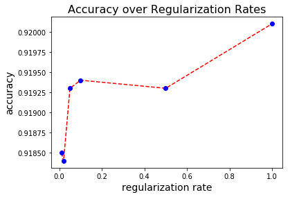

---
title: Train an image classification model with Azure Machine Learning
description: This tutorial shows how to use Azure Machine Learning service to train an image classification model with scikit-learn in a Python Jupyter notebook. 
services: machine-learning
ms.service: machine-learning
ms.component: core
ms.topic: tutorial

author: hning86
ms.author: haining
ms.reviewer: sgilley
ms.date: 09/24/2018
#Customer intent: As a professional data scientist, I can build an image classification model with Azure Machine Learning using Python in a Jupyter notebook.
---


# Tutorial #1: Train an image classification model with Azure Machine Learning

In this tutorial, you will train a machine learning model both locally and on remote compute resources. You'll use the training and deployment workflow for Azure Machine Learning service (preview).  This tutorial is **part one of a two-part tutorial series**.  

You'll learn how to:

> [!div class="checklist"]
> * Set up your development environment
> * Access and examine the data
> * Train a simple logistic regression locally using the popular scikit-learn machine learning library 
> * Train multiple models on a remote GPU cluster
> * Review training results and register the best model

You'll train a simple logistic regression using the [MNIST](http://yann.lecun.com/exdb/mnist/) dataset and [scikit-learn](scikit-learn.org) with Azure Machine Learning.  MNIST is a popular dataset consisting of 70,000 grayscale images. Each image is a handwritten digit of 28x28 pixels, representing a number from 0 to 9. The goal is to create a multi-class classifier to identify the digit a given image represents. 

You'll learn how to select a model and deploy it in [part two of this tutorial](tutorial-deploy-models-with-aml.md) later. 

If you don’t have an Azure subscription, create a [free account](https://azure.microsoft.com/free/?WT.mc_id=A261C142F) before you begin.

## Prerequisites

1. The following resources and assets must be available:
   - [Python 3.5 or higher](https://www.python.org/) installed
   - A package manager, such as [Continuum Anaconda](https://anaconda.org/anaconda/continuum-docs) or [Miniconda](https://conda.io/miniconda.html), installed
   - The Azure Machine Learning SDK for Python installed
   - An Azure Machine Learning workspace.  
   - A `config.json` file, that contains Azure subscription information for the workspace. This file is located in a directory named `aml_config`.  

   If these are not yet created or installed, follow the steps in the [Get started with Azure Machine Learning Services](quickstart-get-started.md) article.

1. The following package dependencies (matplotlib and scikit-learn) must also be installed in the conda environment in which you installed the Azure Machine Learning SDK.

   ```
   conda install -y matplotlib scikit-learn
   ``` 

1. The file [utils.py](https://aka.ms/aml-file-utils-py) downloaded into the same directory as `aml_config`.

## Get the sample notebook

To try the whole example yourself, download [this Jupyter notebook](https://aka.ms/aml-notebook-train-model) into the same directory as `aml_config` and `utils.py`.

To run the notebook, execute these commands in your activated conda environment:

```
#go to the directory containing the tutorial notebook
cd <path to docs-prj directory>

#install a conda-aware Jupyter Notebook server if necessary
conda install nb_conda

#start up the notebook server
jupyter notebook
```

## Set up your development environment

All the setup for your development work can be accomplished in Python. You will:

* Import Python modules
* Configure a workspace to enable communication between your local computer and remote resources
* Create a directory to store training scripts
* Create a remote compute target to use for training

### Import modules

Import Python modules you'll need in this session. Also display the Azure Machine Learning SDK version.

```python
%matplotlib inline
import numpy as np
import matplotlib
import matplotlib.pyplot as plt

import azureml
from azureml.core import Workspace, Project, Run

# check core SDK version number
print("Azure ML SDK Version: ", azureml.core.VERSION)
```

### Load workspace

Create a workspace object from the existing workspace. When the workspace was created, you saved a file into `aml_config\config.json`. `Workspace.from_config()` will read this file and load the workspace into an object named `ws`.  You'll use `ws` throughout the rest of the code in this tutorial.

```python
ws = Workspace.from_config()
print(ws.name, ws.location, ws.resource_group, ws.location, sep = '\t')
```

### Create directory

Once you have a workspace object, specify a name for the experiment and register the local directory that contains the scripts with the workspace.  This directory will be used to deliver the necessary code from your computer to the cloud later in this tutorial. The history of all runs will be recorded under the specified run history.


```python
# create a new project or get hold of an existing one.
history_name = 'sklearn-mnist'
proj = Project.attach(history_name = history_name, directory = './sklearn-mnist-proj', workspace_object = ws)
# show project details
proj.get_details()
```

### Create remote compute target

Azure Batch AI Cluster is a managed service that enables data scientists to train machine learning models on clusters of Azure virtual machines, including VMs with GPU support.  In this tutorial, you will create an Azure Batch AI cluster as your training environment. This code will create a cluster for you if it does not already exist in your workspace. 

> [!IMPORTANT]
> **Creation of the cluster will take approximately 5 minutes.** If the cluster is already in the workspace this code uses it and skips the creation process.


```python
from azureml.core.compute import ComputeTarget, BatchAiCompute
from azureml.core.compute_target import ComputeTargetException

# choose a name for your cluster
batchai_cluster_name = "gpucluster2"

try:
    compute_target = ComputeTarget(workspace = ws, name = batchai_cluster_name)
    print('found compute target. just use it.')
except ComputeTargetException:
    print('creating a new compute target...')
    provisioning_config = BatchAiCompute.provisioning_configuration(vm_size = "STANDARD_NC6", # NC6 is GPU-enabled
                                                                #vm_priority = 'lowpriority', # optional
                                                                autoscale_enabled = True,
                                                                cluster_min_nodes = 1, 
                                                                cluster_max_nodes = 4)

    # create the cluster
    compute_target = ComputeTarget.create(ws, batchai_cluster_name, provisioning_config)
    
    # can poll for a minimum number of nodes and for a specific timeout. 
    # if no min node count is provided it will use the scale settings for the cluster
    compute_target.wait_for_provisioning(show_output = True, min_node_count = None, timeout_in_minutes = 20)
    
     # For a more detailed view of current Batch AI cluster status, use the 'status' property    
    print(compute_target.status.serialize())
```
You now have the necessary modules and compute resources to train a model in the cloud. 

## Explore data

Before you train a model, you need to understand the data that you are using to train it.  You also need to copy the data into the cloud so it can be accessed by your cloud training environment.  In this section you will:

* Download the MNIST dataset
* Display some sample images
* Upload data to the cloud

### Download the MNIST dataset

Download the MNIST dataset and save them in a `data` directory locally.  Both training and testing images and labels are downloaded.  


```python
import os
import urllib

os.makedirs('./data', exist_ok = True)

urllib.request.urlretrieve('http://yann.lecun.com/exdb/mnist/train-images-idx3-ubyte.gz', filename = './data/train-images.gz')
urllib.request.urlretrieve('http://yann.lecun.com/exdb/mnist/train-labels-idx1-ubyte.gz', filename = './data/train-labels.gz')
urllib.request.urlretrieve('http://yann.lecun.com/exdb/mnist/t10k-images-idx3-ubyte.gz', filename = './data/test-images.gz')
urllib.request.urlretrieve('http://yann.lecun.com/exdb/mnist/t10k-labels-idx1-ubyte.gz', filename = './data/test-labels.gz')
```

### Display some sample images

Load the compressed files into `numpy` arrays. Then use `matplotlib` to plot 30 random images from the dataset with their labels above them.


```python
from utils import load_data

# note we also shrink the intensity values (X) from 0-255 to 0-1. This helps the model converge faster.
X_train = load_data('./data/train-images.gz', False) / 255.0
y_train = load_data('./data/train-labels.gz', True).reshape(-1)

X_test = load_data('./data/test-images.gz', False) / 255.0
y_test = load_data('./data/test-labels.gz', True).reshape(-1)

count = 0
sample_size = 30
plt.figure(figsize = (16, 6))
for i in np.random.permutation(X_train.shape[0])[:sample_size]:
    count = count + 1
    plt.subplot(1, sample_size, count)
    plt.axhline('')
    plt.axvline('')
    plt.text(x = 10, y = -10, s = y_train[i], fontsize = 18)
    plt.imshow(X_train[i].reshape(28, 28), cmap = plt.cm.Greys)
plt.show()
```


Now you have an idea of what these images look like and the expected prediction outcome.

### Upload data to the cloud

Now you can make the data accessible remotely by uploading that data from your local machine into the cloud so it can be accessed for remote training. The datastore is a convenient construct associated with your workspace for you to upload/download data, and interact with it from your remote compute targets. (If your data is already stored in Azure, you would not need this step.)

The MNIST files are uploaded into a directory named `mnist` at the root of the datastore.

```python
ds = ws.get_default_datastore()
print(ds.datastore_type, ds.account_name, ds.container_name)

ds.upload(src_dir = './data', target_path = 'mnist', overwrite = True, show_progress = True)
```
You now have everything you need to start training a model. 

## Train a local model

Train a simple logistic regression model from scikit-learn locally.

> [!IMPORTANT]
> **Training locally can take a minute or two** depending on your computer configuration.

```python
%%time
from sklearn.linear_model import LogisticRegression

clf = LogisticRegression()
clf.fit(X_train, y_train)
```

Next, make predictions using the test set and calculate the accuracy. 

```python
y_hat = clf.predict(X_test)
print(np.average(y_hat == y_test))
```

    0.9202

With almost no effort, you have a 92% accuracy.

## Train on a remote cluster

Now you can expand on this simple model by building multiple versions of the model with different regularization rates.  

For this task, submit the job to the Batch AI cluster you set up earlier so you can:
* Create a training script
* Create an estimator
* Submit job 

### Create a training script

To submit the job to the cluster, you need to create a training script. Run the following code to create the training script called `train.py` in a place the workspace can find it.

```python
%%writefile $proj.project_directory/train.py

import argparse
import os
import numpy as np

from sklearn.linear_model import LogisticRegression
from sklearn.externals import joblib

from azureml.core import Run
from utils import load_data

# let user feed in 2 parameters, the location of the data files (from datastore), and the regularization rate of the logistic regression model
parser = argparse.ArgumentParser()
parser.add_argument('--data-directory', type = str, dest = 'data_directory', help = 'data directory mounting point')
parser.add_argument('--regularization', type = float, dest = 'reg', default = 0.01, help = 'regularization rate')
args = parser.parse_args()

data_directory = os.path.join(args.data_directory, 'mnist')
print('Data directory:', data_directory)

# load train and test set into numpy arrays
# note we scale the pixel intensity values to 0-1 (by dividing it with 255.0) so the model can converge faster.
X_train = load_data(os.path.join(data_directory, 'train-images.gz'), False) / 255.0
X_test = load_data(os.path.join(data_directory, 'test-images.gz'), False) / 255.0
y_train = load_data(os.path.join(data_directory, 'train-labels.gz'), True).reshape(-1)
y_test = load_data(os.path.join(data_directory, 'test-labels.gz'), True).reshape(-1)
print(X_train.shape, y_train.shape, X_test.shape, y_test.shape, sep = '\n')

# get hold of the current run
run = Run.get_submitted_run()

# train a logistic regression model with specified regularization rate
print('Train a logistic regression model with regularization rate of', args.reg)
clf = LogisticRegression(C = 1.0/args.reg, random_state = 42)
clf.fit(X_train, y_train)

print('Predict the test set')
# predict on the test set
y_hat = clf.predict(X_test)

# calculate accuracy on the prediction
acc = np.average(y_hat == y_test)
print('Accuracy is', acc)

# log regularization rate and accuracy 
run.log('regularization rate', np.float(args.reg))
run.log('accuracy', np.float(acc))

os.makedirs('outputs', exist_ok = True)
joblib.dump(value = clf, filename = 'outputs/sklearn_mnist_model.pkl')
```

Notice how the script gets data and saves models:

+ The training script reads an argument to find the directory containing the data.  When you submit the job later, you point to the datastore for this argument:

    ```Python
    parser.add_argument('--data-directory', type = str, dest = 'data_directory', help = 'data directory mounting point')
    ```
    
+ The training script saves your model into a directory named outputs. Anything written in this directory is automatically uploaded into your workspace. You'll access your model from this directory later in the tutorial.

    ```Python
    joblib.dump(value = clf, filename = 'outputs/sklearn_mnist_model.pkl')
    ```


You also need to copy the utility library that loads the dataset into the project directory.


```python
import shutil
shutil.copy('utils.py', proj.project_directory)
```


### Create an estimator

Create an estimator by running the following code to define:
* The name of the estimator object, est
* The compute target, such as the Batch AI cluster you created
* The training script name, train.py
* The `data-directory` parameter used by the training script to access the data
* Any necessary Python packages that are needed for training


```python
from azureml.train.estimator import Estimator

script_params = {
    '--data-directory': ds.as_mount(),
    '--regularization': 0.01
}

est = Estimator(project = proj,
                script_params = script_params,
                compute_target = compute_target,
                entry_script = 'train.py',
                conda_packages = ['scikit-learn'])
```


### Submit the job to the cluster

Calling the `fit` function on the estimator submits the job to execution in the target you defined. 

In this tutorial, this target is the Batch AI cluster. All files in the project directory are uploaded into the Batch AI cluster nodes for execution. 


```python
run = est.fit()
print(run.get_details().status)
```

    Running

Since the call is asynchronous, it returns a **running** state as soon as the job is started.

Now, we need to wait for the training to complete.

## Monitor a remote run

Each run goes through the following stages:

- **Image creation**: A Docker image is created matching the Python environment specified by the estimator. The image is uploaded to the workspace. Image creation and uploading **takes about 5 minutes**. 

  This stage happens once for each Python environment since the container is cached for subsequent runs.  During image creation, logs are streamed to the run history. You can monitor the image creation progress using these logs.

- **Scaling**: If the Batch AI cluster requires more nodes to execute the run than currently available, the cluster creates more nodes. Scaling typically **takes about 5 minutes.**

- **Running**: In this stage, the necessary scripts and files are sent to the compute target, then data stores are mounted/copied, then the entry_script is run. While the job is running, stdout and the ./logs directory are streamed to the run history. You can monitor the run's progress using these logs.

- **Post-Processing**: The ./outputs directory of the run is copied over to the run history in your workspace so you can access these results.

> [!IMPORTANT]
> In total, the first run will take **approximately 10 minutes**. But for subsequent runs, as long as the script dependencies don't change, the same image will be reused and hence the container start up time is much faster.


There are multiple ways to check the progress of a running job. In a Jupyter notebook, a widget is available to show you live updates every 10-15 seconds.


```python
from azureml.train.widgets import RunDetails
RunDetails(run).show()
```

Here is a still snapshot of the widget shown at the end of training:


### Get log results upon completion

You can print the logging output after the run completes. 

* For a detailed log of the run, set `show_output = True`.

* For a short summary of the run, set `show_output = False`.

```python
run.wait_for_completion(show_output = False)
```

## Submit multiple training jobs

You can introduce a regularization rate to prevent the overfitting of the model to the training sample. You can start several experiments using different values for each run.

```python
# try a few different regularization rates
regs = [0.02, 0.05, 0.1, 0.5, 1]
runs = []

for reg in regs:
    script_params = {
    '--data-directory': ds.as_mount(),
    '--regularization': reg
    }

    est = Estimator(project = proj,
                script_params = script_params,
                compute_target = compute_target,
                entry_script = 'train.py',
                conda_packages = ['scikit-learn'])
    print("Start a job to train model with regularizaion rate of", reg)
    runs.append(est.fit())
```

    Kick off a job to train model with regularizaion rate of 0.02
    Kick off a job to train model with regularizaion rate of 0.05
    Kick off a job to train model with regularizaion rate of 0.1
    Kick off a job to train model with regularizaion rate of 0.5
    Kick off a job to train model with regularizaion rate of 1
    

Since the cluster was created when you submitted the first run, these new jobs start immediately. However, training itself still takes time.  Wait until they are all complete:

> [!IMPORTANT]
> Training takes approximately 10-15 minutes to complete.


```python
%%time
for r in runs:
    r.wait_for_completion(show_output=True) # or you can set to false
```

## Get results for each run

Once the run is complete, loop through all the jobs to get results for each run

```python
from azureml.core import History
history = History(ws, history_name)
metrics = {}

for r in history.get_runs():
    run_status = r.get_details().status
    
    print(r.id, run_status)
    if run_status == 'Completed':
        m = r.get_metrics()
        if 'regularization rate' in m.keys():
            metrics[r.id] = (m['regularization rate'], m['accuracy'])
            print(m)
```

## Evaluate and register a model

For each model trained with different regularization rates, you can inspect how well it performed. The model performance can help you choose the best model for you.

### Plot accuracy over regularization rate

Compare accuracy across the models. Retrieve the logged metrics. Then, use `matplotlib` to examine accuracy and regularization rates.


```python
acc_reg = np.array([(metrics[k][0], metrics[k][1]) for k in metrics.keys()])
sorted_acc_reg = acc_reg[acc_reg[:,0].argsort()]

plt.plot(sorted_acc_reg[:,0], sorted_acc_reg[:,1], 'r--')
plt.plot(sorted_acc_reg[:,0], sorted_acc_reg[:,1], 'bo')

plt.xlabel('regularization rate', fontsize = 14)
plt.ylabel('accuracy', fontsize = 14)
plt.title('Accuracy over Regularization Rates', fontsize = 16)

plt.show()
```



By looking at this plot, you can see that:
* Lower regularization rates lead to worse accuracy
* The best model is the one with an accuracy rate of 0.92

Find the ID for the model with the highest accuracy value.  


```python
# find the run with the highest accuracy value.
best_run_id = max(metrics, key = lambda k: metrics[k][1])
print(best_run_id)
```

### Register the best model 

With the run ID, you can reconstruct the run history record in an object best_run, and access all its properties and functions, including the `register_model` function. 

Note the model_path specifies the path to the directory in the run history record where all model files are stored.

```python
# load the best run
best_run = Run(workspace = ws, history_name = history_name, run_id = best_run_id)
print('Best run metrics:', best_run.get_metrics())
print('\n'.join(best_run.get_file_names()))
```

You can then register the model in the Model Registry of the workspace, so you (or other collaborators) later can query, examine, and deploy this model.

```python
# register model from the best run
model = best_run.register_model(model_name = 'sklearn_mnist', model_path = 'outputs/sklearn_mnist_model.pkl')
print(model.name, model.id, model.version, sep = '\t')
```

## Clean up resources

[!INCLUDE [aml-delete-resource-group](../../../includes/aml-delete-resource-group.md)]

## Next steps

In this Azure Machine Learning tutorial, you used Python to:

> [!div class="checklist"]
> * Set up your development environment
> * Access and examine the data
> * Train a simple logistic regression locally using the popular scikit-learn machine learning library
> * Train multiple models on a remote GPU cluster
> * Review training details and register the best model

You are ready to deploy this registered model using the instructions in the next part of the tutorial series:

> [!div class="nextstepaction"]
> [Tutorial 2 - Deploy models](tutorial-deploy-models-with-aml.md)