# Quickstart: Prepare and visualize data without writing code in Azure Machine Learning

Prepare and visualize your data in the drag-and-drop visual interface (preview) for Azure Machine Learning. The data you'll use includes entries for various individual automobiles, including information such as make, model, technical specifications, and price. Once you complete this quickstart, you'll be ready to use this data to predict an automobile's price. 

Before you train a machine learning model, you need to understand and prepare your data.  In this quickstart you'll:

- Create your first experiment to add and preview data
- Prepare the data by removing missing values
- Run the experiment
- Visualize the resulting data

If you're brand new to machine learning, the video series [Data Science for Beginners](https://docs.microsoft.com/azure/machine-learning/studio/data-science-for-beginners-the-5-questions-data-science-answers) is a great introduction to machine learning.

## Prerequisites

If you don’t have an Azure subscription, create a free account before you begin. Try the [free or paid version of Azure Machine Learning service](https://aka.ms/AMLFree) today.

### Create a workspace

If you have an Azure Machine Learning service workspace, skip to the [next section](#start). Otherwise, create one now.

[!INCLUDE [aml-create-portal](../../../includes/aml-create-in-portal.md)]

##  Open the visual interface webpage

1. Open your workspace in the [Azure portal](https://portal.azure.com/).  

1. In your workspace, select **Visual interface**.  Then select **Launch visual interface**.  
 
    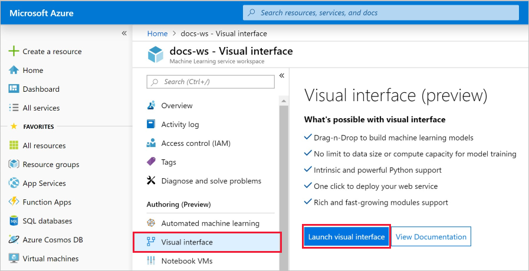

    The interface webpage opens in a new browser page.  

## Create your first experiment

The visual interface tool provides an interactive, visual place to easily build, test, and iterate on a predictive analysis model. You drag-and-drop datasets and analysis modules onto an interactive canvas, connecting them together to form an _experiment_.  Create your first experiment now.

1. In the bottom-left corner, select  **Add New**.
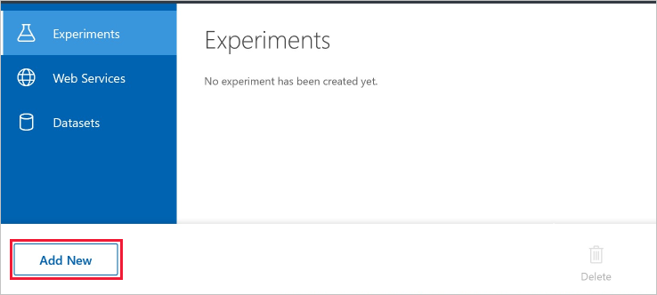

1. Select **Blank Experiment**.

1. Your experiment is given a default name. Select this text and rename it to "Quickstart-explore data." This name doesn't need to be unique.

1. The **Mini Map** at the bottom of the screen is useful for viewing large experiments.  You won't need it in this quickstart so click on the arrow at the top to minimize it.  

    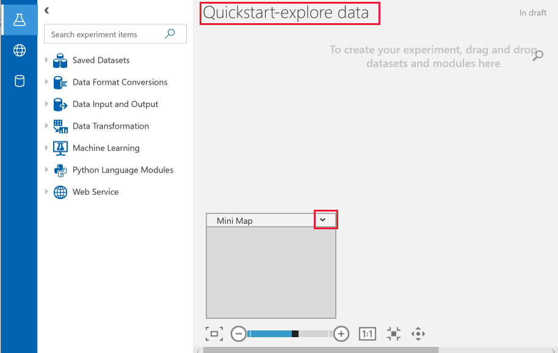

## Add data

The first thing you need for machine learning is data. There are several sample datasets included in this interface that you can use, or you can import data from many sources. For this example, you'll use the sample dataset **Automobile price data (Raw)**. 

1. To the left of the experiment canvas is a palette of datasets and modules. Select **Saved Datasets** then select **Samples** to view the available sample datasets.

1. Select the dataset, **Automobile price data (raw)**, and drag it onto the canvas.

   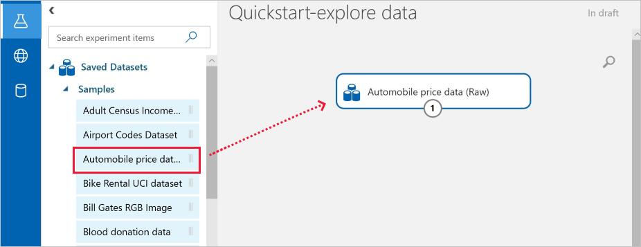

## Select columns

Select which columns of data to work with.  To start with, configure the module to show all available columns.

> [!TIP]
> If you know the name of the data or module you want, use the search bar at the top of the palette to find it quickly.  The rest of the quickstart will use this shortcut.

1. Type **Select** in the Search box to find the **Select Columns in Dataset** module.

1. Click and drag the **Select Columns in Dataset** onto the canvas. Drop the module below the dataset you added earlier.

1. Connect the dataset to the **Select Columns in Dataset**: click the output port of the dataset, drag to the input port of **Select Columns in Dataset**, then release the mouse button. The dataset and module remain connected even if you move either around on the canvas.

    > [!TIP]
    > Datasets and modules have input and output ports represented by small circles - input ports at the top, output ports at the bottom. You create a flow of data through your experiment when you connect the output port of one module to an input port of another.
    >
    > If you have trouble connecting modules, try dragging all the way into the node you are connecting.

     

    The red exclamation mark indicates that you haven't set the properties for the module yet. You'll do that next.
   
1. Select the **Select Columns in Dataset** module.

1. In the **Properties** pane to the right of the canvas, select **Edit columns**.

    In the **Select columns** dialog, select **ALL COLUMNS** and include **all features**. The dialog should look like this:

     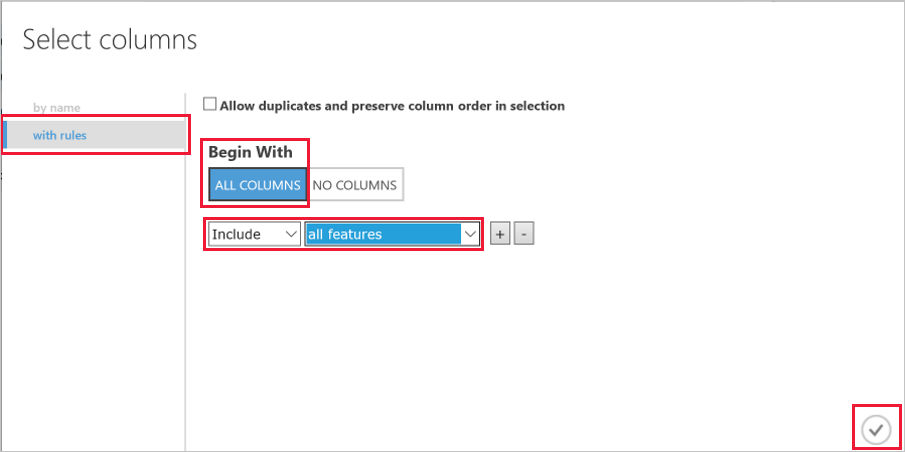

1. On the lower right, select **OK** to close the column selector.

## Run the experiment

At any time, click the output port of a dataset or module to see what the data looks like at that point in the data flow.  If the **Visualize** option is disabled, you first need to run the experiment.  You'll do that next.

[!INCLUDE [aml-ui-create-training-compute](../../../includes/aml-ui-create-training-compute.md)]

After the compute target is available, the experiment runs. When the run is complete, a green checkmark appears on each module.

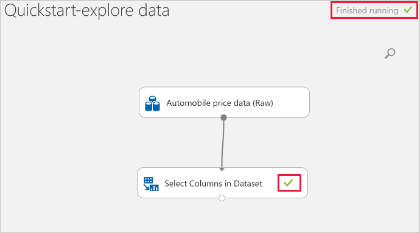

## Preview the data

Now that you have run your initial experiment, you can visualize the data to understand more about the information you have to work with.

1. Select the output port at the bottom of the **Select Columns in Dataset** then select **Visualize**.

1. Click on different columns in the data window to view information about that column.  

    In this dataset, each row represents an automobile, and the variables associated with each automobile appear as columns.    There are 205 rows and 26 columns in this dataset.

     Each time you click a column of data, the **Statistics** information and **Visualization** image of that column appears on the left.  For example, when you click on **num-of-doors** you see it has 2 unique values and 2 missing values.  Scroll down to see the values: two and four doors.

     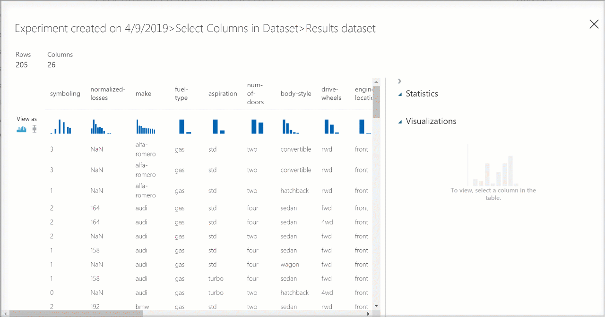

1. Click on each column to understand more about your dataset, and think about whether these columns will be useful to predict the price of an automobile.

## Prepare data

A dataset usually requires some preprocessing before it can be analyzed. You might have noticed the missing values present in the columns of various rows. These missing values need to be cleaned so the model can analyze the data correctly. You'll remove any rows that have missing values. Also, the **normalized-losses** column has a large proportion of missing values, so you'll exclude that column from the model altogether.

> [!TIP]
> Cleaning the missing values from input data is a prerequisite for using most of the modules.  

### Remove column

First,  remove the **normalized-losses** column completely.

1. Select the **Select Columns in Dataset** module.

1. In the **Properties** pane to the right of the canvas, select **Edit columns**.

    * Leave  **With rules** and **ALL COLUMNS** selected.

    * From the drop-downs, select **Exclude** and **column names**, and then click inside the text box. Type **normalized-losses**.

    * On the lower right, select **OK** to close the column selector.

    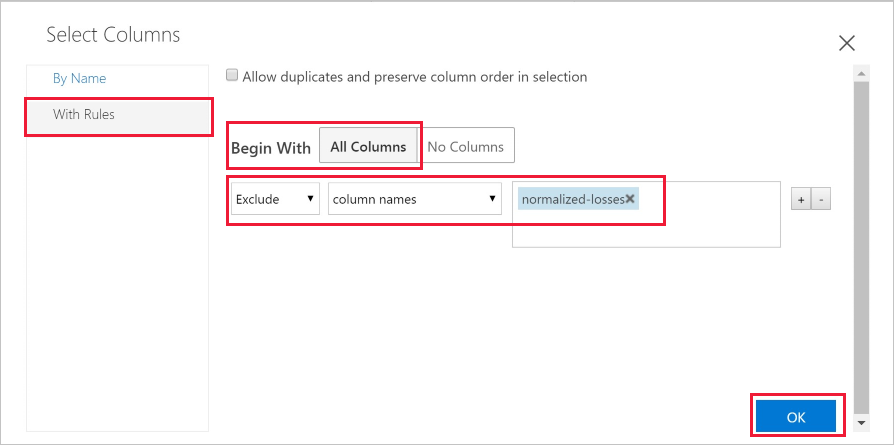
        
    Now the properties pane for Select Columns in Dataset indicates that it will pass through all columns from the dataset except **normalized-losses**.
        
    The properties pane shows that the **normalized-losses** column is excluded.
        
    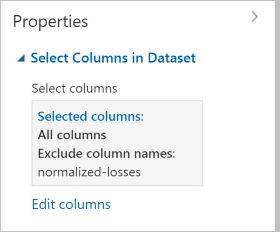
        
    You can add a comment to a module by double-clicking the module and entering text. This can help you see at a glance what the module is doing in your experiment. 

1. Double-click the **Select Columns in Dataset** module and type the comment "Exclude normalized losses." 
    
    After you type the comment, click outside the module.  A down-arrow appears to show that the module contains a comment.

1. Click on the down-arrow to display the comment.

    The module now shows an up-arrow to hide the comment.
        
    

### Clean missing data

When you train a model, you have to do something about the data that is missing.  In this case, you'll add a module to remove any remaining row that has missing data.  

1. Type **Clean** in the Search box to find the **Clean Missing Data** module.

1. Drag the **Clean Missing Data** module to the experiment canvas and connect it to the **Select Columns in Dataset** module. 

1. In the Properties pane, select **Remove entire row** under **Cleaning mode**.

    These options direct **Clean Missing Data** to clean the data by removing rows that have any missing values.

1. Double-click the module and type the comment "Remove missing value rows."
 
    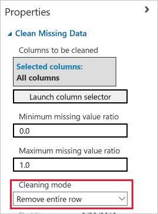

    Your experiment should now look something like this:
    
    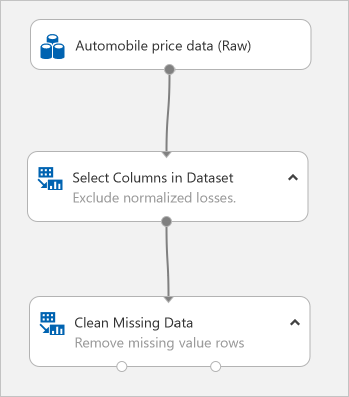

## Visualize the results

Since you made changes to the modules in your experiment, the status has changed to "In draft".  To visualize the new clean data, you first have to run the experiment again.

1. Select **Run** at the bottom to run the experiment.

    This time you can reuse the compute target you created earlier.  

1. Select **Run** in the dialog.

   

1. When the run completes, right-click on the **Clean Missing Data** module to visualize the new clean data.  

    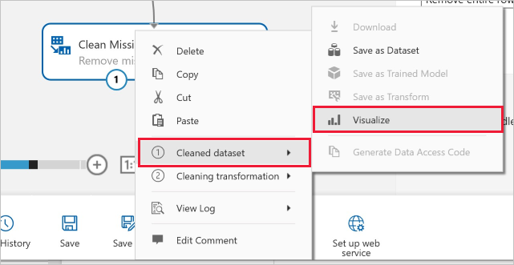

1. Click on different columns in the cleaned data window to see how data has changed.  

    

    There are now 193 rows and 25 columns.

    When you click on **num-of-doors** you see it still has 2 unique values but now has 0 missing values. Click through the rest of the columns to see that there are no missing values left in the dataset. 

## Clean up resources

[!INCLUDE [aml-ui-cleanup](../../../includes/aml-ui-cleanup.md)]

## Next steps

In this quickstart, you learned how to:

- Create your first experiment to add and preview data
- Prepare the data by removing missing values
- Visualize the prepared data

Continue to the tutorial to use this data to predict the price of an automobile.

> [!div class="nextstepaction"]
> [Tutorial: Predict automobile price with the visual interface](ui-tutorial-automobile-price-train-score.md)
