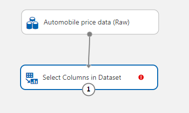
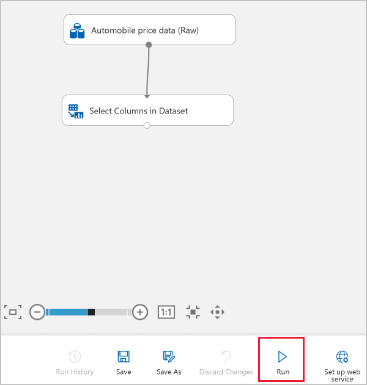
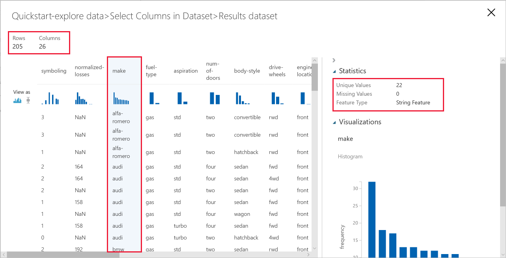

# Quickstart: Create your first data science experiment without writing code

Create a machine learning experiment to prepare and visualize your data with a drag-and-drop user interface.

In this quickstart you'll explore and prepare data:

- Create your first experiment
- Add data
- Select columns in the data
- Run the experiment
- Visualize the data
- Prepare the data
- Visualize the results

After you complete this quickstart, you can use this experiment to [train a model]().

If you're brand new to machine learning, the video series [Data Science for Beginners](https://docs.microsoft.com/azure/machine-learning/studio/data-science-for-beginners-the-5-questions-data-science-answers) is a great introduction to machine learning using everyday language and concepts.

## Prerequisites

[!INCLUDE [aml-ui-prereq](../../../includes/aml-ui-prereq.md)]

## Create your first experiment

1. Select  **Add New**  in the left bottom corner.

1. Select **Blank Experiment**.

1. Your experiment is given a default name. Select this text and rename it to something meaningful, for example, "Quickstart-explore data." This name doesn't need to be unique.

1. The **Mini Map** at the bottom of the screen is useful for viewing large experiments.  You won't need it in this quickstart so click on the arrow at the top to close it.  

## Add data

The first thing you need for machine learning is data. There are several sample datasets included with Studio that you can use, or you can import data from many sources. For this example, you'll use the sample dataset **Automobile price data (Raw)**. This dataset includes entries for various individual automobiles, including information such as make, model, technical specifications, and price.  

1. To the left of the experiment canvas is a palette of datasets and modules. Select **Saved Datasets** then select **Samples** to view the available sample datasets.

1. Select the third dataset, **Automobile price data (raw)**, and drag it onto the canvas.

   

 > [!TIP]
 > If you know the name of the data or module you want, use the search bar at the top of the palette to find it quickly.  The rest of this quickstart will use this shortcut.

## Select columns

Select which columns of data to work with.  For now, view all the available columns.

1. Type **Select** in the Search box to find the **Select Columns in Dataset** module.

1. Click and drag the **Select Columns in Dataset** onto the canvas. Drop this module below the dataset you added earlier.

    > [!TIP]
    > Datasets and modules have input and output ports represented by small circles - input ports at the top, output ports at the bottom. To create a flow of data through your experiment, you'll connect an output port of one module to an input port of another.

1. Connect the dataset to the **Select Columns in Dataset**: click the output port of the dataset (the small circle at the bottom of the dataset), drag to the input port of **Select Columns in Dataset** (the small circle at the top of the module), then release the mouse button. The dataset and module remain connected even if you move either around on the canvas.

     

    > [!TIP]
    > If you have trouble connecting modules, try dragging all the way into the node you are connecting.  

    The experiment should now look something like this:

    

    The red exclamation mark indicates that you haven't set the properties for this module yet. You'll do that next.
   
1. Select **Select Columns in Dataset**.

1. In the Properties pane to the right of the canvas, select **Launch column selector**.

    In the Select columns dialog, select **ALL COLUMNS** and include **all features**. The dialog should look like this:

     

1. In the **Properties** pane to the right of the canvas, select **Launch column selector**.

## Run the experiment

At any time, you can click the output port of a dataset or module to see what the data looks like at that point in the data flow.  However, before the experiment has run, the module doesn't yet know its data, In this situation, the **Visualize** option will be disabled.  By running the experiment, the column definitions for your data pass from the dataset, through the **Select Columns in Dataset** module.  After the run, you will be able to visualize your initial data.

An experiment runs on a compute target, a compute resource that is attached to your workspace.  Once you create a compute target, you can reuse it for future runs.

1. Select **Run** at the bottom to run the experiment.

     

1. In the **Setup Compute Targets** dialog, if your workspace already has a compute target, you can select it now.  Otherwise, select **Create new**.

1. Provide a name for your compute target.

1. Select **Run**.

    

    Your compute resource will now be created. View the status in the top-right corner of the experiment. 

    > [!NOTE]
    > It takes approximately 10 minutes to create a compute target. After the resource has created, you can reuse it and skip this wait time for future runs.

    After the compute target is available, the experiment runs. When the run is complete, a green checkmark appears on each module.

    

## Visualize the data

Now that you have run your initial experiment, you can visualize the data to understand more about the information you have to work with.

1. Select the output port at the bottom of the **Select Columns in Dataset** then select **Visualize**.

     In this dataset, each row represents an automobile, and the variables associated with each automobile appear as columns.  In the [Develop a predictive solution tutorial](), you'll predict the price of an automobile, found in far-right column (column 26, titled "price").  There are 205 rows and 26 columns in this dataset.

     Each time you click a column of data, the **Statistics** information and **Visualization** image of that column appears on the left. 

1. Click on **make**.  This column is a String Feature, with 22 unique value and no missing values. The histogram shows the distribution of **make** in the dataset. 

     

1. Click on each column to understand more about your dataset.

## Prepare data

A dataset usually requires some preprocessing before it can be analyzed. You might have noticed the missing values present in the columns of various rows. These missing values need to be cleaned so the model can analyze the data correctly. You'll remove any rows that have missing values. Also, the normalized-losses column has a large proportion of missing values, so you'll exclude that column from the model altogether.

> [!TIP]
> Cleaning the missing values from input data is a prerequisite for using most of the modules.  

### Remove normalized-losses

First,  remove the **normalized-losses** column completely.

1. Select **Select Columns in Dataset**.

1. In the **Properties** pane to the right of the canvas, select **Launch column selector**.

    * Leave  **With rules** and **ALL COLUMNS** selected.

    * From the drop-downs, select **Exclude** and **column names**, and then click inside the text box. Type **normalized-losses**.

    * Select the check mark (OK) button to close the column selector (on the lower-right).

    
        
    Now the properties pane for Select Columns in Dataset indicates that it will pass through all columns from the dataset except **normalized-losses**.
        
    The properties pane shows that the **normalized-losses** column is excluded.
        
    
        
    You can add a comment to a module by double-clicking the module and entering text. This can help you see at a glance what the module is doing in your experiment. 

1. Double-click the **Select Columns in Dataset** module and type the comment "Exclude normalized losses." 
    
    After you type the comment, click outside the module.  A down-arrow appears to show that the module contains a comment.

1. Click on the down-arrow to display the comment.

    The module now shows an up-arrow to hide the comment.
        
    

### Clean missing data

Now add another module that removes any remaining row that has missing data.

1. Type **Clean** in the Search box to find the **Clean Missing Data** module.

1. Drag the **Clean Missing Data** module to the experiment canvas and connect it to the **Select Columns in Dataset** module. 

1. In the Properties pane, select **Remove entire row** under **Cleaning mode**.

    These options direct **Clean Missing Data** to clean the data by removing rows that have any missing values.

1. Double-click the module and type the comment "Remove missing value rows."
 
    

    Your experiment should now look something like this:
    
    

## Visualize the results

Since you made changes to the modules in your experiment, the status has changed to "In draft".  To visualize the new clean data, you first have to run the experiment again.

1. Select **Run** at the bottom to run the experiment.

    This time you can reuse the compute target you created earlier.  

1. Select **Run** in the dialog.

   

1. When the run completes, right-click on the **Clean Missing Data** module to visualize the new clean data.  

    

## Clean up resources

[!INCLUDE [aml-ui-cleanup](../../../includes/aml-ui-cleanup.md)]

## Next steps

In this quickstart, you learned how to:

- Create your first experiment
- Add data
- Select columns in the data
- Run the experiment
- Visualize the data
- Prepare the data
- Visualize the results

Continue to the tutorial to use this data to predict the price of an automobile.

> [!div class="nextstepaction"]
> [Tutorial: Develop a predictive solution in Studio]()
