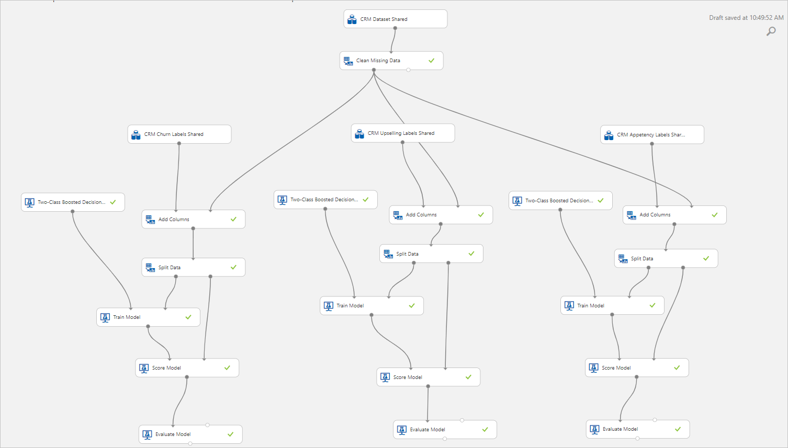
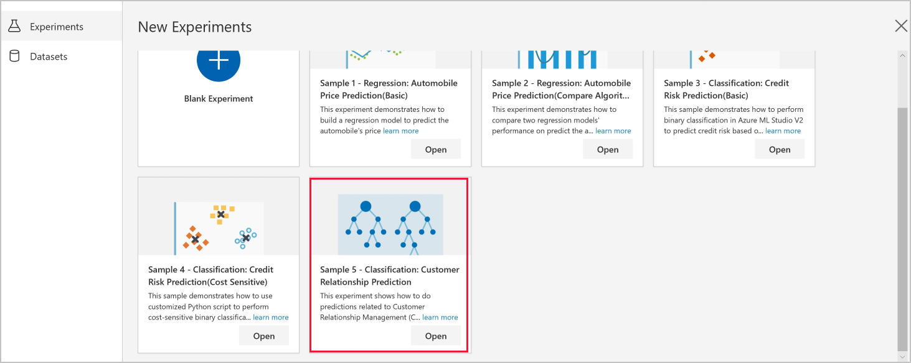
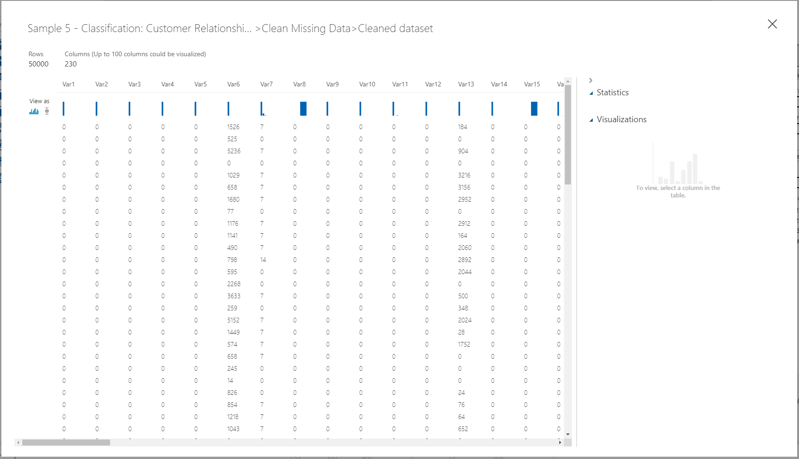
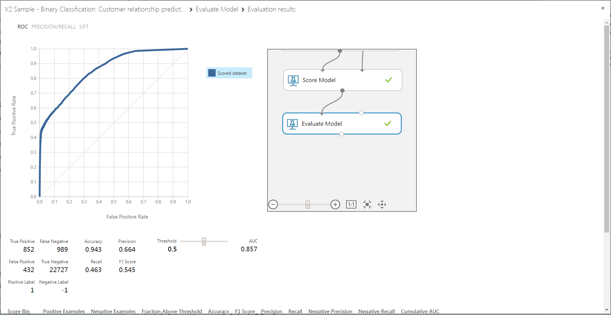

# Sample 5 - Classification: Predict churn, appetency, and up-selling 

Learn how to build a complex machine learning experiment without writing a single line of code using the visual interface.

This experiment trains three, **two-class boosted decision tree** classifiers to predict common tasks for customer relationship management (CRM) systems: churn, appetency, and up-selling. The data values and labels are split across multiple data sources and scrambled to anonymize customer information, however, we can still use the visual interface to combine data sets and train a model using the scrambled values.

Because we're trying to answer the question "Which one?" this is called a classification problem. However, you can apply the same steps in this experiment to tackle any type of machine learning problem whether it be regression, classification, clustering, and so on.

Here's the completed graph for this experiment:

## Prerequisites

[!INCLUDE [aml-ui-prereq](../../../includes/aml-ui-prereq.md)]

4. Select the **Open** button for the Sample 5 experiment.

    

## Data

The data we use for this experiment is from KDD Cup 2009. The dataset has 50,000 rows and 230 feature columns. The task is to predict churn, appetency, and up-selling for customers who use these features. For more information about the data and the task, see the [KDD website](https://www.kdd.org/kdd-cup/view/kdd-cup-2009).

## Experiment summary

This visual interface sample experiment shows binary classifier prediction of churn, appetency, and up-selling, a common task for customer relationship management (CRM).

First, we do some simple data processing.

- The raw dataset contains lots of missing values. We use the **Clean Missing Data** module to replace the missing values with 0.

    

- The features and the corresponding churn, appetency, and up-selling labels are in different datasets. We use the **Add Columns** module to append the label columns to the feature columns. The first column, **Col1**, is the label column. The rest of the columns, **Var1**, **Var2**, and so on, are the feature columns.

    

- We use the **Split Data** module to split the dataset into train and test sets.

    We then use the Boosted Decision Tree binary classifier with the default parameters to build the prediction models. We build one model per task, that is, one model each to predict up-selling, appetency, and churn.

## Results

Visualize the output of the **Evaluate Model** module to see the performance of the model on the test set. For the up-selling task, the ROC curve shows that the model does better than a random model. The area under the curve (AUC) is 0.857. At threshold 0.5, the precision is 0.7, the recall is 0.463, and the F1 score is 0.545.

 You can move the **Threshold** slider and see the metrics change for the binary classification task.

## Clean up resources

[!INCLUDE [aml-ui-cleanup](../../../includes/aml-ui-cleanup.md)]

## Next steps

Explore the other samples available for the visual interface:

- [Sample 1 - Regression: Predict an automobile's price](ui-sample-regression-predict-automobile-price-basic.md)
- [Sample 2 - Regression: Compare algorithms for automobile price prediction](ui-sample-regression-predict-automobile-price-compare-algorithms.md)
- [Sample 3 - Classification: Predict credit risk](ui-sample-classification-predict-credit-risk-basic.md)
- [Sample 4 - Classification: Predict credit risk (cost sensitive)](ui-sample-classification-predict-credit-risk-cost-sensitive.md)
- [Sample 6 - Classification: Predict flight delays](ui-sample-classification-predict-flight-delay.md)