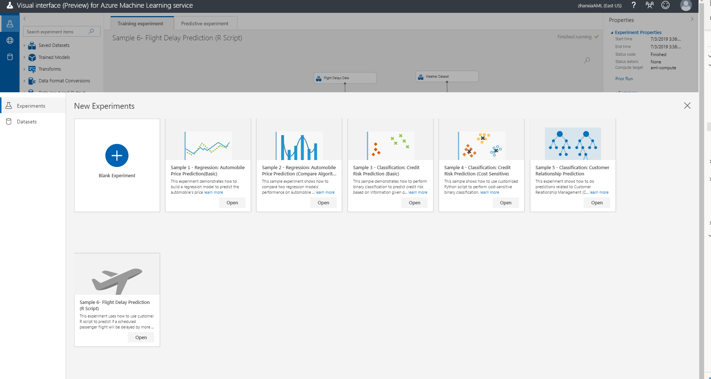
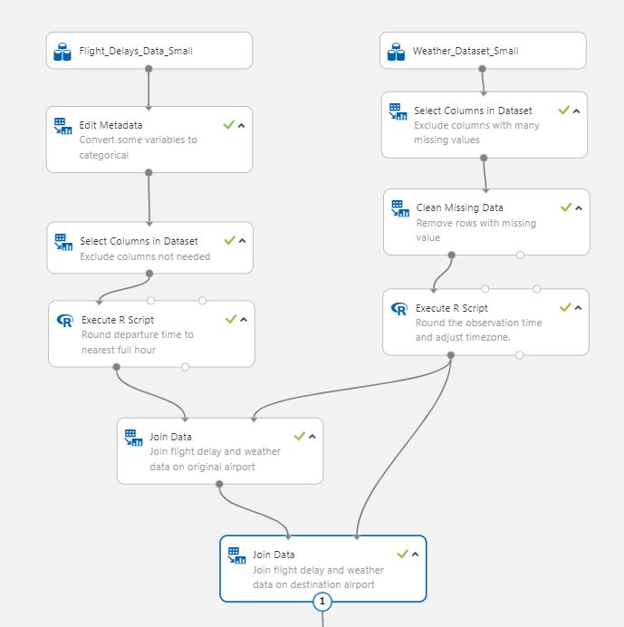
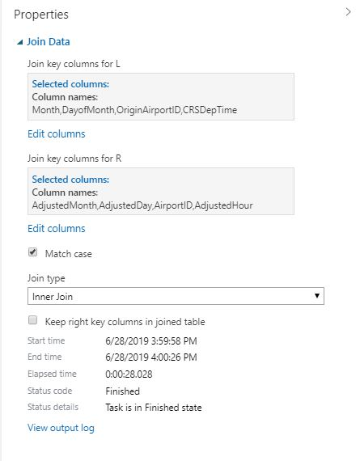
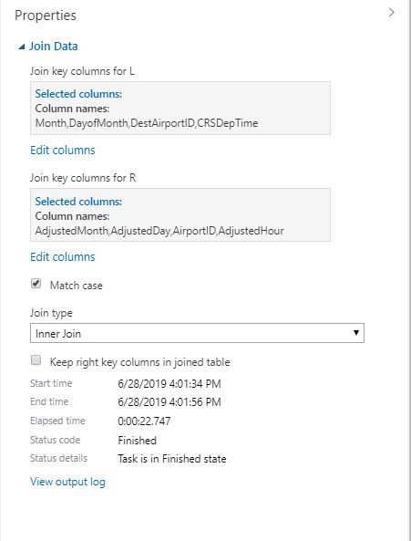

# Sample 6 - Classification: Predict flight delays using R

This experiment uses historical flight and weather data to predict if a scheduled passenger flight will be delayed by more than 15 minutes.

This problem can be approached as a classification problem, predicting two classes -- delayed, or on time. To build a classifier, this model using a large number of examples from historic flight data.

Here's the final experiment graph:

## Prerequisites

[!INCLUDE [aml-ui-prereq](../../../includes/aml-ui-prereq.md)]

4. Select the **Open** button for the Sample 6 experiment:

    

## Get the data

This experiment uses the **Flight Delays Data** dataset. It's part of the TranStats data collection from the U.S. Department of Transportation. The dataset contains flight delay information from April to October  2013. Before uploading the data to the visual interface, it has been pre-processed as follows:

* Filtered to include the 70 busiest airports in the continental United States.
* For canceled flights, relabeled as delayed by more than 15 mins.
* Filtered out diverted flights.
* Selected 14 columns.

To supplement the flight data, the **Weather Dataset** is used. The weather data contains hourly land-based weather observations from NOAA, and represents observations from airport weather stations, covering the same time period of April-October 2013. Before uploading to Azure ML visual interface, it has been pre-processed as  follows:

* Weather station IDs were mapped to corresponding airport IDs.
* Weather stations not associated with the 70 busiest airports were removed.
* The Date column was split into separate columns: Year, Month, and Day.
* Selected 26 columns.

## Pre-process the data

A dataset usually requires some pre-processing before it can be analyzed.

### Flight data

The columns **Carrier**, **OriginAirportID**, and **DestAirportID** are saved as integers. However, they're  categorical attributes, use the **Edit Metadata** module to convert them to categorical.

Then use the **Select Columns** in Dataset module to exclude from the dataset columns that are possible target leakers: **DepDelay**, **DepDel15**, **ArrDelay**, **Canceled**, **Year**. 

To join the flight records with the hourly weather records, use the scheduled departure time as one of the join keys. To do the join, the CSRDepTime column must be rounded down to the nearest hour, which is done by in the **Execute R Script** module. 

### Weather data

Columns that have a large proportion of missing values are excluded using the **Project Columns** module. These columns include all string-valued columns: **ValueForWindCharacter**, **WetBulbFarenheit**, **WetBulbCelsius**, **PressureTendency**, **PressureChange**, **SeaLevelPressure**, and **StationPressure**.

The **Clean Missing Data** module is then applied to the remaining columns to remove rows with missing data.

Weather observation times are rounded up to the nearest full hour. Scheduled flight times and the weather observation times are rounded in opposite directions to ensure the model uses only weather before the flight time. 

Since weather data is reported in local time, time zone differences are accounted for by subtracting the time zone columns from the scheduled departure time and the weather observation time. These operations are done using the **Execute R Script** module.

### Joining Datasets

Flight records are joined with weather data at origin of the flight (**OriginAirportID**) using the **Join Data** module.

 

Flight records are joined with weather data using the destination of the flight (**DestAirportID**).

 

### Preparing Training and Test Samples

The **Split Data** module splits the data into April through September records for training, and October records for test.

 

Year, month, and timezone columns are removed from the training dataset using the Select Columns module.

## Define features

In machine learning, features are individual measurable properties of something you’re interested in. Finding a strong set of features requires experimentation and domain knowledge. Some features are better for predicting the target than others. Also, some features may have a strong correlation with other features, and won't add new information to the model. These features can be removed.

To build a model, you can use all the features available, or select a subset of the features.

## Choose and apply a learning algorithm

Create a model using the **Two-Class Logistic Regression** module and train it on the training dataset. 

The result of the **Train Model** module is a trained classification model that can be used to score new samples to make predictions. Use the test set to generate scores from the trained models. Then use the **Evaluate Model** module to analyze and compare the quality of the models.

After you run the experiment, you can view the output from the **Score Model** module by clicking the output port and selecting **Visualize**. The output includes the scored labels and the probabilities for the labels.

Finally, to test the quality of the results, add the **Evaluate Model** module to the experiment canvas, and connect the left input port to the output of the Score Model module. Run the experiment and view the output of the **Evaluate Model** module, by clicking the output port and selecting **Visualize**.

## Evaluate
The logistic regression model has AUC of 0.631 on the test set.

 

## Next steps

Explore the other samples available for the visual interface:

- [Sample 1 - Regression: Predict an automobile's price](ui-sample-regression-predict-automobile-price-basic.md)
- [Sample 2 - Regression: Compare algorithms for automobile price prediction](ui-sample-regression-predict-automobile-price-compare-algorithms.md)
- [Sample 3 - Classification: Predict credit risk](ui-sample-classification-predict-credit-risk-basic.md)
- [Sample 4 - Classification: Predict credit risk (cost sensitive)](ui-sample-classification-predict-credit-risk-cost-sensitive.md)
- [Sample 5 - Classification: Predict churn](ui-sample-classification-predict-churn.md)
