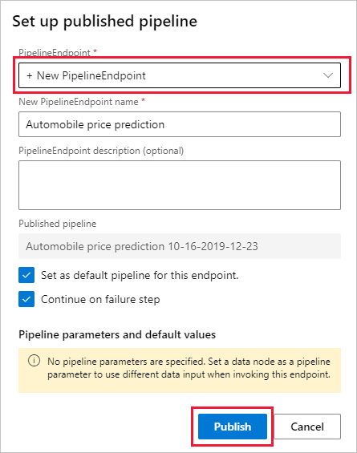

# Tutorial: Deploy a machine learning model with the visual interface

To give others a chance to use the predictive model developed in [part one of the tutorial](ui-tutorial-automobile-price-train-score.md), you can deploy it as an Azure web service. So far, you have trained your model. Now, it's time to generate new predictions based on user input. In this part of the tutorial, you:

> [!div class="checklist"]
> * Prepare a model for deployment
> * Deploy a web service
> * Test a web service
> * Manage a web service
> * Consume the web service

## Prerequisites

Complete [part one of the tutorial](ui-tutorial-automobile-price-train-score.md) to learn how to train and score a machine learning model in the visual interface.

## Prepare for deployment

Before you deploy your pipeline as a web service, you first have to convert publish your pipeline, and convert your *training pipeline* into a *real-time inference pipeline*.

### Publish the pipeline

Until this point, you have been working on a *pipeline draft*. Publishing a pipeline to a Pipeline Endpoint lets you start tracking versions and reuse the pipeline in the future. Pipeline Endpoints lets you organize similar pipelines together.

1. Select **Publish** at the top of the pipeline canvas.

1. In the Setup **Pipeline Run** dialog, select the drop-down arrow underneath **PipelineEndpoint** and select **+New PipelineEndpoint**

1. Select **Publish**

    

### Create a real-time inference pipeline

The published training pipelines needs to be modified before it can be deployed for inferencing. Converting the training pipeline into a *real-time inference pipeline* will make these changes for you.

1. At the top of the pipeline canvas, select **Create inference pipeline** > **Real-time inference pipeline**

    When you select **Create Predictive Pipeline**, several things happen:
    
    * The trained model is stored as a **Dataset** module in the module palette. You can find it under **My Datasets**.
    * Modules, like **Train Model** and **Split Data**, that were used for training are removed.
    * The saved trained model is added back into the pipeline.
    * **Web Service Input** and **Web Service Output** modules are added. These modules identify where the user data will enter the model, and where data is returned.

    > [!Note]
    > The **training pipeline** is saved under the new tab at the top of the pipeline canvas. It can also be found as a published pipeline in the visual interface.
    >

    Your pipeline should now look like this:  

   

1. Select **Run** and use the same default compute and experiment you created in part 1.

1. Select **Score Model** module.

1. In the properties pane select **Outputs** > **Visualize** to verify the model is still working. You can see the original data is displayed, along with the predicted price ("Scored Labels").

1. Select **Deploy**.

## Create the inferencing cluster

In the dialog that appears, you can select from any existing Azure Kubernetes Service (AKS) cluster in your workspace to deploy your model. If you don't already have an AKS cluster, use the following instructions to create one.

1. Select **Compute** in the dialog to navigate to the **Compute** page.

1. In the navigation ribbon, select **Inference Clusters** > **+ New**.

1. In the inference cluster pane, configure a new Kubernetes Service.

1. Enter "aks-compute" for the **Compute name**.
    
1. Select a nearby available **Region**.

1. Select **Create**.

    > [!Note]
    > It takes approximately 15 minutes to create a new AKS service. You can check the provisioning state on the **Inference Clusters** page
    >

## Deploy the web service

After your AKS service has finished provisioning, return to the real-time inferencing pipeline to complete deployment.

1. Select **Deploy** above the canvas.

1. Select **Deploy new real-time endpoint**. 

1. Select the AKS cluster you created.

1. Select **Deploy**. A a success notification above the canvas will appear when deployment completes, it may take a few minutes.

## Test the web service

You can test your web services by navigating to the **Endpoints** page in the workspace navigation pane on the left.

1. On the **Endpoints** page, select the web service you deployed.

    

1. Select **Test**.

1. Input testing data or use the autofilled sample data and select **Test**.

    The test request is submitted to the web service and the results are shown on page. Although a price value is generated for the input data, it is not used to generate the prediction value.

## Clean up resources

[!INCLUDE [aml-ui-cleanup](../../../includes/aml-ui-cleanup.md)]

## Next steps

In this tutorial, you learned the key steps in creating, deploying, and consuming a machine learning model in the visual interface. To learn more about how you can use the visual interface to solve other types of problems, see out our other sample pipelines.

> [!div class="nextstepaction"]
> [Credit risk classification sample](how-to-ui-sample-classification-predict-credit-risk-cost-sensitive.md)
