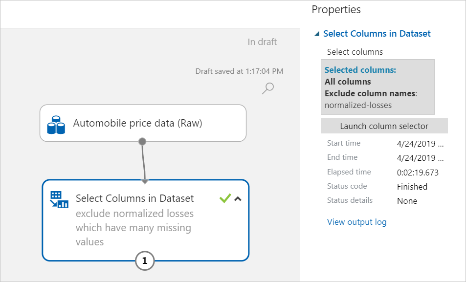
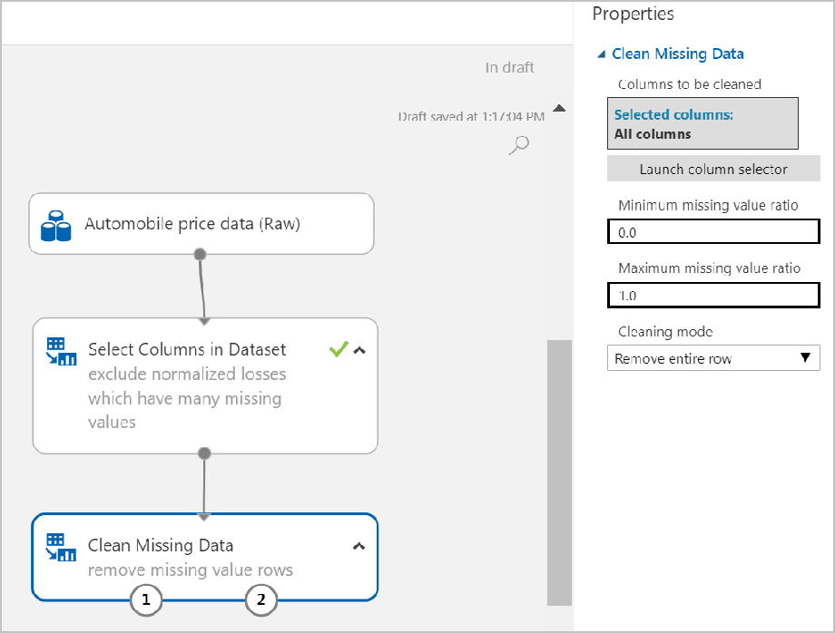

# Tutorial: Predict automobile price with the visual interface

In this tutorial, you take an extended look at developing a predictive solution in the Azure Machine Learning service visual interface. By the end of this tutorial, you'll have a solution that can predict the price of any car based on technical specifications you send it.

This tutorial [continues from the quickstart](ui-quickstart-run-experiment.md) and is **part one of a two-part tutorial series**. However, you don't have to complete the quickstart before starting.

In part one of the tutorial series you learn how to:

> [!div class="checklist"]
> * Import and clean data (the same steps as the quickstart)
> * Train a machine learning model
> * Score and evaluate a model

In [part two](ui-tutorial-automobile-price-deploy.md) of the tutorial series, you'll learn how to deploy your predictive model as an Azure web service.

> [!NOTE]
> A completed version of this tutorial is available as a sample experiment.
> From the Experiments page, go to **Add New** > **Sample 1 - Regression: Automobile Price Prediction(Basic)**

## Create a workspace

If you have an Azure Machine Learning service workspace, skip to the [next section](#open-the-visual-interface-webpage). Otherwise, create one now.

[!INCLUDE [aml-create-portal](../../../includes/aml-create-in-portal.md)]

## Open the visual interface webpage

1. Open your workspace in the [Azure portal](https://portal.azure.com/).  

1. In your workspace, select **Visual interface (preview)**.  Then select **Launch visual interface**.  

    

    The interface webpage opens in a new browser page.  

## Import and clean your data

The first thing you need is clean data. If you completed the quickstart, you can reuse your data prep experiment here. If you haven't completed the quickstart, skip the next section and [start from a new experiment](#start-from-a-new-experiment).

### Reuse the quickstart experiment

1. Open your quickstart experiment.

1. Select **Save As** at the bottom of the window.

1. Give it a new name in the pop-up dialog that appears.

    

1. The experiment should now look something like this:

    

If you successfully reused your quickstart experiment, skip the next section to begin [training your model](#train-the-model).

### Start from a new experiment

If you didn't complete the quickstart, follow these steps to quickly create a new experiment that imports and cleans the automobile data set.

1. Create a new experiment by selecting **+NEW** at the bottom of the visual interface window.

1. Select **EXPERIMENT** >  **Blank Experiment**.

1. Select the default experiment name **"Experimented Created on ...**" at the top of the canvas and rename it to something meaningful. For example, **Automobile price prediction**. The name doesn't need to be unique.

1. To the left of the experiment canvas is a palette of datasets and modules. To find modules, use the search box at the top of the module palette. Type **automobile** in the search box to find the dataset labeled **Automobile price data (Raw)**. Drag this dataset to the experiment canvas.

    Now that you have your data, you can add a module that removes the **normalized-losses** column completely. Then, add another module that removes any row that has missing data.

1. Type **select columns** in the search box to find the **Select Columns in Dataset** module. Then drag it to the experiment canvas. This module allows you to select which columns of data you want to include or exclude in the model.

1. Connect the output port of the **Automobile price data (Raw)** dataset to the input port of the Select Columns in Dataset.

    

1. Select the Select Columns in Dataset module and select **Launch column selector** in the **Properties** pane.

   1. On the left, select **With rules**

   1. Next to  **Begin With**, select **All columns**. These rules direct **Select Columns in Dataset** to pass through all the columns (except those columns we're about to exclude).

   1. From the drop-downs, select **Exclude** and **column names**, and then type **normalized-losses** inside the text box.

   1. Select the OK button to close the column selector (on the lower right).

     Now the properties pane for **Select Columns in Dataset** indicates that it will pass through all columns from the dataset except **normalized-losses**.

1. Add a comment to the **Select Columns in Dataset** module by double-clicking the module and entering "Exclude normalized losses.". This can help you see, at a glance, what the module is doing in your experiment.

    

1. Type **Clean** in the Search box to find the **Clean Missing Data** module. Drag the **Clean Missing Data** module to the experiment canvas and connect it to the **Select Columns in Dataset** module.

1. In the **Properties** pane, select **Remove entire row** under **Cleaning mode**. These options direct **Clean Missing Data** to clean the data by removing rows that have any missing values. Double-click the module and type the comment "Remove missing value rows."

## Train the model

Now that the data is ready, you can construct a predictive model. You'll use your data to train the model. Then you'll test the model to see how closely it's able to predict prices.

**Classification** and **regression** are two types of supervised machine learning algorithms. **Classification** predicts an answer from a defined set of categories, such as a color (red, blue, or green). **Regression** is used to predict a number.

Because you want to predict price, which is a number, you can use a regression algorithm. For this example, you'll use a linear regression model.

Train the model by giving it a set of data that includes the price. The model scans the data and looks for correlations between a car's features and its price. Then test the model by giving it a set of features for automobiles it's familiar with and see how close the model comes to predicting the known price.

Use your data for both training the model and testing it by splitting the data into separate training and testing datasets.

1. Type **split data** in the search box to find the **Split Data** module and connect it to the left port of the **Clean Missing Data** module.

1. Select the **Split Data** module to select it. In the Properties pane, set the Fraction of rows in the first output dataset to 0.7. This way, we'll use 70 percent of the data to train the model, and hold back 30 percent for testing.

    

1. Double-click the **Split Data** and type the comment "Split the dataset into training set(0.7) and test set(0.3)"

1. To select the learning algorithm, clear your module palette search box.

1. Expand the **Machine Learning** then expand **Initialize Model**. This displays several categories of modules that can be used to initialize machine learning algorithms.

1. For this experiment, select **Regression** > **Linear Regression** and drag it to the experiment canvas.

    

1. Find and drag the **Train Model** module to the experiment canvas. Connect the output of the Linear Regression module to the left input of the Train Model module, and connect the training data output (left port) of the **Split Data** module to the right input of the **Train Model** module.

    

1. Select the **Train Model** module. In the Properties pane, Select Launch column selector and then type **price** next to **Include column names**. Price is the value that your model is going to predict

     

    Now the experiment should look like.
     

### Run the training experiment

[!INCLUDE [aml-ui-create-training-compute](../../../includes/aml-ui-create-training-compute.md)]

## Score and evaluate the model

Now that you've trained the model using 70 percent of your data, you can use it to score the other 30 percent of the data to see how well your model functions.

1. Type **score model** in the search box to find the **Score Model** module and drag the module to the experiment canvas. Connect the output of the **Train Model** module to the left input port of **Score Model**. Connect the test data output (right port) of the **Split Data** module to the right input port of **Score Model**.

1. Type **evaluate** in the search box to find the **Evaluate Model** and drag the it module to the experiment canvas. Connect the output of the **Score Model** module to the left input of **Evaluate Model**. The final experiment should look something like this:

    

1. Run the experiment using the same compute target used previously.

1. View the output from the **Score Model** module by selecting the output port of **Score Model** and select **Visualize**. The output shows the predicted values for price and the known values from the test data.

    

1. To view the output from the Evaluate Model module, select the output port, and then select Visualize.

    

The following statistics are shown for your model:

* **Mean Absolute Error (MAE)**: The average of absolute errors (an error is the difference between the predicted value and the actual value).
* **Root Mean Squared Error (RMSE)**: The square root of the average of squared errors of predictions made on the test dataset.
* **Relative Absolute Error**: The average of absolute errors relative to the absolute difference between actual values and the average of all actual values.
* **Relative Squared Error**: The average of squared errors relative to the squared difference between the actual values and the average of all actual values.
* **Coefficient of Determination**: Also known as the R squared value, this is a statistical metric indicating how well a model fits the data.

For each of the error statistics, smaller is better. A smaller value indicates that the predictions more closely match the actual values. For Coefficient of Determination, the closer its value is to one (1.0), the better the predictions.

## Manage experiments

The experiments you create in the visual interface can be managed from the Azure Machine Learning service workspace. Use the workspace to see more detailed information such as individuals experiment runs, diagnostic logs, execution graphs, and more.

1. Open your workspace in the [Azure portal](https://portal.azure.com/).  

1. In your workspace, select **Experiments**. Then select the experiment you created.

    

    On this page, you'll see an overview of the experiment and its latest runs.

    

1. Select a run number to see more details about a specific execution.

    

    The run report is updated in real time. If you used an **Execute Python Script** module in your experiment, you can specify script logs to output in the **Logs** tab.

## Clean up resources

[!INCLUDE [aml-ui-cleanup](../../../includes/aml-ui-cleanup.md)]

## Next steps

In part one of this tutorial, you completed these steps:

* Reuse the experiment created in the Quickstart
* Prepare the data
* Train the model
* Score and evaluate the model

In part two, you'll learn how to deploy your model as an Azure web service.

> [!div class="nextstepaction"]
> [Continue to deploying models](ui-tutorial-automobile-price-deploy.md)
